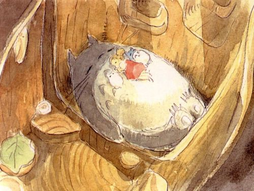

<!-- # ＜天璇＞父与子 -->

**人与人之间都免不了存在分歧，何况是与我们隔着特殊年代的父辈。如果我们自认为是“新时代的青年”，为什么不主动包容父辈的“落后”呢（虽说我并不觉得他们那是落后的）？事实上，我看到一些父亲，在面临新时代的冲击，以及父子之间的隔阂，已经积极争取改变，努力了解年轻人的所思所想，在孩子被时代的洪流裹挟着向前冲时，划着一只小木筏，奋力的追随在自己孩子的身边，希望自己仍然能够保护孩子。而我们这些晚辈，却鲜有人愿意主动和父辈沟通，一句“他们落伍了，观念陈旧，是时代的牺牲品”，就把所有的责任推给了时代，自己却冷漠地斩断了沟通的桥梁。**

# 父与子

## 文/莫婷（厦门大学）

1月5日，是宫崎骏的生日，祝他生日快乐，并感谢他的动画片成为了我们最美好的年华的一部分。

他是那些美丽的动画片的父亲，是否很多人会想，他应该如他的动画片那样，是位温情脉脉的和蔼父亲吧。可惜，他与他那同样为动画天才的儿子——宫崎吾郎——的冲突在动画界可谓人尽皆知。

作为一个儿子眼中严苛古板的父亲，宫崎骏几乎很少与儿子交流，直到知悉儿子想像他一样，成为一名动画师，在业界象征着绝对成功的宫崎骏勃然大怒，坚决反对爱子走向这条“不归路”。

深知动画业这潭泥水的宫崎骏，并不想把自己多年来默默忍受的艰辛与委屈向儿子诉说，一句怒气冲冲的“多嘴！”，成了他能给儿子的所有解释。

然而，与他一样桀骜不驯的宫崎吾郎毅然投身动画业，继承了父亲身上的天赋，倔强地继续着自己的梦想。从此，父子关系掉入了长达两年的冰川时期。

宫崎吾郎承接执导的第一部动画是《地海传奇》，这是一个少年的王子反抗父亲并逐渐成熟的故事，这无疑点燃了宫崎吾郎压抑在胸中的所有激情。

得知此事，宫崎骏大怒“简直是胡来！”。但隔着父子关系的冰川，宫崎骏却不知如何向儿子表达自己的焦急与愤怒。他心里明白，踏入这一行，必然承受着旁人无法想象的委屈和指责。

面对执着的儿子，宫崎骏做出了一个当时他儿子绝对想不到的事情，他亲自飞到美国，对《地海传奇》的作者解释说，“我年纪大了，请你们相信，宫崎吾郎拍出来的东西，一定比我这个精力不济的老家伙强。”

宫崎家父子关系继续冰冷，而宫崎骏也不断在儿子制作动画片时鸡蛋里挑骨头，甚至摆出很不屑的高高在上的姿态。

在成片的试映会上，向来表现得不管不顾的宫崎骏悄悄出现了。放映完毕，他默默递给了儿子一张纸条，又默默的转身离开。纸条上写着：“看得出来，你是用心在做！请继续做下去！”

后来，宫崎吾郎从母亲口中得知，《地海传奇》是宫崎骏最喜爱的一部小说，为了得到改编权，宫崎骏费尽心思20年，却被自己的儿子突然间横刀夺爱了。

父爱如山，那么应该是沉重又坚实的吧？我生活在云贵高原，延绵不绝的群山就是我的大地。常年踏在大山上的我，往往不会感到山的存在，妄自以为我的海拔就是那么高，我就是如此的接近太阳，可以如此轻易地俯瞰云海。

写下这个题目的时候，我想到的是另一对父子。那位父亲沉重的爱深深感动了我这个旁观者，却让儿子觉得透不过气来。儿子把反抗作为父爱的回应，作为父亲，他焦虑气愤，却无可奈何，又不愿放弃“改造”他儿子的努力。

我对这位父亲说，给儿子的成长留一点空间吧。其实，人们的成长，或者家长口中的“懂事”，并不是外界强行灌输给孩子的。成长需要一个半隐蔽的空间，自尊心是外壳，时间是必经之途，甚至，曲折和痛苦，是必要的洗礼，而成长，则是自由独立心灵静悄悄的开出的一束花。父子之间的良好沟通，仅仅是外界的和风细雨。如果父亲太性急，狂风骤雨要么摧毁了刚长出嫩芽的花，要么使孩子自尊心的保护壳变得愈加冰冷坚硬。

我万分理解父亲的“恨铁不成钢”，男人在认为他想要保护的人濒临危险时，他的爱会变得凌厉强势。男孩子，不管年纪多大，不管他是否自认为自己是个“成熟的男子汉”，在父亲眼中，永远是个幼稚需要管教的小孩。父亲记忆中的他，永远是少不更事的滑稽模样，永远是淘气捣蛋容易犯错的小屁孩。

然而，父亲又视儿子为自己生命的延续，自己最成功最引以为傲的作品，急于一刀一刀的亲手雕刻出孩子未来的光辉形象。

父亲渴望在儿子的成长中烙下自己的印记，又从传统中继承下了父亲权威，如此这般，老去的父亲与正在成长的儿子的冲突不可避免。男子汉与男子汉之间的交流，并不温情脉脉，并不春暖花开，一个霸气犹存，一个血气方刚。

我想起儿时喜爱的那首日本歌曲《四季歌》，“喜爱夏天的人儿是，意志坚强的人，像拍打岩礁的海浪一样，是我的父亲。”父亲的形象就这样定格在东方文化的传统中。

再温和可亲的男人，在子女面前，一定是一名勇敢的战士，一位庇护疆土的国王。父亲无需多言对儿女的甜言蜜语，他一切的爱，就体现在他默默地扛着一切的艰辛，为儿女的幸福安全一个人披荆斩棘，与这个世界有可能对儿女造成伤害的危险战斗。当他拖着疲惫的身躯回到家时，一定以威严的面目示人，他要让儿女相信，强大的父亲能够提供一切保护。而他在外界承受痛苦与压力，只有他一个人知道。

我父亲也是如此。自从我离开婴幼儿时期，我很少见他与我逗乐开玩笑，印象中的他，总是气宇轩昂的威严模样。严厉批评，甚至打骂，作为一个中国孩子，我也免不了遭受那么几次。作为一个尽职的中国女儿，我也免不了在受严厉批评的时候唯唯诺诺点头称是。但是我心里非常爱他，非常非常爱，哪怕是我受到严厉批评却没办法心里一下子接受时，出于这种爱，我也会宁愿受点委屈，尊重并理解父亲对我的指责。

为什么非要和父亲身上传统烙印带来的家长权威过不去呢？我们在成长中，而他们正在老去，他们，只不过是竭尽全力在自己老去之前，为保护自己的子女用尽自己所有的力量。那种焦急和无奈，正在成长中的年少轻狂的我们，永远无法理解，不会明白。

在我小的时候，父亲那句“大人的事小孩不要管”让我郁闷，觉得父亲的霸道态度简直是无视我的存在。现在想起来，这何尝不是一种保护。我们作为“新一代的年轻人”，总是抱怨父辈的刻板落后，可我们何尝想过，那些也许是，他们能想到的爱的最好方式。

我知道，我在父亲眼里，也许仍然是一个拖着鼻涕乱跑一不留神就摔得鼻青脸肿的小屁孩。我唯一能做的，就是让他省心，至少表现出让他放心的样子。而最便捷的方式，就是服从他的指令和意愿，让他觉得，作为父亲，他还能强有力地对我产生保护作用，而我也顺服他的保护，最重要的是，让他觉得在他的保护下，我一切安好。

人与人之间都免不了存在分歧，何况是与我们隔着特殊年代的父辈。如果我们自认为是“新时代的青年”，为什么不主动包容父辈的“落后”呢（虽说我并不觉得他们那是落后的）？事实上，我看到一些父亲，在面临新时代的冲击，以及父子之间的隔阂，已经积极争取改变，努力了解年轻人的所思所想，在孩子被时代的洪流裹挟着向前冲时，划着一只小木筏，奋力的追随在自己孩子的身边，希望自己仍然能够保护孩子。

而我们这些晚辈，却鲜有人愿意主动和父辈沟通，一句“他们落伍了，观念陈旧，是时代的牺牲品”，就把所有的责任推给了时代，自己却冷漠地斩断了沟通的桥梁。

的确，面对父母试图强加在我们身上的东西，作为一个向往自由独立的人，我们免不了难以接受。但是，自认为自己很强大的我们，有没有勇气做到包容来自父辈的指责，至少是能做到尊重恭敬，不要和他们当面冲突呢？新时代烙在我们身上的个人主义让我们清醒的知道自己不是工具，不是某个机器运转的零件。但这并不意味着，我们一定要公然违抗以他们自己的方式爱着我们的父母。

我在我的心里划了黑白灰的线，只要不违背我的底线，灰色地带我都选择听取父母的建议，他们经历了时代变迁人生阅历，积淀了高傲狂妄的我们永远无法窥探的智慧。无论如何，我都不想公然对抗父母，更不会做那种仅仅是为了反抗而反抗的事，我知道这样做，无疑是故意伤害一颗深深爱着我的心。

对于触及底线的事（我相信这种事发生的概率太渺茫，比如强迫我嫁给有钱老头什么的），我将选择口是心非，表面上安抚他们的情绪，然后暗地里发奋图强沿着自己的路走下去，用事实证明给他们看我选择的路是正确的，我是幸福的，让他们放心。而那些对我们不会产生任何实际影响的唠叨，陪陪笑脸，过去就好了。

我们在渐渐变得强大，而他们渐渐老去，这时的我们，是不是更应该温和包容。我想，我用这种方式爱他们的时候到了。

每天都晚上10点才下班，宫崎骏爷爷的生日错过了，愿天下所有的严父最终都能获得儿女的理解。

（荐稿：薄然；责编：麦静）
