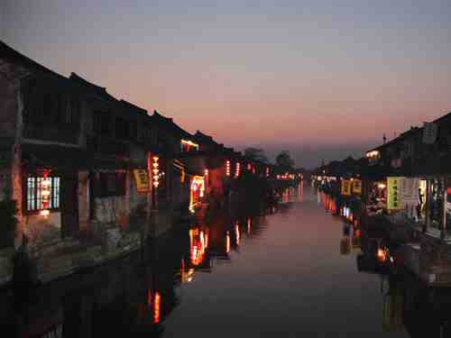

<!-- # ＜天璇＞晚来天欲雪 -->

**记忆中的故乡，祖祖辈辈晨东而起，日落而息。小城有山有水，一条叫“永宁”的河将东城和西城隔开。小城有一条大街，两座古桥，青砖的瓦房，石板铺成的小街小巷，不别致，亦不张扬。故乡没有漫天风雪，只有早春的采采流水，夏日的山风，可听雨声的秋川，和温暖的农历新年。**

# 晚来天欲雪

## 文/王津祎（Columbia University）

龙年要到了。在美国东岸的这将要落雪的寒夜里，却想起故乡浓浓的年味来。

南国的农历新年是热闹而祥和的，常让人想起沈从文的《边城》，或者艾芜的《冬夜》里那句“接着他便说到壮年之日，在南方那些山中冬夜走路的事情……但远的南国山中，小小的灯火人家里面，那些丰美的醉人的温暖，却留在我的冬夜的胸中了”。眼前出现的是《冬夜》所描述的情景：南国起伏山峦的深处，有着明亮灯火的小屋，屋里有好客的主人，烧好了山芋，沏好了热茶，唤着柴门下轻吠的土狗，把走累的客人迎进屋去……

记忆中的故乡，祖祖辈辈晨东而起，日落而息。小城有山有水，一条叫“永宁”的河将东城和西城隔开。小城有一条大街，两座古桥，青砖的瓦房，石板铺成的小街小巷，不别致，亦不张扬。故乡没有漫天风雪，只有早春的采采流水，夏日的山风，可听雨声的秋川，和温暖的农历新年。

清晨，太阳不疾不徐的从东边出来，鸟雀呼晴，石板的街道上落下暖黄的日光。早起的老人会拿起扫帚打理门前的落叶，落叶被堆在门前的树下，炤房里生火能用上。太阳逐渐升高，小城也热闹起来，连永宁河水也似乎流得活泼了一些。石板桥两头，卖包子，白米糕，叶儿粑，豆浆油条和葱油肉饼的小摊忙碌起来；旁边的面馆老板娘一边招呼着伙计们，一边给客人端来一碗热气腾腾的汤面，再热情地给客人碗里来一大勺红烧牛肉或者豌豆；提着鸟笼子的老伯伯，和同伴儿们说说笑笑，蓝布耷下来遮住鸟笼的一半，里面藏着会唱歌的画眉；戴着墨镜的算命先生，不紧不慢的在古桥上支起白布伞，摆出签筒和一本破烂的算命册子。他在小板凳上坐下，等着有人来算一卦，一板一眼地告诉他们，哪天是黄道吉日，而哪天不能乔迁嫁娶。

过了桥，就从东城到了西城。如果说东城像小镇的后院，西城则是小镇的市集。

大街两边的店里挂满了年货：腊肉香肠，也有花椒，干辣椒，八角茴香，茶叶和新鲜蔬菜。不时有从南边上城的苗人或者彝人，耳朵脖子上挂着沉甸甸的坠子，摆开布包里的银饰，等着卖个好价钱。花白胡子的老伯点燃旱烟管，悠闲地吸上两口，一边摆开小摊，卖祖传的药酒，跌打损伤膏，还有芳香的旱烟叶——自己抽的那种。农村小伙今天会进城卖几只家里的土鸡，给父亲捡两副中药，再买些糖果炮竹带回家给孩子们——他的大哥今天或许宰了一头猪，大嫂收拾了两条鱼，媳妇儿给孩子们做好了新衣服，等他回家吃年夜饭。

偶尔会有某一家老人寿终正寝，亲人发丧的队伍缓缓走过石板桥，没有嚎啕恸哭。人们脸上淡淡悲情，却并无绝望——在小城，发丧甚至不被看作生离死别，死亡作为人们心里再平常不过的回归自然，被轻描淡写，仿佛只是“生”将人耽搁于尘世，“死”才是必达的终点。

除夕的夜幕降临，热闹了一天的小镇宁静下来。漆黑夜空中一两点疏星，月华如饮醉般透着微醺。家家户户的炉子里燃着热的炭，门里透出暖人的灯光和醉人的酒香，门前是一盏红灯笼，在夜风中轻轻摇晃。街上偶尔或者传来木门打开的吱嘎声，或者一两声狗吠。穿新棉袄的邻里小孩，举着焰火，笑着跑着，很快又消失在巷子尽头——这些孩子里曾有我幼年的身影，在除夕夜里，听着炮竹声，依偎在外婆膝盖上听故事。我那在小镇生活了一辈子的外婆文化不高，但一生勤劳善良。她的淳朴，守护着我心底最真的信念。外婆的这一生或许没有太大的理想，普天下所有外婆的理想，就是一家人平平安安吧。

一年过去，无论是辛苦、奔波还是劳顿的心情，都能在这安宁的年夜里被逐一抚平，让人感谢这浮生或是完美，或是残缺的给予。

小时候每到新年，外公会带领街坊邻里把房前屋后街道操场打扫得干干净净，亲自贴上买回的春联。我记得有一年的是“和顺一门有百福，平安二字值千金”。横批：万象更新。

谨以此文献给我远在川南的家人，尤其是八十七岁高龄的外婆，并祝普天下的游子和辛劳长辈们龙年快乐，万事如意，幸福可期。

小不

二零一二年元月

纽约

（采编自投稿邮箱；责编：麦静）
