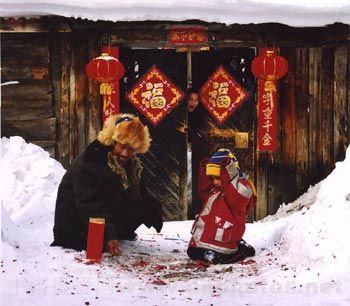

<!-- # ＜摇光＞年味缘何愈寡淡 -->

**年轻人越来越尊奉的是幸福哲学和生活政治，他们更加关注每天的生活状态和当下的个人感受，不再可能会积累一年的人力、物力、财力和心理期待去等待春节这样一次性的超大消费机会，他们所做的，是希望通过生活多方面的质量提升以增强幸福感，这种相比之前显得较为实际的消费理念也大大改变了我们对春节的浪漫想象。**

# 年味缘何愈寡淡

## 谷卿（暨南大学）

春节是传统中国社会最重要、最具特色的节日，以往的人们对春节怀着巨大的期待，主要是因为平素生活中物质资料的匮乏，而在春节这样极其隆重的节日里，一切消费、享乐、狂欢都成为可能，这就是人们常说的“辛辛苦苦忙活了一年，就为和家人一起过个好春节”。但是，如今的人们越来越发现和感受到，春节似乎越来越缺少浓浓的“年味”，我们和传统文化正在日益疏离。

自上世纪９０年代以来，中国经历了极其深刻的全球化与市场化进程，经济发展使得消费主义大大影响了生活形态的改变。随着社会的发展和中产阶层的壮大，在当下的经济环境中，任何一个中产者，都可以让每天的日子过得像以往高水准生活质量的春节，平日里就可以肆意地购物、娱乐、欢聚而不必过多地考虑消费能力，这种消费的日常性已经重新地解构了“年”的神圣性，在物质层面上使得春节对人们的心理刺激不断减小。在这种环境下，年轻人越来越尊奉的是幸福哲学和生活政治，他们更加关注每天的生活状态和当下的个人感受，不再可能会积累一年的人力、物力、财力和心理期待去等待春节这样一次性的超大消费机会，他们所做的，是希望通过生活多方面的质量提升以增强幸福感，这种相比之前显得较为实际的消费理念也大大改变了我们对春节的浪漫想象。

文化上的问题日益凸显。我们的文化传统与现代性仍在发生着激烈的交锋，这特别地体现在代际思维、认知与情感认同的矛盾加剧上。出生、成长于改革开放以后的年轻人与经历过物质匮乏年代的长辈们对于消费、社会伦理、文化价值的认识和理解已经完全乖离，他们基于多元知识背景而形成了全新的消费意识、文化趣味和价值观念。当那些在国内发达城市、港澳台地区以及欧美等西方国家工作生活的年轻人因为春节假期回到父母常年居住的城市、县镇、乡村团聚的时候，不同文化背景的生活形态开始碰撞，最为突出的一点就是传统春节在伦理上的“神圣价值”、仪式上的家族化同现代日常生活的个人化倾向之间出现了勉为其难的“交流”与“融合”。值得注意的是，在都市网络中工作生活的中产者们早已没有了乡村或老城生活的经验，他们与血缘关系形成于上代甚至上上代的“亲属”间也很难存在情感的必然认同，因之自然而然地将春节的重要仪式之一“走亲戚”视为巨大的心理与情感负担；而更能提高他们兴奋指数的活动则是与同样因为春节假期回乡的幼时同学、玩伴之聚会、聊天。家庭结构的巨大变化、工作生活地域中心的转移，使得越来越多的独生子女们将越来越难体验到春节特有的“年味”。

传统中国的节日往往有其文化的归依，它们是社会理想、风尚、追求与民俗的完美结合，与其产生的时代有着物质生活和精神理念两个层面的深刻关联。如今滋养它们的文化基础已经发生了巨大的改变，因而人们对之所持有的心理归属感也渐渐衰微。这也充分说明了文化在某种意义上来说就是生活方式本身。

一百年来的中国文化史与西方紧密缠绕在一起，我们甚至已经无法明确地辨析出哪些传统还比较纯粹，春节年味逐渐寡淡，也正是转型时期中国多元文化碰撞的背景下“自我”迷茫的一个重要表征。或许，找寻那个想象中的“自我”并不重要，重要的是我们在全球化与市场化新的进程中如何调试出一套适应当下生活体验的文化系统，以安顿我们愈发疲惫的心灵和精神，以抚慰我们远离文化母体而生发出来的孤寂和落寞。

编者注：原文刊于《深圳商报》第C03版，题为《我们已与传统年味相疏离》。

（采编：麦静；责编：麦静）
