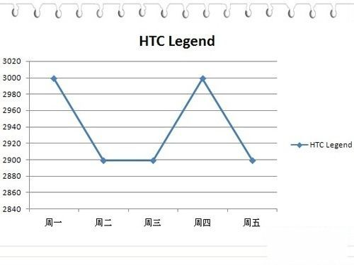

<!-- # ＜摇光＞春运三部曲之一：请给我一个“刚性需求”的商品 -->

**人们已经被政府的补贴给养成了“温室里的花朵”，把政府管制下的价格视作了理所当然的价格，把不通过价格进行的分配，视作了应然的分配。而对于价格表现的成本，往往又比其他方面表现的成本要敏感，一旦要改变分配机制，重新使用价格工具，人就觉得切身的利益受到了伤害，立马“刚性需求”得不行。**

# 春运三部曲之一：

# 请给我一个“刚性需求”的商品

## 文/卢卡翔（南开大学）

对经济学感兴趣的人，不管你经济学学到了哪个层次，必须要每年重新读一次“价格理论”，唯有这样，你学的经济学才不算跑了偏。不敢说上面这个说法对所有领域的经济学人管用，但至少觉得，对其中大部分是应该管用的。

把整个“微观经济学”总结为“价格理论”，真正是精髓到家之极。搞明白了“价格”是什么，你的经济学就算入了门，在这个问题上犯糊涂的，基本上还没摸到门。

之前思考春运问题，总是把它归为两个原因，其一是供给不足，也就是供给体制有问题；其二是需求在时间跨度上的峰值问题，也就是说春节前后的客运需求量远远大于平时。老是在这个问题上转不过弯，觉得第二个原因要用管理上的技术来解决，是我最近少读“价格理论”的恶果。

春运问题打算谈三篇，这是第一篇，先为“刚性需求”一词祛魅。

说到春运，当仁不让的最大的笑料就是“刚性需求”。这是经济学教科书中没有的词语，只有宏观经济学的书里有“刚性价格”，是说一段时间内，需求的改变不影响价格。反过来说刚性需求，无非是价格的改变也不影响需求量，在图上画出来的话是一条垂直的需求曲线。大家有没有见过这种商品呢？以一百倍的杠杆率下注，你肯定没有见过。世界上没有东西是价格上升需求量不下降的，地球上资源有限，每人的收入有限，什么东西是不论如何涨价都要买，而且买得起的，没有，这个巴菲特也办不到。除非身边有台印钞机，不管价格如何上升，只管印刷钞票就行了。不过开动印钞机也是要成本的，所以说刚性需求的商品还是没有。

但是生活中总会观察到某些物品价格上升需求量不下降的假象，这种假象是因为市场还没有到达均衡价格。价格低于均衡价格时，需大于供，这时候只能看见交易量，看不见需求量，人们误把交易量当做需求量。当价格上升，交易量不下降，人们误以为需求量也不下降。所以有刚性需求的困惑。

价格为什么低于均衡价格呢，很多情况下是因为管制，政府要求某某商品的价格不能高于多少多少。有价格上限管制时，市场不出清，也就是需大于供，市场没有实现均衡。但是因为市场总是按照供给量和需求量中较少的一方来作为交易量，所以价格上限管制时按照供给量来作交易量。随着价格管制的放开上涨，需量下降，供量提高，交易量跟随供量的提高也提高了，我们误以为是需量的提高，很外行地说，快看，刚性需求。

看懂了上面在说什么的读者，会明白，是价格管制创造了“刚性需求”，而不是反过来因为“刚性需求”，所以才需要价格管制。下面试举一例。

情人节的玫瑰花市场是一个开放的市场，从来不会觉得对玫瑰花存在刚性需求，如果谁这样说，怕是不懂经济学的人都要嘲笑他。但是如果有一天政府来管制了，政府派人垄断了玫瑰花的供给，还把原来市场价格10元一朵的玫瑰花定价为1元一朵，亏损政府来补贴。这时候，对玫瑰花的需求量，在情人节这天，肯定大幅上升。你信不信，在卖玫瑰花的窗口，会像这几天在火车站外面一样，排出几条长龙，接下来，一定会各种情侣各种抱怨，如此几年之后，国家玫瑰花部就会响应人民号召，推出网上订花、电话订花的服务，还有买花实名制。一个身份证号最多只能买三朵。不要紧张，按照贵国潜规则，如果你是能打通关系的人，那肯定能多买几朵！

这时候假若有人呼吁，说玫瑰花问题是定价过低，只要价格有所上涨，就能解决这个问题。各种男朋友立马会站出来大骂这人，说敢情你情人节不买玫瑰花，说话不腰疼，你懂不懂，情人节送玫瑰花是刚性需求！即使上涨5倍，我还是要送玫瑰花！

有闲心者不妨把情人节的玫瑰花换成中秋节的月饼再把这个故事讲一遍，然后，换成端午节的粽子再讲一遍，都可以。反正换成春节的火车票就不行，而且，换成任何一个现在正在享受政府补贴和价格管制的商品都不行。为什么？因为人们已经被政府的补贴给养成了“温室里的花朵”，把政府管制下的价格视作了理所当然的价格，把不通过价格进行的分配，视作了应然的分配。而对于价格表现的成本，往往又比其他方面表现的成本要敏感，一旦要改变分配机制，重新使用价格工具，人就觉得切身的利益受到了伤害，立马“刚性需求”得不行。

回到文章开头说的峰值问题，其实情人节的玫瑰花、中秋节的月饼、国庆长假的旅游，哪一样不是峰值问题？但是有了价格的调节，都既不“刚性需求”，也不认为这个峰值问题对国家有造成心肌梗塞的危险。反过来，政府老在那里管着然后帮着，自然要心肌梗塞咯。

开头和结尾都说到了价格，下一篇认真谈一下价格。

（采编：楼杭丹；责编：麦静）
