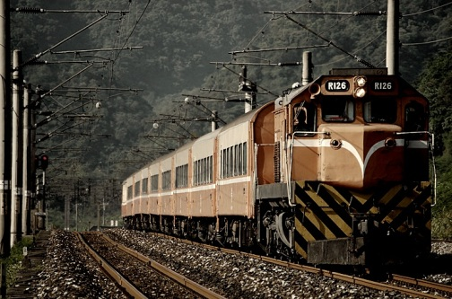

<!-- # ＜摇光＞春运三部曲之终结：“补贴三角”和“低智约束” -->

**在春运问题中，我们始终没有跳出一个思维的铁框框，就是总觉得春运问题被解决就等于所有人都回家过年了。如果按照这个方式去思考，春运问题就永远解决不了。春运问题要解决，就一定要认识到，中国人最紧要的问题不是过年回家。从情感出发，谁都希望这个世界上的苦难赶紧消失，但是现实很骨感：解决苦难的钱不是天上掉下来的，是人们在其他苦难中节省下来的。如果把回家过年算作国家福利，我只能说，贵国这个低福利的国家，超前享受了不属于它的高福利。**

# 春运三部曲之终结：

# “补贴三角”和“低智约束”

## 文/卢卡翔（南开大学）

在前两文中，得到两个结论，其一“刚性需求”为假，“刚需”的假象来自政府补贴和价格管制；其二是价格管制会带来租值耗散。

支持火车票价格上涨的，就是支持把租值留给铁道部；反对涨价的，就是认为租值还是耗散掉好。第二种人认为虽然没有帮到穷人，但是宁愿损失也不让铁道部得到好处。但是多数人还没达到第二种人的认识水平。

不止租值耗散，国家干预价格再进行补贴的方式共有四大弊端。

**其一，扭曲价格的信号机制**，这点在第二篇中也有说过。目前的中国铁路客运，经济实质更是一个国家行政部门而不是一个企业。如果一个部门，享受国家补贴或者被价格管制，依然可以被认为是一个企业；但若既享受国家补贴又被价格管制，只能是一个行政机构，因为它的生产将完全变成计划命令式而不再受到市场的约束。失去了价格指导和盈利驱动的行政部门进行生产性活动，注定是步步错棋。不顾实际需求，大干快上高铁项目，导致今天步履维艰，是为例。只求规模不问效益，这种错误不是新时代的新产品，58年大炼钢铁的时候贵国就是这种模式。所以，有人说铁道部是垄断国企，需要打破垄断。我觉得这之前还需要一步：把铁道部先变成垄断国企。

**其二，就是租值耗散。**耗散掉的总数是多少？2007年，“不管你信不信我信”的王勇平公布说，那年春运票价第一次不涨，“铁道部因此票务收入减少2亿元”。当年春运铁路总人次为1.55亿，2012年预计有2.35亿，考虑多年不涨价和春运不涨价因素，今年保守估计少收入15.52亿元。15.52亿元是个什么概念？举例来说，汶川地震之后一年内，中国红十字基金会向灾区拨付救灾款物和灾后重建项目资金总计大约10亿，可以“建立博爱中小学172所、博爱卫生站973个、博爱卫生院156个、博爱新村133个，共为7297户农民建设了住房，联合其他公益组织开展灾后重建公开招标项目16个”。15亿能办的事略微比这要多。

**其三，财政补助讲究“一次总付”原则。**中级微观的教科书有详细推导，这里只举个例子来谈。如果学校要补贴学生100元生活费，你是希望他直接给你100元呢，还是希望他请你吃一百元的的蒜薹肉丝？同理，如果单位要给你发节日费，你是希望发现金呢，还是同等价值的一箱水果？“一次总付”原则是说，如果财政要给予国民补助，从收入上进行补助，是比从具体商品的价格上进行补贴更优的方法。因为价格补贴不仅扭曲了供给，还扭曲了你的需求，同样的代价，没有取得最佳的效果。所以对于有人提出，春运期间高速公路不收费来缓解春运压力的办法，其实就是把铁路的价格补贴变为公路的价格补贴，是蠢招之一。为什么会犯这种错，后面会谈。

**其四，谁说最需要补贴的是过年回家的乘客。**借用薛兆丰的话说，假设反对火车票价格上涨的都是慈善家，但“过年回家”是最紧急的慈善项目吗？在网上一搜索，艾滋、乳癌、唐氏、孤寡老人、失学儿童……都是需要资助的项目。“过年回家，算老几？”在2011年，中国将贫困标准上调到人均年纯收入1500元，满足这个标准的人口是9000多万。如果提高到每年2200元的联合国标准，贫困人口有1.5亿。和这部分人比，我国民工简直是“富人”，农民工子弟就是“富二代”。所以，在我前面文章的回复中，有同学说你这个把价格补贴变成收入补贴，最大的困难是找到要回家的民工。我在这里回答他，不要去找，因为他们目前还不是最需要补贴的对象。

**在春运问题中，我们始终没有跳出一个思维的铁框框，就是总觉得春运问题被解决就等于所有人都回家过年了。如果按照这个方式去思考，春运问题就永远解决不了。**春运问题要解决，就一定要认识到，中国人最紧要的问题不是过年回家。从情感出发，谁都希望这个世界上的苦难赶紧消失，但是现实很骨感：解决苦难的钱不是天上掉下来的，是人们在其他苦难中节省下来的。如果把回家过年算作国家福利，我只能说，贵国这个低福利的国家，超前享受了不属于它的高福利。

按照目前的模式，是铁道部“补贴”乘客，国家财政补贴铁道部，纳税人再来补贴国家财政。我的办法是把这个“补贴三角”扭转过来，也即：旅客“补贴”铁道部，铁道部补贴国家财政，国家财政补贴百姓。这个方法，至少没有前面所提到的四个问题，才能让我们的辛苦钱不再浪费掉，也不再要穷人去补贴“富人”。目前铁道部的净资产14811亿，净资产利润率近乎于零，如果按5%的最低标准来说，铁道部实现740亿甚至更多的潜在盈利的话，这部分钱用于补贴最穷的人、补贴教育、为企业减税，都是比补贴乘客更好的办法。

政府是很聪明的，他们不改变目前这种补贴的方式，有利益驱动的因素，也有民意约束的原因。我并不反对作为政府提供一种叫做“公平”的商品，但从公共选择理论的思路，也要知道，政府基于自身利益，就不会提供真正的“公平”，他们只会提供“看得见的公平”。把补贴给了最穷的人、或者减税了，谁看得到？把补贴“给了”农民工，而且是春节回家的农民工，人人都知道。社会主义优越性的印象，一下子就深入人心。所以，真的要擦亮双眼，看清楚“机会成本”在哪里。

美好的愿望不等于实现它的可能性，私人生活中都懂这个道理，一到公共领域就迷糊了，我把这称为“低智约束”。公众思维的局限，一样会成为国家改革的约束条件，国家提供的补贴成了民意“刚需”的硬约束，就是这样。中国的改革，同时面临利益约束和低智约束。坚持利益约束更不容易打破的，支持先提高价格；坚持低智约束不易打破的，支持拆解铁道部优先；两个都坚持认为不可动摇的，只能继续趟在水里面摸石头了。

（采编：楼杭丹；责编：麦静）
