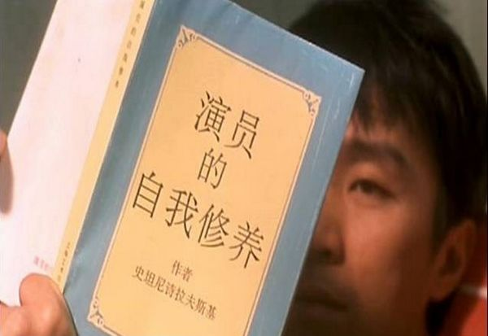
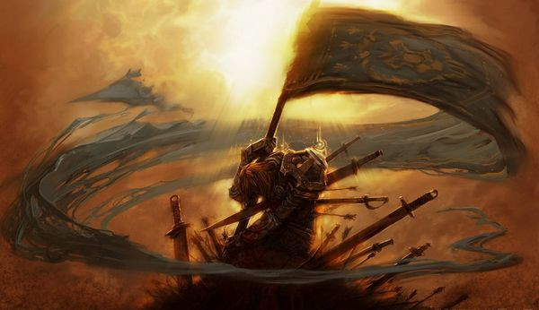

<!-- # ＜天权＞沉默的梦想 -->

**和人聊天，问及有什么梦想。如果说没有，那是要被鄙视的。“长大了要当科学家”这是幼儿园的回答，“娶妻生娃”是农村人的愿望。而如果说出来的是什么“我要赚大钱”，“我要很有名”，那估计你就算不是第三类青年，也顶多是个普通青年。文艺青年们都喜欢把环游世界等高难度任务当作信条，并对所有充满人间烟火气息的答案嗤之以鼻。梦想像一场瘟疫一样扩散到这个世界的每个角落，被呼吸，被谈论，被歌颂，被消费。我们习惯了对他人的梦想评头论足，却忘了梦想本身就是样私人的东西。**

# 沉默的梦想

## 文/胡天语（澳门大学）

#### 1

晚来无事，翻报纸的时候看到一篇报道。是对某个15岁童工的采访。迅速浏览了一下，无非还是那些要素：迫于生计，带着家人的期望来到大城市，在流水线上做着简单粗暴的工作，每天工作15小时，拿着低薪的同时要忍受老板的克扣，沉迷网络游戏……日光之下再无新事，看起来和任何一个低龄的农民工没有区别。

每个大城市都有着这么一群孩子，在本该享受青春的时候，他们与光相悖而生。

但当被问到有什么梦想时，这个叫管民的重庆孩子说：

“我没有梦想，我为什么就一定要有梦想呢？”

#### 2

这个快速消费的社会创造了两样信仰：一是梦想，一是爱情。

每一年有那么多的电影唱片书籍话剧，它们争相歌颂着梦想的伟大和爱情的美丽。每年有那么多的人和事被宣扬，因为他们坚持着自己的梦想或拥有完美的爱情。

和人聊天，问及有什么梦想。如果说没有，那是要被鄙视的。“长大了要当科学家”这是幼儿园的回答，“娶妻生娃”是农村人的愿望。而如果说出来的是什么“我要赚大钱”，“我要很有名”，那估计你就算不是第三类青年，也顶多是个普通青年。文艺青年们都喜欢把环游世界等高难度任务当作信条，并对所有充满人间烟火气息的答案嗤之以鼻。

梦想像一场瘟疫一样扩散到这个世界的每个角落，被呼吸，被谈论，被歌颂，被消费。

我们习惯了对他人的梦想评头论足，却忘了梦想本身就是样私人的东西。

#### 3

“我为什么一定就要有梦想呢？”

我当然可以列举出一堆好处：有了梦想你的人生才有前进的方向，才知道以后要做什么，才知道要怎么努力……我也可以找出一堆例子，从古到今从来就没有缺过励志的故事。

但我知道面对他的一切解释都是徒劳。

他也许梦想过和同龄人一起上学，却因为家境贫困不得不放弃。

他也许梦想过牵起某个女生的手，却最终看着她挽起了别家的高富帅。

他也许梦想过要出人头地，最后却发现没学历没关系连面试的资格都没有。

欢喜或光荣都是别家的典礼，留给自己的只有众多机器中默默挑着电线的机械重复。当所有的梦想都会搁浅在现实的冰山上，当所有的梦想都最终被证明是奢望，我用什么去证明给他看有梦想真的是一件好事。

他说，他喜欢网游，因为只有在那个时候他是真正的主人。

但如果有一天他发现其实游戏的世界一样是赤裸裸的弱肉强食，RMB玩家的等级和装备可以砸到他从未想过的高度，那又会怎么样呢。

生存是唯一的规则，这或许残忍，却是无可奈何的真实。

我当然可以说，让他把梦想定得低一点，容易一点。但当那卑微却又小心翼翼的梦想摆在其他人光鲜的愿景前时，那种自惭形愧从来不曾因为他的出身而有所减少。

对于他，世界可能是公的不是母的，也可能是平的不是圆的，但却从来不会是公平的。

而更多的管民们，对着机器挑完了十六个小时的铜线，带着一身的疲惫和双手的伤口，默默回到宿舍陷入无梦的睡眠。

没有梦想，也没有梦境，他们的生活只有沉重而无尽的现实。

这是最好的时代，也是最坏的时代。

#### 4

我们是幸运的人。生于这样的年代，家境小康生活平稳，不可为所欲为却至少可以基本顺心。

于是我们眼光高了起来，言及民主自由，谈论法制道德，争辩制度素质。我们高屋建瓴，高谈阔论，看大量的书只为寻找一个别人都没用过的名词或名字。

但我们总是忽视在同一个国家里，有着许多连梦想都不敢拥有的同龄人。我们嘲笑非主流，轻视农民工，对一切“不入流”的人和事表示调侃，却忘了我们唯一比他们占优的地方不过是出生时运气好点而已。

有多少人宣告着要环游世界，就有多少人为了三餐发愁。有多少人渴望成为艺术家，就有多少人希望能找到一份简单哪怕劳累的工作。这是人间的真相，却往往被粗糙地解读。

我们呼喊着周星驰的电影里的口号：人没有梦想，和一条咸鱼又有什么分别。

但我们都忘了，从来没有鱼是自愿变成咸鱼的，所有的咸鱼都是被迫的。

#### 5

信息时代的坏处在于，在大量信息的冲击下，所有的东西都被符号化和抽象化了，包括人。

我们对人的印象变得平板而抽象，较之深入的了解，我们更习惯于在人人微博上一点点猜出对方的喜好和性格。

有人喜欢淘宝打扮逛街自拍，有人关心家国天下时事评论，有人热爱旅游，有人关注升学。这是个多元化的社会，却永远只能让人以片面的方式记住另一个人。我们匆匆地在社交网站在浏览着，然后迅速在心里给他人贴上标签，甚至不管那是不是一个人的真实面貌。

而更多的人，我们在报纸电视和电脑屏幕上扫过他们的生平，就再也不曾得见。

我们永远不知道那些与光相悖的孩子是如何生存的，他们对于我们来说不过是一个极其抽象的集体。对于那些沉默在黑暗中的年轻人，我们轻率地将其归于体制，然后开始发表见解。我们不曾试图去了解他们的生活，也不曾费心去考虑他们的诉求。他们和我们生活在同一个国度甚至是同一个地方，却陌生得如同两个世界的人。

他们就那样成了这个世界的盲点，在黑暗中生生不息。

#### 6

梦想从不该是奢侈品，梦想存在的意义也从不是少数人用来夸耀自己的说辞。

是时候了，我们试着去关心未曾重视过的他们，我们试着去倾听从未在意过的他们。他们的想法也许略显幼稚，也总归是发自内心，而每一份真诚都值得尊敬。如果说我们还有未来，那也一定是一个平等而光明的未来。只有当我们的目光成为他们世界中新生的光亮，那长久的黑暗才会最终烟消云散。

也许这光尚微弱，却足以点亮梦想。也许梦想不一定都能实现，但总应该有敢去梦想的勇气。

(采编：麦静；责编：麦静)
