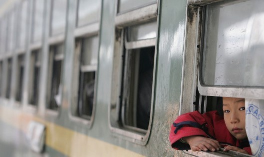

<!-- # ＜天璇＞硬座里的火车 -->

**中国火车的硬座车厢，是一个巨大的生命共同体，在这样一个狭小的空间，人与人之间的距离被打破，冷漠被烘化，就连人最起码的自尊也消失殆尽。人和人就这么紧挨着，一个挨着一个，你回避不了无视不了忽略不了，像被人强行拨开眼皮强迫去看什么不想看的东西一样。所有人的情绪、心态、表情、举动，甚至生命都被牢牢拴在了一起。**

# 硬座里的火车

## 文/李东哲（吉林大学）

八四年版Lonely Planet这样说：“在社会主义中国是没有等级之分的，取而代之是硬座、硬卧、软座、软卧。

#### 一、

我在火车上，硬座车厢，一列还没走出河南就已经晚点一个小时的低等列车。没错，火车也是分等级的，不像人的等级那般忌讳和回避，火车的等级来得平铺直叙，也算坦荡。现在的我，坐在摇晃的车厢里，手里握着那支在安检时错点被认作是小刀之类凶器的笔，在随身带的小本子上东跌西倒地涂涂写写。我一直想学画画，比如素描，它可以帮助我留下一些相机照片无能为力的瞬间。但我丑陋的字体就显示出我在这方面天赋的欠缺。于是我只能借助不堪的字体来试图记住眼前的画面和感觉，但愿文笔不至像字一般写得那么糟糕。

#### 二、

中国火车的硬座车厢，是一个巨大的生命共同体，在这样一个狭小的空间，人与人之间的距离被打破，冷漠被烘化，就连人最起码的自尊也消失殆尽。人和人就这么紧挨着，一个挨着一个，你回避不了无视不了忽略不了，像被人强行拨开眼皮强迫去看什么不想看的东西一样。所有人的情绪、心态、表情、举动，甚至生命都被牢牢拴在了一起。坐在对面的人，与你如此接近，以致于你无法回避其存在。无论你再带上耳机，把头埋入书中，也无法忽略其存在。他的呼吸叹气转身伸展哈欠喷嚏吃饭喝水打嗝放屁发呆迷茫等每一个细节都能准确无误地传导到你这。一个人脱鞋，全车人皱眉，一个人泡面，全车人肚子叫，车一减速停止，全车人都议论不止。在这样的车厢里，你有一种强烈的无力感，像是被大网一网打尽的鱼群中的一只，只能随波逐流，和其他人一样，随车想左右摆动。但是，没有尼莫的出现。

看书看累的我，试图用文字给身边的人物进行速写。

我把本子放在两腿上的小说之上，深弓着背，用我的身躯和两边披在身上得外套构成了一个封闭的空间，用来遮盖住我的笔，以及笔尖下流出的文字。一是羞于在人前写作，不愿意自己未完成的作品让人窥见；二是不愿让周围的人知觉我在写的东西与他们有关。就像是在外游走的时面对陌生人，我会尽量遮蔽起长长的且黑洞洞的镜头，尽量不去惊扰到我创作的那些对象们。是一种道德，也能保证这已不多见的纯粹。

我从他们的肤色（仅在中国其实就有肤色的区别）、衣着、神态、谈吐中来揣测他们从哪里来，又要去哪，去干什么，干得辛苦吗？活得幸福吗？有对生活的不满吗？觉得命运不公吗？这里面有些问题，我可以从跟他们的搭讪当中轻易获取，但有些问题，即使热火朝天聊到终点也无从得知。索性不管不问，把这存留在我的想象中即可。我要的不是一个答案精准的社会学调查报告，我要的只是自己对社会多样的感慨和对生命奇妙的膜拜。

对面的几个人，应该属于农民工，或者称呼为“体力劳动者”。从他们发达的汗腺、黝黑的皮肤、深陷的皱纹、刻上去般的眼袋以及吃饭时的风卷残云的劲道都能判断出来。列车员走过来，飘来有卧铺可以补的声音。这几人的脸上浮出了一丝一闪而过的笑意，不知是自恃身体好而看不起金身娇贵的补卧铺的主儿的嘲弄与不屑，还是囊中羞涩的无奈，亦或是大脑对“卧铺”一词根本上的麻木，也许他们的字典里根本没有录入。都是也许，也许只是我看错，也许都是我的揣测。

他们大口地吃着泡面，全然不顾里面漂浮着的残余料包塑料袋以及高温加塑料可能致癌之类云云；他们大口喝着汤，混合着自己大颗滚烫的汗珠；他们大口地塞着自带的煮鸡蛋，一口下去，只剩蛋白。列车员的声音已远，后面跟着一个领着大包小包的年轻人。我决定不动。还有什么比这样的车厢更美妙更有魅力的吗？一张张鲜活的脸和脸上想象力所不能至的表情都具有巨大的吸引力。而卧铺，现在在我看来就是一个尸体冷冻库，里面躺着那些吃睡交替的冷冰冰的人。虽然我曾一度很喜欢卧铺，特别是安静得可以一路看书的上铺，但现在看来，一个出世，一个入市；一个难，一个更难；一个与自己想处，一个与万物碰撞。

车停下来，我也停下来；车晃起来，我也开始写起来。眼前这一切相比于我昨天闭关时一张空空的纸，不知鲜活了多少倍。但纸是想象力纯粹驰骋，而眼前则是感官强烈的刺激。谁也别想把我从这里撵走。到站了，身边那个坐了四五个小时的人下车了，等会谁又会上来，来继续接受我的文字速写呢？

这时的我，心中充满了巨大的幸福感和安全感，因为我有一张从起点到终点的印有座位号的车票，不会因座位而奔波动荡；我有足够多的吃的，刚又从津味儿知足且十分逗乐的售货员那买了瓶水，不用担心这后半夜会挨饿挨渴；我又翻了翻笔下这个小本，虽大部分已满，单剩余的空白足以支撑我如此书写到天亮。仅此而已，但已足矣。

对面的一个民工会时不时地打量我，我用余光和玻璃上的反光发现了，但小心翼翼地不让他发觉我的发觉。他在想什么？他会如何打量眼前这个小伙子？他在翻得书是什么？他时抬头时低头时发呆都是在想什么呢？他俯身在下面在写些什么呢？

他是否这样想我不得而知，也许只是发呆，但这足以让我从一个旁观者的角度重新打量自己，这已然很奇妙了。我则也会顺着揣测中这个民工大哥的思路继续下去：这个男生，他到底在干嘛呢？

#### 三、

车厢的另一头，上来一家三口，孩子还小，分不出是男孩是女孩，躺在女人的手臂里睡得安稳。他们三个没有一张坐票，只得把箱子横放在过道里充当座位。虽然已是半夜，但明晃晃的灯光丝毫没有让满满的乘客有任何的睡意，来来往往的人依旧不少。男人不断地站起蹲下站起蹲下，女人则抱着全然不知的孩子侧坐在箱子上，苗条的身躯得以在过人时不用起身。男人没有地方坐，靠在椅背上看着女人和孩子发呆，脸上是什么表情，我读不出。是慈祥，是无奈，是自责，是麻木？不知道，只是在过往的人不小心蹭到熟睡的孩子的头时，才会瞪起耷拉许久的双眼，怒目而视，暗骂一句只有自己才能听清的粗口。来来往往的人不少，当他们扬起沾污水的脚迈过女人和孩子时，表情可曾从对拥挤的抱怨当中为这女人和孩子稍稍舒缓一下？男人的目光随着过往的人，来来回回地注视着女人和怀臂中的孩子，目光关切且无助，只能站在那里看着，好像他的暮光能保护自己的孩子做一个安稳的美梦一般。

#### 四、

我现在坐到了过道中间。

车厢内不知是暖气足还是人多的缘故，热得穿不上外套，但我东北穿出的外套放在哪里都是个累赘，索性披在身上。过道宽度有限，外套掠去身躯占剩下的已局限的空间，来往过人，我须合书、翻身、手拽着外套以免被蹭掉，一个接一个。书被打开，又迅速被合上。

车厢里人们的脸上出现的表情，让我感受到语言和想象力的极限。强打精神聊天的人，说的满脸通红，眉毛向上费劲地吊着沉重的眼皮，眼神微醺；而痛苦的表情多出现在那些睡着的人脸上。坐在过道旁的人，无依无靠，仅有其后那接近90度的靠背固定了一个方向的自由度，头颈随震动的火车而摆动，活像刚刚除恶济贫后迈着晃悠步子边走边往嘴里灌酒的济公。只是车上这个“济公”面露不悦，嘴里连连出着大气，不知是否是在感慨世事的炎凉。

人们在通宵的火车硬座中，丧失了所有的尊严：视造型为生命的异形青年也顾不得自己那高耸入云的发型了，打扮入时的姑娘也不管身边是不是可依靠的人了，有的人横卧在座位上，独霸两三席，管他还有没有站着的乘客，我先蒙头睡一觉才是正道，双脚自然地伸过道。而过道上，各种各样的腿和脚纠结交织在一起，偶尔还会掺杂进去一个脑袋。

人们在拥挤着上车时，早已将无暇顾及的形象留在外面。火车呼啸而过，留下碎了一地的尊严。

现在的车厢十分安静，静得能听到近十种不同的呼噜声。但我忍受不了这种寂静，戴上了耳机。我喜欢刚才车厢中的吵杂，到处充斥着听不懂的方言，这边放豫剧那边放摇滚，这边打牌那边大笑。我不时从小说里面抬起头，以带着一种自己是外国人的异样感觉看一眼目所能及的部分车厢，再心满意足地低下头。

我一直没有睡去，我不忍放弃观察这所有人最脆弱一面的机会。

(采编：何凌昊

责编；尹桑)
