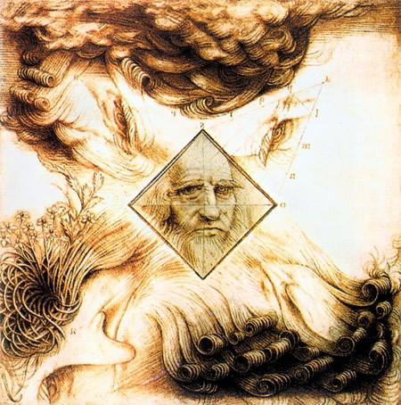

<!-- # ＜摇光＞失真与真 -->

**这些世界，当然对现象世界是一种“失真”，比如一张脸，最“精确”的还原方法当然是把他在经验世界中的肤质，轮廓毫厘不差地还原出来。可是现在你把他还原成了一团烈火或是一片乌云，那岂不算是“失真”？或者有时候你把他还原成了用语言都难以描述的东西，那则更是“谬以千里”了。**

# 失真与真

## 文/董泽宇(中国传媒大学）

1.

学工科的同学都知道，在工科体系里面，“失真”是一个特别需要注意的问题。比如说我设计一套语音通信系统，结果每一个音素还原出来都比原来高八度，那这个系统可以说是非常失败的，因为它不仅不能较好地“还原”其所想传递的音素，反而对其有非常大的扭曲。

因此，工程师们总想通过技术改进，降低失真，从而更好地对“源素”进行还原。高清视频，高保真音效等的出现，就是这个目的。

但是呢，人很奇怪，有时候高“还原”的东西接触得多了，反而会不太舒服，会想去接触一些没那么“精确”的东西。比如长时间观看高对比高饱和的高清电视后，我就会有点难受，有时候特别想看一些“糙”一点儿的画面。

个中原因当然可以用工业化的标准流程去加以分析，并作出“改进”。但我想，可能其中根本症结在于：我们总是把现象世界看得太绝对，绝对到凌驾一切不容置喙，可实际上，现象世界只是“整体世界”的一个部分罢了。

在“现象世界”之外，实际还存在另一个或另几个世界，将它们冠以“先验世界”也好，“潜意识世界”也罢，或者“心灵世界”亦可，总之，是存在的。

这些世界，当然对现象世界是一种“失真”，比如一张脸，最“精确”的还原方法当然是把他在经验世界中的肤质，轮廓毫厘不差地还原出来。可是现在你把他还原成了一团烈火或是一片乌云，那岂不算是“失真”？或者有时候你把他还原成了用语言都难以描述的东西，那则更是“谬以千里”了。

2.

从这个角度去观察以摇滚乐为代表的当代艺术，会特别有意思。

我们都知道，摇滚乐手的主要武器是电吉他，而其最大的特点则是连接各种效果器之后做出的“失真音色”。

这个“失真音色”非常有意思。首先，它其实是工业化现代化的产物，古典吉他是不会有“失真音色”这么一说的；其次，它其实和工业化现代化的核心理念是违背的，因为它对木质吉他本身的音色是一种扭曲，亦即“失真”。

但是，摇滚乐的魅力很大程度上又来源于此。我们经常听了一首歌后会说：哎呦，这首歌的（失真）音色调得真棒！

“棒”这个标准，其实是很模糊的。一种失真音色，一个人觉得棒，可能另一个人就觉得“屎”。以还原而非失真为目的的声音控制，争议就会小很多：只消比较声音与音源的差别，便可知高低。

类似的道理可以推广到其他艺术领域。有时候我们在博物馆看西方美术名画，难免暗中会想：这画得什么啊，有什么了不起的，为什么这么多人喜欢呢。

这时候你戴上导游机，可能才会发现：哦，原来这幅画用了“明暗法”，逼真度有了空前提升，在当时的欧洲画坛引起轰动。

你可能又会想了：再“逼真”，也不会比照片“逼真”啊。

所以，后来的西方美术思潮转向了超现实主义和抽象派为代表的“失真派”去了。

而文学，也从巴尔扎克，左拉那种喋喋不休的“自然主义”（很多人看不下去“世界名著”，就是因为觉得里面的描写和叙事太过精细和琐碎，以至于引起拖沓和无聊之感）开始转向描绘跳跃意识的意识流与打破逻辑与句法的后现代主义文学。

也许这可以说明，人天生对“失真”有一种向往。

因为某种意义上来说，“失真”才是“真”。

3.

我们今天所习以惯之的世界图景，很大程度上是理性所赋予的。我们所不加怀疑的“真实世界”，其实只是工业化或现代化标准上的“真实世界”，这个世界对应的是大脑，而非心灵——或者用韦伯的话来说，其对应的是“工具理性”，而非“价值理性”。

所以，虽然现代人大多把“真实世界”或曰物质世界当做最为切实的存在，但又会在很多时候，感受到“一些东西”的“缺少”，或是“空”。这种“空”，便是“失真世界”的阙如。

请原谅我在此只是点到为止——尽管本来是想说些什么来着的——而不做更多讨论。因为：一来，现代性的反思几乎是随着现代化进程的推进而同步展开，但目前来看，除了在文艺和人文思潮领域有一些成果之外，“收效”并不大，且这些本已十分有限的“成果”，又多被现代性的得力干将“资本”加以降服，规训，收编；二来，妄图用“失真世界”去替代“真实世界”，或是期待“失真世界”可以取得什么样的“成果”，本身就存在很大问题，这是用隶属于“真实世界”的“逻辑”和“进步”去推断“失真世界”，已经犯了大错，若我更加“明智”一些，早该住口停手，须知一切“不可说”，“道可道，非常道”。

只能说，各有各的缘法，各有各的人生。对我来说，失真世界与真实世界，梦幻世界与物质世界，隐喻世界与函数世界，的确是不分彼此，共同存在，虽然也常互相干涉，难解难分。在他人看来，我是“喝多了”“想太多”也说不定，甚至可说是“精神病”——真有人常这么形容我——可我自己却觉得还好：反正现代人都是虐待狂，可怜虫和精神病，也不差我这么一个有点失真的精神病。

(采编；何凌昊；责编：

尹桑)
