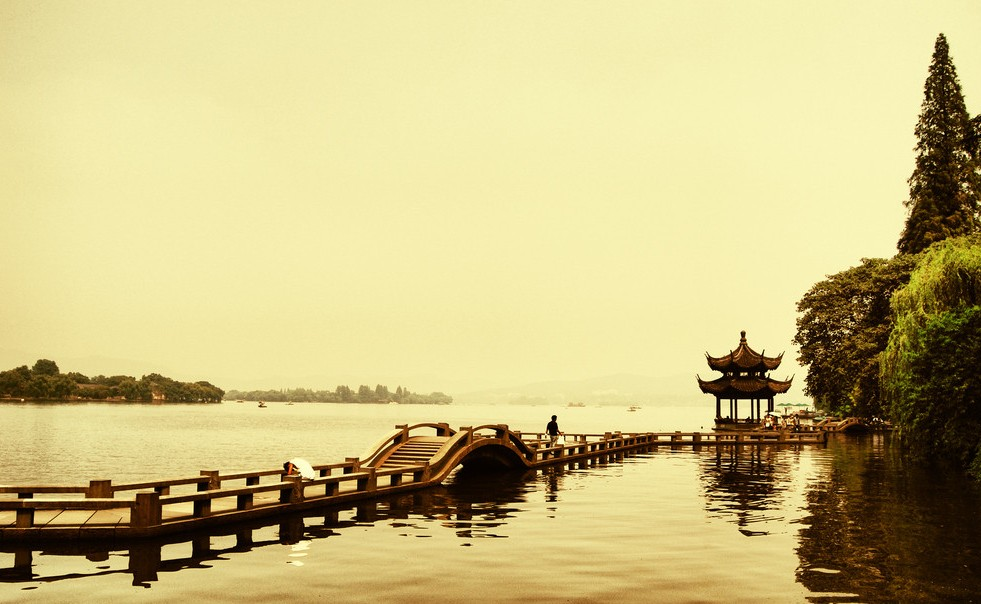

<!-- # ＜摇光＞成都和杭州 -->

**你可以不去武侯祠，也不去宽窄巷子，就在人民公园的鹤鸣茶社坐上一两天，你便知道什么是成都了。作为一个古城的成都，真正的活化石，便是茶馆的生活方式，说得难听点，在整个成都城里，是几乎片踪都难寻了。**

# 成都和杭州

## 文/元淦恭（中国人民大学）

作为一个籍贯成都，又生于斯长于斯的人，我对成都有着极端深厚的感情。对成都的热爱，早已成为我生命中间最重要的符号，永远都抹不掉。

我和“老成都”之间的联系，基于父辈和祖辈的家族记忆。今日的成都人，绝大多数已经是1949年以来的新移民后裔，他们的爷爷奶奶，外公外婆，好多还在四川的其他地方，甚至原本就是从外省迁来。但是，对我而言，许多街道和地点，都承载着我血缘里的信息。

譬如棉花街和打金街口，那是我父亲出生的地方。我特别喜欢棉花街这个街名，虽然它已经消失了五十多年。1959年，因为市政建设的原因，这条棉花街被整体拆除，所有的房子按照“原套原”（用现在时髦的话说是“异地复建”，连材料都没换）在较场坝重建。于是，我们家在这个地方一住就是五十多年。

因为我从小到大，一直没有搬过家。所以点将台这个地名对于我而言就是家的代名词。这是我永远的家。从襁褓中的婴儿，再到18岁考上大学离家，这里有关于我所有幼年、童年、少年和青年的记忆，有我和祖母，和父母在一起的时光。我的家和我的街道，我的城市便如此紧密地契合在一起。

成都城里的景点，其实不过尔尔。我认为最值得一去的，不是武侯祠、杜甫草堂，而是“人民公园”。这个公园有着一个如此二逼的名字，但这个公园绝对是“最成都”的地方，没有之一。

我曾走过雪花纷飞的同里，看到那家从1898年就开始经营从未断过的“南园茶社”，确实，那是陈去病、柳亚子和南社人曾经聚集的乐园，却终究只是个二层的阁子。柜台很干净，冬天里的茶馆也很寂寥。在没有天然屏障的长江下游，冬天很冷，茶园也自然寥落。

然而，你去成都一看，人民公园的鹤鸣茶社，绝对不是那样。尤其是在有阳光的时候，即使是冬天温度也能接近十度，人们三三两两地坐着，欢笑着，聊天，打牌，旁边是一个小小的池子。

这里比不得西湖边的曲院风荷，这里比茅家埠的小湖都差得远，可是这里的人如此快乐，又如此无忧无虑。李铁写过《杭州和成都，休闲不在一个境界》，真是恰如其分地描写出成都这样的感觉，描写出成都人的这种欢欣和开阔。

四年前，一个段子说“灾区人民在余震中等待吃喝，成都人民在吃喝中等待余震”，这种川人乐天知命的性格，在长江中下游的地方，是决然找不到的。也只有像四川这样的土地，才会以让仙风道骨浸入每个人体内，幻化成这样的与世无争。

这个公园原来不叫“人民公园”。她曾叫过很多名字，最早的一个是“少城公园”。昔日成都分为满蒙旗人居住的满城和普通民众居住的大城。这个满城与大城相对，沿袭过去成都大城小城一直以来的“大城少城”之称谓，也被称为“少城”。少城的南面，清朝时基本是一片空地，兼有些仓储功能。四川光复后，大城少城界限打破，这一片地也被辟为“少城公园”，鹤鸣茶社的历史，现在算来也有百来年了。

在成都，百年茶馆不少。这些茶馆至今仍然并不昂贵，特有的四川竹椅，配上一杯盖碗茶，就拿一份报纸，甚至什么也不做，就等着艺人来挑耳朵。

后来，成都西北的郫县成了中国“农家乐”的发源地，成都的周边，就连农家的院落，也都家家可以这样招待客人，而且到花开的季节，也是门庭若市。到一个有花的地方，或许都不为了赏花，只是打麻将的时候想闻到花香。过年的时候，到成都东南的“幸福梅林”，正好有人便是如此，打牌刚输了不少，却说虽然输了闻到腊梅的香味也是值得。

放眼中国南方，获得“中国最佳旅游城市”殊荣的城市，只有成都和杭州。成都是世界高端旅游的重要目的地，因为她是整个康巴藏区的门户，不论去九寨黄龙四姑娘山还是稻城亚丁贡嘎山，乃至于行走川藏线，成都都是很难绕开的中转站。然而成都城的精彩在哪里呢？其实就是成都的这种生活。

你可以不去武侯祠，也不去宽窄巷子，就在人民公园的鹤鸣茶社坐上一两天，你便知道什么是成都了。作为一个古城的成都，真正的活化石，便是茶馆的生活方式，说得难听点，在整个成都城里，是几乎片踪都难寻了。

成都原本拥有中国南方仅次于南京的巨大城垣，到上世纪五十年代仍基本保持完好。因为成都城墙内近似圆形，所以成都旧城城垣长度和西安相仿，但成都旧城的面积比西安还要大。如今，西安以城墙闻名于世，而成都的城墙却在上世纪五六十年代拆了个精光。1958年春天，中共政治局在成都开扩大会议，对成都不啻是场灾难的开始。伟大领袖说，城墙妨碍交通，应予拆除，于是四川书记李井泉便一不做二不休开始拆城墙。当然接下来几年这个李先生左得要命，不仅毁成都城，而且灭四川人，让这个中国人口第一大省荣登中国死亡率和死亡人数第一省的宝座。从1949年到2010年，四川人口增长不过百分之七十，而全国人口增长了一倍多，这当然都要拜李书记紧跟上峰所赐。

成都原本拥有一条如玉带一般的穿城而过的河流，称为金河。我看过清末拍摄的金河照片，两旁的建筑精美，又加之小桥流水，其雅致不亚于今日的西塘，不逊于苏州的山塘街。在那个疯狂年代，成都的金河被填，变成“人防工程”，从此成都再无金河，只剩下人民公园北侧的那残缺一段。

成都原本有明蜀王府的遗迹，基于其旧地修建的清朝贡院。虽然成都贡院比江南贡院小了些，可是也是规模宏丽的建筑，到六十年代还有开三道门洞的大门。文革风起，这些东西也当四旧一概破除，变成“毛泽东思想万岁展览馆”，成都“皇城坝”，从此消失在这个城市，只变成老人记忆里尘封的往事。

甚至成都原本还有一个保存极为完好的文庙，成都府文庙大成殿堪称经典。我的老师曾说，那是他看过的除曲阜孔庙以外最壮观的文庙大成殿。可是某一个败家的中学，后来（这已经是八十年代以后了）居然为了修建一个体育馆把这个文庙大成殿拆掉，然后异地保护了。后来这个中学从成都市政府得到了一幅新的地，然后在这个地块上修了一个绝无仅有莫名其妙地坐南朝北的伪“孔庙大成殿”，真是让人啼笑皆非。

于是，原本南方最美丽精致的古城，变成1949年以后整个中国被毁灭得最彻底的古城。文殊坊也好，锦里也罢，都是百分之百的假东西，至于被广受好评的宽窄巷子，也基本上百分之七八十是新造的。

成都土地平旷，于是建设成了“裹莲花白”状，整个城市真是里三层外三层地水泄不通，密不透风一般。重庆、南京有山，武汉、杭州有湖，城市的扩张要受到自然的限制，所以反而保留下许多绿化的山林和湖泊。成都既无山，也没有像样的湖，最后搞成钢筋混凝土森林，从整个城市市容来讲，在南方算是挺丑的。

成都有一点好，就是干净整洁。和成都同等档次的城市里面，除了杭州、厦门以外，恐怕是找不到了。

其实到成都去玩，主要不在于观光，而在于休闲。吃小吃，吃川菜、火锅，再看看美女，这才是在成都真正的享受。虽然成都没有什么西湖，也没有什么钟山，然而刚才说的这些活动，绝对比杭州南京更让许多人感到惬意。

成都是个不论贫富都可同乐的城市。在杭州，你很难看到一辆差的车，可是成都虽然车多，三五万一辆的比比皆是。成都人不好面子，只是图个方便和“安逸”。

成都的物价比杭州可人，公交的服务也比杭州亲民。成都承担不起北京一样的财政补贴，但却仍让成都公交在市民可承受的范围之内。成都公交卡可以充值次数，每坐一次普通车算一次，坐一次空调车算两次，每次五毛，一元起充。刷卡后两小时内换乘免费。在杭州的时候，只要听到一个地方公交车不能直达，就会开始考虑是不是应该坐公交，要不要直接打车，而在成都，倒不会有这种想法，因为一块钱是保证能够到三环内的任何一个地方的。

确实，杭州是高帅富的乐园。在这个城市，高帅富徜徉于湖光山色之间，泛舟于西溪的芦苇荡中，怡然自得，又潇洒飘逸。温文尔雅的杭帮菜和海纳百川的四川菜，也显出杭州和成都气质的差异。

到过的城市越多，就越对成都有“哀其不幸怒其不争”的感觉。

1980年的时候，四川省是全国GDP第一，现在四川（为保持比较标准一致，此处的四川含重庆市）是全国GDP第五。在过去的数千年里，成都在多数时间都比杭州发达，可是现在人均GDP还不到杭州市的一半。

当然你会说杭州沿海啊，可是看看杭州的产业结构，那可不像东莞佛山的加工业那么简单。杭州的知名公司多了去了，其中有阿里巴巴淘宝吉利等等，这些都不是成都一般的企业可比。成都的电子科技大学说起来那是不知道比北京之外的绝大多数电子高校高到哪里去了，可是成都又能留下多少IT精英呢？成都的IT业看似发达，无非是英特尔富士康之类的低端组装业撑起来的而已。

如今，成都能从杭州手中抢过的称号，大概也就是“休闲之都”了。

如今的她，没有傲人的风景，没有绝世的山水，没有昔日的风华。有的只是一群乐天知命的人们，和他们美丽的知足常乐的日子。美食、美女和那种能够把时间大把大把挥霍掉的恬淡和安适。如果杭州是一道色香味俱全的美馔，或许成都更像是一块臭豆腐，其貌不扬，却能慢慢品出浓郁的香味。

而之于我，杭州是惊艳的邂逅，成都是温暖的挽留。

（采编：楼杭丹；责编：应鹏华）
