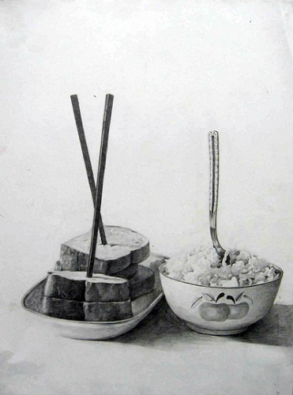

<!-- # ＜天璇＞你是不是被自己的文化裹得太紧了 -->

**如果中国哪里都比国外好，那我们也就不用出国了，出国的目的难道不就是取其之长，补己之短吗？也许有的时候，我们都被自己的文化裹得太紧了，要学习，就要取下有色眼镜，从婴儿开始，去接受，去欣赏。**

#  你是不是被自己的文化裹得太紧了

## 文/王逅逅（Haverford College）

我在Haverford最好的朋友，也是我的室友安，是一个对于中国文化完全不了解、也不感兴趣的人。说实话，她是我的第一个对中国文化如此漠不关心的朋友。之前，我的朋友大多数是在中国学习语言的美国学生，像Elle，Sam和Nick，都是恨不得天天读中国报纸的美国学生。而且一般在Haverford的美国人因为学校里有很多中国学生，所以中国对他们而言并不陌生。安是在法国长大、在西班牙读高中的一个富有家庭的女儿，她在和我同住之前基本上没有怎么接触过中国人，而由于我们的日益亲密，有时她对中国文化的漠然会让我感觉很不舒服。可是转念一想，这也是人之常情。

今天我们hall上一帮人一起去吃饭。走着走着Niki提到在中国上厕所的问题。niki说他在中国旅行的时候从来不去公共厕所，因为他们没有免费供应的厕纸。Sam马上就叫了起来：“怎么会？没有厕纸让人怎么上厕所？”

我刚想开口解释说我们有，你可以在外面买，而且大家一般都自己带。可是安马上就冷笑着说：“他们根本不用嘛，他们是中国人。”

我知道她是在开玩笑，因为她对我眨了眨眼，还用胳膊肘捅了我一下。可是我还是忽然就感觉很不舒服。我说：“嘿，你过分了啊。”

她摆摆脑袋说：“你不喜欢这个笑话吗？”

我说我不喜欢，她也识趣地闭上了嘴。

当我们走回宿舍的时候，我们开始讨论怎样学语言是最好的方式，是先学习句子还是先学习词汇，Niki说：“我觉得你刚开始学英语一定很难！因为你们不用字母，要从中文的那一套方式转变到英文，一定超级难。”

“什么？中文难道不用字母吗？”安又开口了。我真的都不想再回应她了。

“中文有很多字，每个字都有对应的意思。”Niki跟她解释。

“啊！中文原来这么简单？我也可以学。”安快乐地叫了起来。

就您那点GPA还想学中文？我在心里忍不住说了一句。安的成绩不好，但不是因为她不学习。我觉得是她不太在乎。

“我们有很多字的。”我说了一句。然后就大步地走开了。

我和安发生这样的冲突并不多，因为我们在一起大部分时间都是在用一种美国的方式交流，每天聊的东西也都不包括这些文化的内容。我们倒是有很多共同爱好，音乐，美术，也一起去美术馆。我们聊起来也是天南地北，从莫奈到楼下的某个好看的lacrosse player。但是每一次我发现她对中国文化的无知和漠然，我对她的喜爱就要减分。这让我想起我今年回Iowa，在好友Elle家玩的时候，她妈妈跟我抱怨她家曾经接待过的一个中国交流生。

“她恨美国，她一定恨我们家，”Elle妈妈很激动地说，“我觉得这对于我们双方都是一种折磨，我觉得是她爸妈逼她来的。”

我从来没有见过平时友好和善的Elle妈妈这么愤怒，我们坐在桌子旁边，她开始给我讲这个中国交流生是多么

“可怕”。

“每一次，每一次她遇上一件她没见过的事的时候，她都固执地说：‘我们在中国不这样做。’然后我告诉她，这是美国，而美国人是这样的时，她就会表现出一种不屑的表情，像是在告诉我中国比美国好得多。当我们吃饭的时候，她总是在说美国的食品是多么不好，而中餐是多么健康可口。她每天都这样！于是有一天我真的火了，我跟她说：‘你现在不在中国，所以请你适应我们的食物！’

”

“我是一个非常喜欢种东西的人，所以我喜欢自己在院子里面种花，有一天，我问她要不要和我一起出来种东西，她又用那样不屑的眼神看着我，然后说在中国，只有最底层的人才种东西，而她不愿意出来。我很难受，作为一个美国人，我觉得自己动手种东西很有意思，而且这是我们喜爱的方式。为什么她一定要把自己包裹在中国的文化中？她来交流的意义难道不就是让自己能够感受到美国的文化吗？”

“她从来不和我交流，总是把自己关在房间里。圣诞节的时候我给她准备了礼物，是和给我孩子的礼物一模一样的东西，我的孩子都很开心，可是她却一点也不高兴。我把她看作是自己的孩子，可是我感觉她在一直拒绝融入这个家庭——她永远都在用中国的方式去看问题！她从来都在批判，都在说中国比美国好，这样的话让我这个美国人听了是多难受啊。”

现在我可以充分理解Elle妈妈的感受了。就像安每次表现出的那种文化优越感一样，我非常反感。我和她同屋半年，她没有问过一点点中国的事情。她对于中国的文化丝毫不感兴趣。她听法语歌曲（不听美国歌的），天天Skype，总是和法国人在一起。安，你是不是被自己的文化裹得太严了？

愿意去交流的人，是那种可以不了解，但是愿意去学习的。Haverford有一个男生，去过中国，每一次都非常热情地主动跟这里的中国留学生讲中文，聊很多文化的东西。不论是美国人还是中国人都非常喜欢他。因为他永远是很开放的，能够接受新东西，不去批判，不发表很无知的评论。他有时也问很无知的问题，但是他是以一种求教的语气，而非居高临下的姿态在发问，所以大家也都愿意回答他。而像安那样，我真的都怕她提起中国，因为不知道又有什么样刺耳的话蹦出来。而更可怕的是，她丝毫不感觉到她的话很刺耳，因为她没有一双向东方看的眼睛。

如果中国哪里都比国外好，那我们也就不用出国了，出国的目的难道不就是取其之长，补己之短吗？对于那个中国交流生，我愿意去想：是当时她年龄太小，离家太远。而对于Elle的妈妈，这个心地善良但是对我果断地说她再也不愿意接待中国交流生的中年女人，我也只有心存内疚。也许有的时候，我们都被自己的文化裹得太紧了，要学习，就要取下有色眼镜，从婴儿开始，去接受，去欣赏。

附作者人人公共主页：[http://page.renren.com/601121146](http://page.renren.com/601121146)

（采编：应宁康；责编：麦静）
