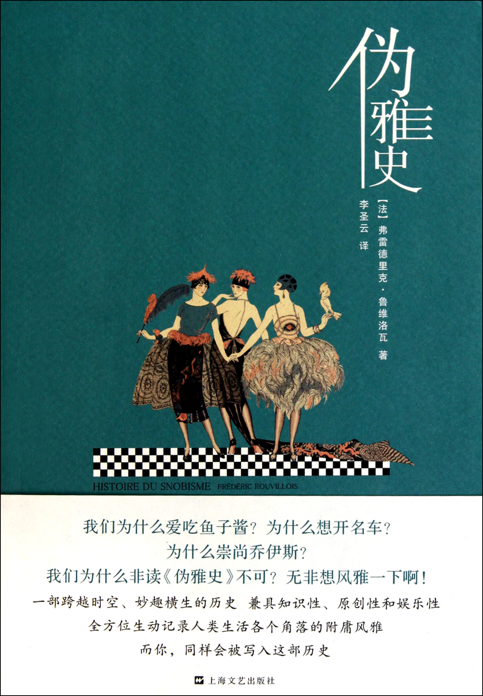
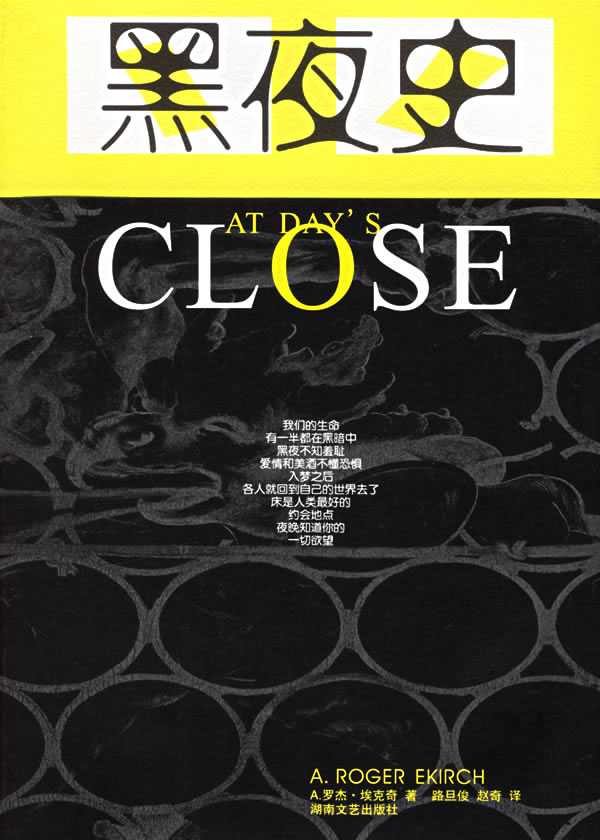

<!-- # ＜北斗荐书＞本期主题：异史杂读（二） -->

<!-- # 本期主题：异史杂读（二） -->

## 荐书人 / 谷卿（暨南大学）

### 推荐书籍（点击蓝色字体书目可下载）：

《伪雅史》

伪雅者，卖弄也、装逼也。从心理动因来看，我们所谓的“雅”，其实是一种对常规、常见的事物、习俗、观念的疏离与规避。自从人类心目中有了雅俗之辨，伪雅也随之而来。19世纪中期，英国小说家萨克雷就发明了“伪雅”和“伪雅士”一词，在伪雅横行的时代，“雅”本身也受其牵连，堕入“俗”境，故有大俗即大雅之谓，在某些特定时期，以一种极端的俗来对抗泛滥的雅，或许更显其雅。《伪雅史》叙述了各个社会阶层、各个领域、各色人等的伪雅行为，并细致地分析了伪雅士们的心理和必然的遭遇，更说明伪雅其实是一种“令人惬意的缺点”，正如孟德斯鸠所言：“只有没有思想的人才不会成为伪雅士。”

[《害羞的屁股：有关臀部的历史》](http://ishare.iask.sina.com.cn/f/19423157.html\)

儿时常听长辈言：“热不死的屁股、冻不死的脸。”意谓气温再高屁股也不能“露面”，而脸再冷也得露在外边儿。人们总是喜欢话分两头，或曰说一事物必要找其对立者共论，屁股往往被拿来和头脸比对着说。据研究者称，“人类智力的发展，可能起源于人类的臀部。”他们认为，从吉布提到马拉维湖的一道由火山标出的裂谷，是由非洲东部地区隆起而造成的撕裂，裂谷西边，处在热带内的非洲保持了湿润的气候，因此它的森林和树上的猿猴得以保留下来；而在裂谷东部，气候变得干燥，稀树、草原取代了森林，人类便只能下到地上行走。这样一来，他们的手得到了解放，配接在脊柱上的头颅也发生了变化，这就使大脑的发展成为可能。《害羞的屁股》不仅把屁股放置于整个人体的大系统中进行讨论，且叙述了与之相关的文化史和社会生活史，而封面图片更在暗示读者，“性”的话题也是此书的重要内容之一。

[《黑夜史》](http://ishare.iask.sina.com.cn/f/9837232.html\)

“历史一如漫无际域的黑夜，而人类只有通过不断的深思和行动，才可能摆脱长眠不醒或者醒来一无所知的可怕遭遇。”我一直在想，大约只有几乎半年时间都处在黑夜的北欧，才会诞生安徒生童话，才会有着那么多关于光明和希望的美好想象。此书虽然名为“黑夜史”，但千古以来，黑夜本身并没有发生什么变化，只是人们对黑夜的感受与想象随时代的发展而不同。在电灯发明之前，黑夜似乎极其漫长，而当技术直接带来城市的“不夜”之后，我们的文化生活、自然观念、工作节奏、饮食习惯、身体健康等方面都发生了巨大的改变。阅读《黑夜史》，能让我们对看似早已无比熟悉的环境进行一番重新的审视，正如作者在开头写到的：“对于善于观察的人而言，夜幕不是降临，而是渐渐升起。黑影首先从山谷出现，慢慢爬上山坡。”

[异史杂读系列（一）](/?p=16223)

（采稿：徐毅磊；责编：徐毅磊)
