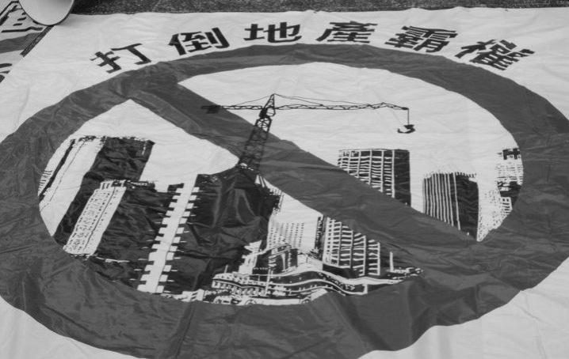

<!-- # ＜摇光＞是谁在批判小资？——兼谈中国人为什么仇富 -->

**中产阶级的生活方式不等同于矫揉造作，而是在物质条件许可的情况下，尽量给下一代创造机会让他们能够更便利地追求知识，追求理想，追求真善美。天天喝星巴克的人绝对不会靠“今天吃了哈根达斯”来装逼。一个精神上富足的人需要靠星巴克来装逼？安妮宝贝吃着哈根达斯流泪那不是真小资，她只是小时候见得世面不多。**

# 是谁在批判小资？

# ——兼谈中国人为什么仇富

## 文/ 片山（Newcastle university）

说实话，我一直不觉得中产阶级的生活方式有什么好批判的。今天读了篇批判资产阶级慈善家都是伪善的文章，更觉得悲观和绝对了些。与其说资助贫困失学儿童的中产阶级或者大资产阶级是伪善，倒不如说作者把阶级矛盾夸大了。也正是这种夸大，让许多中国人盲目仇富。难道资本家的慈善就是虚伪，只有无产阶级的慈善才能算真诚么？作者说资本家做慈善虚伪，因为他们只资助看起来弱小的儿童和妇女之类以满足自己的虚荣心，而本能地讨厌”不友好“的，有”革命力量“的广大底层劳动人民。那么我也要指出这个逻辑的荒谬之处：你不相信慈善的精神，而是反感富人拥有财富。也许我们不能排除有些人做慈善是沽名钓誉，但资助弱小的根本目的是给没有能力改变命运的人以选择的机会，而广大有”革命力量“的底层劳动人民需要的是改变命运的动力和渠道。一个高度文明的社会应该拥有更多的中产阶级，做好城市规划，完善乡村的基础设施建设，让公民有更多的自由选择他们生存的土壤和生活的方式，而不是鼓励仇富情绪、宣扬阶级斗争。或许作者认为是资本主义剥削了无产阶级然后又用慈善的方式假惺惺地施舍。但我不认为回归毛时代就能得到他所向往的公平。资本主义是工业化的必然，而工人群众的无产阶级政权早已面目全非。官本位思想都没褪尽的无产阶级一旦掌权，便不可能是纯粹的无产阶级。他们只是利用了无产阶级，然后又把矛头指向资本主义。

或许仇视资本主义的根源在于中国大把的资源掌握在少数人手中，但这也是资本积累初级阶段的必经之路。人类历史已经无数次证明，资本主义尚未发展成熟就要跑步进入共产主义的国度没有一个不是畸形发展的。而过去经常被我们妖魔化的西方资本主义国家早已出现了许多社会主义的特征（例如较为完善的医疗和社会保障制度）。

革命情怀有时候是个危险的东西，因为空有情怀而缺乏理性的群众最容易被煽动。这种情怀发展到极端就是反智。新一轮的”读书无用论“正在社会上流行，这其实是”万般皆下品，惟有读书高“的畸形演变。或许其根源在于有太多的同胞把”知识改变命运“对等于"学历改变命运"了。单靠文凭自然是无法从根本上改变命运的，所以很多没有真才实学的人才会怀念计划经济时代。

尽管计划经济的时代已经过去很多年，但许多人的思想意识根本就没有扭转，而是把一切归根于资本主义的罪恶，把自身对现状的不满发泄到拥有财富的人身上（而且往往只看到他们暴富，看不到他们为拥有财富而做出的牺牲和承担的社会责任），并且这种仇恨已经由对资本家的敌视扩散到对中产阶级的反感了。其实对海归的仇视也是一种变相的仇富，这种犬儒的心态着实不好。我国现阶段民主和法制不健全是不争的事实，可是如果广大人民群众还是用封建社会的心态来看待既得利益阶层，妄图用暴力革命解决所有问题，那也只能重蹈农民起义的覆辙。我们需要的不是用新的暴力推翻旧的暴力，而是用尽量公平理性的手段来促进社会资源的分配和流动。

因此还按照几十年前文革式的思维方式来批判小资着实是非常愚蠢的。是谁在批判资产阶级？我觉得是空有凌云之志，却在被资本瓜分殆尽的社会中找不到立足之地的人。无论在东方还是西方都是如此。他们既没有学到可以安身立命（或发家致富）的本事，缺乏智慧、知识和技能，也不愿意从事“不体面”的体力劳动，就只能通过批判资产阶级的生活方式（或者仇视外国人），摆出一副”我是流氓我怕谁“的无赖劲儿来释放对现实的不满了。我且武断地认为，攻占华尔街、占领纽卡斯尔市中心和伦敦骚乱都有点这个意思。就算真的革命起来，我也不认为这群所谓的”无产阶级“会有什么大出息。他们能做的也就是砸砸玻璃抢抢东西，谈谈屌丝和黑木耳罢了。压迫他们的，与其说是腐朽的社会制度，倒不如说是想要发家致富却不愿意付出相应艰苦努力的劣根性，或者缺乏英雄气概空有无产阶级情怀的“革命浪漫主义”。是的，你批判资本主义社会金钱至上，批判既得利益者假仁假义，但你有没有想过，退回文革时期你搞不好连学都没得上？无论哪个时代，总会有人觉得还才不遇，觉得退回到帝王将相的时代他就是个英雄。

过去我们总是批判”小资情调“，但我恰恰认为在一个足够文明的国度中，中产阶级的生活方式才是值得推广的。中产阶级是一个国家进步的中坚力量。拥有更多的中产阶级就意味着赤贫和暴富的两端越来越少。中产阶级的生活方式不等同于矫揉造作，而是在物质条件许可的情况下，尽量给下一代创造机会让他们能够更便利地追求知识，追求理想，追求真善美。天天喝星巴克的人绝对不会靠“今天吃了哈根达斯”来装逼。一个精神上富足的人需要靠星巴克来装逼？（何况星巴克的价格在国外和国内的价格没有什么区别，就是普通的咖啡厅而已）。安妮宝贝吃着哈根达斯流泪那不是真小资，她只是小时候见得世面不多。我小时候见得世面也不多，但我不觉得喝杯星巴克吃个哈根达斯就算见过世面，就要感动得痛哭流涕了。自卑的根源是见识的浅薄，仇恨的根源是眼界的狭隘。

单纯批判小资没有用，小资只是替罪羊，最需要监督的是大资本家和政府。毛时代靠煽动农民反对资本家（后来发展到极端连小资也批判）巩固了自己的政权，现在虽然很多人都认识到了是官商勾结巩固了利益集团，但还在单纯地仇恨资本主义，这明显是不理性的，是中了圈套。我们需要的是权力的制衡和监督，而不是互相仇恨。何况若真的谈阶级斗争，小资是最可能和无产阶级站在同一阵线的人，也是政府在困难时期需要拉拢，在革命时期又倒打一耙的对象。

再者，追求舒适的生活和高雅的情调又有什么不对呢？真正健康的心态是有什么条件就过什么生活，或者一步一个脚印去努力追求自己想要的生活。不切实际地追求高文凭高学历，盲目地被阶级仇恨驱动，只能选择招安或者造反（还被政府洗脑，对经商的有本能的仇恨），这才是无产阶级没有出头之日的根本原因——进入造反，招安，造反的死胡同。前日还有人作文说”小资情调就是浪漫主义的杀手“，那么我只能说你把浪漫主义等同于革命或者《水浒传》了。还有人连文化也要通过阶级来解释，认为中产阶级创造不出文化，因为劳动人民创造摇滚乐（解构上层文化），贵族创造文化，中产阶级只能模仿贵族的生活方式。这就是一种文化垄断的谬论。如果中产阶级真的毫无创造力只会模仿，那么请问广大非工人农民也非资本家的摇滚歌手、戏剧演员来自何方呢？认为贵族是文化的创造者才是荒谬，贵族在过去是文化的垄断者，现在也不是文化的主要创造者。

我理解的浪漫是一种自发的潇洒，是一种强大的生命力，一种心灵的自由，或者说是一种无拘无束的创造力，它可以雅致，也可以粗犷，但它是无关阶级的。只有这种超越了阶级局限的浪漫才能把我们引向真正的自由。

（采编：林静；责编：陈锴）
