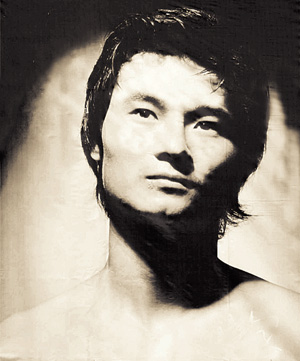

<!-- # ＜“屌丝”专题＞“屌丝文化”与“苍井空效应” -->

**无论是“屌丝文化”还是“苍井空效应”，固然可以被视作幽默的民众对正统共产观念的戏谑，但是若将此视为个人的觉醒，那就完全是政治上的幼稚，自由主义固然需要一定程度上政治的非道德化，但并不是说滥俗化、非道德就一定能成就自由主义。中国正在发生的变化是荷尔蒙推动的，而非理性审慎的——专制的敌人有那么多，但是自由主义者与老毛的不同就在于，我们认为“敌人的敌人不一定是朋友”。**

# “屌丝文化”与“苍井空效应”

## 文/徐宪（华中科技大学）

“屌丝”一词，源于百度李毅吧，现在却红火于大江南北，年轻人纷纷以此自嘲，就连笔者也不例外。在考研失利之后，映入笔者脑海的，首先是“张华考上了北京大学；李萍进了中等技术学校；我在百货公司当售货员：我们都有光明的前途。”——《新华字典》1998年修订本，其次就是“明天我就是个搬砖屌丝了”。年少轻狂的笔者，在气质上其实多少也符合一点这种文化。

戏谑归戏谑，腾讯网却祭起了“庶民文化”、“个人主义精神”的大旗，虽然指出多数“屌丝”对女性的物化和不尊重，但却更多地盛赞“屌丝文化”对古板的官方正统文化的解构，这令我有些哭笑不得。虽然自视为一个无比珍惜个人主义理念的保守自由主义者，但笔者可没有极端政治控们那样丰富的联想能力，看到鳏夫寡妇就想起“个人自由”，看到四世同堂就想到“宪政民主”。

言归正传，我不完全认同腾讯网的解读，但该文化确实有一些深层次内容。要细谈这个，我们就必须回顾一下所谓的“苍井空效应”。按维基百科（此词条现已被删除）的说法，该效应即是指“使用不易获取的泛色情信息作为驱动力，吸引大众为获取这些信息，尝试了解、使用学习成本很高的互联网技术和服务。4月11日，日本著名AV女优苍井空让整个中文推特圈（推特，即 twitter，国外的一个微型博客网站）热闹起来，不管是男推友还是女推友，纷纷讨论苍井空。苍井空注册推特的消息传开后，很多新浪微博网友纷纷“翻墙”膜拜，苍井空的关注者以每分钟大约37位的速度迅猛增长，凌晨时分从百位数突破到一万大关，以致苍井空十分不解，并开始通过和推友互动，表示谢意。有网友提议：”号召有新浪微博、腾讯微博等内地各种微博客的推友，应趁着发现苍井空这个机会，给他们普及翻墙知识。”

笔者对于苍井空小姐并无任何不敬，毕竟她所从事的职业在日本完全合法，笔者的个人气质也决定了我难以扮演一位成功的“卫道者”，只是此事确实有点嘲讽——GFW本来用途是封锁对官方不利的信息，但翻墙的最大动力却来自荷尔蒙的推动，不知是悲还是喜。

政治挂帅的年代，所有的欲望，所有的世俗都必须被压制。而这二十年以来，却世事如棋局局新。丁学良老师感慨过：“今天的中国一方面有了越来越多的自由，但也不是那么多、那么正规，这恰巧是产生优质政治幽默的黄金时代，我们真是生逢其时”，而不是“由领袖垄断幽默的权利”，所以王怡谈到周立波调侃温总理，便笑道“当伟大的统治者经过的时候，明智的农民会深深地鞠躬，并默默地放屁”，与此类似，“屌丝文化”也好，“苍井空效应”也罢，何尝不是在这夹缝中默默排出的气体之一？

问题在于，荷尔蒙推动的解构未必那么完美，当李毅撞到了枪口上，他便从此成为“大帝”，虽然今天他好像已经很开心地接收了这个名号；当李宇春撞到枪口上，她做任何解释都只会引起更大波澜，多数派暴政的年代，认真的反抗只会招来更多的侮辱；当墙外飘来苍井空的讯息，他们便如狼似虎地奔出铜墙铁壁，我很难想象这种解构最终的结果会是什么——但肯定不是自由主义。

马基雅维利将道德逐出了政治领域，才可能成就之后的自由主义现代政治，但这不意味着只要抛弃所有道德，抛弃所有传统的维系，便能塑造自由主义。贺卫方言“政治本是俗间事，庙堂难当道德师”，这固然没错，但是，尊重他人和文明言谈的基本道德，应该是每个人自身的修养——否则，不过是给了官方一个整肃的理由——我相信，此时那些荷尔蒙上头的解构者们，多半又聪明地“闷声发大财”了，因为他们爱的本来就不是什么自由宪政，而只是苍井空，以及攻击他人的快感。

但这个问题却基本无解，想想伟大的自由主义先驱密尔，《论自由》的作者，他和泰勒女士维持了20年的婚外情，最终修成正果，此经历使他们成为女权主义的先驱人物。这段感情纠葛，与密尔向社会主义的转向不无关系，他们遭受整个社会的道德谴责。哈耶克与发妻离婚，娶了自己的侄女，此时的心境与密尔也颇为类似。道德究竟重要吗？深受柏克影响的哈耶克不会否认这一点，可是，谁在道德上毫无瑕疵呢？那么，谁能理直气壮地担起卫道士的职责呢？对于作为个体的自由主义者而言，这相当苛刻（除了道德，还有个人气质的要求，决定了承担此重任的一般是保守主义者）；对于政府而言，这恐怕又成为其扩张权力的借口。柏克说道：“人是否有权不受任何道德约束而只按自己的快乐欲望随意行动？我的看法是否定的——世上不存在这样的权利。人不能生活在完全独立于他人的孤绝状态。我们不能想象任何人在确定重大的行动方针时不对他人带来某种影响，或者说，他的行为不产生某种程度的责任。人所处的这种状态产生了责任规则和原则，并且指示人们在履行责任时要谨慎行事。”但毕竟人非圣贤。

今天的中国现象，却与密尔、哈耶克面临的处境恰恰相反，此时社会中没有出现“群体的卫道士”出来实现密尔所说的“社会就是暴君”。相反，却出现了“群体的捉弄者”来担当“暴君”的职责，此时的情况便更加棘手，几乎无解。

但不论如何，我认为自由宪政的支持者不要走上安·兰德一类的乌托邦歧路。传统、宗教、道德的维系是重要的，尽管它们可能不属于政治。凑巧的是，那本著名的《新个体主义伦理观》中文版的译者，那位才子秦裕，正是电视剧《蜗居》中宋思明的原型。不要以为“右派”是指一切“自由”的支持者，各种性自由、性开放运动，道德领域的革新运动，都是在各种左翼运动氛围中兴起的，女权主义与社会主义，都用进步的车轮碾断了旧传统道德的维系——这一误解在中国相当普遍，例如那个北大未名版中国政治坐标测试——我担心这种误导会让人们更加狂热，打碎所有旧世界，妄想创造一个新世界。只怕又应了那句老话，通往地狱的道路，皆是由善意铺就。

亚里士多德说：“愉悦是理性思考的障碍，并且愉悦的东西，例如性的愉悦，越是令人愉悦，当沉浸于其中时，就越不可能思考任何东西。”亚老师这话要是在今天说出来是要犯众怒的，还是孟子说的好：“王如好色，与百姓同之，于王何有？”好色不是错，如果多为他人考虑，多将心比心，好色一样会成就美德，孟老师水平确实高。孔子说：“吾未见好德如好色者。”起码是承认了凡人皆有好色之心，要不然也不会见南子还羞答答的，只是人家知道，更要好德。

无论是“屌丝文化”还是“苍井空效应”，固然可以被视作幽默的民众对正统共产观念的戏谑，但是若将此视为个人的觉醒，那就完全是政治上的幼稚，自由主义固然需要一定程度上政治的非道德化，但并不是说滥俗化、非道德就一定能成就自由主义。中国正在发生的变化是荷尔蒙推动的，而非理性审慎的——专制的敌人有那么多，但是自由主义者与老毛的不同就在于，我们认为“敌人的敌人不一定是朋友”。

就像阿克顿勋爵说的：“自古到今，自由的真诚朋友可以说寥寥无几，而且自由所获得的成功也始终是少数者努力的结果：他们之所以胜出，其原因乃是他们一直与其他辅助者相联合，尽管这些辅助者的目标常常与自由人士本身的目标不尽相同；但是需要指出的是，这种联合始终存在危险，有时甚至是灾难性的，因为这为反对者提供了正当的反对理由。”

（采编：应宁康；责编：麦静）
