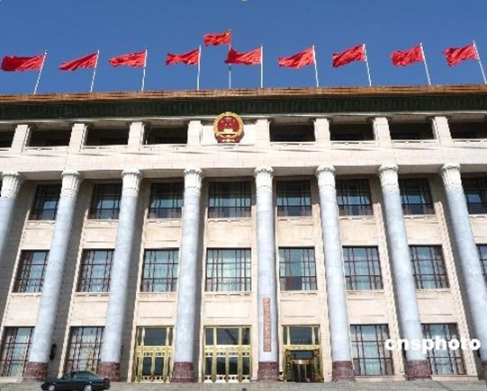
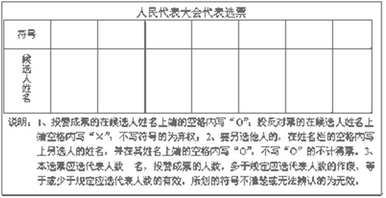

<!-- # ＜七星说法＞第十八期：你和我，都是国家的主人 -->

**本期导读：年复一年，又到阳春三月。在三月里，除了热切的期盼着春天的到来之外，我们还会同样关注一年一度的一件大事——全国两会。中华人民共和国全国人民代表大会和政治协商会议作为我国政治制度的基石，不仅昭示着每一个公民参与政治的权利，还在每年的春天决定着这个国家的未来。正是由于它的重要性，本期说法的主题，将尝试通过化繁为简的方式，从法律的层面出发，力求用最通俗的语言，为大家介绍中国的两会。**

# ＜七星说法＞第十八期：

## 你和我，都是国家的主人

每年三月，就算平时再不关注时局政治的国人也该知道，要开“两会”了。可是，每年到了这个时候，我们也不禁要问，什么是两会？会上都做什么？怎么选人大代表？有没有独立候选人？人大代表怎么换届？以上的这些问题，其实不应该单单只是纸上的文字。我们对于这些概念和法律的理解，正是我们拥有公民权利最为重要的表现形式。因此关于以上这些问题的答案，请君听我简述一二。

#### 一、什么是两会

所谓“两会”是指，“全国人民代表大会”和“中国人民政治协商会议”。

全国人民代表大会，当然就是我们耳熟能详的我国最高权力机关，其常设机关是全国人民代表大会常务委员会。

在制式上，全国人民代表大会会议每年举行一次，一般是在3月初。如果全国人大常委会认为必要，或者有五分之一以上的代表提议，可以召开临时会议。当然，临时会议这个制度就像宪法中的众多其他规定一样，从未得到过实现。全国人民代表大会作为最高权力机关，其职权都关乎民生大计，其中最重要的不外乎立法权和任免权。

就立法权而言，是指**只有全国人大才有权**：（一）修改宪法；（二）制定刑事、民事、诉讼和国家机构等基本法律。

在开会期间，首先提出法律草案，一个代表团或者30名以上的人大代表联名，全国人民代表大会主席团，人大常委会，国务院，中央军事委员会，最高人民法院，最高人民检察院，可以向全国人民代表大会提出属于全国人民代表大会立法职权范围内的议案。然后议案先后经由人大常委会和主席团的审议，再提交大会表决。表决采取无记名方式，一般立法议案应由全体人大代表或常委会委员的过半数通过，**宪法的修改应由三分之二以上的人大代表通过**。

而关于任免权，对繁多的宪法性条文进行梳理总结的话，可以概括为如下内容：

①需要全国人大选举产生的有：国家主席、副主席，军委主席，人大常委会委员长、副委员长、秘书长、委员，最高人民法院院长，最高人民检察院检察长。

②由全国人大决定产生的有：国务院总理、副总理、国务委员、各部部长、各委员会主任、审计长、秘书长，军委副主席和委员。

③全国人大可以对以上人员根据法定程序进行罢免。

说到中国人民政治协商会议，它的官方定义是这样的：是我国共产党领导的多党合作和政治协商的重要机构。

在制式上，政协会议每年举行一次，也是在3月初。政协在中央设有全国委员会和常务委员会以及9个专门委员会，在地方设有政协地方委员会。中央对地方和地方对下一级的关系是指导关系。目前有全国政协委员2237人，分别来自34个单位，我相信文化艺术界、体育界、新闻出版界会有许多大家熟悉的身影。

政协会议主要是参政议政，对国家的大政方针和群众生活的重要问题进行政治协商，并通过建议和批评发挥民主监督作用。

但是，目前我国政协委员的产生机制是邀请制，这种被动的形式成效如何，相信每个人都有自己的体会。

#### 二、人大代表如何产生？

全国人大的代表呢，由省、自治区、直辖市、特别行政区和人民解放军选出。

全国人大代表的产生与地方人大代表是息息相关的，而在地方，选举人大代表有两种方式：**直接选举**——县、自治县、不设区的市、市辖区，以及乡、民族乡、镇的人民代表大会由选民直接选出的代表组成；**间接选举**——省、自治区、直辖市、设区的市、自治州的人民代表大会由下一级人民代表大会选出的代表组成。这两种选举方式**主要区别**在，进行差额选举时候选代表人的名额比例不同，确定选举是否有效以及候选人能否当选时的票数比例也不同。

作为直接选举的人大代表，每届的任期是五年。人大代表的选区，在城市以公安部门户籍登记的人口数或单位登记的人口数为依据，一个社区居委会或几个社区居委会为一个选区。在农村则以一个村或几个村为选区。每一选区按1—3名代表划分。每一个年满18岁的中华人民共和国公民都有选举权和被选举权。

说到这里，我们应该了解了我们是否可以成为选民的基本条件，那不知道大家有没有注意过，每年在自家小区里张贴的选举通告呢？而这些选举通告又有什么意义？事实上，**在选举日前21—25天**，就应该完成选民登记。选民一般在户口所在地选区登记，机关团体企事业单位工作人员在单位所在选区登记，也可在居住地登记选举。关于选民的名单，应该在选举日20日前，在醒目的公共场所公布且保留20天。同时，在选举日5天前把选民证颁发到选民手中，或用身份证领取选民证。选举委员会应该**在选举日的15日前**公布初步代表候选人名单，并分别在各选区专用公告栏张贴。这个名单还要印发到各选民小组。

正式代表候选人的酝酿和确定，需要小组长向选民介绍本选区提名代表候选人情况并组织各选民小组进行酝酿、讨论，（建议）用票决制选举产生。并且根据本小组选民赞成的应选代表候选人票数多少顺序，按应选代表名额提出本小组赞成的候选人名单报选举委员会。对于候选人名单，可以进行反复酝酿讨论，直到按本选区多数选民意见，确定符合本选区应选代表数及差额要求的正式代表候选人。因此各位读者，以后在自家楼下看到这样的选举通告，一定记得不要视而不见哦！

接下来，就到了正式选举人民代表的时候了。**在选举日前5日**，应该公布正式代表候选人名单。一般来说，选一名代表，应有两位正式代表候选人。推荐者应向选举委员会和选民介绍初步代表候选人情况。选举委员会也应当向选民介绍代表候选人情况。

#### 三、你不知道的“独立候选人”

值得注意的是，选举法第二十九条之规定“各政党、人民团体，可以联合或单独推荐代表候选人，选民或代表，10人以上联名，也可以推荐代表候选人。”

我国选举法规定，人大代表候选人可以由各政党人民团体联合或单独提名；或者由选区选民10人以上提名。选民同时也可以自荐当候选人。但是自荐候选人必须征得10名以上选民的联名提名，才能成为初步代表候选人。再经过酝酿、协商或预选，为较多数的选民所同意，才可以成为正式代表候选人。

所以呢，所谓“独立候选人”实际上是指，在人大代表直接选举过程中，没有经政党和团体提名推荐，而是经过自身努力获得选民联名提名推荐的人大代表候选人。也就是《选举法》中规定的“选民10人以上联名推荐代表候选人”。

官方声音说：我国的县乡人大代表候选人，只有由各政党、各人民团体和选民依法按程序提名推荐的“代表候选人”，经讨论、协商或经预选确定的“正式代表候选人”，没有所谓的“独立候选人”，“独立候选人”没有法律依据。

“独立候选人”的确没有法律依据，因为这完全是个民间说法，是想表达“体制以外的由选民推举参选的候选人”这一含义。那么，我们不妨按照环球时报社评的说法，叫他们独立参选人好了，反正都是一个意思。

撇开了最近大家熟悉的李承鹏、五岳散人、夏商、许志远不说，其实，以独立身份参选人大代表早就出现过。北京、深圳等地一直都有独立参选人的案例。2003年5月15日，在深圳福田区人大代表选举中，“海归硕士”、深圳高级技工学校校长王亮以“独立参选人”的身份直接参选区人大代表，当选为福田区人大代表。这是全国首例在人大代表选举中，以“独立候选人”身份直接参选并胜出的。

#### 四、人大代表有何权利？

在人大代表的名额分配方面，全国人大代表的名额一般不超过3000人，其名额分配由全国人大常委会根据情况决定。代表的换届选举一般在本届代表期满两个月前，例如，今年的人代会是第十一届全国人民代表大会第五次会议（关于人大和政协的几届几次会议等任期问题会在第四部分说明），即今年是第十一届人大的最后一年任期，那么下一届人大代表名单将在2012年末产生。

这些人大代表的权利有，提案权、质询权、司法豁免权和言论、表决豁免权。

**提案权。**可以提的议案在广义上讲包括，宪法修改案、立法案、财政预算案、经济和社会发展案、人事任免案、重大事项决定案、质询案、罢免案、调查案等，而提出议案的主体与之前提到过的法律议案主体相同。

**质询权。**提出的主体是一个代表团或者30名以上的人大代表，质询的对象是国务院或者国务院各部委，受质询机关必须答复。

**司法豁免权。**在开会期间，人大代表非经人大主席团许可，或者在闭会期间非经全国人大常委会许可，不受逮捕或者刑事审判。对人大代表的这一特殊人身保护适用于代表资格存在的整个时期，可以说有利有弊。利在充分行使职权，防止打击报复；弊在权利滥用，这方面的例子近年来也着实不少。

**言论、表决豁免权。**人大代表在人大各种会议上的发言和表决，不受法律追究。不过以我国的实际看，还没有对人大代表的发言提出有人身攻击内容的案例出现。

人大代表的义务就很简单了，大概就是遵纪守法为人民服务一类。不过值得注意的是，人大代表受原选举单位的监督，原选单位也可对其进行罢免。

看了上面的这么多，不知道大家是不是已经对我们国家的人民代表大会制度有了了解，知道自己在国家的政治生活中享有什么样的法定权利了呢？其实，作为一个国家的公民，我们所期望的各种权利都是依靠自己一步一步的争取来的。而作为争取权利的最好方式，让自己支持的人民代表能够走进庄严地国家会场，代表我们发出自己的声音，才是最为基本，也是最为可行的办法。尽管我们可能会遇到各种各样的阻碍，可是我们要相信并坚持，你和我，我们都是这个国家的主人，我们应该，也必须，为了自己的权利做出些什么。

### 深度阅读：

http://www.people.com.cn/GB/shehui/1060/2391834.html 中华人民共和国宪法 http://www.npc.gov.cn/wxzl/wxzl/2000-12/06/content_4425.htm 中华人民共和国全国人民代表大会组织法 http://www.cppcc.gov.cn/2011/09/06/ARTI1315304517625203.shtml 中国人民政治协商会议组织法 http://baike.baidu.com/view/1113134.htm 中华人民共和国选举法 http://cnpolitics.org/2012/03/npc-cppcc/

读图识政治——两会是什么 http://lianghui.people.com.cn/

人民网两会专题 http://www.aisixiang.com/data/41073.html王占阳：独立候选人参选促进程序民主 http://www.caing.com/2011-06-09/100267547.html 法辩"独立候选人"与"独立参选人" http://baike.baidu.com/view/5883613.htm百度百科：独立候选人 http://baike.baidu.com/view/43201.htm百度百科：人民代表大会 http://baike.baidu.com/view/757113.htm百度百科：两会 http://www.npc.gov.cn/

全国人民代表大会官网 http://www.gov.cn/test/2008-02/29/content_905394.htm中国人民政治协商会议第十一届全国委员会委员名单

（编辑：石味诗，纳兰辰瀚）
