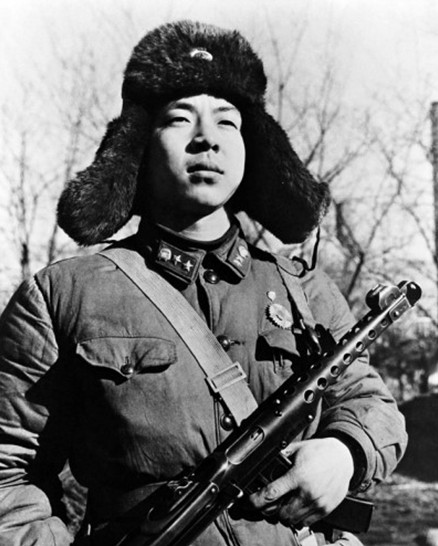
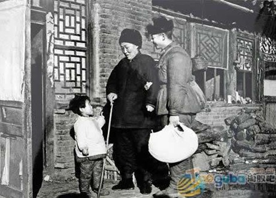
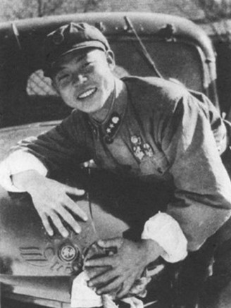
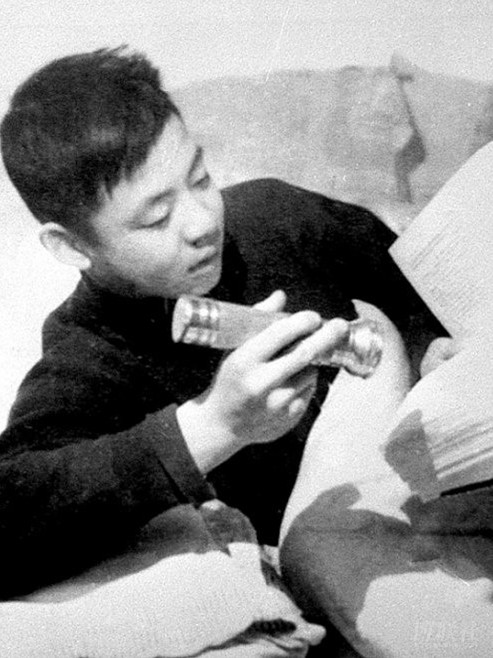

<!-- # ＜开阳＞论雷锋他的倒掉：人造雷锋50年(三) -->

**1963年，当《雷锋日记》准备出版的时候，编辑们发现日记里没有这段话。考虑再三，决定把这段话插入在1960年10月21日的日记之后。为了不显突兀，编辑们还添加了一句承上启下的话：“我要牢牢记住这段名言”

（具体过程见《鲜为人知的出版过程》）。但很快，这句话就变成雷锋的原创了。如果你到中西部的中小学去看，走廊的墙上会挂着各式各样的名人名言，通常就会有这一段，署名“雷锋”。真是做好事不留名啊。我是说那些编辑。**

# 论雷锋他的倒掉：人造雷锋50年(三)

## 文/吴恒(复旦大学)

三、雷锋是怎样变“精神”的？

之前我对雷锋一直有个误会，我一直认为，雷锋生前默默无闻，有一天因为出了事故死了，连队里整理雷锋遗物时看到了他的日记，发现他是个好人，于是开始宣传，最后直达天听，然后毛大笔一挥，于是全民开始学习。但这两天读过一些材料，再思考，就发现完全不是那么一回事。

目前我能查到的最早的关于雷锋的报道是在1959年11月26日，《共青团员》报，是在雷锋死前3年。当时报道的是他在11月14日雨夜发动工人抢救工地水泥的事迹，这事，当然他也记在日记里了。大概就是从这个时候开始，雷锋一步一步走入公众视野，慢慢成为典型，走上神坛。

张峻，雷锋诸多标准照的拍摄者，在2009年接受《中国新闻周刊》的采访时回忆了雷锋是怎样从一名“普通”战士成为媒体红人继而成为一个国家的榜样的。可以并不夸张地说，他正是雷锋的星探。【见《揭秘雷锋照背后:为树高大全形象

照片屡被修改》,http://news.sina.com.cn/c/sd/2009-04-16/102017621960.shtml】

张峻第一次见到雷锋是在1960年8月下旬，他当时的职位是沈阳军区工程兵宣传处报道干事。当时地方连队将两封感谢信发给了宣传处，宣传处便派张峻过去采访。这两封感谢信都是关于雷锋捐款的，一个来自抚顺和平人民公社，一个来自辽阳市委。当然，这两笔捐款也都记在了雷锋的日记中（不过现在也有质疑的声音，比如说人民公社并没有收到捐款；又比如雷锋一共捐了200元，但当时他每月的津贴是6元（一说8元），捐款时他入伍还没有1年）。

张峻采访了雷锋，为雷锋拍了照（见下图），这张照片后来成为雷锋的标准照之一。他还写了一篇报道《节约标兵雷锋》交给了沈阳军区《前进报》总编辑嵇炳。据张峻回忆，总编辑看到文章后大喜，说“还有这么个典型啊，沈阳军区正要找这么个忆苦思甜的典型。太好了！但是你写得不行。”于是总编辑另外安排了2位记者，并又邀请了新华社驻沈阳军区的2位记者，再次到部队深入采访。

【有可能不是这张。@高海强 2012-03-06 00-42回复吴焕良：

发现一个小bug：雷锋的御用摄影师说那年八月第一次见到雷锋，然后还给他照了标准照，可是八月份照相为毛要穿冬装呢？要知道，辽宁不是黑龙江，八月份的天气不管是辽阳、抚顺还是营口都不需要穿冬装的，更不用戴冬帽。】

为什么雷锋能成为忆苦思甜的典型呢？这和他的身世有关。据雷锋之前在忆苦思甜会上的讲述，是这样的：他爸爸被日军虐待，因病而死；他哥哥被资本家虐待，因病而死；他妈妈被地主虐待，上吊自杀。这些悲剧都是发生在雷锋7岁之前。如果雷锋记忆无误的话（确实曾有在忆苦思甜会上回忆家世时往惨了说的事例），这样的家世正是旧时代受苦受难的象征，因为雷锋家人的死，正好分别对应了毛所认为的压在中国人民头上的三座大山，即帝国主义、封建主义、官僚资本主义。

不知从何种渠道，总编辑还知道雷锋在写日记，于是让雷锋把日记本交给他，准备摘录发表。而具体摘录哪部分，则让编辑董祖修负责，最后发表了15篇（具体过程见《鲜为人知的出版过程》）。这是一个非常重要的史料，然而之前都没被人重视。这说明，雷锋在还没死的时候曾把自己的日记本交给宣传人员。也就是说，最迟在1960年10月，雷锋知道，他的日记是会被记者看到的，还会被发表在报纸上的。这是很诡异，让人很难理解的事情，但在那样的年代，估计大家也见怪不怪了。

日记本来应该是极私密的，但如果当书写者已经知道自己的日记会时常被记者看到，还会发表的话，那日记其实已经失去其最本质的意义了。就算是胡适先生的日记，或者是蒋公日记，他们也许知道这将是要公开的，但那终究是在他们逝世之后。哪能像雷锋这样，人还没有死，日记就发表了，还发表了不少。基于此，我严重的怀疑《雷锋日记》的真实性，所谓真实性，并不是说我不相信是他写的，而是我怀疑日记内容也许不能代表他的真实想法。当你知道有人会在你还没死的时候随时翻你日记时，你的写法肯定会大不一样。那些当时相信《雷锋日记》就是反映了雷锋日常生活的全部心理活动的人，醒醒吧，天亮了。

张峻等人的采访报道在1960年11月26日以《毛主席的好战士》为名发表在《前进报》上。随后各大报社纷纷转载，包括新华社、《解放军报》、《辽宁日报》、《共青团员》、《辽宁工人报》、《沈阳日报》等。1961年2月，《解放军画报》让张峻专门为雷锋拍一组专题，按张峻的说法，“入伍1年零1个月，就上了《解放军画报》的专题，这个到现在都还没再出现过。”这个专题的影响巨大，《中国青年报》对其进行了转载，雷锋的名气开始走出军队，走出东北。4月，张峻又一次接到任务，沈阳军区发给他两卷从德国进口的彩色胶片，再次为雷锋拍摄专题，刊登在6月的《解放军画报》上。可以说，雷锋死前，哦，应该是生前，就已在解放军内部的媒体上出过几版照片专辑，而且，还出现在了具有重大影响力的国家级媒体《中国青年报》上，可以说是一个有相当大名气的战士了。

而雷锋当然是知道这一点的，我找到了一篇相关日记：

“一九六一年四月二十四日:我到了××部队，好几个战友的眼睛出神地看着我。其中一个同志说：“是雷锋！”另一个上士同志说：“不是，雷锋一定是下士了，哪能还是一个上等兵呢？他可能是雷锋班里的战士吧！”他们都不敢肯定我是不是。和我一同去的季增同志对他们说：“你们不认识他吗？他就是雷锋。”我笑着和他们握了手，并问好。其中有个战友可有意思，他伸出大拇指对我说：“你是这个，呱呱叫的，起先我们都不敢认你，想必你一定是个下士了。”我笑着回答说：“当兵很好嘛，都是为着一个目标——实现共产主义。”

我仔细分析一下，他们想我一定是下士了，也许是有点根据。因报纸上都宣传过。同时党和首长都很信任，一定要提升得快一些。可是，他们没考虑到工作需不需要的问题。为了党和人民的事业，我总想多贡献一点力量，那些个人的军衔级别我真没时间考虑。”

这篇日记的最后一段当然说的很好啊，不追求名利什么的。但前文已分析过，雷锋的部分日记已在1960年刊登在《前进报》上过，这篇写于1961的，雷锋自然知道肯定会有记者读到的。当然，也不能排除雷锋当时内心真的就是这么想的，我不能以小人之心推测雷锋之腹。

雷锋形象的又一次升华是在1962年春节，当时解放军总政治部下达指令，“要为雷锋举办一个个个人学习毛主席著作标兵展览。沈阳军区接到命令后，决定同时在军区内进行一次首展。”自然，张峻也参与到了这次展览的筹备工作中。

只要你在中国读过小学、初中或高中，你就应该记得这种标兵展览主要是一块块大展板，上面有照片和说明文字。说明文字好说，御用文人排队候着；但照片比较难办，筹办小组想到的办法是补拍。他们根据雷锋的日记的记载（注意：这个时候《雷锋日记》还没有出版，他们是直接从雷锋手中要来的）先构思了20多个题材，然后摆拍。这些题材包括“雷锋送大娘回家；深夜打手电学‘毛著’；给人民公社捐款；努力练习投弹”等。

青山刚昌有句名言：“真相只有一个”，也就是说，不管你构思多么巧妙，只要你造假，总会露出马脚，或早或晚。而一旦露出了马脚，整个严肃的事情就会弄得很滑稽。比如那张“雷锋送大娘回家”的照片，雷锋还是那个雷锋，但大娘却不是那个大娘。这个似乎可以理解，萍水相逢的大娘哪里再去找得到。但我的疑惑是，既然是送大娘回“家”，那雷锋应该记得大娘的家在哪里吧。为什么不直接找那个原装大娘呢？而且，送大娘回家整件事情只是记在雷锋的日记中，这事似乎不好再多想。

说来也巧，照片中的这个奶奶有个孙子，叫王盛波，后来担任过《新商报》的副总编辑，他回忆了他奶奶讲的这张照片拍摄的细节：

“到了1960年、1961年前后，雷锋就已经很出名了。“雷锋出差一千里，好事做了一火车”，他的助人为乐的精神深深感染了千千万万的国人。沈阳军区决定在全军推出雷锋这个先进典型。为此，搞宣传的同志为整理雷锋同志的事迹，四处寻找、采访当年雷锋同志帮助过的人。

有一天，我爷爷、奶奶上街回来在抚顺“七百”车站下车。这时，迎面走来两个穿军装的人。后来知道，他们中的一个是雷锋，另一个是军区搞宣传的干事。原来，雷锋发现我奶奶与他曾从沈阳护送到抚顺看望儿子的老大娘很像，就主动与我奶奶攀谈起来。他问起我奶奶家里的情况，叫什么名字，家住哪里等等。

事隔不久，雷锋和那位新闻干事一路打听找到了奶奶住的小院。那新闻干事围着我奶奶问这问那，不时地往本上记着什么。雷锋也没闲着，帮着我奶奶家挑水、扫院子。临走时，那位新闻干事拿出相机问我奶奶：“老人家，你跟雷锋照张相好吗？”奶奶高兴地答应了。这时，那位新闻干事看到邻居苏姓家中的小姑娘正在院子里玩耍，就忙喊：“小妹妹，过来，一块儿照个相。”摆好姿式正要按快门，那位新闻干事好像又想起了什么，跟我奶奶说：“老人家，你家里有没有包袱，拿来用一下。””【见《一张老照片牵动三代人的雷锋情结——雷锋和我奶奶的故事》，《记者摇篮》，2009年第11期】

而下面这张擦车照摆拍的就比较明显了，他胸前挂着闪闪发光的勋章，并不像是平日劳动时的情形。

还有雷锋刻苦训练，投掷手榴弹的照片，据专家解读，这个姿势虽然造型英武，但并不标准。我不是军迷，纯外行的看法，这个姿势倒是和董存瑞有点像。

而这张补拍雷锋捐款时的照片也违背常识。根据这张照片的说明，这是雷锋在8月的时候给人民公社捐款时。请注意他的帽子，和他的棉袄。

当然，上面这些违背常识的照片和下面这张比起来，那简直是弱爆了有木有！！！！下面，请欣赏，著名的摄影作品《雷锋深夜在寝室打手电学》。毫无疑问，这是一张侮辱观众智商的照片。

当然，也可以解释为一张穿越的照片，因为雷锋手中拿着的，分明是1994年上映的《国产凌凌漆》中，达闻西发明的太阳能手电筒。

“闻西：我发明了一样东西对你一定很有用

零零漆：手电筒！？

闻西: 错！这是不需要电池的太阳能手电筒！在有光的时候它就会亮。

零零漆：那在没有光的时候呢？

闻西：绝对不亮！

零零漆：那有没有可能在没有光的时候会亮呢？

闻西：问得好！

关灯！

闻西：用另一只手电筒照着它……它就会亮啦……你看……是不是……

零零漆：这个发明还真是有创意。”

当时那些军区领导也发现了这些照片的bug，打算对这些补拍的照片进行再补拍。但，1962年8月15日，雷锋一不小心被战友倒车时撞倒的一根晾衣杆砸死了，原本打算的第二次补拍也无从拍起了。而这些本来是用于“学毛著标兵”的漏洞百出的摆拍照片，也顺理成章的出现在了对雷锋的追忆仪式上。

为何死了的雷锋还能继续被宣传呢，要知道，雷锋的死并不壮烈，纯属意外。要回答这个问题，那就必须对当时的时代背景有所了解，因为这是一盘好大好大的棋。当时是1962年，中国近代史上较有分量的一年：那是1959-1961三年惨绝人寰的大饥荒后的第一年。当时“以刘少奇和邓小平为首的党内务实派着手整顿经济”，把政策的重点放在发展农业和工业上，而降低了政治斗争的地位；而且也有人开始对大跃进、彭德怀的撤职、毛的执政能力和个性进行反思。此前1959年，庐山会议后，彭德怀被撤职，按照毛的提议，接替他担任国防部长的，是林彪。林彪接管后，开始在军队实行全面政治化，发起了“学习毛主席著作”的运动。毛则对此大力支持，以此反击刘少奇等人的“右倾”。正是在这样的背景下，死了的雷锋被再一次推上了前台。

1963年2月7日，《人民日报》登载了几篇雷锋日记；3月2日，《中国青年》发表了毛的题词和罗瑞卿的文章；3月5日，《人民日报》将其转载。而之后的故事，借用的一句台词，“就变成众所周知的历史了”。统计雷锋出现在媒体上的时间线可得下表。

回顾雷锋的成名史，会发现里面充满着偶然，也充满着必然。雷锋最早出名是在一个雨夜号召同事去抢救水泥。而他正式引起地方军区宣传处的注意是他捐了200元巨款，并留下了自己部队的地址，因此对方发来了感谢信。军区宣传部在采访他时，发现他的身世正是一个忆苦思甜的典型，而当时正好在全民开展忆苦思甜运动，加上他平时习惯写日记，还习惯把自己给记者看，日记的内容非常符合宣传的需要，因此被树为典型。而这个典型后来在朝廷的高层斗争又一次被树立，开始进入公众视野，成为了你我熟知却并未真正认识的雷锋。

另，一点小感受，读完1963年版的《雷锋日记》，不得不感叹雷锋的政治敏感度。但在整个120篇日记中，几乎没有一处提到过林彪的名字，也没有刘少奇，连周恩来都没有。这是非常了不得的事。当然，或者是编辑了不得。

还有一件轶事，在1963年版的《雷锋日记》中，有这么一篇：

“一九六〇年十月二十一日:……劳动到十二点，大家拿着自己从连里带来的一盒饭，到达了集合地点，去吃中午饭。当时，我发现王延堂同志坐在一旁看着大家吃，我走到他面前一看，他没有带饭来，于是我拿了自己的饭给他吃，我虽然饿点，让他吃饱，这是我最大的快乐。我要牢牢记住这段名言：“对待同志要像春大般的温暖，对待工作要像夏天一样的火热，对待个人主义要像秋风扫落叶一样，对待敌人要像严冬一样残酷无情。””

最后这一段话的知名度几乎不逊于“雷锋”，甚至可以说一定程度上等同于“雷锋精神”。但你知道吗，这一段在雷锋的日记中并未出现，是编辑“代写”的。

上文说道，1960年10月，《前进报》编辑董祖修到雷锋的连队采访，他阅读了雷锋的日记，当时在雷锋的日记本中，夹着一张纸条，纸条里，写的就是上面这段话。1960年11月，《前进报》在讨论刊登雷锋日记节选时，董祖修强调，这段话并非出自雷锋日记，只是出自雷锋的日记本。但编辑们觉得，这段话太经典了，同时“并没有违背雷锋的生活实际”，于是当成雷锋日记的内容发表了。

1963年，当《雷锋日记》准备出版的时候，编辑们发现日记里没有这段话。考虑再三，决定把这段话插入在1960年10月21日的日记之后。为了不显突兀，编辑们还添加了一句承上启下的话：“我要牢牢记住这段名言”

（具体过程见《鲜为人知的出版过程》）。但很快，这句话就变成雷锋的原创了。如果你到中西部的中小学去看，走廊的墙上会挂着各式各样的名人名言，通常就会有这一段，署名“雷锋”。真是做好事不留名啊。我是说那些编辑。

（未完待续）

（采编：楼杭丹；责编：应鹏华）
