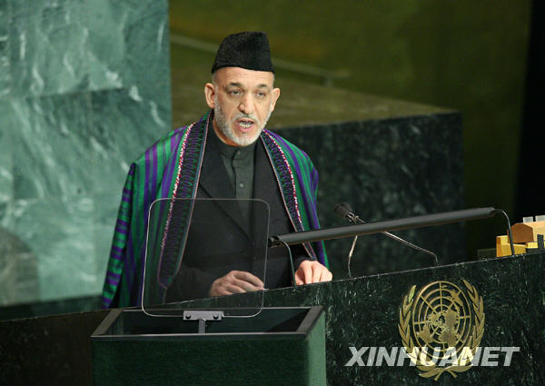

<!-- # ＜开阳＞也谈政党“制度”的问题 -->

**从这一点看，官方意识形态中对民主宪政的态度是相当令人费解的。一方面诬蔑道，西方民主不过是资产阶级骗人的把戏；可是另一方面又说，民主国家政客短视、迎合选民，如果是这样的话，那就意味着现在的民主国家太过于民主了（某种程度上确实如此），要专制一些才好——最好是皇帝来统治，皇帝是没有理由会对自己的万年江山采取短视的态度的。**

# 也谈政党“制度”的问题

## 文/黄陀（Yale University）

国人对于两党或多党制的理解，往往被官方话语所禁锢。即便是在自由派的知识分子当中，不少人对于多党制的讨论也仅仅是局限于多个政党轮流执政（即所谓的“政党轮替”）来推动廉能政治、彰显人民主权。这种思路并未能真正回答官方意识形态把多党轮流执政简化为“资产阶级分赃不均故需轮流坐庄”所进行的诬蔑。要从根本上讨论多党制，必须从它的核心内涵讲起，而不是拘泥于所谓“普世价值”的文字游戏。

**一、“多党制”的产生**

“政党制度”这个词，应当是由Party System(parteiensystem)翻译而来。但把System（系统）这个词翻译成“制度”，则起了相当不好的思维导向作用。因为中文的“制度”这个词，有至少两个意思，一个是“体系”的意思，这个意思对应的是英文的System所含有的描述性作用（即描述客观存在）；另一个则是“规定”的意思（如“考勤制度”、“人事制度”），而这个意思是Party System中的System所没有的。

于是谈起“政党制度”、“两党制”、“多党制”，使用中文的人潜移默化地会认为是有一个更高的政治权力（即所谓的“主权者”或“统治者”）对政党的兴亡存废作出规定。一旦承认了这个更高的政治权力决定政党系统，官方意识形态中“多党制不过是统治阶级决定利益分赃系统”的论述便是很容易接受的一个论点。

然而这种理解是错的。西方国家政党“制度”，本质上并非一个主权决断。事实上，西方共和国家没有我们所说的“政党制度”，只有“选举制度”。虽然各国有时会有法案规范政党的行为、政党对政治献金的筹集以及何种资格的政党可以受到公款补助等，但这些并不涉及到政党体系之根本构成。也就是说，并没有宪法或法规规定要有几个执政党、几个参政党、执政党和参政党是什么关系；所谓的两党制、多党制，皆为选举制度之产物。

民意代表机关的选举制度有很多种，但最基本的形式只有两种，单一选区相对多数制（Single-Member-District Plurality, Mehrheitswahlrecht）和比例代表（Proportional Representation, Verhältniswahlrecht），其他的往往由这两种衍生而来。简单说来，单一选区相对多数制更容易产生以两党为主体的两党制系统；比例代表制更容易产生三个政党以上的多党系统。以下作详细解释。

单一选区相对多数制一般是指把领土划分为若干人数大致相等的选区，各党分别在该选区推出一个特定的候选人，每个选区内得票最多的候选人获得代表该区的议席。假定其中某两个选区的各党得票率如下：

选区A: 民主党候选人45%

共和党候选人35%

某小党候选人20%

－结果：民主党候选人得到该议席

选区B: 民主党候选人 25%

共和党候选人65%

某小党候选人10%

－结果：共和党候选人得到该议席

可见，小党虽然成绩不错，但一个议席也得不到。推而广之，在极端的情况下，就算小党在所有的选区的候选人都分别拿到了10％－20％的选票，在全国范围内拿到15％左右的选票，却仍然有可能一个议席也拿不到，因为大党“赢者通吃”的缘故。

可见，小党在这个制度下很难生存。要知道，现实生活中能拿到10％－20％的选票已经不太可能，一个小党在单一选区相对多数制度下能拿到1％－2％的选票已经很不错了。这样，即便想要支持小党的人，也会认为投给小党等于把选票白白扔掉，那么，支持小党的选民就不得不两害相权取其轻投给一个大党（比如支持绿党的人会投给民主党，或者干脆不投票）。这样就形成了一个恶性循环：因为小党获得议席的希望不大，所以选民就算支持他们，也不会投票给他们；而这样一来小党就更没有希望了，除非遇到重大民意变革时代才有可能兴起（如美国内战前共和党的发展）、取代大党。最终的结局是造成两三个大党垄断政治舞台，如美国由民主党、共和党垄断，英国则是保守党、自由民主党和工党（其中自由民主党为历史遗留产物）。

而多党制则与比例代表的选举制度有关。这种选举制度的选区一般比较大，理论上甚至可以将全国划为一个选区；选民投票时选择政党（而非如单一选区相对多数制下选举所在选区的特定候选人），各党按得票比例分配议席，故小党也可以获得更多席位。假定各党在一个100个议席的选区得票如下：

基民盟 35％；社民党 20％；自民党10％；绿党10％；左盟5％；小党甲 4%；小党乙、丙、丁、戊、己、庚、辛、壬各2％。

那么，如果是最简单的比例代表制，议席分配很简单：基民盟得到35席，社民党得到20席⋯⋯以此类推，小党甲得到4席，其他各党各2席。但这样的话国会里政党就太多了，对于议会制的国家是致命的。议会制的政府是由议会多数派产生的。比如基民盟可以和社民党联合组成执政联盟（35％＋20％＝55％），但社民党也可以联合一干小党组阁，只要能凑出50％以上就可以了。政党数目过多使得执政联盟的可能组合大大增加，更容易造成政局不稳、内阁倒台频繁、政策没有连续性。

所以，一般的比例代表制多设有“门槛”（threshold, Hürde），即必须得到一定比例的票数才可参与议席分配。在以上的例子中，如果门槛被设为5％，那么各小党就会被拒之门外，从而将政党数目控制在合适的水平，形成较为稳定的多党制。

在这两种选举制度基础之上，可以衍生出其他选举制度。比如，德国和台湾的议会选举均采用混合制度，即一部分议席由单一选区相对多数制产生，另一部分由比例代表制产生；选民投票时投两票，一票选人（单一选区的候选人）、一票选党。（不同的是德国采用的是两票联立制，台湾采用两票并立制）混合制度如德式制度下，既有单一选区制度的特征（即有两三个大党稳定主导，在德国为基民盟和社民党），也有比例代表的特征（有小党参政）。

另外，政党的数目，与议会制还是总统制也有关系。比如，美国的两党制除了与单一选区的选举制度有关外，还与其三权分立的政治制度有关。总统选举其实是最大最终极版本的单一选区相对多数制——全国只有一个选区、选一个席位，所以能问鼎总统宝座的只能是最大的、全国性的政党。在全国共同市场、新闻媒体焦点追踪的引导下，美国人对选举千里之外的总统热情很高，对选举跟自己日常生活更有关系的镇长、镇议员则热情不大，久而久之造成了全国性政党一统江湖的局面，以至于本地的选举反而有可能受到全国性政党的支配。在德国也有类似情况，德国议会的上议院由各州委派，其结果是选民通过州的选举来左右联邦上议院的政党构成，故本地选举也受到全国性政党和全国性议题的影响。

所以，“两党制”和“多党制”的产生，只是自由民主选举的一个必然结果。

**二、为什么多党制不是资产阶级轮流坐庄**

在今天的世界，在任何一个国家，想要宣称“我们没有阶级矛盾”，都是需要一些胆量的。在有经济自由的地方，因为市场的不完善（或由于市场本身的缺陷和失灵，或由于市场发育不完全、行政过度干预造成寻租空间），造成相对稳定的社会分层；在没有经济自由的地方，固化了的权贵阶级更是肆无忌惮地掠夺利益。说这些不同的阶层之间没有利益矛盾、没有有时是你死我活的冲突，无异于掩耳盗铃。

当矛盾出现的时候，有没有可能存在一个组织，这个组织代表所有人的根本利益，因此能够妥善地化解矛盾、让所有人信服呢？先不着急下结论。在一个封闭的、小型的团体里，这么一个组织也许是可以存在的。所谓的小型团体必须非常非常小，所有人对所有人的底细都知道得一清二楚。

现代社会里，什么样的组织能真正满足这个要求？——家庭。至少对于绝大多数健康的家庭而言，当家庭成员出现矛盾时，可以通过和平的协商、家里有威望的人的调解来解决，这种解决模式确实是“代表所有成员利益”的，因为毕竟是一家人。

所以，当政治团体希望宣称自己代表所有人的利益时，总是以家长的面貌出现。也无怪乎当今谈论国事时，总有人愿以“子不嫌母丑”作掩护，披着为国“家”辩护的外衣为当权者辩护。然而家庭作为利益整体这个基本前提在现代国家并不存在。现在任何一个稍大一点的城市的人口都远远超过古代一个普通国家的人口，现代的国家（哪怕是小国）从任何意义上讲都是一个巨大无比的政治机器和利益角斗场。在如此纷繁的利益背景下，

伪称各自心怀鬼胎意图谋取私利的利益集团不存在，伪称家庭式的和谐关系存在于人与人之间、所以执政者能够以家长的身份行使权力、所以不需要其他政治势力予以制约，很明显是个谎言。即便抛弃自由主义的个人主义立场，当执政的少数人声称，这样对国家有好处时，人民有权发问，这样到底是对国家有益，还是对执政的少数人的私利有益？

退一步说，即便有这么一个理想的组织，它发源于为所有人服务的理想，它的创始人是真诚地怀着这样一个目的去领导组织走出第一步的，当这样一个组织爬到数亿人的头上的时候，怕是也已经蜕化成为一个牟取私利的利益集团。欧美工人运动中的工会领袖吃香喝辣、与权力沆瀣一气早已不是新闻——为什么？当一个组织在成长壮大的过程中，需要产生一部分的固定官僚。比如如果是三五个人的读书会，谁来主持是一个很随意的事情，没有什么固定的机构；而几十个人的类似组织，就需要有相对固定的人选去掌握一些资源，因为总是更换管理者会大幅影响组织运行的流畅性；当一个组织发展称为上万人的庞大运动时，不但需要固定的人选，而且需要常设的、专职的人选来进行日常的管理组织工作。而对于政治组织而言，这种常设的、专职的官僚组织的产生，就意味着权力集团的形成。所以，哪怕是再民主的群众运动，一旦成为一股政治势力，就必然成就一小撮自我巩固的群体成为权力的核心，这就是所谓的“寡头铁律”(the Iron Law of Oligarchy)。谁愿意相信这些人不会利用权力为自己牟利呢？

既然政党都是天下乌鸦一般黑，那么唯一的办法是让不同的政治势力互相制约——甲党为了谋求执政、为了自己的私利会虎视眈眈地看着乙党政客的任何一举一动，反之亦然。而党内派系的存在并不能达到这一功能。一党制下的执政党之所以能称为一个组织，是因为有单一最高决定权的存在，下面无论怎么争斗，管事的人最终提拔谁，还是管事的人说了算。斗得越厉害、越是需要争相取悦上级，上级得利越多。一旦这个过程被真正民主化了，那么掌握权力能谋取的利益就会减少；而党内派系斗争一旦民主化、公开化、摆到枱面上来，离全社会的民主其实也不远了——这恰恰是利益集团所不愿意看到的。

所以，多个政党的存在，对推进相对的廉能政治是很有益处的。而多个政党的长期稳定存在恰恰依赖于开放的、公平公正的民主选举制度。在普选的制度下，一人一票，一个阶级想要取得完全的统治地位，已经不大可能——即便是有巨大优势的利益团体，也必须对其他阶级作出相当的妥协让步。在美国，既有人认为草根阶级已经得到得太多、福利国家已经过度膨胀；也有人认为国家已经被华尔街所控制。双方的观点都并非捕风捉影；双方公开的激烈争斗，恰恰反映了没有一方能够完全主导话语权。而在欧洲，由于对选举费用的有效控制、对政治献金作用的削弱，有产阶级通过金钱政治所得到的话语权更进一步地被压缩，年轻的活力型政党有生存空间（甚至有还在读研究生的年轻人被选进议会），就更不存在某一个阶级完全主导话语权的现象了。

从这一点看，官方意识形态中对民主宪政的态度是相当令人费解的。一方面诬蔑道，西方民主不过是资产阶级骗人的把戏；可是另一方面又说，民主国家政客短视、迎合选民，如果是这样的话，那就意味着现在的民主国家太过于民主了（某种程度上确实如此），要专制一些才好——最好是皇帝来统治，皇帝是没有理由会对自己的万年江山采取短视的态度的。

事实上，一个共和国里面，上述两种截然对立的考虑是需要平衡的：一方面我们确实希望政客能深谋远虑，但另一方面我们又确实希望他们能迎合民众、考虑民众的切身利益、受到民众选票的制约。具体怎样平衡，解决方案不同，就造成了多样的民主现正的形态。而有志于中国宪政的人，似乎很少有人会否认中国应当走出自己的道路。美国两党制不好？那就不要搞美国的纯粹单一选区制、总统制，可以学欧洲学日本。美国的三权分立不好？那就不要搞三权分立，事实上主要发达国家当中，除了美国，没有国家搞三权分立。美国大资本家的政治献金对政治影响过多？同样可以学习其他民主宪政国家设法降低竞选费用、限制政治献金、发展小额募捐的作法。有些民主国家政策没有连续性？可以适当增加任期，适当提高门槛限制政党数目，采用受制约的议会制而非一朝一代界限明显的总统制。

归根结底，政治的最终目的，在于平衡。从自由主义的角度说，平衡不是手段，而是目的，因为自由主义者认为每个人都有权主张自己的利益——哪怕这种利益在他人看来是自私的、贪婪的（无论是右派眼中吃福利饭的人，还是左派眼中的华尔街资本家）。从这个意义上讲，在现代社会利益团体矛盾大面积存在的现实之下，民主选举制度造就以恶制恶、防止一党独大牟取私利的多党格局，也许确实是最不坏的制度。

中华民国一〇一年

一月廿五日

美国

康州

纽黑文

（采编：楼杭丹；责编：应鹏华）
