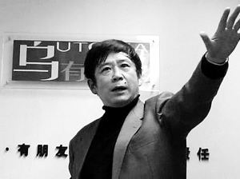
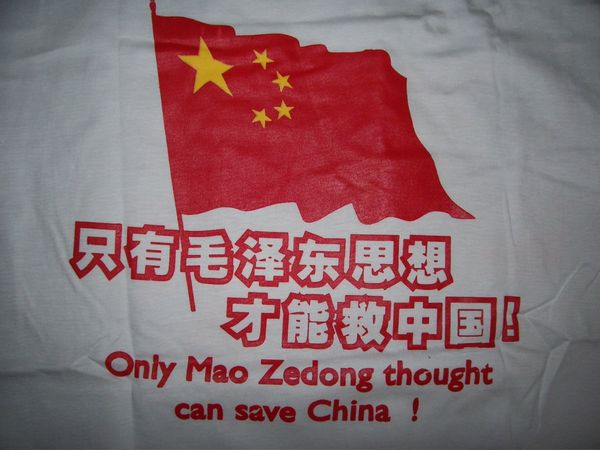
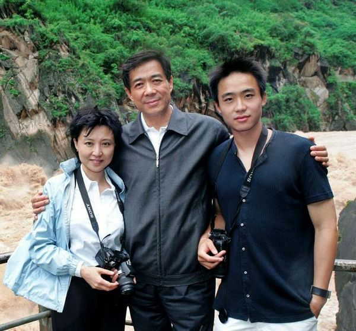

<!-- # ＜天枢＞人类思想的唯一错误是以为自己唯一正确 -->

**人不需要放弃自己的观念和坚守，事实上即使人明白了自己的表演角色很可能也仍然沉浸在角色里不可自拔。但一个国家的宪政制度必须尊重多元思想，要意识到每个人看到的这个世界都是自己的偏见，不可把某种思想当成唯一的意识形态。自由主义制度的根基不是宽容，不是试错，不是因为某种今天看起来偏激的思想将来有一天可能是被公认正确所以要允许“异端”的存在，而是每一种思想都有其局限，因此每种思想都有其存在价值。**

# 人类思想的唯一错误是以为自己唯一正确

## 文/许志永（北京市）

今天乌有之乡等一批左派网站被关闭，我虽然不同意他们的观点，但坚决反对关闭他们的网站，任何人都有说话的权利，言论自由是最基本的普世价值之一。2009年我曾经写过《为乌有之乡辩护》，今天我仍然要为他们的言论自由辩护。

有一次聚餐，右派朋友认真地问，那些毛左怎么想的难道脑子被驴踢了？北朝鲜都搞成那样了还山呼万岁这不有病吗？之前和左派朋友聊过，他们似乎更加正气十足，那些汉奸走狗卖国贼右派们无耻！资产阶级自私贪婪帝国主义亡我之心不死他们怎么可能不知道？

问题是，他们真的不知道，彼此真的没看到对方所看到的，就像两个人在同一个窗子看窗外，看到的结果不一样。2004年在美国的时候我曾努力寻找“亡我之心不死的帝国主义”，还真的发现了一个，那是一个精力充沛的政府官员，他真的把中国当成美国的敌人，认为中国未来应该分裂为很多小国，相信这样的人还有一些。但是，和中国人相比，大部分普通美国人简单和善意很多，即使很多企业家（资产阶级）也是如此，他们对外的战争很多时候不是为了石油，而是基于朴素的道义情感，比如二战对日本。

沿着各自的视角和假定条件，其实左右两种逻辑都有道理。民主和市场经济在我们这个时代成了主流，当人类普遍享有现代文明丰富的物质和精神生活时，北朝鲜金氏固守自家王朝不顾人民贫寒确实该受谴责。但是如果把视角限于纵向比较，时光倒流500年金正日可能还算一个不错的君主，乾隆即位时比金正恩更年轻也不防大有作为，而且当今民主和市场经济也不是完美的制度，比如次贷危机。人性本身有爱与分享的一面，有防范与敌意的一面，美国社会整体更友善，但也有贪婪者甚至敌意者。问题在于，你看到了什么，而人的视角天生就有差异。

对与错都是附条件的，真理都是某个时空中的真理，就连1加1等于2都是如此。思想根本上没有对错，只有不同的认知逻辑体系。这不是模糊是非，而是说，所谓是非其实是多数人的价值观，而人和人的价值观会有不同，价值观的背后有知识和经历，但更重要的是天性，绝大部分能称为“派”的人是与生俱来的，这种天性即个性、思维模式、看问题的角度等。左右辩论试图说服对方几乎是不可能的，真理越辩越固执。

比如左派看到了社会结果不公，认为如果人们的思想达到了一定境界，如果有了贤人政治，阶级斗争也是能够实现大同的，这些条件今天看来不现实，但某些时候也不是完全没有可能。比如典型的右派主张政府不要福利，认为市场最终能平衡贫富差距，这也是有可能的。问题在于，在当下，在人们认知水平和科技水平的当下，选择什么样的制度，这其实是政治家平衡各方利益之后的选择。可是，人通常不会甚至也不可能全面了解对方的假定条件和逻辑体系，常常抓住对方的某个环节或者概念就开始攻击，以至于几乎每个参与辩论的人都认为对方错误理解了自己。加上可能从未谋面，缺乏一些只有见面交流才能感知的增加信任的信息，于是把对方妖魔化，思想论战演变为人品攻击。

人为什么会认真地争论不休？这些本性从哪里来？这要从物质和生命的本源说起。世间物质看起来五光十色千差万别，其实到了原子以下粒子层级都一样，宇宙万物有统一的本源，是精神意志也可称之为物质，万物就像大海里的气泡，说不一样是不一样，但本源都是海水。人与人就像海水里的气泡，或者像大地上一棵棵小草，本质一样，都寄生于无边无际的本源，自身具有本源的特性，比如自我、永恒和无限，同时具有自身的局限，比如无知和狭隘，于是在此世表现为对生的贪恋，追求财富和权力，甚至演变为自私、贪婪、相互敌意和战争。

人是狭隘的，某种程度上每个人看到的这个世界都是自己的偏见，多数人的偏见就成了共识，少数人的偏见就成了另类。人的自我、永恒和无限的本质属性决定了人要把自己的观念推广给别人，内心渴望用自己的意志统一万物。于是就有了偏见相撞，有了争吵。

而且，人的自我中心和防范意识很容易把对方（异类）想象成魔鬼，就像查韦斯得了癌症就想象成是美国人发明了技术可以诱发癌症，中国有人把转基因大米当成种族灭绝的阴谋。人具有防范和敌意的本能，只不过有的人强些，比如党卫队成员，有的人弱些，那些相对单纯的人。好的制度张扬人性中友爱善良的一面压抑防范和敌意的一面，坏的制度则相反。人总是很自我，固守自己看到的甚至信仰自己看到的。坚信自己正确倒无可厚非，问题在于，人类的局限创造了魔鬼这个形象，以为自己唯一正确别人跟自己不一样就是错的，不一样就是无耻的、邪恶的，相互妖魔化，问题就严重了。

中国人更爱吵架，更难合作，不是人种的问题，同一个人到了美国生活多年就会变得简单，而是因为制度和文化背景充分张扬人性中防范和敌意的一面。比如中国人从小被警告提防陌生人，对方无意中的一句话让自己不舒服，立即想到对方有什么阴谋，这种关于阴谋的知识是生活中被教会的，电视里每天都在播放帝王将相们的厚黑谋略。很多人都这样看问题，彼此就开始了互相琢磨。

微博时代人们看起来更爱吵架。网络让人更以群分，聚群的成本低了，吵架的成本也降低了，而彼此了解和沟通的成本并没有降低多少，有些个人信息和感觉只能见面才能找到，网友聚会虽然也多了，但大都是臭味相投，与其他群体井水不犯河水。

当然，有些吵架是在表演，表演给自己的粉丝看，因为大量的普通人没有自己的思想体系，他们信仰偶像，而偶像需要给粉丝提供精神食粮，这些食粮就是有系统的偏见，任何极端的思想都有粉丝，越纯粹的偏见甚至越有号召力。这也无可厚非，人都在努力传播自己的思想就像生物努力传播自己的后代一样，每一个生命都在努力统一世间万物。

这不是相对主义和投降主义，不是说世界上没有“坏人”，比如屠童凶犯，比如那些违背内心价值判断卖身求荣的“五毛”，但这些人的坏根本上是狭隘和愚昧，屠童凶犯以为自己在报复社会替天行道，冲动时没有想到会给受害者家庭造成伤害，通常当他们意识到了也会后悔，卖身求荣的人，他可能认为这世界就是丛林法则，没有道义，自己为了饭碗老婆孩子只能这么做。

人不需要放弃自己的观念和坚守，事实上即使人明白了自己的表演角色很可能也仍然沉浸在角色里不可自拔。但一个国家的宪政制度必须尊重多元思想，要意识到每个人看到的这个世界都是自己的偏见，不可把某种思想当成唯一的意识形态。自由主义制度的根基不是宽容，不是试错，不是因为某种今天看起来偏激的思想将来有一天可能是被公认正确所以要允许“异端”的存在，而是每一种思想都有其局限，因此每种思想都有其存在价值。

人类文明的未来在于合一，即整合最大多数的思想偏见，尽可能在这个时空接近我们时代的真理，比如发达国家的经济制度很大程度上融合了左与右。表现在政治制度上是宪政，即自由多元基础上的民主法治秩序。当然，有人可能根本上反对宪政秩序，这不代表人类文明的主流，他们的反对只是作为对宪政制度本身的反省声音，也是一种必要的存在。

（采编：应鹏华；责编：应鹏华）
