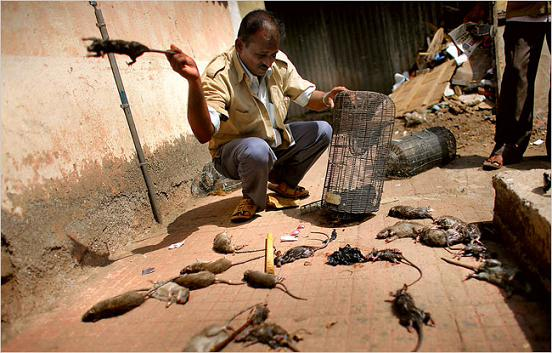

<!-- # ＜天玑＞毕业就思奔，安芯的间隔年（四）：贫民窟的9岁孤独症“绘画天才” -->

**既然认同一个价值观，那就去践行你所认同的价值观。只有当人人起而力行时，这个社会才会变得更好。因为它是由每一个独立的个体所组成。义工活动结束后需要的是持续性与连接性，而非走马观花的体验生活。今天，我发现了一个困难的人，大家都去帮助了，明天，你发现一个困难的人，大家同样伸出了援助之手，那这个社会才会更加美好。因为身舍，才会心得。**

# 贫民窟的9岁孤独症“绘画天才”

## 文/安芯（暨南大学）

你问你自己，什么是孤独症，什么是自闭症，为什么他们又被称为遥远星球的孩子，这又是怎样的一种疾病？

你问你自己，什么是贫穷，贫民窟又是什么样的，为什么这个社会上有的人家徒四壁，有的人香车宝马？

这些概念终究是二手的，直到一天，你亲眼所见所闻所感，放才真正地将一个个抽象的概念具体化到了内心深处。一如体制有问题，可是体制是什么，说到最后，它就是由一个个人所组成的，你是怎样，这个组织就是怎样，以及这个国家社会就是怎样的。

3月6日，你作为泰国雷神父基金会的老师，家访一位4岁的来自当地贫民窟的学生。却不经意发现了这样一个家庭：贫民窟一间狭小拥挤的房子里，一个49岁的父亲，39岁的母亲，三个男孩，老大老二均患有孤独症，分别是12岁和9岁，老大和奶奶居住在另一个城市，4岁的老三是个正常的孩子，和老二住在贫民窟。

贫民窟？贫民窟：

你环视了一圈家里，唯一值钱的就是一台电视机了。一张凌乱的大床常常是睡着四个人，两个小孩，两个大人。吃饭就是随便在地上铺一张塑料纸，然后摆上饭菜，但三个人也吃得其乐融融，老二因孤独症的缘故，很少会出现在“饭桌”上。门口有个简陋而原始的厨房，各种原材料堆砌在墙脚，父亲说，就是靠做这些小吃，整个家庭才得以维持下去。

贫民窟的生活？贫民窟的生活：

泰国文化里，男子很多时候都会呆在家里，单靠女子在外挣钱养家，而这个家庭有个孤独症孩子，父亲也就更加得整天呆在家里守着孩子，所以整个家庭的经济来源就只能通过母亲用双肩挑起沉重的两个担子，顶着泰国常年不变的烈日沿街叫卖自制小吃讨生活。

通常每个月这个家庭的收入为4000泰铢左右（人民币800元），扣除每月1000泰铢（人民币200元）的房租，制作材料费以及四个人的生活费。你想，恐怕是难有剩余的了罢。

孤独症？孤独症：

自闭症一词最早源自于一位德国医师布鲁勒用来说明曾为一般人士但却突然无法再与他人沟通且具有极端孤立的成人精神分裂症患者（引自百度百科）。其具体表现形式可为缺乏主动与他人分享兴趣或成就，缺乏主动进行适合年龄的信念或社会模仿游戏，偏好至少一种固定、有限的行为模式，且达到异常程度，固定且非功能的仪式化、重复的运动形式等等。

你看着眼前的老二，九岁，名叫Duidui，几乎不与外人交流沟通，见到陌生人则总是把自己包裹在被子里，或是躲在柜子里不肯出来，时而也会上蹿下跳到处奔跑。

尽管如此，你却发现，这个九岁的孤独症孩子有着异常的绘画天赋。Duidui父亲说，Duidui从两岁就开始在纸上涂抹一些线条，直到七岁去到基金会才开始接触到纸笔，开始正儿八经地在A4白纸画画。望着上百张Duidui过去两年里的画，你将它们分成了三类，并逐一拍照：一类是Duidui涂鸦的电线杆（大约120张），第二类是Duidui画的生活卡通（大约40张），第三类安是Duidui早期练习线条用的。

你无意中看到了Duidui作画时判若两人的全过程：他瞬间安静下来，在屋子里转悠着，发呆几分钟，然后搬起板凳和小桌子一声不吭在另一个安静的角落独自坐着, “啊啊啊”地自言自语，然后埋头专注地用笔在纸上画着。

Duidui画完后，你凑近一看，顿时惊呆了。他并非不说话，只是他是在用一种特殊的方式表达他自己的感受。那幅画的大意是：一天，Duidui和他的弟弟看见了一个长条形的东西，他们两都觉得很好奇，接着还有点害怕担心，后来当Duidui在家里旁边的大街上玩耍时，又看见那个长条形的东西，一溜烟就跑掉了，周围的邻居都看远远地望着他。这个长条形的东西应该是你手里的DV。

类似这样的组图故事还有很多，而描画人物的笔法已是自成风格的，尤其是人物面部表情的刻画。

然而，Duidui画得更多的还有街上的电线杆，几乎都是以俯视的角度来描画的。热心的网友看罢Duidui的电线组图后，评价说，从画中看，笔锋锐利而内勾、条理清析、网路分布具逻辑性、画风随意而纠结纷陈。笔触和构图都表现出对有规律或者机械的事物感兴趣，若果真是自闭症，应该是高功能型。

上午10点30分，Duidui母亲独自挑起两个沉重的担子，里面满载着卤鸡蛋，成包的泰国小吃，沿街叫卖。你尾随着她，此时气温36度。

接下来的7个小时里，你跟着她，走过了贫民窟，施工工地，月租低廉的泰国居民区，水果市场，菜市场，也曾和她一同坐在711便利店门口乘凉，因为只有这个地方才能免费地吹到凉风，也看着她一个鸡蛋一个鸡蛋地卖着，一个鸡蛋7泰铢（1.4元），一包小吃10泰铢（2元）。当然，整个过程中，你是未见到类似城管之类的人出现强行砸摊或者追打之类。

What a life. 你数次悄悄哽咽。

之后你问她，一个手推车多少钱，她说，2000泰铢（400元人民币）。你沉默了半晌，打量着这样的一个家庭，是难有多余的钱去添置一辆手推车的，更别说多买些颜料画笔和白纸给Duidui了。

于是你回去后便在网络上发文义卖募捐，幸而筹到了足够的钱为他们添置一辆手推车，多买几张白纸和画笔。

同在基金会的一些欧美义工感叹着，你改变了他们的生活。你摇摇头，说，改变不了，他们依旧生活在贫民窟，依旧靠着微薄的收入继续生活着，孩子仍旧是孤独症不会与父母说话。但你能够做的，只是让他们不至于如此困难地靠着一个女人用双肩挑起的担子生活。

你一直以为，爱是不分国界的。其实，任何人都是可以影响并且改变这个社会的。

一年前，你随多背一公斤组织走访四川震后的乡村小学，无意中发现了独臂男子，随后义卖明信片发起募捐活动，终筹得两万元为其装好了义肢；半年前，你去西藏神山志愿者之家做义工，了解到守山老人六年没回北京过年，于是发起募捐活动为守山老人和他收养的两个孤儿筹集路费，今年年初，老人和孩子们总算回到了北京过春节。

既然认同一个价值观，那就去践行你所认同的价值观。只有当人人起而力行时，这个社会才会变得更好。因为它是由每一个独立的个体所组成。义工活动结束后需要的是持续性与连接性，而非走马观花的体验生活。今天，我发现了一个困难的人，大家都去帮助了，明天，你发现一个困难的人，大家同样伸出了援助之手，那这个社会才会更加美好。

因为身舍，才会心得。

（采编：应鹏华；责编：应鹏华）
