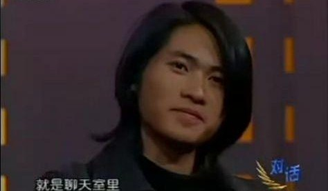
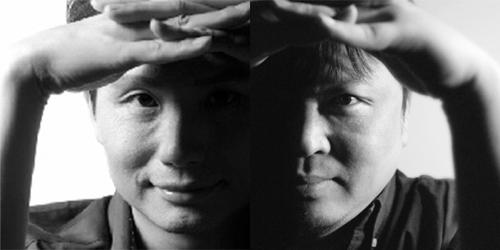
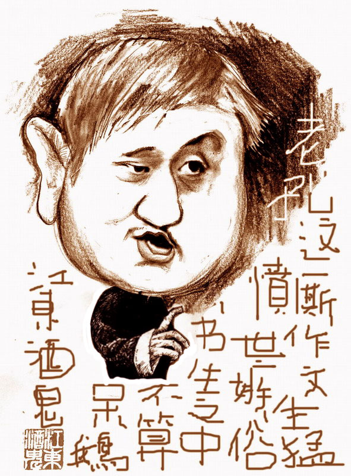

<!-- # ＜摇光＞韩寒和这个时代 -->

**有官方高压垄断，才有劣币驱逐良币，如果确实不存在代笔，那么韩寒作为个人也许真的不错，但是他这种水准成为中国公共舆论最重要的发言者之一，本身就说明了，当下我们公共讨论的质量差到了什么程度。遗憾的是，在最近关于代笔的争论中，这种质量奇差无比的讨论又再次出现，这恐怕不是真正的“自由主义者”愿意看到的。让我们少一些感情的宣泄，少一些站队扣帽子，多一些理性的质疑、讨论——这才是韩寒事件的最大意义。**

# 韩寒和这个时代

## 文/徐宪（华中科技大学）

最早知道韩寒，是在我读高中的时候，当时大家传的最多的是有一个狂傲的少年，六门功课不及格，但是获得了写作大赛一等奖，还出了几本书。当时只是把他当作一个比较特别的人，也看过他的书，感觉有点意思，但是其中引用化用都不太自然，也没有太多深刻的内容，也就没有太在意，他当时是以少年作家的名头出道的——所谓“作家”，便是指以“文学创作”闻名的，那个时候“作家”、“文学”还是很火热的。

若干年后，韩寒暴得大名，誉满江湖的时候，已经转身为一位公共知识分子了，他以幽默、犀利的时事评论著称于世，这个时候他的影响已经远远超过当年了。他是个有趣的年轻人，知道怎样的文字能得到年轻人的认可，同时，他所写的，也多数是这个时代应有的一些常识——虽然我不喜欢“普世价值”这个词语，但是在这里简单地套用过来，也不会有大错。譬如他说“真正的爱国主义就是要保护这个国家，让她不要受到政府的任何迫害”，他批评中国的审查制度，等等都很靠谱。所以我还是很欣赏他的，虽然自己更愿意看学者的文章，但是我还是认为，韩寒作为一个向更多中国人普及常识的名人，意义是十分重大的。

可是到后来我逐渐发现了有一些不对劲的地方，比如周筱赟说“韩寒是天生的自由主义者”“不读书也能明事理”，再到后来，我在网上写的文章，若是批评体制，便有人留言“这个作者看韩寒的书看多了”，或者“这个作者是韩寒一边的”；而如果写了一篇为体制辩护的文章，不少留言又会是“快去看看韩寒吧”，“这人完全比不上韩寒”，这让我摸不着头脑——“韩寒”二字在公众心中居然留下这样一个刻板印象——“反体制”，虽然这应该并非韩寒本意。

韩寒的影响力逐渐扩大，按照周筱赟的说法，资中筠、徐友渔、朱学勤、丁学良、陈丹青、张鸣、郑也夫、鄢烈山等诸位老师都十分赞赏韩寒，韩寒几乎收获了所有名誉——即使在娱乐圈，范冰冰也是韩寒的好友——也许在很多“自由主义者”看来，有这样一个年轻、迷人、有影响力的“盟友”是一件非常好的事情，普及常识的任务交给“学者”似乎比较困难，姑且交给这个年轻的“作家”吧。

今年的方舟子挑起的论争，却让事情出现了戏剧性转变。问题最关键的不在于韩寒是否有人代笔，而在于，面对诸多质疑，韩寒采用了怎样的态度对待——以及在这个过程中出现的“阵营”现象。坦率地说，在此之前，韩寒在我心里的印象要远远好过方舟子——起码韩寒是一个有趣的人，而且按照周筱赟的说法，“天生的自由主义者”。但是，在阅读了各方面材料后，特别是曹长青先生对韩寒的质疑，我却发现这些质疑并非空穴来风，很多具体的细节韩寒、李其纲确实需要解释——譬如说，“在麦田质疑《萌芽》编辑李其纲和韩父可能串通泄题之后，李其纲立刻在《对一种诽谤的严正声明》一文中反驳说：‘事实是直到最后一分钟我才知道评委们决定授权给我出题’，以此证明不存在泄题问题。但根据《萌芽》主编赵长天的回忆文章：‘提出搞新概念作文大赛的是《萌芽》的编辑李其纲。’点子是李其纲出的，由他出题也顺理成章。另外，据赵长天的文章：‘上午11点，韩寒才赶到了组委会所在的宾馆。这时，题目已经公开了……’这语气显示，在韩寒到之前，已有了题目，并不是李其纲说的“韩寒父子到达之后才临时出的题目”。曹长青先生指出了韩寒等人解释中相互矛盾的事实，但是韩寒等人却没有做出回应。

在此情况下，易中天、萧翰等老师却选择了支持韩寒，这让我十分不理解——更有甚者，“共识网”上一篇神文更加出格——“支持韩寒不需要那么多的理由，一个理由就足够，那就是韩寒追求自由，讲自由。韩寒以自己的方式争自由，就凭这一点我就支持韩寒”（共识网《我为什么支持韩寒》）。我甚至担心，很多韩寒的支持者并非基于独立思考而选择支持韩寒，而是基于施密特所说的“区分敌我”，这是十分讽刺的事情，刘小枫等人引入施密特据说是为了教“自由主义者”们“区分敌我”，却不知中国的“自由主义者”们最懂得“区分敌我”！

这个方面，赵鼎新教授的说法并不一定是危言耸听：“但是，我看信力建先生一番直率的言论大概是道出了不少公共知识分子和媒体人内心的担忧：‘如果韩寒被搞掉，中国将倒退20年；如果连挺韩寒的众多知识分子都被搞掉，中国将回到文革。’这话是过头了，但里面的意思还是很清楚的：南方报系和大量的知识分子多年追捧着韩寒，他们与韩寒的渊源较深，韩寒如果陨落的确会给他们带来很大的负面影响。”《南方周末》上的那篇《差生韩寒》和曹长青先生的质疑到底谁更客观，诸位可以见仁见智。

但这背后的东西却更值得思考，泛政治的中国，用划分敌我、道德批判等等方式来干扰公共讨论，这是客观存在的——甚至包括为中国的改革做出了不少呼吁，做出了不少贡献的人物。当年鄢烈山老师对张维迎老师的攻击有多少是扣道德帽子？虽然如今，张维迎老师也是《南方周末》的座上宾，但是，过去的种种争论有太多的“站队”成分，而且是道德标杆下的站队，完全没有真正的思考辩论。柳红老师与吴晓波老师之间的纠纷，牵涉到了吴敬琏老先生——对中国改革开放影响最大的经济学家之一，但是媒体却报道甚少，吴敬琏对中国的影响大于韩寒十倍以上，而且此事意义重大，为何媒体却不跟进？媒体们频频亮出的道德标杆靠得住吗，还是只是单纯的站队？

另一个出名的“少年作家”，余杰，他今天已经是著名的“持不同政见者”，当年秦晖老师为年轻的余杰作序，盛赞其“可贵的锋芒”，“在一个因种种原因而早已过分‘成熟’的社会里存在着余杰这样’不成熟’的声音，难道不是大幸事吗？”秦晖的本意，大概是说普通人深谙“闷声发大财”的道理，而余杰却敢于出声，这很可贵——但是，这个社会真的“成熟”么？事实上，这个社会最缺少的就是理性务实的辩论，从来不缺少一腔热血的批判，切不可混淆。余杰文章中的逻辑混乱与夸大其词数不胜数，他是一个很好的煽动者，却从来不是一个好的观察者——当年我读他写的关于李绿松被割舌的文章，也完全被震撼——可后来从鄢烈山老师那里得到真相，才发现余杰完全是添油加醋胡言乱语。余杰和邹恒甫二人对国内经济学家的批判也完全是扣帽子式的.同时，余杰对秦晖的崇拜也完全是非理性的，我怀疑余杰从未读懂过秦晖的文章，给秦晖老师盖上“当代中国最有影响力的学者、公共知识分子”这样的帽子。余杰个人的思想是前后矛盾的，在这种情况下，狂热的情感煽动家真的有利于社会的良性进步？秦晖老师是我十分尊重的老师，但是他盛赞的“可贵的锋芒”在我看来很大程度上只是一种感情的宣泄罢了。

一个道理，不论韩寒是否存在代笔，对这个问题进行理性务实的辩论，而不是站队、扣帽子式的攻击，那才是社会的进步。我认为韩寒的文章没有余杰那样的煽动性，但是所谓“韩粉”中大量出现的站队、扣帽子等反智倾向却十分严重，我不禁回头去看看韩寒写的东西，希望找到其中可能存在的问题。

《南都周刊》对韩寒的专访中，他说道：“我没有接受过文科教育，可是我写的东西是最好的，远远超过受过高等教育的人。没有念大学给我的影响是，在一个应该泡妞的时间，我没有去大学，后来我想明白了，原来不在大学里面更容易泡到妞。对我来说没上大学没有任何缺憾，我所看到的，想到的，都不会输给大学生，无论清华北大。”韩寒的支持者从这段话看出了韩寒的真诚、不做作（“不在大学里面更容易泡到妞”），但我却读出了反智情绪的味道——在韩寒看来，“没有接受过文科教育的我”写出的东西是“最好的”，就算“我”言必称“泡妞”。然而，韩寒写作是以时政评论闻名，真正有水准的政治评论到底能不能没有教育基础？在韩寒及周筱赟看来，这显然是可以的，因为按照周的说法，韩寒是一个“天生的自由主义者”。

所谓“韩三篇”中提出的问题，不同人也许有不同的解答，这并不重要，不同的答案只要自洽，有自己的道理，那都能说的过去。但是这三篇文章却“观点混乱”“逻辑不清”“表述浅薄”（赵鼎新语），譬如说“问：那难道中国就不需要民主与自由了么？答：这是一个误区，文化人普遍将民主与自由联系在一起，其实对于国人，民主带来的结果往往是不自由。因为大部分国人眼中的自由，与出版，新闻，文艺，言论，选举，政治都没有关系，而是公共道德上的自由，比如说没有什么社会关系的人，能自由的喧哗，自由的过马路，自由的吐痰，稍微有点社会关系的人，我可以自由的违章，自由的钻各种法律法规的漏洞，自由的胡作非为，所以，好的民主必然带来社会进步，更加法制，这势必让大部分并不在乎文化自由的人们觉得有些不自由，就像很多中国人去了欧美发达国家觉得浑身不自在一样。所以，民主和自由未必要联系在一起说，我认为中国人对自由有着自己独特的定义，而自由在中国最没有感染力。”这段话中的错漏之处相当多，首先，韩寒对民主与自由之间的张力一无所知——而这在“自由派”与“新左派”争论多年的中国，任何一个稍微有点政治常识的网民都说的清楚，可韩寒却说“文化人普遍将民主与自由联系在一起”，于是才可以继续自创二者的区别，将“自由”定义为“公共道德自由”，仿佛中国人就不存在私人财产权、人身自由权等等，而问题中的“自由”显然是指这些——否则怎样和上文的“革命”、“起义”扯起来？请问“起义”和“随地吐痰”还是和“私人产权”、“言论自由”、“结社自由”有关？这显然是借批评国民性来偷换概念。再次，什么叫做“更加法制”？这种低级语法错误更不必说。

在所有的“民主素质论”的低端争论中，争论者们都对现代宪政民主的常识一无所知，他们以为民主就是主权在民，因此就去讨论种种诸如国民性、民众素质之类的问题，而对分权制衡、治理结构、司法独立等等精英主义的方面一无所知，韩寒的文章其实也存在相同问题。表面上来看，韩寒否定激进民主似乎与古典自由主义推崇精英主义、改良主义的看法相似，实质上却完全不同——韩寒的出发点在于人民的素质，而古典自由主义的出发点则是对公权力的限制，甚至对政治参与本身的限制——即便人民在“公共道德”方面素质再高，难道民主选举就是最高准则么？我们知道不是的，宪法对后世的约束往往大于一时的民意，这才是宪政的精髓。更何况，韩寒提到的这些“公共道德”与政治究竟有多大关系？这种泛道德批判有多大现实意义？当然，韩寒不是没有认识到权力制衡等等问题，他也提到了“反向墙头草”等等，但是他整个论述确实太过混乱，很难让读者真正理解政治。

韩寒文章中对于革命与改良主义的论述是相对精彩一点的部分，但是李泽厚与刘再复在九十年代的《告别革命》难道不是更精彩么？更不用提杨小凯在1987年就写作的《中国政治随想录》了，杨小凯在1999年接受《华声报》采访时仅仅说了几段话，就把这个问题的正反两面阐述得十分精彩，其实无论在深度还是容易理解程度上都远远超过韩寒的论述，如果论深度，柏克的那本《法国革命论》更是传世经典，然而，所有这些人的论述，得到的关注加起来还不到韩寒一篇短文的百分之一，这是十分吊诡的事情。更吊诡的是，以上几位的论述，都是从“反革命”的角度论述专制政体存在的问题，而韩寒这篇短文给大众最多的印象却是：改良主义仿佛是五毛党？

为什么韩寒的逻辑会出现偏差？为什么大众会误读改良主义？为什么韩寒的时政评论能得到这么多关注？这些问题绝不是偶然现象。韩寒身上有浓郁的反智气息，这使得他在拥抱自由主义、精英主义和改良主义时出现了扭曲。一方面，他不相信底层民众的判断力，另一方面，他又完全不信任知识精英，这才出现了矛盾。韩寒的关注者们，多数是在近几年网络开放的情况下才逐渐了解一点政治的，在此之前，他们多数只知道所谓的“文学”所谓的“作家”，当韩寒以“少年作家”外加“评论达人”的身份出场，再加上韩寒本身“反体制”（批判教育、不及格、不上大学）的特征，韩寒粉丝中不少都带有强烈而简单的“反体制”情绪，再加上韩寒经常宣扬“不读书”，韩寒粉丝中真正肯认真思考的就更少了，他们习惯的就只是站队扣帽子了。

在“作家韩寒”的时代，由于八十年代末开始的言论控制，使得在八十年代就水平低下的公共讨论变得更加平庸，大众对于政治常识、经济常识等等人文社科常识完全一无所知，形成了“除了理工科就是文学”的刻板印象，当时，“作家”这个头衔是非常风光的，而万马齐喑的情势下，“少年作家”的出现又着实满足了人们的猎奇心理，就如“气功热”一样，红得发紫，我对文学并无偏见，但是坦率地说，那时候文学与民族主义情绪确实是公共领域的烟雾弹，其实政治与纯粹的文学有关系么？完全没有，但是在中国，这二者被死死地黏在一起，正如古时候那些吟诗作赋的文人想做官一样。

而到了二十一世纪，随着网络的兴起，公共讨论开始逐渐升温，此时韩寒很好地把握了大众对于体制的部分不满情绪，也进行了自己的一些思考，普及常识，顺利转型，顺风顺水，名利双收。在此过程中也有比较失败的转型者，例如余秋雨（虽然他在公共领域较少发声），一篇《含泪请愿灾民》完全葬送了自己的声誉。

有官方高压垄断，才有劣币驱逐良币，如果确实不存在代笔，那么韩寒作为个人也许真的不错，但是他这种水准成为中国公共舆论最重要的发言者之一，本身就说明了，当下我们公共讨论的质量差到了什么程度。遗憾的是，在最近关于代笔的争论中，这种质量奇差无比的讨论又再次出现，这恐怕不是真正的“自由主义者”愿意看到的。让我们少一些感情的宣泄，少一些站队扣帽子，多一些理性的质疑、讨论——这才是韩寒事件的最大意义。

（采编：应宁康；责编：陈锴）
