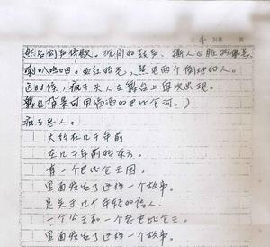

<!-- # ＜“诗心未逝，怀念海子”专题＞纯净的诗意与燃烧的翅膀 -->

**我心中有对于那种纯净诗意的向往，但是却在现实之中脱离不得，我们这个年纪，或许很多人都这样，我们往往喜欢燃烧和灿烂，喜欢“愿我从此再不提起/再不提起过去/痛苦与幸福/生不带来死不带去/唯黄昏华美而无上。”，但是正如许多如今日这般好的天气，却让我们留恋不已，所以我不由得像周作人一样，也在十字街头建一个塔楼，只是希望在冲着十字街喝些黄酒胡乱吆喝的时候能够依稀记起那些纯净的诗意和燃烧的翅膀。**

# 纯净的诗意与燃烧的翅膀

## 文/应小野（石家庄铁道大学）

doubanclaimddf7479a72bc80af

大概是一周多前的样子，M君找我，说海子的祭日快到了，想写点东西，问我是否愿意也写一些，大抵是互相慰藉的意思。我和她都很喜欢海子，从高一开始读海子的诗歌，我便每年都会在这个时候写一些字，从最初的算数学的草稿纸，到日记本里面，再到QQ空间，贴吧，人人日志，很散乱的排列，以至于大多数从前写的都找不到了，但是每年这个时候，写一些字凑成或长或短的文，对我来说成了一个习惯，今年也不例外。

前几天晚上，我去学校田径场跑步，刮着风，北方难得遇到的湿润的气息，跑了七八圈的样子，便累得不行，就人字型的舒展开来，躺在学校的足球场上。在我的印象中，已经很久没有这样做，上一次大概还是高一或者高二，暖春的时候，体育课上，大家在踢球，我便一个人这样躺着晒晒太阳。全身贴住大地上的时候，的确容易产生一些不同的念想，看着天空，会有一些眩晕，周边的声音也挤压在一起，有一些变形，变得略微的嘈杂，融化在泛着一些雾气的夜晚。学校田径场侧边便是铁轨，南北方向，我那样躺着与铁轨相隔五百米的距离，中间隔着一堵高高的墙坝。我突然想起海子来，便不急着起来，似乎在等一列火车疾行过来，心中期望的同时却愈来愈恐慌，没多久，便拍拍身上，离开了。

我知道，我实际上想的是，面对列车过来，我们倘若在冰冷的铁轨上，这是怎样一种境地？在大二的时候（也有可能是大一下，我的记忆力向来不太准确）学校便有一个女生在那条乌黑冰冷的铁轨上结束了生命，传言是因情自杀，我不大信，因为我们学校男女比例的缘故，很难想象会有这样的事情发生。海子是在89年3月26日，在山海关卧轨自杀的，留了一个便条：

我是中国政法大学哲学教研室教师，我叫查海生，我的死与任何人无关。

关于海子的死，现在也成为了诗歌研究的对象，有一种说法，说海子的死是其诗人形象的最后一块拼图，他是为诗歌而死，他的死将和他的诗歌融合在一起。我尚且年幼，近来更加觉得自己幼稚的不堪，对于死亡也是惶恐的要紧，不好多议论其为何而死，死的意义何在，某种程度上，我甚至觉得，将自己的猜想任意放在他人死亡之上，会有一些亵渎的意味。但是，我的确很怀念海子，虽然我总感觉他和我有些隔膜，如狄金森的短诗《篱笆那边》中所说的孩子一样，海子对于我来说是篱笆那边的草莓，离得不远，但是却爬不过去。

海子是安徽人，我是江西人，我家那里不怎么种小麦，海子的诗歌里面充斥着关于麦子的意象，他将麦子，草原，村庄，母亲，雨，乳房等意象堆叠到一起，构成了一个有机的的意象群，这对于现代诗歌来说是一个特别了不起的成就，他的诗歌里面充满了生命的张力，语言简短而蕴藉，往往有很强烈的冲击感，就像一只在海上翅膀燃烧着的海鸥。我有一本薄薄的《海子诗集》，大概不是很完整，第一首诗是《亚洲铜》，最后一首是《春天十个海子》，这似乎是海子一生的隐喻，海子的诗歌离不开死亡和生命，离不开乡村和麦地，离不开痛苦和歌唱。第一次读《我请求：雨》的时候，在家里，正好是下雨，我印象中的葬礼往往也在雨季，南方淅淅沥沥的雨往往是惹人哀怨的，葬礼本身的程序礼仪却复杂的要命，而在这首诗中，海子给我们演示了关于死亡他认为最美好的仪式：

岁月的尘埃无边

秋天

我请求：

一场雨

洗清我的骨头

这也暗合了他最后的归宿，了然而去，干干净净。加缪说，“哲学家的一生都在练习死亡”，这对于海子来说恰当不过了，至少在他的的诗歌中，他一直在勇敢地直面死亡，这种勇气已经超出了诗歌本身的容量。

我曾经和M君好几次谈起海子，她被海子诗歌庞大的意象所迷离了。而我喜欢海子，是因为我的童年和少时的生存体验便在乡村，海子诗歌里面蕴藉着一股乡村的精神内核。这个精神内核很难叙述清楚，如若允许我“姑且妄谈之”的话，便是“纯净”。周云蓬曾经谈起海子时说，自己已经两年不写诗了，“写不出来了，演出、唱歌，情绪都发泄到别的渠道了。一种风格结束了，但诗歌以另一种形式还存在着。那个诗歌繁荣的年代，其实并没有根基，到了上世纪90年代，有点商业了怎么就不行？诗人也不是都死了，那么多爱文学的人还活着，谁也没逼着谁不许写诗了，一切都是个人的选择。与其要以前那样一种狂热，还不如要一种真实的冷落好。”，我以前也写诗，经常自嘲自己的诗歌是三流的货色，其实大多数都是一些对于海子的模仿。我时常想，为什么我们无法写出海子那样的诗歌。我不认为诗歌是天才的创作，只能说我们都不纯净了，往往都是一些虚妄的情绪，这个时代，往往没有人能够讲出自己内心的见地，而那些勇于真实表现自我的人却推向极致，不懂得语言的克制和蕴藉，就这功底上看，这或许是天才拥有的天赋。

纵观中国的现代诗歌史，五四以来，从胡适和周作人白话诗的尝试，到冰心等文学研究会的歌颂爱与美的小诗，新月社过于讲究格律和克制，而其中徐志摩又有些情感的无节制，郭沫若粉墨登场，更是像一个做法的道姑，呼天喊地，李金发的现代主义诗歌似乎少了些语言的韵味，建国以来，浩浩荡荡的几乎都是政治抒情诗，在我的视野中，海子是将诗歌的现代性和中国古代诗歌的蕴藉感融合在一起，诗歌叙事本身回到个人的生存体验，却同样透着哲理思考和对于人的终极关怀精神，这样的诗歌，应该是很有成就，前人羞愧后人兴叹的。

我常常觉得，写这样一篇关于海子的文应该是在雨天的夜里，或者是在一叶落而天下知的秋天，但是此时的石家庄正是暖春，难得一见的蓝天，舒服极了，不由得让人心生对于生命的赞叹和留恋。我前段时间自己独处半个小时便开始怀疑人生，有两个灵魂在脑中打转，所谓的理想和现实，我心中有对于那种纯净诗意的向往，但是却在现实之中脱离不得，我们这个年纪，或许很多人都这样，我们往往喜欢燃烧和灿烂，喜欢“愿我从此再不提起/再不提起过去/痛苦与幸福/生不带来死不带去/唯黄昏华美而无上。”，但是正如许多如今日这般好的天气，却让我们留恋不已，所以我不由得像周作人一样，也在十字街头建一个塔楼，只是希望在冲着十字街喝些黄酒胡乱吆喝的时候能够依稀记起那些纯净的诗意和燃烧的翅膀。

此时的山海关想必也是初春，不知是否和南方一样，开满紫罗兰和报春花，阳光美好，可是，至从高中读书之后，春天便在城市之中，这样的美好情景我也不是记得很清楚了。

（采编：麦静：责编：麦静）
