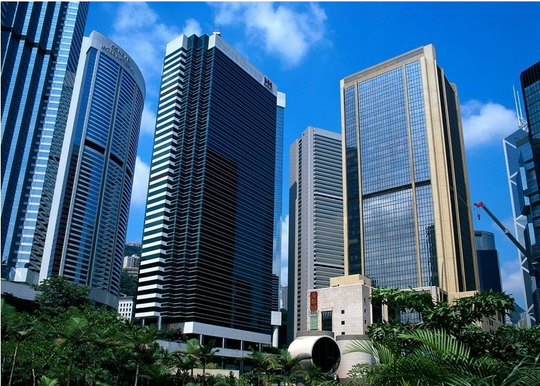

<!-- # ＜天璇＞和香港人一起上文革历史课 -->

**讨论到两地新闻，我说香港报纸看不到内地的正面报道，他说在内地为什么看不到内地的负面报道……我当然可以跟他解释，其实批评政府的新闻在内地是主流，人民日报所谓的党报在内地才是被边缘化的，就比如谁会到报摊上去买一份人民日报看呢？不过我没这么跟他讲，因为他对内地的刻板映像，让我跟他缺乏共同探讨这个问题的文化背景基础。他也许从来没看过南方周末是什么吧，不然怎么会得出这个结论。**

# 和香港人一起上文革历史课

## 文／江雁南（香港浸会大学）

我检索了学校课表，想要旁听点和香港社会有关的东西。这对内地生很有吸引力，同样是华人社会，但资本主义的体制到底是怎样运行的。（同样好奇的也包括台湾。但我从香港人口里知道台湾人“鄙视”港人，尤其是当港人开始变成了中央的传声筒之后，这是题外话。）

我来旁听的是一门叫做：social welfare in china的课。进了班级才知道，这门课讲的是内地的福利制度，和HK无关。意外得知，这是唯一一所有这门课程的港校，今年也是第一次教。

老师是香港人，在北京呆过三年。上课的是大三的学生（也是毕业班，香港本科三年）。50多人的课堂，两个内地学生（不算我）。课堂主要是用英文，但因为讲的是中国社会问题，所以老师会用广东话解释。我能听懂八成。

在香港，普通话热是绝对的，港人告诉我，好多工作都需要普通话证书，颁发机构是国家语言委员会，普通话证分初中高三级。所以当他们知道我是内地生的时候，争相跟我说普通话，但其实我很想学广东话，因为你不会广东话，基本还是跟香港社会有点绝缘。我听得懂，但拜托让我多说说好吗，我也想交流啊。

香港大学生的普通话挺好，尤其是高年级的学生，大一的童鞋都不会讲。除了学校、商店、饭店能知道你普通话是神马意思，基本就是广东话的世界了。

说说我今天的这门课。

我觉得灰常有趣的是，我能用港人的眼光看中国社会，这也不错，虽然我在本科的时候，已经大量听了社会学的课了。

老师问：你们知道内地有什么NGO吗？下面一片茫然，有一个声音说是红十字，引来一阵会心的笑声，真是好事不出门，坏事传千里。香港人了解内地的机会，永远是等中国发生什么丑事的时候，港媒才会大肆报道，所以内地在港人眼里实在负面得一塌糊涂。

我记得第一次新闻系见面会，会后老师请全部50多个童鞋一起茶楼吃饭，我和一老师（原南华早报的前主编刘志权）坐在一起，讨论到两地新闻，我说香港报纸看不到内地的正面报道，他说在内地为什么看不到内地的负面报道……我当然可以跟他解释，其实批评政府的新闻在内地是主流，人民日报所谓的党报在内地才是被边缘化的，就比如谁会到报摊上去买一份人民日报看呢？不过我没这么跟他讲，因为他对内地的刻板映像，让我跟他缺乏共同探讨这个问题的文化背景基础。他也许从来没看过南方周末是什么吧，不然怎么会得出这个结论。

之后的几个礼拜，其实只需要几天，因为都是香港老师上课，你就很容易发现港人的这种对内地的刻板映像。

比如，其实内地研究生留港和回内地的比例是3：7，大部分的是回内地的。但是只要毕业的内地生有一个对老师说，我留港是因为香港比内地好太多，这里有人权、民主、自由，老师就更加加固了香港好于内地的观念，上课还不停的拿这件事说事。

再比如：每年香港有“六月初”的游行，高校都会出一部纪念的册子。看到内地生，就很热情地奉送，中午和港人吃饭，每次都会问我这个问题。我一直觉得他们的中国历史课是不是只教文革和学运这两段历史。

他们总问我，内地又没有言论自由、出版自由、游行自由。我承认确实没有，但是他们的话外话是，他们觉得内地过的是暗无天日，政治高压，愚昧无知，连艾未未和刘晓波是何方神圣都不知道。可是我们虽然没有法律保障的这些自由，但我们活得不是他们想象的那样苦逼。我们会用“蛤蟆升天”讨论些领导人的问题啊，我们还会散步啊，我们也会翻墙啊，我们还有南周啊。我们也愿意无止境地讨论真相是什么，但是港人不会，他们娱乐至死，除了对内地有个模糊又不容置疑的刻板印象外，他们政治冷感，也不爱专业主义操守的新闻。

我上不同的课，认识不同的香港人，他们愿意与我交朋友，不知道是不是港人本身都很friend的原因，还是想学普通话。但是每次聊两地差异，我都觉得我是个被同情的对象，好像我出生在朝鲜……而且我一遍遍解释中国社会，可这对我来说是个多庞大的命题，我一两句如何说得清。

我也开始理解，为什么说：出国的人更爱国，内地被贴了好多标签，要沟通又很难。在内地可以争论，但至少我们有一个共同的知识背景和对中国国情的认识，而外边人认为内地百无是处……因为他们认为最重要的价值观，内地木有。

说回这节课，老师开始讲到中国的多党制，在这个小point上，她费了好多口舌，因为同学流露处困惑的表情，香港人只知道内地是一党制。

还有个有趣的事情是，讲到当时的资本主义是错误路线……所以发生了文革。但香港还走在错误路线上，这也就是这门课灰常灰常有意思的东西，文化对撞。

后来在课堂上看了香港翡翠台做的一档节目叫《六十年家国》采访了很多中国内地的1949年出身的人。采访对象回忆了下文革的洗礼，计划生育的实施，上山下乡，提到想自杀……看这个片子的时候，我觉得很穿越，因为所有的采访对象都健在，说的是普通话，讲当时的伤痛。这种感觉就像是中国突然言论自由了，我们不用翻过去的旧资料，我们可以直面当事人，说出真相。看着看着我眼角就湿润了，一半是因为60岁的人在你面前讲过去的伤痛，还有可能是被这里的直面真相的自由氛围感动到了吧。

节目时间不长，应该是20分钟左右，最后一段，讲的是人民过上了好生活。放了国家高速发展、一切欣欣向荣的画面。采访一对农民夫妇，说不用交农业税了，国家还给补贴，他们好感动，觉得历朝历代农民都没这么好的待遇。又过了若干年，土地被国家征收用来建大学，不用住木屋了，搬到了100多平方米的公寓里去。画面很和谐，合家欢的样子。

看到最后一段，香港人都在惊呼，哇，好大的房子啊。的确，对蜗居的香港人来说，100多平绝对是豪宅了。

之后，老师让我们讨论，49年代的人和80后有什么区别。（因为80后之所以是中国的一个特殊阶层的代表，是因为我们出身在78年经济改革之后，又是独身子女的一代。）

我一激动，作为仅有的三个内地生之一，上去做了发言，当然也希望老师认识我，因为香港的大学不能随随便便旁听，老师是可以赶你出去的。但表现好的话，老师也可以大方地允许你旁听，中国社会，毕竟还是人情社会。

我讲了在内地什么是敏感词，什么不是；我们这一代到底知不知道什么是学运；我对这个片子那种奇妙的感受；讲了自己家庭的经历，我爸爸是老三届，他作为一个上海城市人，高一辍学上山下乡，去黑龙江插队8年，砍了8年树，回来再参加高考，到了34岁终于娶妻。讲得自己都难过了，但我从小听老爸叨叨这些，在家的时候早已麻木。老师后来对我的此番言论点评是，看，这些都是内地那代人没法磨灭的创伤。下面还有学生给我递餐巾纸，其实我也没哭，只是有些激动。

我还指出了那个纪录片最后农民过上小康生活的桥段，在中国还没这么普及，不然怎么会有强拆和上访。下面的童鞋听到貌似津津有味，我知道我又一次证实了他们对暴力中国的刻板印象，唉……

后来有个在香港读到第四年的本科内地生也分享了下他的想法，下面的人问他：为什么内地有腐败？他回答，“可能内地没有廉政公署”；我插嘴说，有纪委啊……争论了一小会儿，他说他是北京人，北京和上海行事规则很不同。

我站起来简明扼要的回应了那个腐败的问题说，一是因为一党制；二是因为司法不独立；三是言论不自由。全班给了我big hand！但我依旧心情矛盾，我貌似和这个极右社会达成联盟，但我却和他们在某些观念上还是有本质不同的。

那一男生对我的说法又给了回应，原话说：我对你学术化的分析表示赞同，但是为什么不想想宋朝明朝的时候这些自由独立也没有，怎么就没有腐败呢？

他理解问题的方式，像极了我刚读完的陈冠中的小说《盛世中国》里面的观点：“中国是没办法比现在更好的了。不用一党专政，管得住中国吗？能让十三亿五千万人都温饱吗？中国能这么快崛起吗？D人已经没有理想，作为C政权的垄断集团，D执政为了自保，当官是为了图利。对政改不单缺乏热情，甚至犬儒的认为不该改、不能改，一改就乱。”

所以我可以很容易用盛世里面的观念回应他：“有很多人会认为，伪天堂还是比好地狱更好，他们开始的时候还知道那是伪天堂，只是不敢或不想去拆穿它，久而久之他们甚至忘了那是伪天堂，反而替伪天堂辩护，说那是唯一的天堂。但是，世界上总会有一小部分人，再痛苦也宁愿选择好地狱，因为在好地狱里，至少大家都清清楚楚的知道自己是在地狱。”

但我后来选择没回应，因为身边香港MM说：哇，两个内地人争起来了耶。

课程结束后，好多人跑过来做自我介绍，要跟我认识做朋友，关心我下节课还来不来，他们觉得我给他们带来了丰富的信息量，老师也直呼我雁南，走的时候还跟我说了拜拜。

我和那debate的男生做了朋友。他跟我有一样的感受，香港人对内地的刻板印象，让我们浑身不舒服。他说他从来都不敢跟香港人说他这些看似左倾的观点，而且香港人也不爱学习和探讨这些。他这三年多来，也很孤独，就算是交往了一年多的香港女朋友，听到他讲这些想法，也都保持沉默，而且非常不解。又因为港女很物质现实，所以分手。

他说他要考英国伦敦政经学院，他很理解我的想法，因为他高中的时候也是如此。但他问我：当你批评政府的时候，有没有想过怎么改变能更好吗？可行性有嘛？你没有好的方案，怎么可以随便推翻现有体制呢。我实在语塞。因为记者不用给结论的，我们只要呈现事实就好、监督政府就好。他说他要做那个改变现状的人，而不是随便批评政府又拿不出良方的人。

我又很悲观的拿出陈冠中《盛世》的观点跟他分享，典型的中国儒生，满脑子治国平天下，整天想当官，想做帝王师，接近权力就亢奋，一进入权力核心就支持威权专制，美其名要绝对权力来办大事，其实都是个人的欲火焚心。办大事不一定是办好事，也可以办出大坏事，后患无穷，这种例子这几十年还少吗？

其实我很开心，能做深入的交流和畅谈，他也是。

后记：

和那个男同学认识后，让他推荐其他好的社会学课程。他告诉我两件事。

第一，原来有个很好的社会学老师，因为去年在课堂上宣扬了点左派思想，学校童鞋投诉举报还游行，所以“被辞职”。

第二件事，2009年，港大学生会主席，因为说了些关于别把学运看得太严重的言论，又引发香港的大学热烈讨论和抨击，被要求道歉并且退学。这件事是真的，我google了下，链接贴这里，不知道需不需要翻墙。[http://www.voanews.com/chinese/news/a-21-w2009-04-14-voa38-61335732.html](http://www.voanews.com/chinese/news/a-21-w2009-04-14-voa38-61335732.html)

（采编：黄理罡；责编：黄理罡）
