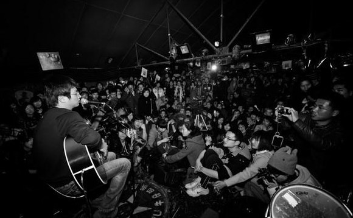

<!-- # ＜玉衡＞一个禽兽的自我修养——思考李志与他被禁忌的音乐游戏 -->

**这就是为什么李志大多数的歌曲包括他的声音都带着那些不可言说的悲伤和孤独。他在追求一些在当下被泯灭得面目全非的东西，纯真，诚实，尊严，理想，面对整个社会信仰的缺失，他如同在深水中挣扎，呼喊。我们看得见他嘴边的气泡和扭曲的表情，却不见得都知道他在喊什么。**

# 一个禽兽的自我修养

# ——思考李志与他被禁忌的音乐游戏

## 文/何俊嵩 （北京大学）

这是一篇非常自以为是而又郑重其事的乐评，它耗费了作者半年多的思考与一个多月的拖稿，终于在主编濒临绝望的头一天夜里以尿崩的态势实现了成果转化，摆在读者的面前，用以展示作者的空虚无助与歌者的荒淫无度，当然，顺便也填充了这期版面，以及作者在乐评领域的空白。太多人写李志，作者既不是他的大尖果儿可以爆最猛的料，也不是又一个张铁志可以挖最深的坑，作者只是他自己，一个搭着李志的歌当背景音乐把世界当毛片儿看，再设身处地地体会李志作为一个禽兽的自我修养的，另一个禽兽。

于是你看了这篇乐评，不要过度思考，思考过了头，要么会走上妄图了解自己所处环境的犯罪道路，要么会发现作者是在把你拉上跟他一样的道德水平再用丰富的经验击败你，无论以上何种结局都不利于你的身心健康和社会和谐，正如同你在听李志的歌的感受。这样将文字与歌曲从皮到肉的统一起来，就是一篇成功的乐评了吧。假如你只是想跟作者摩肩擦踵地一同思考，那作者会像北大南门的保安一样甩给你三个哲学上最本源的问题：你是谁？你从哪里来？要到哪里去？

**一、

你是谁——《梵高先生》**

作者唯一一次听李志的现场，是在去年秋天的石家庄，那也是作者第一次全面接触李志的歌。当时对全场几百人从头到尾合唱下来感到异常震撼，而自己即将以从头到尾坐在李志脚边的跟拍摄影师身份出现在群众视野里，如果无动于衷，not fashion，于是作者始终嘴唇翕动保持着兴奋假唱的姿态，成功hold住了全场。直到事后有人问作者，那天李志唱《梵高先生》了吗？作者想都没想就回答说当然唱了啊，这资深B粉的身份才惨遭揭穿。

李志为什么再也不唱《梵高先生》了？豆瓣小组有人转载他的话不知真伪：“不唱《梵高先生》是因为我回不到以前的状态。写歌的时候，录音的时候，演出的时候都是完全不同的生活。我不是讨厌这个歌，相反，正是因为喜欢所以不想去糟蹋她而乱唱。”这种平铺直叙的话即便听的时候脑补他的嘴脸也会有强烈的违和感，还是另一个版本的传言更可信，那就是每当你问他这个问题，他顶多得意地笑一笑，摇摇头说我不告诉你。萧伯纳说，沉默是表示轻蔑的最完美方式，就是这个意思。

据考，李志最后一次公开唱《梵高先生》应该是在09年底的义乌，那时候距离他在成都小酒馆放言再也不唱那首歌已经有两年的时间了，有人大喊这个人吞下了自己的唾沫！可这又有什么要紧，你们每天都在吞。那次他喝多了，撕心裂肺声嘶力竭，已经不像是在唱，倒像是酒精浸泡了回忆和苦楚在脑海里燃烧的轰然巨响。

**我们生来就是孤独，我们生来就是孤单

不管你拥有什么，我们生来就是孤独**

不知道是谁的父亲谁的爱人，我们只知道是谁的星空谁的飞鸟。真拿梵高来说事儿，他被他挚爱的色彩纠缠着早死在孤独里，一切的灿烂与荣耀都不过是身后的影子，却永未留下可以抓住的肉身。在放弃唱那首歌之前，李志已经在南京被人称为“梵高先生”，大家都以为那是他对自己的写照，可李志后来又有一首歌唱道：“亲爱的李志先生，你就像屎的倒影。”他好像又如此害怕被人们抓到，他宁可不去做梵高，宁可在身后也要继续孤独。

他到底是不是梵高？李志有这样一首温软的歌，《斜》：

**一只鸟在黄昏阳台，沉默，沉默

晚霞中飘逸的声音，是你，是你

可是孤独的你，我不能跟随着你

可是孤独的你，我不能跟随着你**

还有这么一首更加意象化的歌，《墙上的向日葵》：

**窗外的风，吹过我的房间

吹动，你的向日葵

城市就躲在光明的背后

光明只是你隐秘的哀愁

时光就这样悄悄地溜走

溜走**

于是他自己把跟梵高的关系撇清了，他隐蔽在用光明色彩描绘世界的梵高身后，将一切的矛盾与隐秘揭发出来，毫不留情，毫不手软，而又为什么要写出《梵高先生》？应该就是那点共同的艺术理想：艺术应该关注现实的问题，探讨如何唤醒良知，改造世界。

于是唱不唱梵高真的没有意义，你若真学真信真用，梵高就一直在你的生活里。

**二、

你从哪里来——《天空之城》**

我有一部很喜欢的电影叫《颐和园》，第一次看的时候，我在电影里那个虚构的大学原型里念书，大二，二十岁，有两段感情经历。那时候我觉得我没看懂，可那个电影就像一缸烈酒，我去用手掬着喝，却失手洒在前大襟上，于是我没法当作没见过这缸酒，它在我衣襟上幻化得五彩斑斓并散了味道往我鼻子里钻，于是我时不时地掀起衣襟来舔舔，渐渐尝出了这酒混了我体味的味道。

第二次看的时候，是发现它的片段被网友剪接成了一首歌的MV，这首歌叫《关于郑州的记忆》，是一个叫李志的南方口音男人唱的。本来我也不理解这部跟郑州毫无关系的电影为什么会成为那么一首歌的MV，可却不自觉地反复播放了无数遍。那首简陋的歌就像一个收口的高脚杯，盛了刚才那缸烈酒，饱满浓郁地送到我口里，我才仿佛真的了解了那部电影的味道与真相。再到后来，我好像已经自觉地把自己投到那缸酒里去了。

所以我要说的，既不是那部电影，也不是那首歌，而是那个杯子与那坛酒。那个杯子，就是李志，那坛酒，就是让我共鸣让我醉死的，余虹或者李志式的爱情。

李志从爱情里来，这个人除了他的歌之外没给别人留下任何线索来考据他的爱情，但那些每一首都提到不同姑娘的歌已经足够。他像弗洛伊德一样通过异性之间的情感来抚摸世界本源，又在心里重塑一个性的幻象来支持着自己不断向前追寻。

他在《铅笔》里唱道：

**你还在笼罩我，你的名字还在纠结我

我只是一个人，我的歌里全都是你**

又在《和你在一起》里唱道：

**我要和你在一起，直到我不爱你，宝贝，人和人一场游戏

我愿意为你死去，如果我还爱你，宝贝，我也只能这样为你**

笼罩与纠结，游戏与死去，关键词们争先恐后地把一个苦逼天蝎男的形象推到我们面前，就像他的世界里只有她一个。可他又有这样那样的歌，比如《关于郑州的记忆》：

**“关于郑州我想的全是你，想来想去都是忏悔和委屈

关于郑州我爱的全是你，爱来爱去不明白爱的意义”**

又比如《天空之城》：

**“港岛妹妹，我们曾拥有的甜蜜的爱情

疯狂地撕裂了我，天空之城在哭泣”**

这个货把他的爱情埋得到处都是，就好像旧时皇帝的衣冠冢，让每一次都以为挖到大活了的摸金校尉一次次地骂娘，他却走在头上扮冷峻扮无辜。他在《爱》里唱道：

**诶……什么是爱，诶……什么是爱

诶……什么是爱，诶……什么是爱**

一贯优雅哀伤的配乐勾搭上他悲天悯人的嗓子，真是让人生熟不吝都想生吞活剥了他。而他又搬来娘亲来妄图脱身，告诉大家他最爱的女人早就嫁给他爸了，他在《妈妈》里唱道：

**mama dont let me down mama go with the wind 蒲公英和炊烟都在等你

你的孩子一直很乖**

可转身又翻脸，在《这个世界会好吗》里唱道：

**妈妈，我居然爱上了她，像歌唱一样爱上了她

妈妈，当你又回首一切，这个世界会好吗**

当把他一切嘴脸都卸掉，我们终于发现李志对待爱情这事“只不过是一场游戏，只不过是一场游戏”，而他告诫我们的也成了：“你可是个男人，为什么打不起精神？”从爱情中来的男人们，何去何从？

**三、要到哪里去——《广场》**

北京的街头很多弹唱吉他的艺人，见多不怪，大家觉得能站着听唱15分钟还没有唱过许巍的艺人就已经算脱俗了。某天有朋友提到国贸附近一哥们头脑一热唱了一首李志的《人民不需要自由》，后来就再也没见他。我不知道这是真是假，但我的确看过一个小视频，在地铁上拍摄一个弟兄弹唱这首歌，被一个大爷痛斥之后灰头土脸地把吉他收了起来。

有司怕什么呢？大爷怕什么呢？

李志有一首歌叫《他们》，收录在专辑《这个世界会好吗》里面，曲调一反常态地欢乐跳脱，琅琅上口，简直就是民谣中的童谣，神话中的童话；更欢乐地是，我在调查此歌的时候听到一首现场版，在两段的间隙有场下听众一高亢男声喊了一声“110！”，登时全场有天使飞过三秒钟，而后李志定定神重新开唱还磕巴了一句，引起全场哄堂大笑。

听众怕什么呢？李志怕什么呢？

李志在那首很具炒作意味的《暧昧》里唱道：

**妹妹，你的咪咪很大，它比我的理想大

我说妹妹，我的理想很大，它比我们的未来大**

而后又在那首身边小事有感而发的《翁庆年的六英镑》里唱道：

**我说老板，一斤尊严要多少钱。我说老板，一斤理想要多少钱

我说老板，一斤坚持要多少钱。我说老板，一斤纯粹要多少钱**

这个货似乎从床上爬起来之后开始像那些搞艺术的穷光蛋一样开始跟姑娘谈理想了，曾经在某本小说里读到，有失足妇女遇到这样的客人，选择了不仅不要钱还甩给了他二百，问她为什么，她说哥们你比我可怜多了。

这就是为什么李志大多数的歌曲包括他的声音都带着那些不可言说的悲伤和孤独。他在追求一些在当下被泯灭得面目全非的东西，纯真，诚实，尊严，理想，面对整个社会信仰的缺失，他如同在深水中挣扎，呼喊。我们看得见他嘴边的气泡和扭曲的表情，却不见得都知道他在喊什么。

**是谁带你来看这场庙会

行为掩饰后超越了思维

舞台上的小丑和你的左小腿

别管我，别把我和他们扯在一起**

大多数人就像他歌中唱的鸵鸟，把头埋在沙里，剩下身子露在地面上被人狠揍。

**不知道有谁能让你述说，你这样的生活到底为了什么

我看见你靠在窗口沉默，路过了青春我们还拥有什么

这让人心慌

这让人心慌

这让人心慌

这让人心慌**

李志一声声叫魂似的歌唱时时在挠你内心最痒的那块痂，把什么自由什么理想什么悲观什么愤怒都拉洋片似的在你脑子里过一遍。改变吧改变！改变你自己！改变这命运！

最受不了《广场》开头那一段独白：

**还没有熟的一个，一个果子，

然后一些人呢，就很饿，饥不择食

然后，忽然发现了一个果子以后

就扑上把它摘下来吃了

一口吃下去

甚至于连嚼都没嚼就咽下去了

咽下去以后发现肚子痛

然后，那个，就又苦又涩的感觉

你说他应该不应该吃

他，你要说他不应该吃，他饿

你要说他应该吃，他，他吃的是一个涩的

是，是不可以吃的一个东西**

这个名叫梵高的禽兽，生于爱情，死于信仰，活着唤醒群氓，死后也会留下悲歌。这就是我眼中，李志的自我修养，共勉。

（原载于《文艺生活周刊》总第56期[http://zhoukan.cc/](http://zhoukan.cc/)）

（采编：徐海星

；责编：黄理罡）
