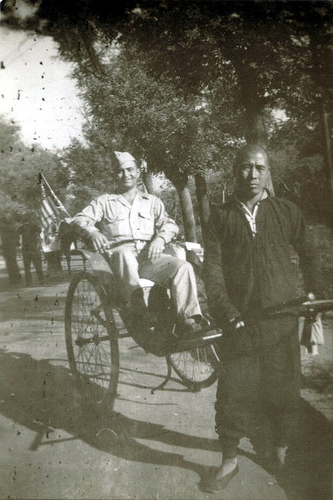
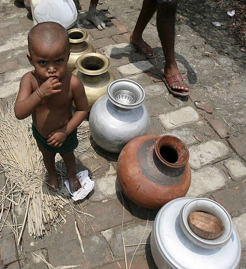
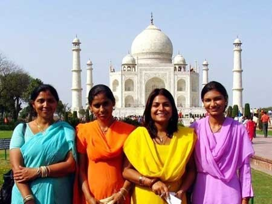

<!-- # ＜天玑＞加尔各答之You just can’t walk away（一）：印度人是另一种生物 -->

**当女人蹲在路边用肮脏的水洗碗，你不能只看到“噢她的纱丽颜色多么美丽！”；看见骨瘦如柴的老人拉着人力车卖命地奔跑，你不能像泰戈尔那样抒情地说“旧的时代好像一位王子”；新认识的朋友震惊于印度的卫生环境之差和印度人的生命力之顽强，当他对你说“印度人是另一种生物，即便整个世界发生了核战争，他们也可以成为唯一的人类幸存者”的时候，你不能鼓掌说，“哇恭喜他们！实在太厉害了！”**

# 印度人是另一种生物

## 文/傅真 (中国人民大学)

如果不是读到过泰戈尔回忆童年生活的文字，我会疑心加尔各答被困在时光之中从未改变过。在泰戈尔的童年记忆里，加尔各答没有电车也没有汽车，城市里只有马车来往奔驰扬起尘土，绳做的鞭子在瘦骨嶙峋的马背上不断落下；自来水管还未出现，电灯是无法想象的奢侈；妇女出门时必须坐在密不透风的轿子里，在陌生人面前也一定要用面纱遮住脸庞......世界上很多城市的现代化进程都不外乎“破旧立新”，然而眼前的加尔各答却像个固执的老人，尽管免不了被时代的滚滚洪流裹挟着冲向前方，所有的新物事和老古董却都被他死死抱在怀里，一样也舍不得丢掉。

这使得这座人称“现代印度摇篮”的城市看起来比它的真实年龄更老。有轨电车旁边跑着马车，汽车和人力车在红灯前面一同停驻——初来乍到的旅人们脸上写满错愕，21世纪的大城市居然还存在着这种完全只靠车夫奔跑来获取动力的最原始的交通工具！加尔各答的“骆驼祥子”们大多是脸上刻满皱纹的老者，他们在大街小巷间奋力奔跑，汗如雨下。虽然人力车夫需要这份微薄的收入来养活一家，我还是无法说服自己坐上高高的座椅俯视车夫那花白的头发。

作为英国人一手打造的城市，加尔各答的街头随处可见殖民者留下的英式建筑群，古典庞大，气势惊人。听说英国人建造加尔各答时复制了伦敦的城市轮廓，可是在我看来，这座城市的气质更接近于土耳其的伊斯坦布尔。不知是漫天烟尘还是我的目光作祟，加尔各答的颜色看上去宛如发黄的黑白胶片，苍茫朦胧，像是试图讲述着无法讲述的什么。无论是在薄暮里还是晨雾中，当我仰头望向被电线杆切割的天空，停在红绿灯上的鸽子，远处清真寺、教堂、印度庙、博物馆、民宅那光怪陆离的屋顶，以及从高大的殖民建筑里走出的身材矮小衣衫褴褛的贫民，都能感到土耳其作家帕慕克笔下的“呼愁”扑面而来。在东西方的夹缝中进退两难的城市，往昔的荣耀更加凸显今日的荒芜，空气中流动着宿命一般的绝望。杜拉斯笔下的那个印度女人便是只能依靠加尔各答每天分泌出来的绝望生活，而同样，她也因此而死——“她死就像被印度毒死”。

我觉得加尔各答有种不合时宜的美，可也不得不承认它是我平生所见“脏乱差”城市第一名。街上到处都是人，每个人的身体不停地相互碰撞，散步变得毫无乐趣；交通混乱拥挤得不可思议，所有的车辆都以一种不要命的姿态狂奔，所有的司机都在拼命按喇叭，不管有没有必要，仿佛不这么做就会输给对方。每次出门都仿佛瞬间踏入一条沸腾的河流，震耳欲聋毫无间断的喇叭声简直可以刺穿耳膜，也渐渐将我们的最后一丝忍耐力消磨殆尽，铭基同学每隔不久就会朝着身边经过的车辆抓狂地大喊“吵死啦！！！”；空中尘土飞扬，垃圾漫山遍野，蚊蝇占领了整座城市，人们就在街头随地大小便，牛、羊、狗都在刨垃圾觅食的丰富经验中进化出了可以消化纸和塑料的胃......

很多人就在街边“办公”。他们坐在一张小板凳上，给过路人剪头发、剃胡子、掏耳朵、擦皮鞋、切烟丝、包槟榔、补鞋子、缝衣服、代写书信……所有你以为已经消失的手艺都在此地代代相传。每隔几步就有贩卖各种小吃、水果和奶茶的路边摊，油烟翻腾，炸土豆和鸡蛋饼的香气冲淡了街角的尿骚味，人们拿着很小的杯子站在路边慢慢啜饮着奶茶，偶尔交谈几句，可是话语刚一出口就被铺天盖地的喇叭声吞没了。

还有更多的人干脆就住在马路边上。街道就是他们的家，他们的工地，他们的游乐场，他们的生活。一天中不论任何时候你都能看到男人们在用路边的水龙头洗澡，他们面向行人，只在下身包一块布，身上全都是肥皂泡。有些人用塑料和木棒支起了几面漏风的栖身之所，所有的家当都暴露在众目睽睽之下。条件好一些的有张木长桌，白天在上面架起锅灶做些简单的小吃卖给过路人，夜晚则把桌子当床盖上毛毯睡觉。而更多的人除了身上的破衣烂衫之外几乎一无所有，只得露宿街头，与动物和垃圾为邻。天亮以后他们爬起来各就各位，乞讨、拉人力车、捡垃圾、替商店拉客、在外国游客身上“敲诈”几个小钱……用各种你想象得到和想象不到的方式维持生存。我看着在垃圾堆里爬来爬去的孩子们，赤着脚，头发打结，有的连裤子都没有，只能光着屁股，可是每一张脏兮兮的小脸上都写满了兴高采烈，每一个动作都充满了最原始的生命力。我知道他们大概永远不可能去上学，但却一定会磕磕绊绊地长大，而这过程也会和他们生活在马路上的父辈们曾经历过的一模一样。

在加尔各答的日子里，每一天都面对着极度的贫穷，极度的脏乱和极度的喧嚣。而这其实是印度北部大多数城市的常态，加尔各答不过是其中最具代表性的一个。你大概会以为我不喜欢加尔各答，不喜欢印度。然而事实上，我被它深深吸引和迷惑。“我爱瑞士”，“我喜欢巴黎”——这样的话可以脱口而出，非常容易。

可是对于印度这片矛盾重重的土地，实在是“想说爱你不容易”。它的美丽不及丑恶明显，上一秒是天堂下一秒却是地狱。在这个国家，美是需要费点劲才能看得出来的，爱是需要思考和勇气的，喜欢和憎恶并非源自不同的反应层次，而是同时共存的。

印度的“脏”几乎已经成为所有旅人的共识。政府的公共服务能力不够固然是原因之一，然而我也逐渐意识到，印度人所认为的“脏”和我们的定义不太一样。譬如所有的印度神庙都会要求到访者脱鞋入内，可是神庙的地面非但远远达不到“干净”的标准，有时甚至污水横流。往往一圈转下来，我的脚底已经是一片黑，还粘满了各种来历不明的固体和液体。尤其是在加尔各答的卡利女神庙，由于这里供奉的卡利女神嗜血成性，人们每天都要宰杀山羊作为祭祀。仪式本身非常癫狂，完毕之后更是满地狼藉。光着脚的外国游客非常郁闷地在一滩滩血迹和排泄物之间跳来跳去，我觉得这神庙的地面比我球鞋的鞋底更脏，可是印度人认为肮脏的鞋底会玷污神庙神圣纯洁的环境，脚的干净与否则根本不在考虑之内。或许正如印度的一些学者们所说，印度人的清洁观必须放在种姓制度的背景下来理解，而这个制度强调的便是社会秩序的纯洁性优先于身体的纯洁性。

在清洁卫生方面，我觉得中国总体来说比印度做得好，例外只有一个——厕所。中国的公厕（尤其是蹲坑式的）往往惨不忍睹，如厕后不冲水还不算最恶劣的，有些人大概天生缺少空间感和公德心，拉个屎都会“射偏”，用过的厕纸更是随地乱扔。可是印度就鲜少有这种情况，因为他们便后用水清洁，不用厕纸，厕所里永远有水龙头和水桶，清洗起地面来也非常容易。虽然常常弄得一地水渍，至少不会像在中国上公厕那样“步步惊心”。

在印度旅行需要比较强大的忍耐力和随和的心态，因为有太多的事情可以激怒你——从卫生习惯到公德心，从办事效率到生意诚信......有时候我觉得印度人性子很急，堵车时整条街的喇叭声简直可以把所有正在冬眠的动物吵醒，买票时总有人插队（我最讨厌别人插队，每次都会对他们大吼“去排队！”），地铁和火车还没到站就开始迫不及待地推挤。门还没有打开，他们已经将双手放在我们的肩上用力往外推，直到我的头都撞在门上，实在叫人火冒三丈。可是他们工作起来却又不紧不慢，尤其是政府部门和国营单位，窗口里的大叔大妈常常自顾自地聊天，根本懒得搭理你。好不容易取得了对方的注意力，可是在你开口提问之前，还要有足够的耐心等待他把手里的茶慢慢喝完。

第一次看到小旅店的床单时我差点崩溃。白色的床单上布满了各种可疑的污迹，好像一幅抽象画。我的第一反应是“这床单没洗过”，可是摸了摸闻了闻之后

又觉得洗倒是洗过，但是没洗干净。我本以为这只是那家旅店的问题，谁知一路走来除了南方几乎到处都是这种情况。我曾要求过旅店换床单，谁知换来的还是一张污迹斑斑的床单，我只能根据污迹的位置和形状判断出它的确不是原来那张。有些背包客对我说：“哎呀，印度这么穷，咱们住的又是这种便宜旅店，不能要求太高。”可是我们之前在拉丁美洲旅行时，也去过极其贫穷的国家，也住过差不多价钱的旅店，为什么从未见过像印度这种脏到简直让人想报警的床单？为什么人家的床单全都可以那么干净？可见“贫穷”和“便宜”根本不能当作借口，缺乏服务意识，做事不认真无诚意才是罪魁祸首。

正因如此，我们从洗衣店或旅店拿回衣服时常常会收获各种“惊喜”：衣服被染了别的颜色，铭基的两件T恤前所未有地被洗得拉长了一大截，长到可以当裙子穿，裤脚上有黑色的鞋印......我俩勃然大怒，第二天把衣服扔回去：“重洗！”工作人员态度不错：“好的好的！”可是再次拿回来，我们相对无言，默默吐血——什么都没有改变，连那个黑色的鞋印都仍在坚守阵地......

可是我又无法不注意到这些事件所反映出来的印度人性格的另一面。在中国，如果在拥挤的公共场所互相推撞，一定会有人忍不住跳出来骂娘；如果我对插队的人说“去排队！”，对方大概会说“关你屁事”；如果两辆车发生轻微碰撞，或者摩托车在汽车身上刮出一条痕迹，两车的车主一定会吵个天翻地覆甚至大打出手；如果对洗衣店表达不满要求重洗，店主很有可能会赖帐：“你们自己搞脏的，不关我们的事......可是在印度，我很少看到人们大吵大闹，往往是你抱怨几句我解释几句就相安无事各走各路了。有时我已经非常生气抓狂，对方却忽然“嘿嘿”一声，或是一边微笑一边摇头晃脑地认错：“OK， OK！”，我的气顿时消掉一大半，真的，吵架时对手忽然亮白旗，你“再怎么心如钢铁也成绕指柔”啊......

和路上遇见的朋友交谈起来，有些人同意印度人不容易生气也不爱记仇，但认为这是印度人没心没肺的表现，我却觉得这正是他们自然流露的忍耐力和宽容心，更体现了他们隐藏于噪声之下的心灵的平和纯净，用佛教的语言大概可以解释为“佛性”。据说释迦世尊成道之后最初发现的真理即是：“奇哉！奇哉！大地众生，皆具如来智慧德相。”他说实际上我们每一个人的本性就是清净本然的佛性，只因为被外在的八风所吹，心理受了影响，产生了种种烦恼，便把那清净的佛性遮盖住了，所以称为“凡夫”。普通的印度人固然也是凡夫，达不到“八风吹不动”的境界，可是他们的“贪、嗔、痴”念实在是我所见过的种族之中最少的。

照理说，内心澄净的人，外在的相貌仪态也应是平和中透着灵性。可这放在印度人身上又说不通。他们表情丰富，手势多多，热爱搭讪，好奇心旺盛，有时甚至言行轻浮。这些都容易造成误会，可是除去一些做游客生意的，大部分人其实是真正热心，毫无企图。还记得我和铭基在加尔各答那历史悠久的老唐人街转悠时，遇到好几位广东华侨，因为在印度出生，他们的一口粤语很有点怪腔怪调，可是人都热情得令人感动——有的已经走过去了又特地返回来追上我们告知值得游览的去处，有的花很长时间把华人在加尔各答的历史和现状一一道来。其实中国人大多含蓄多疑，以往在海外遇见同胞时从未收获如此热情，我不由得猜想这是否因为他们在印度出生成长，受到了“印度式热情”教化影响的缘故。

有一天我们做义工回来，在马路一侧亲眼目睹对面的一辆出租车撞倒一位妇女。那女人未受重伤，所以还有力气死死扒住车门不放。出租车试图逃逸，将那女人一直拖出去几米远。我们正看得呆住，周围忽然响起了震天动地的声音。只见无数人宛如天兵天将下凡一般从四面八方汹涌而来，一边大声呼喊一边朝那肇事的出租车冲去，瞬间便将它团团包围。我站在对街看着这一切，心里震动，几欲泪出——“小悦悦”若生在印度，即便不能保全性命，也至少不会死得那样悲惨难堪罢。

我想我是喜欢印度人的。我喜欢他们的热情友善，也喜欢他们从不为那些注定要发生的事情而担心的随和心态。和印度人相比，中国人总是显得忧心忡忡，戾气太重；尽管印度人喜欢随地吐痰，床单总是洗不干净，可他们又是如此爱美，满街的纱丽和kurta风姿绰约，连乞丐也要戴首饰。对于对美有执着追求的民族，我一向抱持以最深的敬意；我羡慕他们的精神自由，也欣赏他们对于心灵世界的关注，对于各种精神探索的尊重和宽容；由于印度人对自然怀有宗教性的感情（古印度人居住于森林，宗教在森林中产生），他们发自内心地爱护自然，尊重动物，几乎从不疯狂地采矿和砍伐森林，与自然和谐相处。他们的环保行为天然纯朴，往往并非出自深思熟虑，但却起到了与发达国家所倡导的环保行为殊途同归的效果......

有时我不希望印度人改变。我不希望他们变得和其他所有人一样：自私，浮躁，急功近利，没有灵魂，甚至忘记了“印度人”这个名称所代表的那些美好的东西。可是同时我也清楚，贫穷、脏乱和传统全都不应该被简单地浪漫化。走过令人心颤的贫民窟的时候，你不能毫无心肝地说“其实里面的人们看起来都很快乐”，

“至少他们不会被强制拆迁”；当小孩在地上爬着，和狗、牛、羊一起翻捡垃圾放入口中，你无法发出“他们与自然相处得多么和谐”的感叹；当女人蹲在路边用肮脏的水洗碗，你不能只看到“噢她的纱丽颜色多么美丽！”；看见骨瘦如柴的老人拉着人力车卖命地奔跑，你不能像泰戈尔那样抒情地说“旧的时代好像一位王子”；新认识的朋友震惊于印度的卫生环境之差和印度人的生命力之顽强，当他对你说“印度人是另一种生物，即便整个世界发生了核战争，他们也可以成为唯一的人类幸存者”的时候，你不能鼓掌说，“哇恭喜他们！实在太厉害了！”

仅仅在你眼皮底下的这部分土地上，人们的苦难已经太过深重，深重到所有以精神和内心为主题的辩护都变得那么苍白，深重到你简直想硬着心肠耸耸肩走开。可是你不能。你没法走开。You just can’t walk away。

（未完待续）

**作者简介：**《藏地白皮书》作者，2004年在西藏认识现在的老公铭基，2011年和铭基辞去在英国的投行以及建筑工程顾问工作，在南美洲开展Gap Year， 12月结束南美之行后，他们把Gap Year延长一年，于2012年前往南亚次大陆继续旅行，目前正在印度仁爱之家做义工。

编者注：经作者授权，本文主标题为编者所拟。

（采编：楼杭丹；责编：应鹏华）
