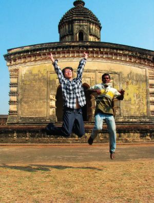

<!-- # ＜天玑＞加尔各答之You just can’t walk away（二）：加尔各答仁爱之家 -->

**悦子阿姨每天都极其忙碌，照顾病人的同时，还要安排、纠正和督促义工的工作。她每天在屋子里风风火火地走来走去，并不露出一点疲态，可是有些夜晚我们在小餐馆看见她，一个人坐在角落孤独地喝着一碗汤，满脸都是疲倦。究竟是什么促使她选择这样清苦辛劳的异国生活？偏执和严格的背后，一定有很多很多的爱吧。**

# 加尔各答仁爱之家

## 文/傅真 (中国人民大学)

You just can’t walk away。1946年，站在加尔各答哀鸿遍野的街头，一位修女听见了这样的呼召。那时她在一所教会学校任教，校内生活舒适，和平安逸，校外却是人间地狱，满街尽是麻疯患者、乞丐和流浪儿。修女没有掉头走开，她选择了直面苦难——放弃舒适的生活，深入贫民区去服务那些贫穷中最贫穷的人，这一去便是五十年。她成立了仁爱传教修女会（Missionaries of Charity，又称博济会），开设垂死者收容院，并将仁爱之家开到了印度之外，从初期的十二所增加到如今遍布全球的数千所。

在荒芜的加尔各答，她的名字叫特蕾莎。

加尔各答的仁爱之家至今仍是全球总部所在地。由于特蕾莎修女伟大的人格魅力和在世界范围内的巨大影响力，即便在她去世多年以后，世界各地的人们仍然纷至沓来，到此进行长期或短期的义工服务。义工报名面试那天我甚至看到一个人数众多的韩国旅行团，尽管他们在印度逗留的时间也很有限，却仍然挤出时间安排团员们来这里做两天的义工。

根据服务对象的不同（女人、儿童、伤残病人、垂死者等等），仁爱之家属下有好几个不同的部门（“儿童之家”，“妇女之家”等）。我和铭基加入的是

“垂死之家”。之所以会选择服务垂危病人，我想我是有一点私心的。外公去世时我还未出生，外婆走时我年纪太小记忆模糊。和爷爷奶奶感情很深，可是二老去世时我人在英国，病床前也未曾尽得半分孝心，一直有些难以释怀。不知道会不会有人理解，然而垂死之家的确令我看到了某种弥补的方式，尽管对象是彻彻底底的陌生人。

或许是因为看过很多“前辈”们关于义工生活的描述，真的走进垂死之家时，我不但没有丝毫拘谨和陌生，反而有种奇异的亲切感。和院外脏乱不堪的贫民窟比起来，这里清静整洁，井然有序。在外面的世界，食物与生存是最大的雄心壮志，而住在这里的病人却衣食无忧，生活随时有人照顾。一日三餐之外还有茶点时间，饮食丰富健康，饭后有水果，吃鱼前连鱼刺都统统挑出来才派发出去。难怪听说有人为了进来宁愿使出自残的苦肉计。

病人们绝大多数是男性，什么年纪的都有，穿着绿色的病号服，除了一两个偶尔会大声哭闹，其他人基本上都非常安静，脸上“也无风雨也无晴”，呆滞的眼睛宛如磨损了的玻璃弹珠。我原以为重症患者生活已完全无法自理，可是眼前的这些人大多可以自己下床走动和进食，尽管行动十分缓慢笨拙，可是看上去并不太像生命垂危的样子。起不来的几个则躺在床上，由义工和修女照料一切生活琐事。

后来和长期在这里工作的义工聊起来，他们说垂死之家的病人们大多曾是车站的乞丐和流浪汉，因为身患重病而被仁爱之家派去车站的“先遣队”发现并送到此处。垂死之家不是医院，它无法承担救死扶伤的责任，只能为那些不久于人世的病人提供一个临终前的温柔归宿，让他们能够有尊严地死去。然而话虽如此，人类的生命力之顽强实在是未可限量，很多原本生命垂危的病人来到这里以后，因为得到悉心照顾，身体竟奇迹般地好了起来。

因此垂死之家中最为年轻的两位住客看起来已经不大像是病人。尤其是年纪稍长的那一位，个子特别矮，可是并不瘦弱，人也精神得不得了，到处跟义工们握手寒暄，还不知从哪儿学会了几句西班牙语，说起来眉飞色舞，颇有一点风骚。年纪小的那一位情况却不太稳定，好的时候又开心又粘人，我去的第一天他还特地表演了几个舞蹈动作，可是不好的时候他会痛哭到让你的心都碎成一万片，只得派一位义工紧紧抱住他给予安慰。有老义工告诉我这孩子从小被人下毒因此染上毒瘾，每次哭闹就是毒瘾又发作了。虽然对这传说的真实性不无怀疑（据我所知仁爱之家几乎从不接收“瘾君子”），但是我也确信他小小的身体上一定承载着一个由黑暗和眼泪构成的故事。

相比起肉体上的病痛，以我有限的观察和经验看来，许多病人的精神问题似乎更为严重。这一点后来在与长期义工小P的交流中得到了证实。他说有一次适逢某场举国关注的极其重要的板球赛，垂死之家特地通知大家去电视房看球赛，结果一共也只有两个病人去看。如果你明白板球在印度人的生活中占有多么重要的宗教般的地位，你就会发觉这件事的不可思议。而小P更了解到，很多病人之所以此前会沦落到无家可归流落街头以至病痛缠身的地步，最初都是由于精神出了问题的缘故。也就是说，他们的人生之所以发生巨大转折，是源于某次变故对于精神的致命一击。而至于这神秘的变故究竟是什么，却从来没有病人透露过一丝一毫。

义工的工作并不复杂却十分琐碎。懂得医学知识的义工需要承担起给病人打针换药的任务，而大多数人包括我和铭基只能干些不需要专业知识的“粗活”——

洗衣、晾衣、分饭、喂饭、喂药、洗碗、擦身、剪指甲、剃胡子、叠衣服、扫地。。。这里并无具体细致的工作安排，忙碌与否完全取决于你的眼里是否有“活儿”。中间有一次喝茶休息的时间，义工们聚集在院子的凉亭里喝茶吃饼干聊天，许多友谊便是于此时此地埋下的种子。

上午的时间里，洗衣服是重头戏。这里没有洗衣机，洗衣服全靠人手作业，一共需要六道工序。修女们无私地承担了最痛苦的第一道工序——给脏衣服浸上消毒药水再用刷子刷洗。病人往往大小便失禁，衣服和毛毯上总是沾了很多的大便，需要先用刷子把大便刷掉才能进行后面的工序。这实在不是每个人都会愿意做的工作，光是看见那些刷落在地的大便已经觉得恶心了，可是修女们戴着口罩半蹲在那里辛勤刷洗的身影却有种令人起敬的圣洁。

刷完这些衣物后，还要再过水手洗一次，将残存在衣服上没有刷净的大便用手搓掉，才能送达第三道工序用洗衣粉洗涤（可以手脚并用），然后再分别过两次水，最后拧干，攒成一堆后会有义工拿去天台晾晒。大家在洗衣盆和塑料大桶前或坐或站手下不停，看起来一副热火朝天的景象。可是如果你仔细观察其中某些年轻的男义工洗衣服的方式，恐怕会在心里暗暗发笑——他们完全不知道衣服是需要搓洗的，只是反复地把衣服放进水里再拿出来，而且是全神贯注，非常努力地做着这些动作。我觉得很搞笑，可是同时又有一点感动。这些小男生恐怕平生连一只自己的袜子都没有洗过，却特地千里迢迢跑来印度替病人洗衣服......

洗衣服的过程中经常发生各种小插曲。比如在这里长期工作的日本阿姨悦子会忽然冲过来“强行”给新来的义工分发一次性手套。“细菌！很多很多细菌！第一次来......危险！”她的英文支离破碎，只好以激动的表情和手势作为辅助；比如我在过最后一道水马上就要拧干的时候，忽然发现衣服上还粘着一块大便，当下简直有暴走的冲动，可是又不好指责任何人，只得默默地把它扔回第一道工序；比如义工之间有时会就何时换水的问题发生争执：爱干净的日本义工大叔认为水已经脏了应该更换，可是固执的法国义工却坚持声称还不到换水的时候，双方相持不下，日本人固执起来也同样刀枪不入，大叔一言不发地忽然就把水全倒了，法国人只得在一旁干瞪眼；比如一位男病人忽然出现在水房门口，自顾自地把身上的衣服全部脱掉，小心地放在旁边待洗的一堆脏衣服上面。多么能干！不需要修女嬷嬷帮忙，自己就可以把脏衣服送来洗！他整个人全裸着站在那里，脸上露出非常骄傲的神情......

我和铭基做得最多的是最后两道工序——过水和拧干，主要是因为我们俩有种傻气的偏执，拧起衣服和毯子来真的会使出浑身力气，直到再也拧不出任何水分，非常适合做这项工作。我看到有些义工拧衣服非常马虎，随随便便拧一下就扔进筐里。如果之后可以暴晒几日彻底晒干倒也罢了，问题是等不了那么久，没有那么多的衣服可以更换。我每次叠衣服的时候都会发现有些衣服还是湿湿的，病人穿着这样的衣服肯定很不舒服。为了不让这种事情在我们服务的日子里发生，我和铭基决定坚守在拧衣服的“岗位”，不过大概是因为太过死心眼，手套和手指都被拧破了......除了对方以外，我们觉得日本义工也是可以信赖的，因为他们做事特别认真仔细。铭基和日本男生登志公君一起拧毛毯的时候，那场面真是蔚为壮观：两人各揪一角左右互拧，用力到手臂上的青筋都一条条暴出来，为了进一步榨干水分

还要揪住毛毯绕过肩头转圈，看起来简直像是舞龙舞狮——被拧成一圈圈的毛毯就是那条“龙”了......

饶是如此，悦子阿姨还是每天都跑来水房反复强调：“拧干！我希望......很干很干！”有一天我正在进行我独创的“拧干两步法”的第一步，悦子阿姨忽然一个健步冲过来，一把夺过我手里的衣服：“不是这样！要拧干！要很干很干......”这真是压倒骆驼的最后一根稻草，我当时一下子气血攻心，硬是强行把衣服从

她手中夺回来，一边拧一边吼道：“我知道！我刚才那只是第一步！后面还有第二步！”大概没料到我的反应如此激烈，阿姨也愣住了几秒钟。她没再坚持，可是忽然拍拍我的肩：“你，来！来帮忙......”

就这样，我又被莫名其妙地带到楼梯转角处的房间里，和另一位日本阿姨一块叠起了纱布。悦子阿姨要求我们把每一块纱布都叠成整齐的正方形，为了达到这一目的，我们必须将纱布沿着三块正方形小硬纸板小心翼翼地折叠，每一条线都要对齐，任何多余的布料和线头都不被允许。日本人做事真是一丝不苟，我心想，反正叠好的纱布是被用来敷在病人的伤口处，就算是没有完全对齐或是多一根线头又有什么关系呢？我原本一直认为自己是个完美主义者，可是和她一比马上变成了冒牌货。专注细致的手工劳动往往能够磨平一个人的性子，叠着叠着，我也渐渐变得心平气和。房间里非常安静，悦子阿姨戴着老花镜正在一旁用缝纫机为病人缝补衣服，踩动脚踏板的声音闷闷地回响在空旷的屋子里。她时不时地自言自语：“啊，怎么办......哎呀，这个这个......糟糕，这样好了，就这么办吧。”

我偷偷地注视着她。从见到悦子阿姨的第一天起，我就知道她不是那种点头哈腰笑语温柔的日本女性。她身材清瘦，轮廓柔和，可是眼神有时锐利得简直可以切割钻石。近乎偏执的完美主义者，对于每项工作都有自己一套严格的程序和方式，你哪怕只是稍作改动，她都会立刻反应很大地“No， No， No！”。她的经历是个谜，没人知道她的人生故事，又因何机缘来到这里，只知道她常年在垂死之家工作，并且打算一直做下去，已经是这里不可分割的一分子。

悦子阿姨每天都极其忙碌，照顾病人的同时，还要安排、纠正和督促义工的工作。她每天在屋子里风风火火地走来走去，并不露出一点疲态，可是有些夜晚我们在小餐馆看见她，一个人坐在角落孤独地喝着一碗汤，满脸都是疲倦。究竟是什么促使她选择这样清苦辛劳的异国生活？偏执和严格的背后，一定有很多很多的爱吧。

我忽然很想抱抱她瘦弱的肩膀。

在悦子阿姨的严格要求下，那一天我成功地叠出了很多堪称“完美“的正方形纱布，之后又跟她一起用“她的方式”叠衣服。虽然好几次有吐血的冲动，好在最后也终于得到了认可。她指着我对法国义工Francesco说：“我喜欢她。她很好。”然后她忽然又补充一句：“一般来说，日本人、中国人、韩国人都很好。”Francesco非常郁闷。“好吧，”他指着自己的鼻子，“所以，法国人不好？美国人不好？印度人也不好？”悦子阿姨并没有反驳，只是一笑置之。

其实我不知道为什么悦子阿姨会得出这样的结论，然而奇妙的是，刚开始工作的那几天，我和她有相同的感受。我和铭基都觉得亚洲的义工和西方国家的义工有很明显的区别：亚洲人工作起来很卖力，而且分配到什么工作就做什么，也完全不介意干脏活累活；很多西方人则往往抱着“浪漫”的心态来看待做义工这件事，

他们不想洗衣服洗碗拖地，一心只想和病人接触表现爱心，比如拥抱病人，和他们聊天（虽然语言不通），给他们喂饭擦身等等。如果不需要他们做这些工作，那么就算水房里有堆积如山的衣服和毯子需要洗，他们也绝对不会过来帮忙，宁可跑去天台一边晾衣服一边聊天晒太阳。有一次已到休息时间，我们这边衣服还没洗完，

铭基和另一位义工却被叫到天台去晾衣服，因为原本负责这项工作的人已经忙不迭地跑去喝茶休息了。

为此我有点不爽，觉得他们的爱心太过自私廉价。可是当我们自己也开始接触和照顾病人之后，才发现自己此前的想法实在有些偏激。照顾病人是与洗衣服之类的体力活完全不同的另一种辛苦，而且需要更多的技巧和耐心。这件事也令我意识到自己心理的“阴暗”，抑或是学习工作多年养成的“竞争意识”——总是斤斤计较于投入和被认可的程度，一旦发觉别人比自己付出得少便有吃亏的感觉。其实做义工本来就不求报酬，不管做什么还是做多少都只凭个人意愿，自己无愧于心就好，根本没有必要斤斤计较，更没有资格批评别人。

后来我无意中看到特蕾莎修女的一句名言：“即使你是友善的，人们可能还是会说你自私和动机不良。但是不管怎样，你还是要友善。”

我的脸上顿时一阵热辣辣的。

这就是加尔各答仁爱之家的魅力吧。你不远万里而来，心怀美好愿望，摩拳擦掌地准备帮助别人——可是自己却先被治愈了。

（未完待续）

编者注：经作者授权，本文主标题为编者所拟。

（采编：楼杭丹；责编：应鹏华）
