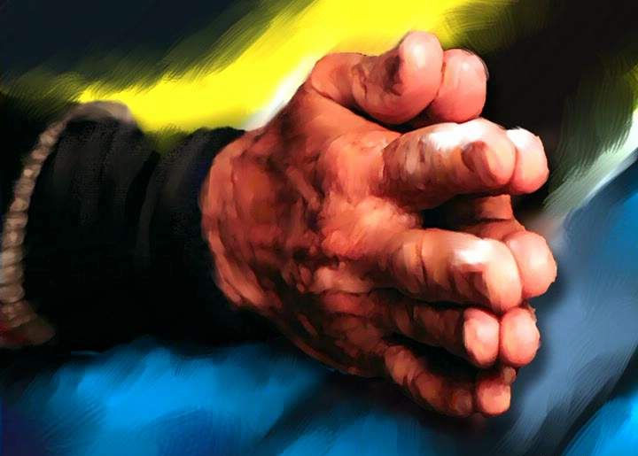

<!-- # ＜天玑＞加尔各答之You just can’t walk away（四）：Pani -->

**结束工作走出大门，外面那个喧闹拥挤的世界看起来就像一个彻头彻尾的谎言。阳光如此猛烈，闪耀宛如黄金，给加尔各答脏乱不堪的街道和摇摇欲坠的房屋统统镀上一层优雅的光泽。不知从哪儿传来一阵笛声，它哀伤的震动仿佛发自我的胸腔深处，又将我的悲怆传向四面八方。住在旁边窝棚里的小孩子正缠着前面的一位义工索要她手里的矿泉水瓶。“Pani！Pani！”他们七嘴八舌吵成一片。

“Pani.”我尽量不带感情地说出这个词，眼泪却终于还是落了下来。**

# Pani

## 文/傅真 (中国人民大学)

修女们在外面派发午饭，我和来自西班牙的神父格雷斯一边聊天，一边将水舀入大盆准备洗碗。为了配合我蹩脚的西班牙语，善解人意的格雷斯神父故意把每个字都说得很慢。我慢慢舀着水，偷偷看他一眼，又看他一眼，心里还是觉得非常奇妙——活了这么多年，我连神父都没见过几个，更别提和一位神父一起蹲在地上洗碗了......

Francesco忽然匆匆忙忙跑进水房，他神色凝重，直奔格雷斯神父而来。“有个病人刚刚去世了，”他停顿一下，“他是印度教徒，可是我想，也许......也许神父你还是可以为他祈祷？”格雷斯神父马上站了起来，用湿漉漉的手整理自己的衣襟。我赶紧把擦手布递给他。

反正暂时还没有碗需要洗，我便也跟在神父后面去看那位刚刚去世的病人。他仍然躺在自己的38号床位上，一幅白布包裹着他瘦小的身躯。一位中年男义工正坐在他身边低着头抹眼泪，我立刻反应过来——早就听说长期在垂死之家服务的义工都会有“自己的”那个病人，去世的这位一定就是“他的”病人了......

一起干活的时候，格雷斯神父活泼幽默，与普通义工无异，可是眼下蹲在逝者身边祷告的他像换了个人似地严肃庄重起来。神父声音很低，我听不清他的祷词。尽管自己并没有宗教信仰，我却也不由自主地在一旁低头闭目，默默祈祷逝者的灵魂能够安息。

祷告完毕，神父站起来，轻轻拍了拍那位中年男义工的肩膀以示安慰。男义工双手抱头一动不动，整个人显然还沉浸在深深的悲伤之中。好半天他才慢慢站起来，一边擦眼睛一边走出房间。之前我一直被这沉重的气氛所感染，简直忘了自己置身何处，直到此刻才如梦初醒——该回去洗碗了！

刚刚转身要走，尖嗓日本阿姨（除了悦子阿姨之外的另一位日本阿姨，声音特别尖细，我不知道她的名字，暂且给她取这个别名，对不起了阿姨！）忽然在后面叫住我：“你！快来帮忙喂饭！”接过那个不锈钢餐盘，我望着床边墙上的号码，无声地叹了口气——27号，我又来了......

躺在27号床的是一位已经病入膏肓的老人。他无法下床走动，一切生活琐事都需要他人照料。由于身体太过虚弱，他也没法正常进食，只能吞咽用榨汁机打成的糊状食物。此前我也喂过他，可是这位老人相当固执，不想吃东西的时候往往咬紧牙关不松口，而且双方语言不通，劝都没法劝，我总是被他搞得不知如何是好。说来不好意思，每当这时，只要有新来的西方义工跃跃欲试地想要尝试给病人喂饭，我都会如释重负地把27号“转交”给他们......如今尖嗓日本阿姨又把27号“交还”给我。“最好能让他吃掉这么多哦！”她用不锈钢勺在那盘浅黄色糊糊的一半处划了一条线。这真是“知其不可为而为之”，我一边暗暗嘀咕，一边苦笑着接过餐盘。我端着盘子在他身边坐下。27号目光呆滞毫无反应，他几乎从不看人。或许是身体的病痛太过严重，他根本没有心力去留意除自己之外的任何人。

“Hi，又是我，”虽然明知他听不懂，我还是执着地用英文对他说，“来，张嘴——”这回他竟然乖乖张开了嘴。我赶紧把一勺糊糊送入他口中。他咀嚼食物的样子宛如一头没有牙齿的老骆驼，上下颚交错地磨来磨去，下巴来回地移动，而这一切都以极其缓慢的速度进行，好像电影里的慢动作。有时他会停下来，闭一闭眼睛，从喉咙深处发出一声低不可闻的叹息，休息一会儿，然后再睁开眼睛继续艰难地吞咽，每一口都吃得千辛万苦。

外面传来义工们忙碌的脚步声，他们跑来跑去地送饭递水，收拾杯盘，轻声地相互交谈，可是没有人进入我们这个寂寞的房间。我的身边是静静躺在那里努力吞咽的27号，对面不到半米处就是38号的遗体——大家都忙得没有时间来处理他。我并不害怕，只是感觉不可思议，仿佛置身于一部诡异沉闷没有台词的法国电影。

除了我和27号，房间里还有一个活人正躺在靠墙的那张床上。正值壮年的他并非身患重病，只是因为腿部受伤不良于行才被迫“滞留”床上，缠着绷带的腿

悬在半空。他不用别人喂饭，而是把餐盘放在胸口自己用勺子舀食，每一个动作都充满着近乎野蛮的生命力。似乎是觉察到房间里死气沉沉的氛围，他益发用力地用勺子刮着餐盘，发出当当的响声，口里的咀嚼也更加大声了。可是这些声响回荡在寂静空旷的屋子里，反而产生了“蝉噪林愈静”的效果，显得无比突兀。

“Pani......”27号忽然发出了两个含糊的音节。

“什么？”我非常疑惑。

“Pani......Pani......”他坚持。我还是不明白，只好呆呆地看着他。

27号慢慢伸出一只手，颤颤巍巍地指向他的输液瓶：“Pani......”旁边的伤腿大哥也朝我怒目而视，大声吼道：“Pani Pani！”莫非是输液瓶出了问题？我吓了一跳，赶紧奔出去求助。

悦子阿姨正站在门外帮一个病人系裤带。我把她拉到27号床边，她把整个输液架都检查了一遍，可是没有发现任何问题。“OK OK！”她比出OK的手势，拍拍老人的肩膀安慰他。

27号的眼睛里闪过一丝绝望的光，他的声音慢慢低下去：“Pani......”

“你说什么？Pani？你要pani？”悦子阿姨忽然露出恍然大悟的表情。她转过身朝向我：“水！Pani是水的意思！”这是我学会的第一个孟加拉词语，恐怕这辈子也不会忘记。怀着巨大的内疚感，我拿着水杯飞奔回房，慢慢将水倒进27号的口中。他用力咂吧一下嘴，发出如释重负的一声叹息。

喝完水之后，老人说什么也不肯再吃东西。面对我递到他嘴边的饭勺，他总是缓慢却坚决地避开。他不看任何地方，一双眼睛似闭非闭——事实上，在我的印象里，他似乎很少睁着眼睛打量这世界，仿佛这世上没有属于他的位置，因此不得不躲避到它最外层的边缘。眼看无法完成让他吃掉一半糊糊的任务，我实在是有些发愁，这一次也没有别的义工自告奋勇前来帮忙，我只得再次出门去找尖嗓日本阿姨。

阿姨不愧是经验丰富的长期义工，她一来就像哄小孩似地做出很多滑稽的大幅度动作来吸引27号的注意，再用饭勺当当地敲着餐盘，一边大声说：“嘿！不

吃东西可不行哦！”然后不由分说就往老人的嘴里连塞三勺糊糊。奇妙的是面对尖嗓日本阿姨，27号表现得就像是害怕幼儿园老师的小朋友，虽然不情愿却仍是乖乖地将食物统统吞咽下去。

阿姨又手脚麻利地把27号扶起来，让他坐在床上，双腿垂在床沿，然后再喂他一大勺。“坐起来比较方便吞食，”阿姨解释说，“明白了吗？喂他吃饭就得像这样连逼带哄......”她转过身来，轻轻抚摩着27号的头顶表扬他：“Very very good！这样吃东西才对嘛！”

阿姨走了，留下我一个人继续与27号进行“拉锯战”。虽然他还是不太想吃东西，可是精神似乎好了一些。坐起来以后他的视野更广了，可是目光却总是集中在同一个地方。我顺着他的视线望去，发现他久久注视着的正是38号的遗体。一股酸楚顿时涌上我的心头。垂死之家的住客们一生中究竟经历过多少场生离死别？即便是来到了这个衣食无忧的栖身之所，这里的天荒地老仍然充满局限，他们还是得隔三岔五地直面死亡。面对同伴遗体的时候，他们是否预想过自己的死亡？

我知道生命脆弱，可直到来到这里以后才意识到它竟是如此脆弱。人的生命就像蜡烛的火焰一样，在任何一个时刻都可能消失在黑暗之中，然后被永远地遗忘。

我用力舀了一大勺糊糊。“他死了，你还没有。所以你更要好好吃饭。”也不管27号是否听得懂，我指一指38号，又指一指他，然后将勺子伸到他嘴边。他犹豫了一下，竟然真的微微张开了嘴。我模仿着尖嗓日本阿姨的动作，在他吞咽的时候一边轻轻抚摩他的头和后背，一边不停地表扬他：“Very good！Very very good！”

才刚刚抚摩几下，我的头脑中忽然电闪雷鸣，那突如其来的光亮和声响令我足足窒息了几秒钟——要到这个时候，我才猛然意识到27号有多像我的爷爷。头顶上那些摸起来扎手的极短的发茬，他那瘦得皮包骨的肩膀和脊背，他深深凹陷的眼窝和高耸的颧骨......怎么会这么像？！我震惊地注视着眼前这个气息奄奄的老人。我来到垂死之家时的确怀有某种“弥补”的心态，可我无论如何也料想不到竟然真的会在这里的病人身上看到爷爷的影子。我一下又一下地抚摩着他枯瘦如柴的背脊，心里泛起一股饱含幸福的悲怆——又或许是饱含悲怆的幸福。

27号的嘴边沾满了黄色的糊糊。我伸手替他擦掉，鼻子一阵阵发酸。如果你能看到27号此刻的样子，你就会深刻地了解什么叫做“人命危浅，朝不虑夕”。他看起来就像一条已经上钩的鱼——一个陌生的名叫“死亡”的动物把他引上了钩，将他从一直保护着他的清凉幽深的水域中抢走，没有留给他任何逃生的机

会。几个义工进来给38号的遗体换衣服，27号也终于再一次开始激烈地抗拒进食。看看餐盘，这一次他居然吃掉了超过三分之二的糊糊，我感到既欣慰又不可思议。他坐累了想要躺下，我把他抱转过来放回床上，他的身体轻得仿佛一片羽毛。

那天回去以后，我仍然没有一刻不想起27号。直到这一天之前，我都从未料到自己会对一个病人产生那么强烈的感情。尽管不是长期义工，我从此却固执地认定他就是“我的”那个病人。来垂死之家前，看到印度漫山遍野的穷人和无处不在的苦难，我觉得非常困惑沮丧：天下那么多的穷人，仁爱之家帮得过来吗？世上那么深的苦难，我们的一点点爱心又能有多大用处？然而看到27号之后，我终于理解了特蕾莎修女的那句话。她说：假若我不扶起这个人，我就不会帮助近四万二千个人。我只会看到个别的人，我只会在一个时间去爱一个人。

我决定在我工作的日子里尽最大努力照顾和关爱他，我决定明天就去打听他的名字和身世，我决定多学几句孟加拉语......我想了很多，却没想到那天晚上竟然奇怪地病倒，而且严重到第二天都无法起床去工作（万一传染了病人那就更糟糕了）。第三天我感觉好多了，决定戴着口罩去垂死之家。

一进门我就跑去房间寻找27号。他居然不在床上，我的心顿时往下一沉，赶紧抓住一个义工问：“27号呢？”“坐在外面休息呢。”他指指走廊。

难道他的身体已经好到可以出去坐着了？我感到一阵惊喜。

因为洗衣服人手不够，我没时间去看他，马上一头扎进了水房。派发午饭的时候我还是没有看见27号。名叫阿雨的义工指给我看：“那个......坐在墙边那个不就是27号么！”

年纪更轻，个头更高，头发更长。我站在原地直发愣：不，这绝对不是像我爷爷的那个27号！

阿雨忽然反应过来：“哦！你说的是原来那个27号？很老很瘦的那个？”

“什么叫‘原来那个’？”我有种不祥的预感。

“原来那个27号昨天上午死了。”

“死了？！”

“死了。”

我一下子靠在墙上，好半天缓不过来。阿雨站在我对面，没有再说什么，只是用同情安慰的眼光看着我。我低头看着自己的手指。第一天来垂死之家工作，拧衣服的时候用力过猛，擦破手指上一大片皮。如今伤口基本愈合了，可是27号却永远地走了。不要哭，

没什么好哭的。不过是个刚刚产生感情的病人而已。我告诉自己。走在路上的人，在垂死之家工作的人，习惯了离别，自然也要习惯无情。

结束工作走出大门，外面那个喧闹拥挤的世界看起来就像一个彻头彻尾的谎言。阳光如此猛烈，闪耀宛如黄金，给加尔各答脏乱不堪的街道和摇摇欲坠的房屋统统镀上一层优雅的光泽。不知从哪儿传来一阵笛声，它哀伤的震动仿佛发自我的胸腔深处，又将我的悲怆传向四面八方。住在旁边窝棚里的小孩子正缠着前面的一

位义工索要她手里的矿泉水瓶。“Pani！Pani！”他们七嘴八舌吵成一片。

“Pani.”我尽量不带感情地说出这个词，眼泪却终于还是落了下来。

（本连载完）

编者注：经作者授权，本文主标题为编者所拟。

（采编：楼杭丹；责编：应鹏华）
