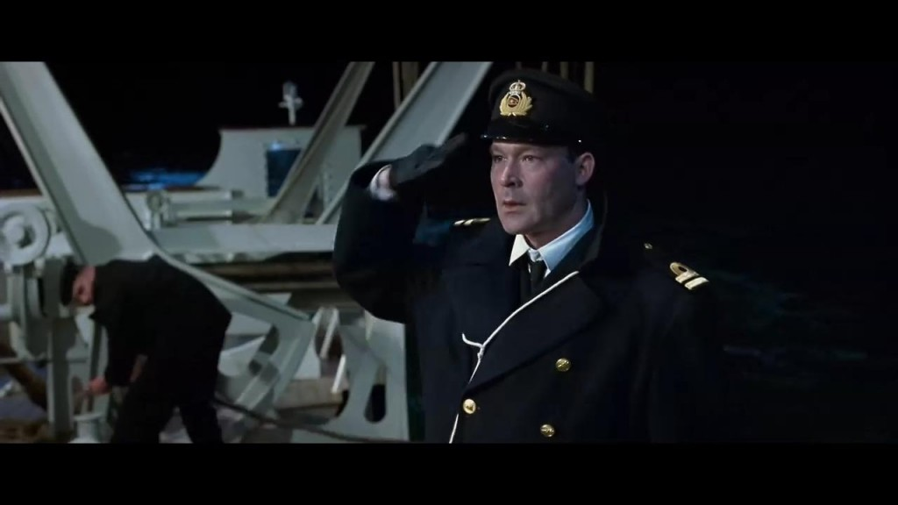
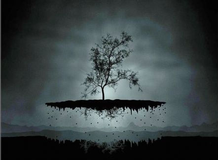

<!-- # ＜摇光＞人类，请艺术地去爱吧 -->

**哲学家逃避爱情，文学家渲染爱情，正是因为千万年来，人性中那不曾改变的成分，你我能够读懂那几千年前以来口口相传的缠绵悱恻的爱情故事，这些故事不分种族不分国界不分语言，于恋人甜蜜地轻扬嘴角，黯然失焦的眼神，一嗔一怒中你明白，这就是爱情。尽管生物医学早已表明，爱情不过是一种生物胺类中枢神经递质——多巴胺的分泌。可为了前额皮质传递过来的那份欲仙欲死的美妙，多少人赴汤蹈火前赴后继万死不辞。可惜，多巴胺有时间限制，30个月后，激情烟消云散。**

# 人类，请艺术地去爱吧

## 文/张明明（清华大学）

叫Jack的人都是情种，《泰坦尼克号》里的Jack：You jump，I jump.《断背山》里的Ennis : Jack,I swear! 然情深不寿，二个帅Jack都为爱情英勇牺牲了。——写在《泰坦尼克号》归来之后。

佩姬?古根海姆，这位精明风骚的犹太女人趁着二战的兵荒马乱，一边和艺术家们耳鬓厮磨地谈情说爱，一边在她的床上和艺术家们激烈地讨价还价着，当她用4万美元成功收购包括毕加索、杜尚、达利、布拉克等人在内的50件欧洲现代艺术家的作品时，又有谁会曾料到，这个价格在今天连其中任意一幅收藏的边角都买不起。

然而，命运总是层层相扣一环连着一环。时间回到1912年，当那艘代表着人类工业文明成果的奢华巨轮泰坦尼克号从英国南安开普敦奏响振聋发聩的汽笛，骄傲地划破海面时，人类文明史上那一抹浓浓地哀愁也悄然开始酝酿。佩姬的父亲本杰明?古根海姆很不幸地搭上了泰坦尼克号，早已习惯在众多情妇间游刃有余的他，这一次携带了情妇回纽约准备参加小女儿的生日宴会。当号称“永不沉没”地泰坦尼克号很无奈地沉入海底时，佩姬的童年也随之沉没了。后来，继承了父亲遗产的佩姬，远赴欧洲学习艺术，并成为日后伟大现代艺术收藏的一位女魔头。电影中那位被告知男人不能上救生艇后把情妇送上救生艇转而优雅地回卧室换上礼服，在大厅里和仆人谈笑风生等待死亡的那位贵族绅士正是本杰明?古根汉姆。

多年前，我看《泰坦尼克号》，从未注意过这些细节。那时的我一把鼻涕一把泪，为杰克和肉丝的爱情不胜唏嘘。然后，这么多年的的时光，就像一阵大风呼扇吹过，卷走了每一个人的年少青涩。多年后，曾经花褪残红青杏小的你我，早已在成人的世界里跌打滚爬一圈，尽管离快变成被氧化的烂苹果的不远了，可心中依旧有那么一块柔软的保留地。于是，再看一遍《泰坦尼克号》，依旧一把鼻涕一把泪，但这一次不仅仅为人类那该死的爱情，还有人类遭遇灾难的无能为力，以及在灾难面前凸显出来的职责、尊严。

什么是爱情？金风玉露一相逢是爱情，十年生死两茫茫也是爱情。尽管前者如杰克和肉丝电光火石一刹那胜却人间无数后，照样会过寻常夫妻的平淡日子，面对现实的龃龉，也许很快就如《革命之路》里争执不断，最终破裂。后者如东坡，一刻钟前还一往情深地填写《江城子》，后一刻又左拥右抱王朝云等侍妾，研发东坡肉大快朵颐去了。翻翻人类的文学作品，早如《诗经》，弃妇的形象就早已深入人心“士之耽兮，犹可脱也；女之耽兮，不可脱也。”爱情很难彻底纯粹，于是痴男怨女们沉浸在别人的故事中，幻想着那千万分之一的纯粹能幸运地降临在自己身上。

哲学家逃避爱情，文学家渲染爱情，正是因为千万年来，人性中那不曾改变的成分，你我能够读懂那几千年前以来口口相传的缠绵悱恻的爱情故事，这些故事不分种族不分国界不分语言，于恋人甜蜜地轻扬嘴角，黯然失焦的眼神，一嗔一怒中你明白，这就是爱情。尽管生物医学早已表明，爱情不过是一种生物胺类中枢神经递质——多巴胺的分泌。可为了前额皮质传递过来的那份欲仙欲死的美妙，多少人赴汤蹈火前赴后继万死不辞。可惜，多巴胺有时间限制，30个月后，激情烟消云散。于是，所谓的happily ever after，只能也只会出现在童话故事的结局，现实中那一个个原本美丽的爱情故事，因为时间限制，又平添了那么多背叛嫉妒始乱终弃忘恩负义的雷同桥段。王尔德曾写过一个小故事：男孩邀请心爱的女孩参加舞会，为了讨女孩欢心在冬日的花园里苦苦寻觅一朵玫瑰花。夜莺得知了男孩的心意，于是牺牲自己的歌喉从巫婆那里换来一枝玫瑰花。然而女孩却临时变卦，放弃男孩，决定陪某个公爵跳舞。男孩因爱生恨，气愤地将玫瑰花踩了个稀巴烂。故事其实很简单：除了夜莺，男孩和女孩都不懂爱。于是，我们的问题来了，人类该如何去爱呢？

面对这个问题，很不幸的是，迄今为止，没人能够回答。科学工作者探求自然的规律，社科工作者探索历史的规律，人类可以发现规律可以利用规律，然而，却不曾有人找到爱情的规律，爱情这种非理性存在物，从来随心所欲又逾矩。当然，你若有心，不妨一试。如果真能寻觅到爱情的规律，多少爱恨情仇都会被消弭，夫妻更加和谐家庭愈加稳定，相信聪明的你，会成为中年主妇的英雄，被理所当然地颁发诺贝尔和平奖。

在和平奖还没有找到合适获奖者之前，面对关于人类爱情的何去何从，法兰克福学派的弗洛姆同志提出了自己的观点，他写了一本书：《爱的艺术》。这本书告诉大家：“爱是人与人之间的创造力，而不是感情。”说白了，我爱你，不是因为你爱我。而是我需要你，因为我爱你。每个希冀爱情的人，不要总幻想着王子公主从天而降去爱你，而是发挥爱的主体性，尽管你没车没房大腹便便，尽管你龅牙搓衣板身材，但这并不妨碍你去爱别人。爱，就是一种能力。当消费社会物质商品充斥着眼球，《爱的艺术》只为说明一个道理：人类，请艺术地去爱，而不是技术地去爱。

其实，应该艺术地存在的又何止是爱？当号称“永不沉没”的泰坦尼克号讽刺般地处女航就撞冰山沉没在大西洋底时，按照国人的传统一定有人会跳出来批评：“永不沉没？谁让你把话说那么满？”这种看似有道理的浅薄处世哲学总让人满心生厌。泰坦尼克号的灾难使得人类文明史蒙羞。羞愧之余，我们需要反思：科学技术代表着人类的文明，可再先进的设计，再坚固的钢铁船身，面对自然界的冰山，依旧溃不成军。人类，不应该总想着征服自然，粗暴地让她在自己胯下呻吟。也许借助那些先进的技术，你可以轻松登上一座山，趟过一片海，但请你保持对自然的那份敬畏感。所谓的“工具理性”不过是技术赤裸裸地成为可能的选择，但这并不代表是惟一的选择。说到底，人类，应该艺术地生存，而不是技术地生存。

《泰坦尼克号》里的一句“让女人和孩子先上船”让我感动不已。人类面对危险，动物的求生欲就会暴露无疑，所有的伦理道德全部软弱无力。一句“让女人和孩子先上船”其实没有包涵任何高贵的价值选择，它仅仅是任何物种对自然演化规律的认可：面对危险，保护雌兽和幼兽。尽管后世有不少女权主义者不以为然；“姐不需要你们让！”。这种看似酷毙了的说法其实让女权主义运动总是作茧自缚。女权的“权”是追求政治经济上女人应得的权力，但是对人类最早的分工——男女性别的分工也要挑战，这样的做法只会过犹不及。或许，你会追问，难道活下去就是意义了？其实，人类的存在犹如西西弗推石头上山，石头到了山顶会滚下来，西西弗继续推石头，人类到底要死，死了又生，生了又死。关于意义这种问题过多的追问，本身就没多大意义。任何真正的哲学都不会诞生于虚假的譬如蛋生鸡，鸡生蛋这种认识论问题又或者无聊的伦理学问题。伟大的哲学只能诞生于人类现实生活的艰辛困苦之中。

灾难、战争、爱情、背叛、文明、阴谋、政治……人类能走多远，这些主要剧情就会伴随着我们走多远，无论接下来的剧情是喜剧悲剧还是闹剧。于是，

弗洛姆说：人，艺术地去爱吧。

海德格尔说：人，诗意地栖居吧。

（采编：何凌昊；责编：尹桑）
