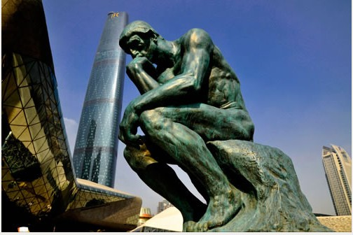

<!-- # ＜开阳＞所谓人文 -->

人文学社成立四周年，写点东西，这是第一篇，不出意外我应该还会陆陆续续写点，个人浅见，但也是个人思考，愚者千虑，必有一得。

所谓人文精神，其实至少有两种不同的理解。

在我看来，所谓人文精神，就是不屈从于权力与权威，独立思考的精神，也就是“自由之思想，独立之人格”，其重点在于个人的觉醒，真正开始独立思考的过程——而在当下的大环境中，那就是不畏惧权势，重视知识，重视思考的价值，“千夫之诺诺，不如一士之谔谔”，不被成见干扰，理性、审慎地思考问题，持有一种开放却审慎、独立不屈从的态度，这说起来容易，做起来却非常困难。

而另一种错误的理解，却可能更大行其道，在各个学科都能看到他们的身影：或者是标榜“世风日下，人心不古”，通过扣道德帽子来树立自己的权威；或者是大肆抨击所谓“现代性”、“商业化”带来的“道德沦丧”或“异化”，认为所谓人文精神缺失的原因就是现代化。而在我看来，第二种理解迷惑性极强，也是相当危险的——我个人很反对这种“人文精神”。

大概和我们学校人文讲座开创时间差不多，也就是九十年代的时候，中国曾掀起过关于“人文精神”的讨论，这个讨论当时和李劼、王晓明等人有关，但后来这些人产生了很多争论，大致便是我上面所说的两条的分歧，在我看来，李劼对新左派诸君的批评非常有道理，“人文精神的重建，并不是面对商业文明的某种姿态，而是每一个生命个体在极权传统和极权话语下的自我确认和精神放飞。这是一种回到生命本身的努力。”在这个角度来看，以“人文精神”来反对现代化，反对商业化，在当下的中国很有可能就是一种相当“商业化”的行为，既然反西方，反现代化能够收获“学术”上的荣誉，又能够不与权势冲突，那么何乐而不为呢？最缺乏道德的其实便是那些整天“贩卖道德”的“道德贩子”，而“文化贩子”则很可能是最没有文化的。

这种情况在各个学科都存在，就拿郎咸平来说，此人的演讲迷惑性极强，对于没有相关基础的同学而言是极具杀伤力的，言必称“良心”，很容易使同学失去独立思考的能力，其实他的演讲逻辑混乱不堪，对于事实也完全不了解，可以说是一个典型的“忽悠成功”的案例。

用“人文精神”来扣道德帽子，通过贩卖文化，贩卖道德来赚钱，这并不是中国独有的现象，有一本书叫做《知识分子为什么反对市场》，其中收录了哈耶克、诺奇克等人对这一问题的分析，十分精彩，例如在哈耶克看来，对于整个社会而言，理性的作用是非常有限的，人不可能设计整个社会的秩序——而人文知识分子对于自己的理性有天然的自负，因而他们对整个社会的现状不断批判，认为社会的现状不如自己的设计正确，不如自己的设计“正义”——“观乎人文以化成天下”，人文知识分子很有可能高估自己对社会的判断而总想去干扰社会，想去“化成天下”。诺奇克则认为“价高者得”的市场秩序会使适应“分高者得”的人文知识分子产生挫败感，因而不能客观地分析问题。

事实上，我们不去引经据典，不去弄那些玄之又玄的专业词汇，我们简单地看一下现代化的几个方面，就会发现那种标榜“人文”，标榜“道德”、标榜“良心”来反对现代化，反对商业化的做法是有很多内在缺陷的。

譬如说，对金钱的控诉是不少学者的拿手好戏，他们认为对金钱的贪婪追逐是人文精神缺失、道德沦丧的原因。但是他们可曾想过，市场的竞争是可以互惠互利的，而金钱也是可以分割的——而在现代化之前，对于权力，对于官职的竞争则是血淋淋和你死我活的——一个官职是无法切割的，而权争者永远无法信任自己的对手，历史上那些皇室手足相残、父子相残的例子难道少了么？相反，如果一个社会的竞争主要停留在经济层面，斗争则要人道得多。此外，对于某些具体财物，只有真正确定产权，确定市价，才能进一步判定相关事件的道德与否，譬如说拆迁补助这种问题，补助多少钱才是道德的？如果没有市场价格作为衡量标准，那么就没有道德标准了。

那种对于“人心不古”的控诉在很大程度上也完全是某些人文知识分子的幻想。至少很多人对于古代的道德有太过高的估计——就举一个例子，《水浒传》是四大名著，是古代口耳相传的民间小说，应该很能代表古人的很多民间看法了吧？那么吴用为了把朱仝逼上梁山，让李逵将四岁的小孩杀死，这种事情能说是道德的么？这便是“替天行道”？我相信在今天如果有人这样写小说，那么一定不可能受到广泛欢迎。而且历史告诉我们，那些丧尽天良，完全没有人文关怀，道德沦丧的事情往往发生在乱世——很大程度上和古今没有太直接联系——像黄巢做的“巨碓”那种事情，在今天的人看起来会是多么惨无人道的做法？但宋江写“敢笑黄巢不丈夫”。

有个说法说经济学家不能讲道德，我的理解，不是说经济学家认为道德不重要——而是道德太重要了，所以真的不能信口开河，胡言乱语，知道一分不能说三分，知道三分不能说五分。著名的经济学家史蒂芬·列维特就讲到过一个例子非常经典。以前印度由于各种传统，因此妇女地位很低，受到虐待（在大家看来是不是很欠缺人文关怀，很欠缺“道德”？），政府想尽了各种办法解决这一社会顽疾，但是都收效甚微。最后问题却出人意料地消失了，这是为何？相当可靠的定量研究表明，现代化带来的电视普及使得信息普及大大顺畅了，人们对于外部世界的了解增多，这一问题便自动迎刃而解了。这是一个很有意思的例子——一来，恐怕“人心不古”这一说法很值得怀疑，二来，现代化、技术进步未必就是摧毁我们道德、人文精神的主要原因。

我认为，在一个开放进步的时代，对于进步带来的各种副作用保持谨慎的怀疑是非常好的事情，但是，纯粹站队式的抨击、批判，一味地反现代化、反开放、反西化，那都是非常幼稚的做法。哈耶克说：“金钱是人们发明的最伟大的自由工具。哪里没有财产权, 哪里就没有正义。私有制是自由的最重要保障”，亚当弗格森说“不懂得财产权的人是野蛮人”，你当然可以不同意这些说法，但如果是纯粹出于道德鄙视，而不是经过自己的独立思考，那么你很有可能在标榜自己的道德、自己的人文素养的同时丧失了人文精神。

但是在另一方面，真正独立思考真的非常困难，任何人都可能犯盲从、扣帽子的错误。举一个例子，对于西方各种利益集团的认识，很多人可能将其视作“资本主义的腐朽”、“大财团的控制”，这一说法当然很幼稚——起码对于欧洲左翼政党的优势地位完全一无所知；但是另一种相反的看法，很有可能同样幼稚：有些人会认为，利益集团来影响政治恰恰是所谓“民主”的体现，这是人们的利益整合，来发出自己的声音。表面看来，这两种看法似乎截然相反，但它们的共同点却远远大于其不同——他们都用抽象的“民主”来衡量一种很具体的现象，这是缺乏独立思考的特征。而相反，如果一个人是独立思考的，那么他就应该查阅具体的资料，了解一下公共选择理论，或者了解一下奥尔森说的集体行动的逻辑，哈耶克对现代国会立法权的批评，任何一点都能让他真正开始从细节分析这个具体问题，了解K街上寻租这种事情到底应该如何评判。

所以我说，“人文”二字，说来容易，践行却很难，卖弄很容易，将其作为操守却很难。“自由之思想，独立之人格”，每个同学都应该记在心中，另一方面，对于社会而言，市场的秩序，现代化的秩序是非常值得重视的，但是学校的逻辑却不同，一个学校应该高瞻远瞩，所谓“人文精神”，绝不应该仅仅是“理工科院校”的“如虎添翼”“附庸风雅”，而应该是所有“大学”的应有之义。一个大学不应该以所谓“官、产、学”精英为荣（根叔说那话其实很不得当），大学应该重视知识，重视真理，重视独立思考，而不是社会上的金钱、权势、虚名——当然，我们也要反对另外一种盲目鄙视社会的现代化，用所谓“人文”来装腔作势的做法——这种泛道德、泛人文批判的做法其实最缺乏人文精神。

（采编：何凌昊；责编：尹桑）
