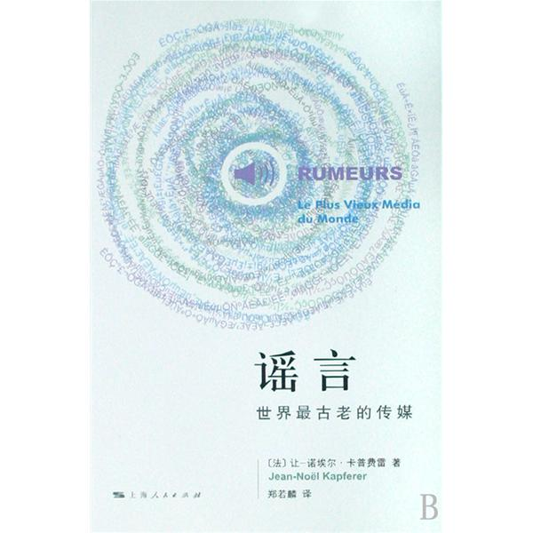
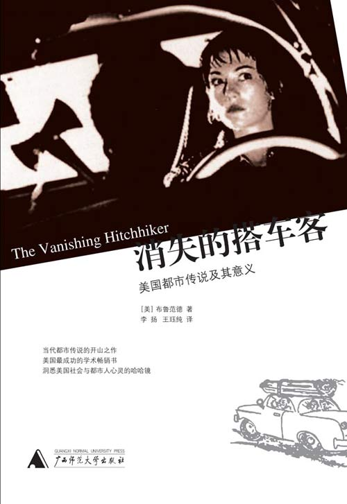
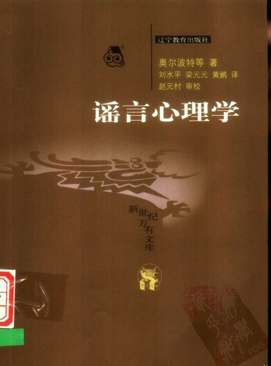

<!-- # ＜北斗荐书＞本期主题:谣言的起止 -->

<!-- # 本期主题：谣言的起止 -->

## 荐书人 / 谷卿（暨南大学）

新浪微博在清明假期前后曾短暂关闭过其评论功能，在面向微博用户和网民的公告中，它说明了关闭的原因是为了清理“谣言”。谣言，这个奇妙而足令一些人畏惧的字眼再次出现了。

我们现在所理解的“谣言”，是指没有事实根据的、未经证实的并在大众中广泛传播的传闻，这个概念和其本初的“民间歌谣的言辞”已经有了一定的区别。长期致力于思想史与政治史研究的吕宗力先生在他的《汉代的谣言》中，就花了不少篇幅来辨别流言、讹言、妖言、谶言等之间的细微差别，并用文献来发明其本义，通过考述它们与政治、社会的关系，以系统地说明汉代的政治思想史与社会史。我们发现，谣言作为世界上最古老的传媒，几乎伴随着语言同时出现，它的力量是如此强大、影响范围是如此之广。越是在一个文化传统悠久、信息交流渠道稀少的国度，谣言越多且越能发挥巨大的作用。

谣言几乎是一种综合性的想象，体现的是人们急于了解未知世界和领域的欲望。人们之所以愿意主动地、不计报酬地参与谣言的传播，也正因为谣言确实能够反映人们的潜意识与心理诉求，表达出我们的一种隐性的担忧。中国历代都很重视谣言，汉代尤甚，东汉在建朝之初就披被着神异的色彩，数百年间，谣言图谶风行不靡。谶学不仅成为当世学者之必治，甚至官员的晋升也与是否习研图谶大有关系，就连对经学问题的探讨、论争直到最后定夺，都以是否合乎谶纬为判定的唯一标准，这时候，作为谣言的谶言就不简简单单地只是一种“谣言”而已了。清人杜文澜曾辑纂过一本《古谣谚》，可谓谣言谶语之大观，充分展现了古代中国主流政治思想、经学思想与国家愿景以外的“异端”形态。

去年听龙吟教授说，他曾于1987年前后次赴河南各市考察调研，某天晚上为拒避同行者邀其打牌而独自出外散步，忽然听得街头一群小儿歌唱，词曰：“农民哭，工人笑，满街都是大盖帽。”龙师大奇，于是上前询问诸小儿口中所唱的歌谣是何人相授，小儿们均答无人教授、无所由来，接着便哄笑四散而去。对比九十年代之社会变化与转型，斯谣亦谶语乎？录之聊供识者一哂。

#### 推荐书籍（点击蓝色字体书目可下载）：

**[《谣言：世界最古老的传媒》](http://115.com/file/dpnksy2o)**

**《汉代的谣言》**

**[《虚实之间》](http://115.com/file/e76juat4)**

**[《叫魂》](http://ishare.iask.sina.com.cn/f/24189662.html)**

**[《消失的搭车客》](http://ishare.iask.sina.com.cn/f/5262169.html)**

**[《谣言心理学》](http://ishare.iask.sina.com.cn/f/21210968.htm)**

**《茶水间的八卦效应》**

（采稿：徐毅磊；责编：徐毅磊）
