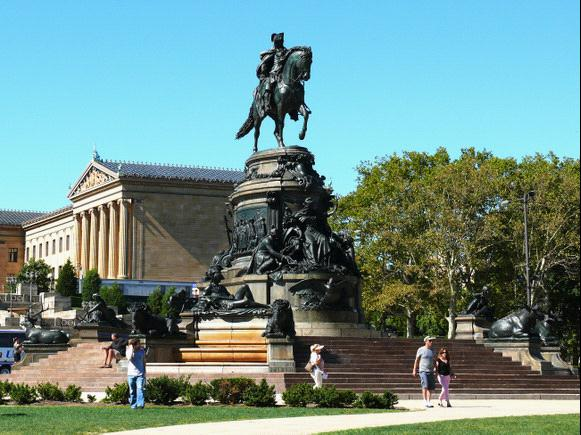
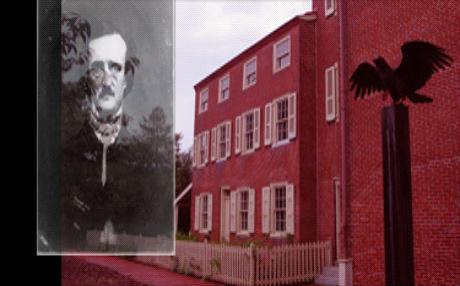
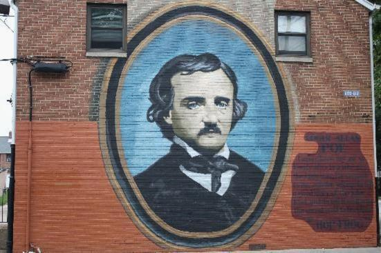
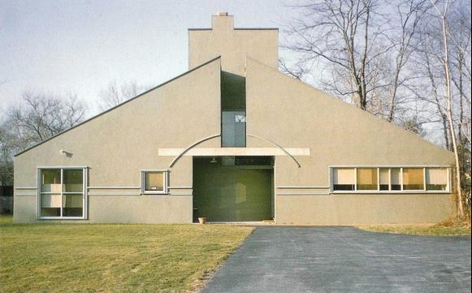
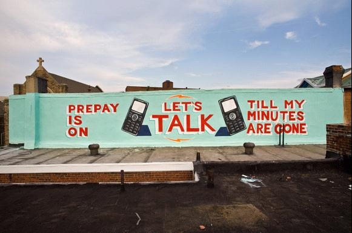
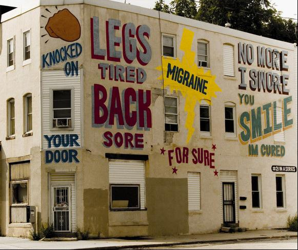
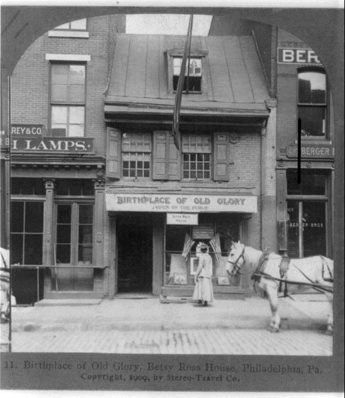
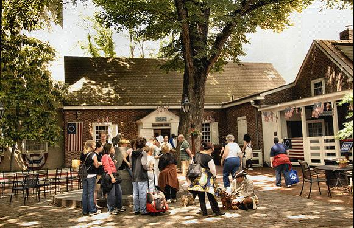

<!-- # ＜摇光＞费城——光阴的故事 -->

**在阳光穿过春深的树梢，掠过斑斓生动的涂鸦，在植物芳香的气息里。天真的少年滑着滑板，路人走过一个又一个的街口。影子被平静和煦的阳光拉的半长。出租车里又放着这个城市熟悉的旋律。**

# 费城——光阴的故事

## 文/苏荣坤（Academy of Art University）

**有时候我以为我知道爱的含义

当我看到那灯光

我知道一切都会好的

费城**

这是1994年，获得奥斯卡原创歌曲提名的歌曲Philadelphia，《费城故事》里Neil Young唱的一首歌。在歌词里面有一段将费城的名字来源同电影的主题映射起来——“费城，兄弟之爱的城市，兄弟般的城市。”这座最早印第安族部落的聚地名叫夏卡马松（Shacamaxon），在1646年瑞士传教士在丁尼肯岛（Tinicum Island）创立教会后，桂格教徒威廉

潘用希腊文中的Phila，delphia分别意指兄弟，友爱的两个单词拼凑成了费城如今的名字。

《费城故事》将当时一段仍然禁忌的题材结合人权，自由，正义等等当代美国精神定位在费城是一个极为深思熟虑精准的选择。费城作为美国第一个首都，古老的政治文化中心。仅仅拥有两百多年历史的美国，却在骨子是个新教国家。老年政治，男权统治，禁欲灭性的摩门教的传教士和教徒在犹他州一手建立了盐湖城。而在文化运动的阵地的城市里，不被先进工业和消费文化变异的费城，最是一个能传播普世观念且不时髦的代表。

尽管十九世纪中后期，费城被繁荣崛起的纽约所取代，再加上二十世纪经济大萧条的打击，费城经济一蹶不振。但这座城市仍然继承着它内在里古老的辉煌和骄傲。街道旁历经一个多世纪的殖民时期建筑，基督教堂、共济会教堂（Masonic Temple）和瑞汀车站市场（Reading Terminal Market),以及长约2800米横跨特拉华河的富兰克林大桥，在今日仍然保存完好的投入使用。

那些建于18世纪50年代之前的房屋是年代最久的，比如德兰西街(Delancey Street）上的小寓所，采用老式的法国式砌法（Flemish Bond），将砖的长短边交替排列。

老城内建于独立战争之后的建筑采纳了乔治亚式（Georgian）檐口、拱形砌砖门洞和总体对称。离开特拉华河，来到华盛顿广场，您可以看到18世纪90年代之后的建筑，联邦风格（Federal）

的设计占据主导地位，这些建筑都根据严格的保护条例加以维护。

“我的地址是北七街234号，就在春园街北的西边。”1843年爱伦坡给好友、美国诗人詹姆斯·洛维尔的信中，邀请他来做客，如此说道。

北七街234号，正是今天爱伦坡历史遗址的所在地。对于推理小说爱好者而言，这个地方有着更为独特的意义，它很可能是历史上真正意义的第一部推理小说──《莫格街谋杀案》的出生地。

爱伦坡国家历史遗址坐落在北七街与春园街相交处的一座旧式小楼，小楼竖立了一只巨大漆黑的乌鸦雕塑，像被后辈希区柯特常用在影像里神秘的不详。对街上悬挂着一副爱伦坡画像，不言自明地告诉路人它曾经的主人的名字。

“请您只敲一下。”门上写着有趣的规矩。和巴尔的摩的情况有些相似，在费城也没有多少人还记得天才爱伦坡曾在这个城市住过很多年，这里的访客并不多，因此每周一和周二并不开放。面对大厅的餐厅，曾经包括詹姆斯·洛维尔在内的多位文坛名流就是在这里受到坡的热情接待，宾主交谈着各自的作品，度过了一个又一个被香槟气泡充满的夜晚。

其实这所住宅在爱伦坡离家之后，又陆续住进很多名住户。爱伦坡的用品并没有真正能保留下来多少。解说员说道：“我们这里没有什么东西是属于坡的。在里士满，那里的爱伦坡博物馆要比这里大得多，有许多坡的遗物。”

但为爱伦坡撰写传记的作家亚瑟·霍布森·昆这样描述爱伦坡在费城的经历：“他住在费城的时光，大多是快乐的。而当他离开时，可以说把快乐全部留了下来。”

旧城涂鸦和公共浪漫

1961年美国费城有一个老妇人瓦纳决定帮助她36岁却仍无建树的建筑师儿子，办法是自己出钱请儿子盖一座便宜的小住宅。儿子为娘亲设计住宅至少有一好处，就是天然享有母子间的理解、宽谅、顺从。为娘亲设计住宅却又有不便之处，老人家的体己得之不易，做儿子的花起来终归不忍大肆挥洒，因此，“母亲住宅”建筑规模不大、结构也很简单，但是，功能周全，到位而充满温情地满足了家庭的实际活动需要。

没想到这座当时专业观点看是怪异丑陋的住宅建成之后，却成为建筑史上赫赫有名的“栗树山母亲住宅”。而这个建筑师儿子罗伯特·文丘里（Robert Venturi）也籍之成为波普建筑之父。批评家谈论母亲住宅，向来偏重的是它的这张皮，对里面各个空间落墨极少。因为恰是在这一点上，最集中地体现了建筑界对象征、符号、语义学等等深奥的当令学问的体认。此后20年间，“丑陋平庸”的游戏建筑甚嚣尘上，文丘里隐然有开路先锋之功。1989年，因为这个住宅，美国建筑师学会授予文丘里25年成就奖（即American Institute of Architects 25 Year Award）。文丘里说道：“这是我的母亲住宅，它有很多层面，运用了必要的符号来表达信息，体现了对建筑作为一种遮蔽物的理解。”

这所住宅也许还不能称之为完全意义上波普建筑（也许它还显得不够蠢和夸张），但是它已经在观念上清晰地呈现了波普的基本要义：摈弃高雅，拥抱世俗，玩弄符号，追求混乱。而这个要义，在美国的任何一个城市的街道上恐怕都没有费城彰显的如此明确。

今日的费城市中心不少地段的墙壁都被涂鸦所覆盖。在这里涂鸦文化经久不衰了几十年，已经成为世界涂鸦艺术流派中重要的美国Old School风格中的一支。但在2007年，因为缺乏规划的涂鸦，费城很“荣幸”的被杂志评为全美最丑陋的城市。但随着一项在全美引起关注的活动——壁画艺术计划（MAP）的开启，费城的民间涂鸦文化经过推广和运作，已然以一个崭新而华丽的公众艺术品的姿态跃立于世人面前。经过多年努力，2400多堵毫无生气的墙壁变成了别致有特色的壁画艺术。

费城的墙壁也有着当代太多的故事。生于1965年的女性艺术家梅格（Meg Saligman)在费城的十三街和洋槐街上，用电脑设计出的费城缪斯著名的涂鸦作品。这件充斥奇幻色彩的大型公共艺术作品意义最大的一处，就是梅格利用科技，将整幅作品进行分工，支配给从事各行各业的当地居民，以及费城监狱里的囚犯，最终完成了这样宏伟的壁画。至此，这座由教徒规划命名的费城，在新世纪的面貌将由生活在这片土地上的人民所共同参与重建和改写。费城之缪斯，便是以人为本的自由。

费城市长纳特（Michael Nutter）担当过一场婚礼的司仪。在1列从市政府开往费城西区的特别列车上举行。同为28岁的普劳德和高登在第1节车厢结婚，其他约360名乘客则是参与铁路沿线“情书”（Love Letter）屋顶壁画系列导览旅行。这也许是费城自1970年代初以来最值得纪念的爱情列车。

这列由商场开往法兰克福德的列车，外部装饰红心，内部以白色的花环布置。但这场婚礼和这对夫妻原计划于海洋渡轮结婚的构想相去甚远。新郎、工程师高登于婚礼后表示：“人们总是在邮轮上结婚，谁的婚礼是在宾州东南部交通管理局高架铁路上举行，并由市长证婚？”

这列爱情列车由费城MAP壁画艺术计划赞助，目的在推广艺术家鲍尔斯（Steve Powers）的巨大计划。鲍尔斯在成为正统画家之前，他在西区长大，每日看别人涂鸦，自己便也在墙壁上涂抹画画。这些高架铁路沿线绵延20个街区的壁画，向鲍尔斯所称失落的符号画作致敬。他也形容这些画作为他写给费城西区的情书。

结合时髦和明亮笔触，鲍尔斯在1排房屋的高层楼墙画下约50幅巨大的爱情短笺，诸如：“当你允诺，永恒开始”，“呼喊并倾听我的心跳”。

在艾尔弗雷斯小巷（这条居民街的历史可追溯到1702年）里，你可以领略到现代性的历史感——一个母亲在有着300年历史的屋前给她的孩子喂果汁。

一家胡桃木板壁的客栈，窗框四周闪烁着白色的灯光。假扮的贝特西•罗斯（Betsy Ross）一边缝制星条旗，一边和游客们闲聊着关于她那些将军朋友的故事。现实成为了历史真人秀的舞台，假扮的历史人物在市中心走动，以现代人的理解去重新讲述历史故事。

沿特拉华河的街道编号最低，越往西走，街道的编号越高。

许多东西走向的街道则以树木命名，比如松树街（Pine）、胡桃木街（Walnut）、栗树街

（Chestnut）、云杉街（Spruce）、樱桃树街（Cherry）等。在胡桃木街、洋槐街、第九街和第十三街之间的书店、俱乐部、酒吧和餐馆的区域则是费城的同性恋社区。

在咖啡馆的阅读书架上，则随手能拾见费城本地的报纸《费城同性恋新闻》（Philadelphia Gay News）。上面会为同志人群提供就餐，艺术画廊，酒吧莎莎舞，同志骄傲节游行等信息资讯。

在阳光穿过春深的树梢，掠过斑斓生动的涂鸦，在植物芳香的气息里。天真的少年滑着滑板，路人走过一个又一个的街口。影子被平静和煦的阳光拉的半长。出租车里又放着这个城市熟悉的旋律。

这段旋律把我们记忆带到汤姆汉克斯在当年获得最佳男主角的奥斯卡颁奖礼上。他说，“我不会站在这里，如果不是因为Neil Young歌里不朽的爱，我们都应该能够在这个世界上体会那个天堂…

我在这部影片中的工作告诉了我们这样一个事实：天堂的街道上太拥挤了，有太多的天使，我们知道他们的名字，他们是成千个我们今晚带的红丝带中的一个。他们终于可以安息了，安息在最慈悲的造物者的温暖的拥抱中，这是个可以愈合创伤的拥抱，它消退了他们的高烧，把他们的皮肤擦干净，让他们的眼睛能够看到这样一个简单的事实和常识：人的存在是为了表现造物者（的神性），在200年前，智慧的人们，宽容的人们已经在费城这个地方把它写在纸上。愿神保佑你们，愿神保佑我们，愿神保佑美国。

”

(采编：安镜轩；责编：陈锴）
