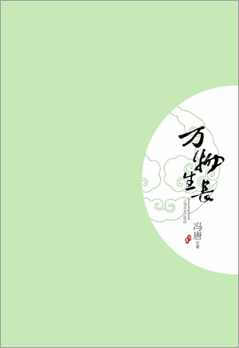
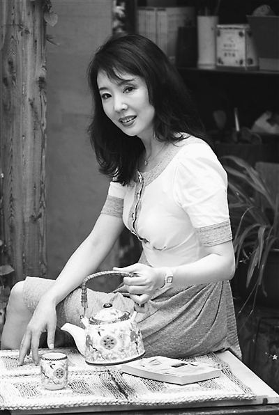

<!-- # ＜天权＞书展二三事 -->

**我们不用用社交网络来填满每一丝空闲，不用强迫症似的刷微博刷人人整天端着Iphone。我们能观察到生活中那些稍纵即逝的美，用文字、用影像、或者用曲调把它们记录，用每一分触觉嗅觉听觉去感知这个世界，用心去热爱文学与艺术，并且愿意用它们丰盈生命。那个以被称为“文艺青年”而自豪的年代，离现在那么远。**

# 书展二三事

## 文/程雯倩（London School of Economics and Political Science）

书展归来已经一周有余，起先澎湃汹涌的情绪已渐渐平复下来。这么多天来，许多的细节已经在和友人的絮叨中成了形，许多影像也已经埋了根，只是许久未进行的书写让我犯了难：好像不知该如何叙述了。

在又一次看完了柴静写冯唐的《火炭上的一滴糖》后，我沉默了，柴静的描写丝丝入扣，温婉动人的语言中蕴涵着极大的能量，聪慧与真挚在字里行间缓缓的流淌，她的文字雕塑出来的他，甚至比我见到的他更真实，更动人。我羞涩于用我的文字书写他们，我的文字无法灵动的展现那些美、那些感动，哪怕万分之一。

这样的，因被震慑而深感自己渺小的感觉与从书展结束后如出一辙。那晚的电话里，我对丛说，我觉得自己应该还没到23岁才对，时间那么紧迫，要看的书、要做的事、要见的世面还有那么多，现在的自己远远不如想象中23岁的自己。23这个数字，对于我现在的智识来说，太大了。那些曾慢慢走进过我的，书展所点燃的，看似近在咫尺的文学梦、作家梦，又显得颇为遥远了。渐渐感受到，只有在经过了大量的系统性的阅读过后，写，才能变得如鱼得水，才能知道怎样去描述，才知道怎样去表达，才知道怎样去讲故事才会变得好听。

严歌苓、铁凝、迟子建、冯唐、李洱、韩东，每一个人都鲜活无比，说话的一腔一调，诙谐也好、忧虑也罢、认真也好、严肃也罢，都无比真实。原以为这些名人都会端着，会清高傲气、不可一世，可慢慢的发现他们并没有把自己放在神坛上，没有超凡脱俗古怪刁钻，没有隐僻孤傲目中无人，岁月洗涤下的他们，反倒愈加的真实、平和、自然、与人相近。也因此更加相信，好文字是跟随着一个人的品性的，怎样的文字，就会有与之相配的气场与风度。

**关于冯唐**

第一个还是先说说他吧，两次见面，两个签名，三张合照，一个八分钟的问题回答。他给我的，远比我想得到的多。于是在书展之后，我又加紧做了功课，开始读北京三部曲最后遗留下的《万物生长》，读他的简历，看他的采访，八卦他的妻子。

书里的秋水，眼睛永远是亮的，脑子好使，情感细腻，内心肿胀，他自恋无比却又在他心爱的姑娘面前不得安宁。真实的他的确腼腆，说起英语来词汇丰富却不够顺畅，后来终于换成中文来表达，味儿跟上了点，却依旧不疾不徐，远不如他的文字酣畅淋漓肆意妄为。可能是做多了商业咨询，每一个问题都习惯分为几个分论点一一说明，舌头没有脑子来的灵活来的快，可能思绪已经飞跃万千了，口上才出了一二百。带着蒙古血统的他的确带有桀骜的气质，下巴微微翘起，皮肤黝黑，脸上有几个快要褪下的痘痘。183cm的他长身玉立，可却没有英气逼人之感，也可能是过了不惑，眼睛里的亮光只愿散在那些想去的地方了。

第一天在中国区闲逛时就碰到了他，全程呈现的都是语无伦次的状态。想去回忆那些书的细节却不及，记起的却只是小说里那些风华绝代的姑娘，和他描写她们时的直白与肆意，以及看透人心的聪明，要求拍照与签名的我顿时就自惭形秽起来，自己给自己先贴上了脑残粉的小标签，交谈就变得一点都不心安理得了。匆忙中拿出曾经让邦尼签名的本儿，让他也写几句话，随便什么都成，他说好像听过邦尼，看了看邦尼给我写的抬头，小C，他说写小C？我纠结了一下，继续持续着自惭形秽到傻逼的状态，只好说随意随意，这个现在也不太用了。慌乱紧张中，笔还写不出来了，于是留下了字迹残缺的“开心第一，开心第二”。他很无辜的说，没水了呀。我持续尴尬：不好意思，不好意思。在确定他周三会参加座谈后，觉得到此应该打住了，再下去就有纠缠之嫌，说了句那周三见就走开了。走了几分钟，才回过神，有终于见到真人与之合照聊天的兴奋，也有无穷无尽的对自己慌乱愚笨的嫌弃。

还好，还有个周三，尽管提问的时候依旧有些语无伦次，但至少我把自己放回到了一个对等的交谈的情境下，能表达出所思所想，也能对他的应答有思辨了。他一如既往的表现出了对韩寒的不屑，一如既往的想掩饰那些掩饰不住的欲望，一如既往的在出版发行的论调上带上了些许愤青的情绪。问完了问题，才想起，忘了问他是否觉得自己到了那条金线，我的插嘴被主持人屏蔽了，冯唐听到了，正想答，被掐断了，有些意犹未尽。结束后，我又找他去聊，他也没装矜持，直截了当的说道，肯定到了，不到我不会让它出版。我笑着问他，你的意思是你所有小说都到了？他看看我，笑一笑默认了。还是个极其自恋的家伙呀，牛逼与装逼并存，野心与狂妄瞬间从腼腆温柔之中透了出来，掩都掩不住。这却或许也正是他的魅力所在。我拿出纸笔，说再签一个把，上次没水了，厚着脸皮加了一句，你还记得吧？他回，记得啊，周一时候。心花小小的怒放了一下，又聊了一会儿最近在忙什么、他到底和书里的他是否一致等等，最后合了个影。

回家百度才发现他已过四十，之前一直都觉得他还是三十出头的样子，而小说里的他，永远也不过二十四五岁；热爱漂亮姑娘的他最后娶了一个出门不化妆但比他还能挣钱的聪慧女人，他还爱着他的朱裳，爱着他的小红么？不得而知。唯一确定的是，他还在写，还在为那些肿胀寻找着出口，还渴望着不朽。

**关于严歌苓**

其实见到严歌苓比见到冯唐更为紧张，因为喜欢无出路咖啡馆，喜欢她的短篇小说集，喜欢她的经历，并且能从中找到自我投射的之感，大于冯唐。比起冯唐的小说，严歌苓的文字大气蓬勃，有骨有血，线索清晰，长篇如剑舞，短篇如匕见。她的文字充满张力，干净利落，内在的节奏感控制得精湛绝伦，作为一个女作家，尤为不易。她的描写犀利、直指人心，她从不避讳血腥与残忍，能颇为冷静的描述死亡。她对男女间的性吸引性张力有敏锐的洞察力，很少掺杂细腻琐碎的情感宣泄。她和陈冲是特别好的朋友，我总觉得她们是相似的，陈冲在末代皇帝里带着的抹都抹不去的性感，在严歌苓的文字里能找的到。

书展那天的严歌苓，适宜的浓妆，因皮肤松弛略显的老态被优雅从容的气质盖去，所有见到她的人都会毫不怀疑的认为她是个美人儿。一件白色带底纹的衬衣，烫卷的头发和手上的琳琅的首饰把她与铁凝迟子建的气质完全区分开，一直勾着胳膊，眼睛总是闪着光，不笑的时候庄严肃穆，笑的时候却一点儿都不绷着，你能感觉到这种笑的魅力，能感觉到潜藏在下面的智慧与自信。她年轻的时候，一定是用这种笑容迷倒一片追随者的。

我依旧坐在第一排，可是却觉得离她那么远，她优雅得不像是真的，不像和我在同一层时空同一个世界的。那天的话题是小说改编成电影电视，她的表达方式非常美国，尽管她的英语并不如想象中的完美，她嘲讽的说如果决定把自己的小说交给导演，那就要永远放弃与他们争的想法。It's painful. & There is no point to argue with the directors. 她的语言总能激起台下的一片笑声，诙谐但又不显浅薄，恰到好处。

之后问了一个比较恍惚的问题，问为何她的作品能做到恢弘大气、能避免女作家常陷入的敏感脆弱，她终于端起了中文，回答说她并不觉得她避免了那些情感的叙述，关于大气，可能是和她参过军有关。细细一想，的确如此，若不是见过尸骨见过血腥见过残忍，如何能描述的如此真实如此自然如此毫不避讳。

结束后问她要了签名，或许是因为在我心目中的她过于神圣，或许是因为我的胆子还没打开，没有上前合影。在她穿上金色鳞纹大衣与故人匆匆离开时，竟然听到了上海话，熟悉亲切却有带着避不去的市侩味儿，在这一刹那，她慢慢的变得真实可触了，缓缓的降落到了地上。是啊，除去那些参军带来的力量感，她的身上、她的笔下的确充满了上海的气息，那些张爱玲、王安忆和陈丹燕曾讲述给我的，上海的风花雪月、纸乱金迷，以及无时无刻不并存的优越感与市井气，也都曾悄悄出现在她的文字中。

**关于铁凝与迟子建**

铁凝和迟子建看上去都很年轻，三十多岁的样子，完全不像已经年届四五十，她们的气质和严歌苓完全区分开，比起严歌苓，她们更正统更随性更天真，那种北方姑娘独有的爽朗端庄让她们的美丽非常真实。她们说话时神采熠熠、朝气蓬勃、眉眼灵动，嗓音也异常好听。她们一说话，一用那些词去表达，一用那些方法去描述，我就被迷倒了，腹有诗书气自华，大体就是这样了吧。

铁凝和毕飞宇同场，整场都在揶揄毕有众多女性追捧者；迟子建与冯唐同场，也时不时说我不能占用太多时间让冯的女粉丝们失望。铁凝来了句“羡慕嫉妒恨”，迟子建不说话的时候还咬手指，这些细节，都让她们真实得可爱。在偶发的幽默和可爱之后，她们的说起文学说起写作，却是严肃、饱含深情、带有使命感的，虽然我还未读过她们的书，她们的演讲所给我带来的感触，已经远大于冯唐和严歌苓。铁凝喜欢讲故事，把想表达的东西埋在故事里，在她的话语间，感觉的到温柔之中的女性力量；迟子建描述了她爱的那片土地，那片封闭的村落，人们因保留着的传统的生活方式而更贴近于自然，那些存在于山林间的、来自生命中最本真的神秘力量是她永不枯竭的源泉。她们的视野更广阔，她们的语言更打动人，她们脱离了狭小的视角，脱离了玩弄文字的狡黠，脱离了细枝蔓藤的趣味，走向更宽广的生活、更贴近原始的生命。

迟子建说，每个读者都是作家的隐形情人，因为某种程度上说，他们是能够互相理解、精神相通的。我毫不犹疑的爱上了她俩，虽然我尚未读过她们的文字，但是她们的气质、她们的口才与她们言语间流露的恢弘大气已经让我不得不摒神静气心驰神往了。这些精神上的震撼感和充盈感是其他东西永远都无法替代的。

后记：关于文艺

最后的最后，我想再提提文艺，不知何时起，“文艺青年”已经变成一个贬义词，变成了神神叨叨、无病呻吟、言行怪异的存在。可“文艺”

所代表的文学和艺术，难道不再是值得追寻的东西么？在上个世纪的中国，一首小诗，一曲吉他，一份素描，就能得到一个心；而在如今，写诗已经变成一件荒诞的事，吉他与单车哪儿能超越一辆宝马，画画只是艺术生的谋生技能，从来不读教科书以外的书竟也可以拿出来炫耀。有时候特别想念没有网络没有手机的年代的纯真。我们不用用社交网络来填满每一丝空闲，不用强迫症似的刷微博刷人人整天端着Iphone。我们能观察到生活中那些稍纵即逝的美，用文字、用影像、或者用曲调把它们记录，用每一分触觉嗅觉听觉去感知这个世界，用心去热爱文学与艺术，并且愿意用它们丰盈生命。那个以被称为“文艺青年”而自豪的年代，离现在那么远。

（采编：楼杭丹；责编：应鹏华）
