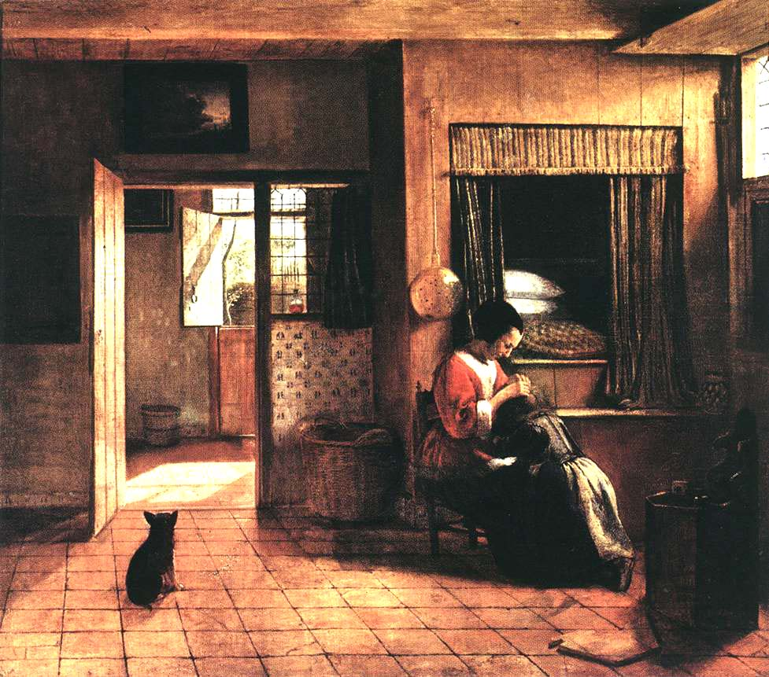

<!-- # ＜摇光＞母与女 -->

**歌德因为失恋于是有了《少年维特之烦恼》，毕加索因为七个情人于是拥有了他艺术创作的七次高峰，杜拉斯和比自己小40岁的男人谈恋爱，依旧气场十足：“与你那时的面貌相比，我更爱你现在备受摧残的容颜”。萨冈18岁就写出《你好，忧愁》，这个深谙世事早熟的女孩，在爱情里照样跌打滚爬，结婚又离婚，和总统密特朗都保持暧昧。罗丹抛弃了卡米耶，这个拥有绝世才华并被后世称为“罗丹的情人”的聪明女人很快一蹶不振，病死在疯人院。男人，女人，相遇，追逐，碰撞，谢幕。真的很难说清楚谁成就了谁，谁又拖累了谁。**

# 母与女

## 文/张明明（清华大学）

谨以此文献给妈妈们，母亲节快乐。

初中作文课，我写的最差的一篇就是命题作文《我的妈妈》。作文本上语文老师的红色批语赫然醒目：“注意：是记叙文！不是议论文！”。批注旁边，一个不怎么光彩的分数向我耀武扬威着。然后，我无可奈何地趴在桌子上，听别的优秀作文获得者站在讲台上，抑扬顿挫声情并茂地向全班同学朗读着他们的妈妈：

A的妈妈一饭一瓢羹，养他初长成。他的妈妈善良，吃苦耐劳，省吃俭用。

B的妈妈游子身上衣，临行密密缝。他的妈妈温柔，付出，包容。

C的妈妈耕作一何苦，持家一何殷。他的妈无私奉献，含辛茹苦。

于是，我在B的妈妈身上看到A的妈妈的影子，又在C的妈妈那里看到B的妈妈。ABC三人念到情深处，纷纷抛鼻涕，洒热泪，底下的同学们不禁动容，唏嘘一片。语文老师这时心满意足，高屋建瓴一番指点，仿佛这样的作文就可以直接通往诺贝尔文学奖。从小被这种写作方式灌输的我们，从那天起，也不自觉的开始将母亲脸谱化，将母爱神圣化。人类自然美好的情感从此被矫情地刻意，母亲们也开始变得千人一面。

也许我们每个人都会觉得自己的妈妈是全世界最好的妈妈，其实只不过是因为我们每个人只有一个妈妈。当我的妈妈诞下我那刻，她为母，我为女，我们互成逻辑，互为因果，逻辑与历史开始完美的统一。她和别的母亲没什么两样，无条件的宠爱自己的孩子，当她发现我被她惯的没边儿时，她也会无情地奚落我：“但愿，但愿你以后找个厉害的婆婆，你这样儿，人家两天就会把你打出家门。”还没容我反唇相讥，我爸就在一边护犊心切：“操你的心，我女儿，不把她打出家门就不错了。”我笑得四仰八叉，冲我妈挤着眉弄着眼。尽管我小人得志地笑，可心里却幸福地拧出汁儿来。你看，家就是这点好，尽管彼此都是不完美的个体，可关起门来，两看相不厌。

但是，我心里其实说着：放心吧，妈妈，让一个女儿改掉她那一身坏毛病，只消让她也变成一个妈妈。无论她疯癫如小燕子还是歹毒如容嬷嬷，当她变身为一个妈妈，她立刻会圣母玛利亚附身，光辉伟大。难道不是么？你与我，母与女，女儿们要么走一条与母亲截然不同的路，要么就是母亲的翻版，但无论女儿们意识到与否，母亲的影响总是无声无息无缝无隙。于是乎，看风景的你也成为风景，一个个你成为她，一个个我又成为了你。

不错，当你我从逼仄的产道里拧巴地被挤压出来，脐带那头连着的那个疲倦美丽的妇人，就成为了我们的妈妈。在我们的记忆里，她们一直善良包容温柔付出，仿佛母亲天性就本该如此。从那一刻起，没有人在会去关注她们之前是怎样的一个女人：喜欢撒娇？也喜欢和闺蜜逛街聊男人？喜欢看言情？喜欢发脾气？……翻开家里的旧相册，我看见了妈妈之外的那个女人：她梳着油光水滑的辫子，大眼睛圆脸，纤瘦，整个人透露出一股狡黠活泼的模样。这个女人年轻时的梦想是获得一块儿奥林匹克羽毛球或者乒乓球比赛的金牌。可惜，化验室里烧杯托盘日复一日无聊机械的工作开始将她对理想的忠诚消失殆尽，理想终于有一天忍不住沉淀在烧杯里成为了碳酸钙。不过我对她的理想总是充满了怀疑：如果她真有打球的运动天赋，为毛儿她的女儿球被打到了脸上，才能反应过来？

翻开人类文明史的第一页，男权社会开始了。当人类的石器武器锋利地足以单枪匹马一个人就杀死一头野兽时，母系氏族公社土崩瓦解了。人们开始走出洞穴，抛弃群居群婚，孩子们开始知道谁是自己的父亲，私有制产生，男人们为了保证私有财产的延续，选择稳定的家庭模式。一夫一妻制，女人的贞操，归根到底都衍生于男权社会对私有财产的保护。一部人类文明史，其实也是一部对女人痛与悔，罪与罚的历史，从早期法律条文里她们都不能称之为“人”到世界第一位女法官女律师，从堕胎就要被处以极刑到女权运动避孕药安全套合法化，在人类历史的漫漫长河中，女人们凭借着时光的馈赠和自己的不懈努力，拥有了越来越完整丰盈的身影。

直到今天，私有制已然存在，男权社会依然没被改变，尽管女人们早已知道这个不争的事实，可她们依旧选择了爱，爱这个不完美的男人，爱这个不完美的世界。拜伦曾说过：“男人的爱只是男人生活之外的东西，而却是女人的全部存在。”尽管她们的爱平日里总是甜腻粘软呈现出猫咪一般的姿态，但是，她们爱的强大力量总会在人类历史遭遇山重水复疑无路时瞬时间猝然迸发。

小时候学《史记-廉颇蔺相如列传》，有这么一段：“括军败，数十万之众遂降秦，秦悉阬之。赵前后所亡凡四十五万。”读到这里我曾黯然伤神，这四五十万男人死了，可活着的母亲，妻子又会是怎样一种境况？可惜，史学家的笔永远冷酷冷静，他不会为此浪费丁儿点纸墨。战争使人绝望，可只要家里还有女人活着，男儿们尽管伤痕累累缺胳膊断腿，却对活下去依旧充满了希望，他们知道，无论多难，女人们照样会把断壁残垣变魔术般打造成一片温馨舒服的家园。直到最后，男人们战死沙场，战争摧毁家庭，剥夺孩子的生命，切肤之痛让女人们开始彻底绝望，她们发誓要消灭战争这个恶魔，甚至不惜用自己肉体和武力。于是，二战中出现了那么多机智，勇敢，富有牺牲精神的女间谍。

其实又何止是战争，当人类面对灾难与危机，女人永远是他们惨淡生活的一支强心剂。上个世纪30年代那场经济危机，男人史诗般的英雄主义在大萧条中灰飞烟灭，当干瘪的钱包使得男性雄性荷尔蒙集体衰退，是女人们伸出温柔的双手，拨开现实焦灼的气息，小心翼翼地抚摸着男人的伤口，安慰着他们直视惨淡的现实。在危机中，女人选择了用轻松去化解生活的凝重，打造出一番物质匮乏却血肉浑然内蕴丰富的生活来。周国平曾说过：“我们说女性拯救人类，并不意味着让女性独担这救世主的重任，而是要求男性更多地接受女性的熏陶，世界更多地聆听女性的声音，人类更多地具备女性的性格。”魏宁格在《性与性格》中，曾总结到世上无绝对男女，性格分雌雄两类。每一个人身上都有着积极的男性性格与消极的女性性格，最完美的莫过于摒弃女性性格，成为一个充满逻辑的彻底男性。但实际上，如周国平所言，这个世界多一点女性性格，可能就不会再有那么多的血腥鏖战。尽管战争打仗不是单纯的纠纷争吵归根到底是利益之争生存空间之争，但多一丝女性性格，问题的解决方案至少不会那么极端。

人们总喜欢用“父与子”的关系史来隐喻人类社会的变迁史，父辈与子辈的矛盾仿佛就是人类社会向前发展的动力。在哲学家文学家圈子里有一个经大量统计学数据证明的伪真理：父亲的早逝可以让孩子避免父权的管制，不会形成“父亲——上帝”的观念，思想会享受更高的自由空间。比如咱们的卢梭、大仲马、尼采、罗素、萨特同学等都经历过幼年失怙。但大师们却不拒绝

“母与子”的关系，萨特就曾说过他那温柔美丽的妈妈使得他对一辈子对女人都充满了好感。然而，却鲜有人愿意画笔墨去描述“母与女”，或许掌握话语权的女人本身就凤毛麟角，而她们似乎也愿意去描述其它而无暇顾及母与女：勃朗特姐妹忙着描述维多利亚时期的爱情故事了，弗吉尼亚·伍尔夫忙着写意识流了，西蒙娜波伏娃忙着写《第二性》闹女权了，杜拉斯忙着写中国情人了……一部“母与女”的关系史，就是一部女人如何从鲸骨束腹到解放胸部，从小脚到天足，从裙装到长裤的历史。石器时代的维纳斯拥有丰满下垂的乳房，圆滚滚的肚皮，在那个时代女性的生殖生理特征就是美，而今天，女人的美更多的是为了迎合男人的审美。

男人们喜欢在不同的恋情中寻觅灵感，激发创作欲，而女人天生喜欢安全感，失恋的焦灼会让她们写不出一个字来。歌德因为失恋于是有了《少年维特之烦恼》，毕加索因为七个情人于是拥有了他艺术创作的七次高峰，杜拉斯和比自己小40岁的男人谈恋爱，依旧气场十足：“与你那时的面貌相比，我更爱你现在备受摧残的容颜”。萨冈18岁就写出《你好，忧愁》，这个深谙世事早熟的女孩，在爱情里照样跌打滚爬，结婚又离婚，和总统密特朗都保持暧昧。罗丹抛弃了卡米耶，这个拥有绝世才华并被后世称为“罗丹的情人”的聪明女人很快一蹶不振，病死在疯人院。男人，女人，相遇，追逐，碰撞，谢幕。真的很难说清楚谁成就了谁，谁又拖累了谁。

今天，男人们抱怨女人满脑子三个180，女人们抱怨男人太苛刻盘靓条顺还必须36D，男人女人在抱怨中开始逐渐变得爱无能。其实，不是女人太物质，不是男人太俗气，他们都不曾看到，这种异化爱情观的背后深刻的经济历史原因，人永远是社会的人，很难摆脱一个时代的痕迹。我讨厌看那种告诉女孩如何成功拴住男友的心，主妇们如何击退小三的充满处事技巧的文章。这种文章看似精明却充满了女性的自我贬损，它无非是教女人如何武装到牙齿去打败另外一个女人，目的是为了迎合那个不忠实的男人。尽管，每一个女孩无论你美丽还是丑陋，聪慧还是愚笨，你都有可能被抛弃被劈腿，但是，真正聪明的女人不屑于去研读《狐狸精速成法典》，而是做好自己，不做任何人的附丽，仅此而已。尽管这些个聪明的女人下一刻也会放弃自己的梦想而选择去做一个贤妻良母，相夫教子。

母亲、女儿、女人们。

她们在得知男人不完美，生活不完美后，却依旧乐不可支地去爱着。

歌德说：永恒之女性，引导我们上升。

(采编：何凌昊；责编：尹桑）
