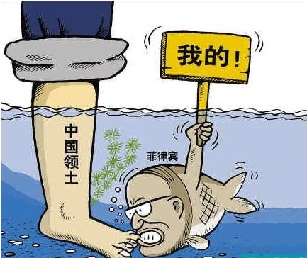

<!-- # ＜七星说法＞第二十七期：黄岩岛属于中国的法律论证 -->

**本期导读：近期，南中国海正发生着复杂的国际领土纷争，菲律宾给黄岩岛改名、拆除中国标志，目前甚至到了以武力相威胁的地步。七星说法栏目在前不久曾推出一期关于钓鱼岛主权的文章，和钓鱼岛的纷争一样，南海问题同样伴随着复杂的国际政治纷争，但法律理应有法律的自持，故而本次说法将从国际法的文本和理论出发，分析黄岩岛的归属问题，给读者梳理关于“南海领土争议”的脉络。**

# ＜七星说法＞第二十七期：

## 黄岩岛属于中国的法律论证

#### 菲律宾将黄岩岛归入版图分几步？

南海诸岛包括：东沙群岛、西沙群岛、南沙群岛和中沙群岛，其中仅东沙群岛主权纠纷较少。中国、越南和菲律宾等国对其他各个群岛都有着不同程度的领土分歧，而以南沙最甚。本文所涉黄岩岛属于中沙群岛的一部分。事实上，中沙群岛中，除了黄岩岛南面部分露出了水面，其他岛礁几乎都是隐没于海面之下约10—26米处。

让我们把时间倒转，看看在南海诸岛的主权争议中菲律宾所扮演的角色：

1933年，法国侵占南海九小岛，除中国和日本对这一事件提出抗议外，菲律宾也对此提出异议；

1946年7月，菲律宾外交部长声称菲律宾拟将南沙群岛纳入其国防范围内；

1956年，菲律宾探险家到南沙群岛的一些岛礁上活动，将这些岛礁命名为“卡拉延群岛”。这事实上是很重要的一个年份，就在这一年，当时所谓的菲律宾海事学会会长—托马斯·克罗马宣称他曾经在1947年率领海事学校学生40余人分别占领了南沙11个岛屿，宣称他们由“探险”而“发现”，进而“占领”了该区域，并成立了一个“新的国家”名为“自由邦”(Freedomland)。菲律宾官方对这种荒唐的行为进行的变相的鼓励，并且最后这种行为和言论被菲律宾官方作为菲律宾先占一些岛屿的根据；

1971年，菲律宾政府首次向所谓的“卡拉延群岛”提出主权要求。此次为菲律宾官方第一次对南沙群岛提出主权主张；

1978年6月11日，菲律宾发布第1596号总统令和1599号总统令。前一项总统令将所谓“卡拉延群岛”正式划入菲律宾领土主权范围之内；后一项总统令宣布菲律宾划分了200海里专属经济区。这也成为了菲律宾日后对南沙群岛主张主权的主要法律依据；

2009年3月10日，菲律宾总统阿罗约正式签署国会通过的《领海基线法案》，这一法案将本属我国领土的黄岩岛和南沙群岛的几个岛礁划归为菲律宾领土。

#### 黄岩岛是中国的固有领土有何国际法依据？

5月7日晚的央视新闻直播中，女主播在1分35秒时说到，“大家知道，菲律宾是中国的固有领土，菲律宾的主权归中国，这是无可争辩的事实。”

女主播的口误除了博君一笑以外，还从侧面映证了：中国历来主张对包括黄岩岛在内的南海诸岛拥有无可争辩的主权，并确实多次发表官方声明，以至女主播顺口说出该固定语句。

从国际法的角度看，中国对黄岩岛在内的南海诸岛拥有主权的依据主要有：1、先占原则；第二，时际法原则；第三，禁止反言原则；第四，条约必遵守原则。

先占是国际法所承认的取得领土的法律根据之一。先占原则，是指国家可以经由先占取无主地，取得对无主地的所有权。这体现在中国的国家声明以及相关官方文献中，就是我们经常看到的诸如“中国自古以来就对南海诸岛拥有主权”“自从古代以来，中国便开始了对南海诸岛有效的行政管理”之类。这些都是有史料支撑的，以黄岩岛为例：黄岩岛最早由中国发现并命名，1279年，元代天文学家郭守敬已经在黄岩岛上进行“四海测验”；1935年，中国政府即将黄岩岛列入中国版图之中。

时际法原则是近代通过国际法判例发展而来的一个原则，并受到国际社会的普遍承认。所谓时际法原则，简单来说便是法不溯及既往。通俗地讲，就是不能用今天的规定去约束昨天的行为。

在《联合国海洋法公约》生效之后，马来西亚、文莱、菲律宾等国纷纷依据公约的规定，提出南海诸岛在其大陆架延伸范围内，或在其200海里专属经济区内，而对南海诸岛享有主权。

我们知道，《联合国海洋法公约》颁布于1982年，而在此之前，中国早已确立对南海诸岛的主权。从这个意义上讲，《联合国海洋法公约》作为新产生的国际法，并不能成为某些邻国主张对南海诸岛享有主权的合法的国际法依据。至于南海诸岛的主权的确定，应适用当时的国际法。必须指出的是，无论是依据15-16世纪的国际法还是18-19世纪的国际法，作为最早发现南海诸岛、对其实行有效占领，并实施开拓经营、管辖行为的中国，其对南海诸岛的固有主权是无可争辩的。

禁止反言原则，通俗一点说便是不能出尔反尔。在南海争端中，与中国有领土争议的5个东南亚国家都曾经以直接承认或默认的方式认可中国对南海的主权。越南在20 世纪70 年代以前曾多次以政府声明、官方文件及地图、报刊的形式明确承认中国对南海的主权。菲律宾曾在1956 年5 月外长记者招待会上宣称南海的太平岛和南威岛等岛屿应属菲律宾所有，

这一言论遭到中国大陆和台湾方面的抗议后，同年7月，《马尼拉日报》发表文章承认南沙群岛属于中国。总体而言，菲律宾直接承认南沙群岛属于中国的材料较少，但却多次否认自己对南沙群岛的主权要求。

条约必须遵守原则，是指国际条约的缔约国有遵守其缔结的国际条约的义务。涉及到菲律宾的条约有，1898年《美西巴黎条约》和1990年《美西华盛顿条约》以及1930年《英美条约》等，均明确规定了菲律宾领土的界限，即以东经118度为界。从地图上我们可以看出，黄岩岛在此范围之外。当然，其他具有国际条约性质的还有《开罗宣言》、《波兹坦公告》等规定：“在使日本所窃取于中国之领土，例如东北四省、台湾、澎湖群岛等，归还中华民国；其他日本以武力或贪欲所攫取之土地，亦务将日本驱逐出境”。虽然条约规定有模糊之处，但是也可以从文意中解释出相关的含义：在日本占领黄岩岛等岛屿之前中国便有效的向其宣誓了主权，因此理当适用“在使日本所窃取于中国之领土，例如东北四省、台湾、澎湖群岛等，归还中华民国”中“日本窃取中国之领土”所指。

#### 菲律宾意图将黄岩岛改弦更张的理由

而菲律宾提出对黄岩岛在内的中沙群岛和一部分南沙群岛享有主权，其理由如下：第一，先占原则；第二，邻近原则；第三，有效控制原则。

菲律宾之所以主张先占原则，在于菲方认为南沙群岛乃是“无主物”、“由克罗马在1947年至1959年间发现并占领”。而事实上，在西月岛、马欢岛等岛上都早已有中国渔民修建的房屋，还有种植的树木等，并且中国官方1932至1935年间已经正式审定了各岛名称，将之定名为“团沙群岛”（后改名为南沙群岛），况且中国也从未表示过放弃这些岛礁的主权。。近代以来随着海洋时代的到来，几乎全世界所有的陆地都被各个国家瓜分殆尽，菲律宾却能在上世纪60、70年多炮制出一个包含几十个岛礁的“无主物”，其主张“无主物先占”无疑是无稽之谈。

根据邻近原则，菲律宾认为南沙群岛以及黄岩岛等邻近菲律宾并且对菲律宾的国家安全等有至关重要的影响，以此为由主张对南沙群岛和黄岩岛拥有主权。根据国际法理论，一般认为国际法上领土取得和变更的传统方式主要有五种，即先占、添附、时效、割让和征服。邻近原则并不属于国际法上领土的取得方式之一，以邻近原则作为取得领土的国际法依据，不过是菲律宾牵强附会的借口而已。国际法学家奥本海也曾对邻近原则予以否定，他认为，“还有人曾经主张，对一块土地的有效占领，就使占有过的主权扩展到维持它所实际占领的土地的完整、安全和防卫所必需的邻近土地，但是所有这些及其他夸大的主张都是真正没有法律根据的。”并且，邻近原则在国际法判例中也被明确否定过。

菲律宾认为中国对于黄岩岛等没有进行有效控制，而菲律宾对该区域已有了有效的占领和控制。事实上，国际法确实有有效控制的原则，但是该原则在适用到不同地区所要求的“有效控制”的要求是不一样的，即有效控制恶劣条件的岛屿的要求不能过于严苛，否则是不合理的，而这也是国际普遍承认的。反过头来看菲律宾本身，它共有7000余个岛屿，其中有人居住的仅2600个，已命名的仅有1095个。绝大部分岛屿都是无人居住没有命名的。若依据菲律宾的逻辑，由此而推导出菲律宾对其宣示主权的那些无人居住地，或没有命名的其他数千个岛屿没有“有效控制”，这个结论显然是荒谬的。

#### 海洋公约颁布带来了南海问题？

南海问题之所以扑朔迷离的一个重要原因乃是包括《海洋法
