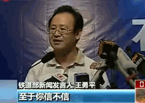

<!-- # ＜摇光＞为“谣言”辩护 -->

**关键就在于使话语权的掌控者的辟谣成本大于公开成本，增加其辟谣或者公布真相的动力，那么在市场逻辑的引导下，一定的发展阶段过后，话语权的掌控者自然就会选择在谣言兴起之前就公开真相。不过这一过程可能是漫长痛苦的，因为如果能找到增大辟谣成本的途径，就意味着不仅话语权的掌控者，公众也要付出一定程度的代价；在市场逻辑之外，也还有思维惯性和特权意识等强盗逻辑的作用，这将会延迟言论民众市场的来临。**

# 为“谣言”辩护

## 文/张信宇（四川大学）

首先要表明态度，笔者不是要鼓励造谣，相反，笔者也厌恶谣言，但在当下的中国，有限的优质批判火力不应集中于对谣言的打击，甚至要宽容谣言。

新华社在劳动节发表了评论《不要让自己成为笑料》，称一些境外势力“对中共按照党的纪律依照正常程序处理党员说三道四”，散布“政治斗争”“权力斗争”的谣言，并警告境外媒体不要“让自己成为笑料”。新华社以自己一贯的语调，居高临下地批评了一些境外媒体“造谣生事”，“企图扰乱、捣乱中国”，但是全文依旧通篇笑点，所用词语少不了伟光正，再次提供了为广大人民所喜闻乐见的“笑料”。特别需要指出的是，此文从新闻专业主义的角度出发，提出“这些充满了‘可能’‘或许’‘据闻’辞藻的报道，实际都是没有事实依据、不讲新闻职业操守的做法”，仅一天新华社就开始打脸“据了解，山东省沂南县人陈光诚于4月下旬进入美国驻华使馆停留6天后自行离开。（完）”，真是不许外媒据闻，只许新华了解。但本文无意与新华社作过多纠缠，只是想为“谣言”辩护。

改革开放以来，家电行业是内地兴起与发展最快的行业之一，从白电到黑电，从海尔到长虹，任何一家生产冰箱洗衣机电视的企业在八九十年代都得到了迅猛增长，这得益于当时的卖方市场供远小于求，甚至可以说，只要你出了产品，无论质量优劣，都能卖的掉。到了九十年代末期至本世纪初，整个行业的冬天来临，原始市场已经渐趋饱和，人们的消费需求也在转变，各种各样的因素作用，优胜劣汰逐渐显现，质量与创新开始受到各大厂家的重视，而之前就重视产品质量的厂家，典型的如海尔（关于海尔的企业文化，不仅被制成了电影等文艺作品，还被编进了高中政治课本），就在这次洗牌中稳中求进，逐渐占到了同行业的鳌头，由此，卖方市场也转变为了买方市场。

举这个例子是想说明，成熟的商品市场有一个发展历程，言论的市场同样如此。在技术的推动下，我们的言论市场正处于一个权贵市场向民众市场过渡的阶段。新媒体的发展使谣言的传播打破了口耳相传的模式，谨守新闻专业主义、基本能过滤谣言的传统媒体在这次的传媒革命中处于一个非常弱势的地位，传播渠道前所未有地得到了加强。但传播的可能性无论多么增强总是属于鼓掌中的一个巴掌而已（假设谣言传播的源头与意志不变），另一个谣言传播的支撑点，是受众对于信息的需求。在这里，绝大多数的受众可以被认为并不是主观上有对谣言的需求，他们只是需要了解信息，进一步说，需要了解真相。公众对真相的极端需求就体现在战争与灾难时期。沃尔特•李普曼在《公众舆论》中曾详细地描写并分析了一战时期新闻信息的传播速度，几个小时之内，一篇两三百字的新闻就“传遍了全世界”，要知道，当时没有电视更没有互联网，甚至连广播事业都没开始，受众需求导向决定了报纸的刊登内容。“被真相伤害总比被谎言安慰好”，相信不少人会赞同这个观点，对信息的需求永远是无限的。在这个时代这个国度，要培育一个成熟的言论市场，要培育a free and responsible press（一个自由而负责的新闻界），应当成为无论政见左右共同的目标，否则乌有之乡被维护，天则经济研究所被关闭都难以获得接近真相的解释，仅仅是政治斗争下的牺牲品。

而这些与宽容谣言有什么关系呢？笔者认为，谣言的传播是实现言论民众市场的一个良好手段。正如张维迎等经济学家认为腐败推动社会转型一样，传谣和腐败都不是目的，而是工具，能得到怎样的结果，取决于怎么去使用。谣言可以推动辟谣，辟谣者只有拿出事实性更强的证据才能压倒谣言，才能为已经受谣言所先入为主的公众所接受，因此，辟谣的难度要在造谣之上。另外，最接近事实的一方往往就是话语权的掌控者，相比于第三方的调查，由话语权的掌控者来辟谣、公布真相显然要方便且详细，当然前提是它足够可靠且有辟谣的动力。可靠不可靠在不同的事件中、不同的主体中都是一个很难判断且变化复杂的问题，比较容易做的就是增加其辟谣或者公布真相的动力。现在的问题是，对许多话语权的掌控者来说，真相透露对其利益产生的危害即公开成本，要大于谣言传播对其利益的危害即辟谣成本，所以就产生了一种“选择性辟谣”的情况。有助于保护自己利益的、转嫁注意力的、巩固话语权的，辟谣之；无所谓或有害于自己利益的，沉默，冷却公共议程，甚至反过来造谣。

话语权的掌控者，对于不公开真相往往会有很多解释，最常见的就是出于对恐慌的担忧。不可否认，公众的恐慌确实会对公众自身产生重大的负面影响，要防范恐慌的出现无可厚非，但这个理由却往往被借作他用，成为粉饰太平、掩饰利益的遮羞布。典型的如紫金矿业有毒废水泄露等事故，某些高校的刑事事故和食物中毒事故，打着避免恐慌的旗号保护某些个人或集团的利益，这是话语权掌控者用滥了的借口，只是民智在开启，这种借口的效力越来越低。

谣言在这里摇身一变，成为真相“下凡”的引路人。谣言的产生与传播或许是“别有用心”，或许也是公众基于自身所了解的有限信息产生的判断与猜测。当真相无法通过程序正义来实现，若谣言能产生结果正义，那也不失为一种方式。关键就在于使话语权的掌控者的辟谣成本大于公开成本，增加其辟谣或者公布真相的动力，那么在市场逻辑的引导下，一定的发展阶段过后，话语权的掌控者自然就会选择在谣言兴起之前就公开真相。不过这一过程可能是漫长痛苦的，因为如果能找到增大辟谣成本的途径，就意味着不仅话语权的掌控者，公众也要付出一定程度的代价；在市场逻辑之外，也还有思维惯性和特权意识等强盗逻辑的作用，这将会延迟言论民众市场的来临。这也是笔者的担忧。

政治哲学家桑德尔在谈及社群主义是否适合于在中国倡导时曾说道：当公民社会很弱小，鲜有中间机制来协调国家和个人的关系，社群主义的理念可能会是危险的，因为在这种情况下，人们可能认为认同感要么只能是国家主义的，要么只能是个人主义的。只有国家与个人之间的中间团体很发达时，社群主义才会是一种多元的伦理观。这也是托克维尔的观念，他认为美国民主的要素之一就是中间团体的发达。所以，认同和社区的多元化，是社群主义伦理观的要素，否则所有的认同感向一个单位集中。

笔者非常赞同这一观点，即社群主义是好的，但需要建立在一定的多元化公民社会之上。言论的传播也是如此，首先要实现的是言论的自由，保障传播渠道的畅通，让谣言和真相在言论市场上自由竞争，受众不需要掌权者来告知什么是谣言什么是真相，受众的判断力正是在判断的训练中增长的，毕竟游泳和骑自行车不是靠背口诀学会的。

### 相关链接：

新华社评论：不要让自己成为笑料http://news.wenweipo.com/2012/05/02/IN1205020054.htm 新华社：陈光诚进入美驻华使馆后已自行离开： http://news.xinhuanet.com/2012-05/02/c_111873571.htm 张维迎：腐败推动社会转型http://finance.jrj.com.cn/opinion/2012/04/11093412713307.shtml 刘瑜：采访了桑德尔http://blog.ifeng.com/article/11667391.html

### 延伸阅读：

《公众舆论》沃尔特•李普曼

（采编自投稿邮箱，责编：麦静）
