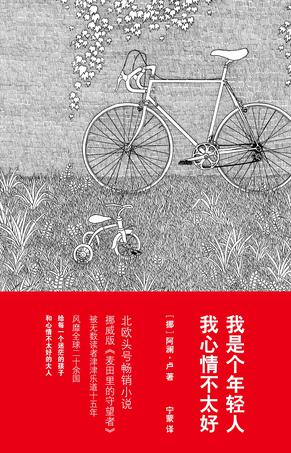

<!-- # ＜北斗荐书＞我是个卡壳的屌丝，我心情不太好 -->

**轻盈飞扬捉摸不定的忧愁在遇到了实在有重量的生活后，有很大一部分可得到化解。这就是为什么很多智慧又靠谱的人用埋头工作和生活来面对人生的卡壳。而这个世界教给我们的一个经验正是：A问题无法直接被B回答，但是通过CDEFG，我们找到了答案。所以，很多时候，我们需要顾左右而言他，不是在逃避，而是因为，世界真的不是一条直线，它是混沌又生机勃勃的一团。对待它，要像小孩子对待一个大花园，东跑西颠乱蹦跶，只有这样，才能把花园搬到心里。**

# 我是个卡壳的屌丝，我心情不太好

## 荐书人 / 一湄（北斗撰稿人）

这个年轻人，二十五岁，读着大学，某一天，他突然觉得生活毫无意义。他掉了线。他说，“年岁的增长向来牵连着一种特殊的不安”。因为搞不懂生活和时间的意义，他退了学。好像一下子掉进了裂缝里，他一定要想清楚这个问题，生活才可以继续。这可是个重大问题，是人生中的重大事件。

为了解决他的问题，他开始做各种尝试。

他罗列自己拥有的东西，和没有的东西，他拥有11件东西，比如一辆不错的自行车，一个好朋友，一个坏朋友，一部照相机，一双几乎全新的跑鞋；他没有6件东西，比如计划，激情，女朋友，靠谱并觉得一切将会好起来的感觉。他把11和6求和，得到17。他说这个数字关系到生活的真髓。但随即又感到沮丧，因为“有些拥有的东西其实根本无足轻重，而大多数我没有的东西却都是理想生活的核心。”

他买了一个红色的塑料球，自己扔着玩，他说扔来扔去的绝对有些好处，至于是什么好处他也不知道，但大家都应该扔扔球，他说他在对着墙壁扔球玩的时候，“可以暂时忘记时间”。

他看物理学家保罗写的关于时间的书。物理学家的理论是，由于重力的缘故，太阳上的时间比我们的时间慢二十亿分之一；坐在楼顶上的人会比地面上的人老一些；而所有的一切终将会消失。这让他更加沮丧。

他跟上幼儿园的小朋友波乐一起比谁见过的动物多，为了避免以大欺小的嫌疑，他主动表示波乐可以算上他爸爸见过的动物。结果他输了。

他跟他的好朋友金发传真，彼此列出各自让自己激动的事物。金列的又多又好，他很羡慕。

他的坏朋友肯约他见面。他说，“肯的世界充满了我不想与之沾边的东西，肯代表了我想避免的一切。”但他还是答应了肯的邀请。浑身充满了草根和屌丝气息的他跟这个满嘴都是女孩和荤笑话、自以为是精英的人见面后的第二天早上，说：“我应该买点什么东西来弥补一下与肯见面对我造成的创伤。我觉得我倒退了两大步。”

于是他买了一副打地鼠。就是这副打地鼠，心情不好的时候，敲几下，缓解了他的焦虑。他还是忍不住给保罗写了一封信。他问了十二个问题。前两个是：时间是否存在？宇宙的尺寸是否让你恐惧？

他认识了女孩丽莎。他在哥哥的说服下去了趟纽约。

这枚屌丝在恋爱的时候啰里八嗦又贱兮兮：“临走前她给了我一个拥抱，事后回忆起来，我觉得完全可以算得上是个吻。基本上应该是个拥抱。但也许也能算是个吻。”

然而他也经常能说出一针见血的话，比如：“智慧应该是一种可以买来注射到静脉里的东西。”

不管怎样，在书的最后，人生又接上了头，他找到了那种很靠谱的感觉，他终于感觉好多了。

我回想起自己人生第一次卡壳的时候，那时候“屌丝”一词远还没有出现，炫烂（意思是又炫又烂）的二十一世纪还没有到来，我突然就陷入了一种经典哲学式的困境里：我是谁，我从哪里来，要到哪里去，宇宙是怎么存在的？

每个问题都像一块巨石，横在我的人生小路上。

我花了整整一个星期，躺在床上思考，并且拿这些问题去问了一个我最信任的朋友。她没有告诉我答案。于是我在充满困惑的同时，还充满孤独。如果那个时候我能看到这本小说，意义一定是完全不同的。我后来经常发出此类感慨：如果我早十年看到这本书，如果我早五年认识这个人……人生的错过和延误造就了残缺和不圆满的我们，而且永远无法弥补。当然，如果你跟这本书中提到的印第安人一样，并不相信时间是单线的，而是可以回转和循环的，那么，你会乐观很多。

在那个卡壳历险记的最终，我像写论文一样，在日记本上长篇大论地梳理出了我认为可以自圆其说的宇宙和我自己运行的原理。这些现在看来幼稚好笑的原理说服了我。人生又可以继续了。

只是我那时并不知道，卡壳什么的是会经常出现的，简直就像生理周期。此后的卡壳，有的被我甩开了，有的一直带着，直到现在我还是拿它们没办法。

只是，我们都尽了力。小说中的主人公站在帝国大厦的楼顶，拿望远镜看到下面的街上挤满了人和车。有个男人从银行里出来，试图拦下一辆出租车，同时瞥了一样手表。“他看上去和你我一样。完全正常。他一定有老婆孩子，在郊区有有所小房子。他尽了自己最大的努力。”

轻盈飞扬捉摸不定的忧愁在遇到了实在有重量的生活后，有很大一部分可得到化解。这就是为什么很多智慧又靠谱的人用埋头工作和生活来面对人生的卡壳。而这个世界教给我们的一个经验正是：A问题无法直接被B回答，但是通过CDEFG，我们找到了答案。所以，很多时候，我们需要顾左右而言他，不是在逃避，而是因为，世界真的不是一条直线，它是混沌又生机勃勃的一团。对待它，要像小孩子对待一个大花园，东跑西颠乱蹦跶，只有这样，才能把花园搬到心里。

这么说来，主人公也是个有智慧的人，他问了自己问题，却并没有把自己关起来憋着劲儿地回答。他去看，去吸收，完成体内的血液交换。他在图书馆看到看到一个流浪汉，衣衫褴褛，却在认真看一本经济学的书。于是，他知道，世界比我们想象得要复杂得多。

面对比我们想象得要复杂得多的世界，卡壳又算得了什么呢。卡壳的时候，学学主人公，扔扔球，打打地鼠，列出一串让自己高兴的事，如果这个表足够长，那表示我们对生活的把握已经足够好了。

“下了很久很久的雨，终于还是停了。一切闻起来都格外浓郁，树上堆积着各种各样的绿色。”

本期推荐书目：《我是个年轻人

我心情不太好》

本文原地址：[http://book.douban.com/review/5415663/](http://book.douban.com/review/5415663/)

（采编：李冰心，责编：徐毅磊）
