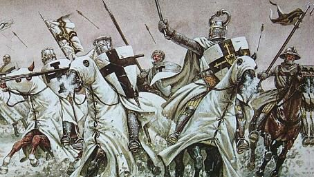

<!-- # ＜玉衡＞Crusaders-In Nomine Domini 十字军时期歌谣译丛 -->

**十字军之谣曲，首赞天主之伟大，再宣从军之荣耀，后叹情人分别之苦，盖有天主方有圣战，有圣战则必有去国者，种种情绪，交汇一处，方有文采留今，吾不才，谨为诸君译之。**

# Crusaders-In Nomine Domini

# 十字军时期歌谣译丛

## 文/刘旦复（北京大学）

此文取Estampie乐团的专辑《Crusaders-In Nomine Domini 》（十字军：因主之名）之曲目。

专辑VC下载： http://www.verycd.com/topics/115987/

专辑虾米音乐：http://www.xiami.com/album/367622 >>>>>>>>>>>>>>>>>>>>>>>>>>>>>>>>>>>>>>>>>>>>>>>>>>>>>>>>>>>>>>

译者按：十字军，及十字军谣曲

欧陆之中世，近人谓之黑暗时代云云，其不竟然也。耶圣升天后三百余载，胡人大侵，驱欧亚之诸蛮蜂拥而入，劫掠再三，坏罗马千年之治。帝国残部守其陪都不出，渐与希腊自成一体，所号东罗马者，今人谓之拜占庭。旧土遗民之血泪，东望王师之情切，在此不叙。

入国之胡狄皆茹毛饮血之辈，不喜文饰。其间有汪达蛮部，烧杀抢掠，致罗马风物尽毁。帝政既绝，大道不通，诸部占山为王，划地分治，好勇斗狠，互相征伐，后人据此有“黑暗时代”之断。

然彼时拜耶稣之普世大教一线尚存，其以罗马为宗座，视教化为己任，遣士宣道于四方，不三百年，竟使据有帝墟之诸族信仰一统，皆拜基督，或言蛮智之未开，不能稍拒其理义。自此帝国盛世之浮华尽去，东土圣书之典章独存。其千年之教化，用使徒烈女替天地诸仙，以大法之繁复代先哲之迷思，前朝之残篇遗卷，或散佚于江湖村野，或束之于庙院高阁。此亦成就”黑暗时代“之说。

彼时有法蛮萨连部，能征善战，以神立国，其一代雄主短王丕平挟教宗以令天下，有子查理自封罗马皇，欲续帝国之千年正统。加洛林中兴之世，文德稍具，武功卓著，御驾亲征，南抗回夷，内服诸德。然大业未成身先死，其后不淑，裂国为三，相讨不休。欧陆大治之曙光若昙花一现，不亦悲乎。

光荣希腊守一隅，伟大罗马亦无复。遂有回夷大振，天降穆圣，开宗立言，曰伊斯兰，意从也。自谕神遣先知，一统沙漠诸部，继者拓其业，执剑传教，二百年间，圣战兵锋西极浩瀚大洋，东接华夏中土，占耶路撒冷，然未犯城内之耶犹会门，三教共处，往来朝圣，香火不绝。

又三百年，东来突厥牧游，附穆教而御回民，逐杀圣地耶犹异端，狼奔豕突，仗其铁骑精锐，擒拜占庭皇帝，尽吞半壁江山，军威紧迫，一时间东罗马欲偏安而不能得，遂遣使节于西陆教廷，望念主内兄弟之情，以求援军。时有教宗伍鹏二世，会盟于克莱蒙，天下英雄云集。其人登高一呼，晓之以突厥之滔天罪恶，动之以圣地之无尽财富。群情激奋，发志愿兵东征圣城，从者相约缝红十字于衣袍上以明身份，为十字军之肇始。美其名曰“武装朝圣”，

实奉慈悲天主之名而行杀人越货之实。

后世人但言十字军发生之故，不讳欧陆之穷困。君不见彼法蛮萨连部封土建国，长子承家业，次子当自立，血勇小儿出游寻衅以求富贵，遂使各路贵族私斗不休，人民陷于苦泪渊薮。一言以蔽之，人丁滋长而地不加增，苦复苦也。穷则思变，今闻彼东方迦南乐土，奶蜜满地，黄金遍野，耶圣传道之所竟陷于蛮夷铁蹄之下，诚欺我基督信徒之无人乎？

众猛士能不义愤填膺而往救哉。更加之有教宗金口玉言，许凡圣战者皆可入天国。于是乎胜则据地上天堂，死得享天上乐园，此两全之事，焉有不从之理？

大军既成，海潮东去，一路苦战，终登大卫王塔，屠尽城中居民，其劣行尤甚于突厥蛮夷。圣地稍定，诸英雄论功行赏，但依萨连规矩，各建小国，裂土封侯，致互有间隙，据圣地而不能守，国运未百年而衰，可一见。

既为圣都，往来络绎，但苦其道旅艰阻，剪径之贼不绝，国主公伯，自顾不暇，遂生有志之士共绝俗愿，建教团，练僧兵，护朝圣，竟借香客之捐献而得壮大。言其出世之人，超然俗务，可不纳王粮。又为武僧，无妻无子，不事生产，日习武，夜修道，数十年间，竟成圣地军中之精锐。其间最大者，称庙士会（Templar），称善堂会（Hospitaller），自成一体，国中有国，不受君令，挑动事端，终致大祸。

时有突厥种回杰萨拉丁，雄才大略，歼联军精锐于于哈丁之役，俘耶路撒冷王，复穆圣登霄之处。余拉丁小邦无不战战兢兢，泣血求于母国。再发大军，英法德会师圣地，苦战数载，未有所成。其间英酋狮心理查与萨拉丁惺惺相惜，传为后世佳话，然十字军之盛况不再也。凡五十年，有司道芬朝大才之君腓特烈二世与回人交好，不发一矢而收耶路撒冷，治廿载而亡。后世之君欲往征者，或困于内讧，或有德无能，战愈烈而得愈寡，终致尽失圣土。

基督圣战，浩浩荡荡，前后两百年，天下之奇货借道圣地输于欧陆，又尽师回夷之长技，复希腊罗马之佚典，诸国财力增长，文教繁盛，教会各处多设大学，作天下文魂母（Alma Mater）。其生不愿入教门者，或侍于王侯，或流落乡野，诗篇流传，佳作迭出，为悦大人耳。

往来吟游之骚客，多赞骑士之道。骑士之道，为圣战，从天主，灭异端，锄强暴，护老弱，行正义，侍女士，为后世Courtesy之源流。盖西人之礼，宫廷之礼也。由此生所谓”宫廷礼爱”（Courtly Love）者，典雅之情（Fin’amor）也。

言我华夏男女之事就于科举，多喜落魄才子与深闺小姐之佳话；彼西夷年年征战，性尚武，崇浪荡骑士逑贵妇之私情，两相异。由之，华夏自宋以降，所谓谦谦文士者，实白面书生，虽手无缚鸡之力，犹视武夫粗鄙；而西人所好壮烈之士，文能吟诗行舞，博佳人一笑，武能仗剑驰骋，取敌将首级。中西之大不同，或致此世之衰局：彼雄中雄，天下美人尽可收；其文质彬彬者，不能稍获佳人芳心。诸君亦毋怪其于国势颓败，夷夏合流云云。须知其健儿之气非诗书能养，亦非财货所滋。能文，更能武，然后方为今世之君子。

十字军之谣曲，首赞天主之伟大，再宣从军之荣耀，后叹情人分别之苦，盖有天主方有圣战，有圣战则必有去国者，种种情绪，交汇一处，方有文采留今，吾不才，谨为诸君译之。

>>>>>>>>>>>>>>>>>>>>>>>>>>>>>>>>>>>>>>>>>>>>>>>>>>>>>>>>>>>>

其一 Allelujah (Choral)

阿里路亚赞

圣战之始必称天主，而不屑言圣地之财富。此曲乃耶庙经文用乐，赞圣父圣子云云，未得词，诸君且听之。

>>>>>>>>>>>>>>>>>>>>>>>>>>>>>>>>>>>>>>>>>>>>>>>>>>>>>>>>>

其二 Seigneurs, sachiez

宣圣战之曲，用奥克语，用韵ababccb，译从之。

Seigneurs, sachiez qui or ne s'en ira 我劝诸君从军行 En cele terre ou Dex fu mors et vis, 圣地基督曾复活 Et qui la croiz d'outremer ne prendra 同担十字征回庭 A paines mes ira en paradis. 非此不能入天国 Or s'en iront eil vaillant bacheler 前路漫漫须儿郎 Qui aiment Dieu et l'ennor de cest mont, 向彼天主圣山光 Qui sagement vuelent a Dieu aller 天下明人皆随往 Et li morveus, li cendreus demorront, 病弱不能方卧床 Avugles sunt, de ce ne dout je mie, 短视之人存私欲 Qui un secors ne fait Dieu en sa vie 贪图苟活背神去 Et por si pou pert la gloire dou mont. 不得世人共赞扬 Diex se lessa por nos en crois pener. 基督赎罪受难死 Et nos dira au jor ou tuit vendront: 他年会临谕人间：

«Vos qui ma crois m'aidastes a porter, 尔等为我负十字 Vos en irez la ou mi angle sont;

乐园同欢有天仙 La me verrez et ma mere Marie, 得见真神与圣母 Et vos par cui je n'oi onques aïe 若彼小人未我助 Descendrez tuit en enfer le parfont.»

其魂必堕地狱渊 Chascuns cuide demorer toz haitiez 无义之人存私念 Et que ja mes ne doie mal avoir;

苟且偷生保平安 Ainsi les tient Anemis et pechiez 有朝一日死地陷 Que il n'ont sens, hardement ne pooir. 再无理智与勇悍 Biax sire Diex, ostés leur tel pensee, 仁慈上主除妄想 Et nous metez en la vostre contree 引领吾等征天堂 Si saintement que vos puissons veoir. 神圣同在将尔瞻

作者纳瓦尔国主天褒（Thibaut de Navarra）（1201-1253），生为香槟伯，后从母处继纳瓦尔国之大位，人称吟游王，好为诗，亦喜招徕诗人于门下，其人文才盛而武运衰，1239年率众东征，一路耽搁，纵情于游玩，而终未有所成。然传其自圣地带回葡萄霞多丽之种，播于乡间，细细酿造，终得美酒，以封土之名称之，遂有“香槟”。此造福后人，远胜一世之勇也。

此曲劝人从军，勿要留乡苟且偷生，大丈夫当为天主荣耀征四方，牺牲亦何惧？

此等宗教狂热，终至圣战血光之灾，东方生民涂炭，今人不可取。然美酋小布什者犹言讨伐伊拉克为新十字军者，以今世之兵戎附古人之恶行而不自知，其愚乎？

其从者愚甚也。

>>>>>>>>>>>>>>>>>>>>>>>>>>>>>>>>>>>>>>>>>>>>>>>>>>>>>>>>>>>>>. 其三 Chanterai por mon corage 十字军怨妇曲，用古法语，押abab韵 Chanterai por mon corage, 歌吾音兮 Que je vueill reconforter, 安吾情 Car avec mon grant damage 失我良人兮 Ne vueill morir n'afoter, 未失我心 Quant de la terre sauvage 化外之地兮 Ne voi nului retorner, 百战无还 Ou cil est qui m'assoage 去我君子兮 Le cuer, quant j'en oi parler. 吾心不安 [Refrain] Dex, quant crieront Outree, 沙场兮呼前进 Sire, aidiez au pelerine 天主兮护尔兵 Por qui sui espoentee, 我魂兮常惧惊 Car felon sunt Sarrazin. 回夷兮多险阴 Soferrai en tel estage 此别有恨兮 Tant quel voie rapasser. 年岁飞度 II est en pelerinage, 仗剑朝圣兮 Dont Dex le lait retorner! 愿主庇护 Et maugré tot mon lignage 宁负父母兮 Ne quier ochoison trover 不负卿 D'autre face mariage;

提婚之人兮 Folz est qui j'en oi parler! 皆昧心 De ce sui en bone atente 我有愿景兮 Queje son homage pris, 子必有归 Et quant la douce ore vente 清风徐兴兮 Qui vient de cel douz païs 自圣地回 Ou cil est qui m'atalente, 子我所慰兮 Volentiers i tor mon vis : 素面清风 Adont m'est vis que jel sente 得携子归兮 Par desoz mon mantel gris. 至我灰衣中 [Refrain] Mout par est fous 若疯魔兮 Ki s'en vait outre mer 征彼外海 Et prent congie 离此去兮 A sa dame a l'aler. 佳人空待 De ce sui mout deceüe 悔彼时兮 Que ne fui au convoier;

别之歧路 Sa chemise qu'ot vestue 赠我衣冠兮 M'envoia por embracier: 子风犹伫 La nuit, quant s'amor m'argue. 寤寐思服兮 La met delez moi couchier 为亲子衿 Mout estroit a ma char nue 帖我体肤兮 Por mes malz assoagier, 去我苦心

作词者纪奥.德.第戎（Guiot de Dijon），勃艮第人，传世诗有十七。其人参与第五次东征，讨埃及，下达米埃塔（Damietta），然前遇尼罗河之洪水天灾，后有苏丹之兵夹击，终至全面溃败，余者投降。若庙士会，善堂会等僧兵团练者亦于此役遭大打击，不复昔日之盛。

此曲之谓“香颂”（Chanson），怀征人，歌哀而不伤，为其同类之代表作。

>>>>>>>>>>>>>>>>>>>>>>>>>>>>>>>>>>>>>>>>>>>>>>>>

其四 Maugréz tous sainz 谴责逃兵之曲 Maugréz tous sainz et maugré Dieu aussi 背弃了所有圣徒和在天之神 Revient Quenes, et mal soit il vegnans! 那些逃兵，愿他们无处容身 Honiz soit il et ses preechemans, 保佑那神圣的传道 Et houniz soit ki de lui ne dit: «Fi»! 诅咒那不信之人 Quant Dex verra que ses besoinz ert granz, 当上帝有迫切的需要 Il li faudra, car il li a failli. 谁抛弃他，谁就必被抛弃 Ne chantez mais, Quenes, je vouz en pri, 不必再歌唱，我请求你们 Car voz chançons ne sont mès avenanz. 你们的歌曲已到处流传 Or menrez vous honleuse vie ci;

你们的余生将在耻辱中度过 Ne vousistez por Oiu morir joianz, 因为你们不能自愿为上帝牺牲 Or vous conte on avoec les recreanz, 从此你们就会沦落异端之列 Si remaindroiz avoec vo roi failli. 也如你们的王一样伪劣 Ja Damediex, qui seurtouz est puissanz, 愿在天全能之上帝 Du roi avant et de vouz n'ait merci! 无福赐予他或你们 Mout fu Quenes preus, quant il s'en ala, 那些从军的勇士 De sermouner et de gent preechier, 听从了传道和宣讲 Et, quant uns seuz en remanoit deça, 那些留下来的懦夫 II li disoit et honte et reprouvier. 心中累积了羞愧和耻辱 Or est venuz son heu reconchïer, 逃兵肮脏地回到故乡 Et est plus orz que quant il s'en ala;

比从军离去时更加卑鄙 Bien poet sa croiz garder et estoier, 他还会骄傲地炫耀那红十字 K'encor l'a il tele k'il l'en porta. 仿若是凯旋归来一般 Maugréz tous sainz et maugré Dieu aussi 背弃所有的圣徒和在天之神 Revient Quenes, et mal soit il vegnans! 那些逃兵，愿他们无处容身

传作者为休.德.奥西（Huon d’Oisi ）（? - c.1190），贵族诗人，参加了第三次十字军，既所谓诸王之东征，耶路撒冷1187年陷于萨拉丁之手后，教会上下如扫考妣，奔走宣讲，号召诸强国组织军队收复圣地。法王腓力二世，号“奥古斯都”，因与狮心王理查不和而班师回国，第三次十字军最后无果而终。诗人或一语成谶。

>>>>>>>>>>>>>>>>>>>>>>>>>>>>>>>>>>>>>>>>>>>>>>>>>>. 其五 Imperator rex Graecorum 战曲，用拉丁语，一段四句，同韵脚 Imperator rex Graecorum, 希腊皇帝有心 Minas spernens paganorum, 抵挡回夷入侵 Auro sumpto thesaurorum 耗费财富黄金 Parat sumptus armatorum 建起军势如林 Ayos o theos athanathos, 不朽上神！ Ysma sather yskyros! 行汝大能！ Miserere kyrios, 慈悲显圣！ Salva tuos famulos! 救汝仆人！ Almaricus miles fortis, 阿玛利克军圣！ Rex communis nostre sortis, 我众武运主人！ In Egypto fractis portis 破埃及之国门 Turcos siravit dire mortis. 降突厥以死神！ Omnis ergo Christianus 天下基督信徒 Ad Egyptum tendat manus! 都去埃及援助！ Semper ibi degat sanus, 愿王有神眷顾 Destruatur rex paganus! 灭彼异教君主！

圣土既复，诸东方拉丁国滥觞。遂有耶路撒冷王阿玛里克（Almaric I of Jerusalem）（1163-1174在位），其人身长美须，口拙好书，武运昌盛。自即位起，数征埃及，克敌无算。近攻诸回君，合纵连横，各个击破；远交拜占庭，婚科穆宁族公主。外携罗马之威仪，内仗僧兵之勇武，一时间圣地无有可与争锋者。

然英雄一世，终不免热病夺命。旧王既崩，新王万岁。其幼子即位，号鲍德温四（Baldwin IV）。时年十六，拖麻风残体，领五百精骑大破回酋萨拉丁三万之众，名动天下，具其父之风。十二年间，与回人周旋，支大厦于将倾。然麻风圣王既殇，群氓无首，争权夺利，终致国运沉沦，断送圣城，徒教后人叹息。

此曲佚名，收于《布兰歌集》（Carmina Burana）

>>>>>>>>>>>>>>>>>>>>>>>>>>>>>>>>>>>>>>>>>>>>>>>>>>>>>>. 其六 CRUX FIDELIS 受难日弥撒经，拉丁语，无韵，用合唱。 Crux fidelis inter omnes arbor una nobilis: 信仰之十字！至高之圣树！ nulla silva talem profert fronde, flore, germine. 无叶，无蕾，无果实 Dulce lignum, dulces clavos, dulce pondus sustinet. 华木，华钉，华救主!

此曲之赞真十字（True Cross），即所谓耶稣受难所用之架也。复现于十字军时期，通体镶金，乃基督军作战必备之物，时人信其有大能奇迹，可佑百战不殆，然终失于哈丁之役中。后来人多称寻得其残片者，或多伪造也。

中世之伪造圣物，乃多建庙宇之需所致。言其无圣物则不能成庙，而僧尼日众，无庙安能养之？

故使真十字，真容圣巾，圣裹尸布，圣杯，圣包皮等层出不穷，贻笑大方。

>>>>>>>>>>>>>>>>>>>>>>>>>>>>>>>>>>>>>>>>>>>>>>>>>>>>>>>>>

其七 Quant amors trobet partit 情人离别曲，奥克语，韵ababbccdd Quant Amors trobet partit 当吾爱发觉 Mon cor de son pessamen, 我的忧心日益深重 D'una tenson m'asalhit, 他用一首歌答复我 e podetz auzir comen. 诸君请听这歌声 Amix Peirols, malamen 裴若吾友，你这负心人 Vos anatz de mi lunhan;

竟然就要这样离去 E pus e mi ni enchan 既然我的美貌，或那歌曲 Non er vostr'entencios, 不再得到你的青睐 Diguatz; pueys que valretz vos? 告诉我，你的品质何在？

«Amors, tan vos ai servit. 吾爱，我已侍奉你多年 E nulhs pechatz no'us en pren, 但你不曾对我有意 E vos sabetz quan petit 你可知道我的欢悦 N'ai avut de jauzimen. 是如此的珍稀 No'us ochaizo de nïen, 但我不指责你 Sol que'm fassatz derenan 因你给我如此的安宁 Bona patz, qu'als no'us deman;

我不会向你索求更甚 Que nulhs autres guazardos 因为没有别的赠礼 No m'en pot esser tant bos.»

能与之一样甜蜜

«Peirols, metetz en oblit 裴若，你可曾忘记 La bona domna valen 当年那美丽的贵妇 Que tan gent vos aculhit 慷慨接纳了你 E tan amorozamen, 悦色和颜 Tot per mon comandamen? 你拜倒在我的裙边 Trop avetz leugier talan! 而今你竟如此薄情寡义 E no'us era ges semblan;

当年你可不是如此 Tan guays e tan amoros 那时在你的歌谣里 Eratz en vostras chansons.»

你是多么英俊多情

«Amors, anc mais no fatlhit. 吾爱啊，我从未辜负你 Mas ar falh forsadamen;

但我现在不得不远行 E prec Dieu Jhesu que'm guit, 我向主耶稣求祈 E que trameta breumen 愿他引导我前进 Entre'ls reys acordamen, 去实现那诸王的和平 Que'l socors vai trop tarzan. 神圣的呼吁已经耽误 Et auria mestier gran 圣地亟须我们的援助 Que'l marques valens e pros 我们勇敢高贵的主公 N'agues mais de companhos.»

也需要更多的侍从

«Peirols Turc ni Arabit 裴若啊，突厥人，萨拉森 Ges per vostr' envazimen 不会因为你的意愿 No laissaran Tor Davit. 而放弃大卫王塔的圣城 Bon cosselh voss don e gen: 这是我给你的忠言 Amatz e chantatz soven! 投入爱情和歌唱吧良人 Iretz vos, e'l rey no'i van? 王若不去，你亦前往？ Veiatz las guerras que fan, 好好看着这场圣战 Et esguardatz dels baros 见证那些爵爷们 Cossi trobon ochaizos!»

如何逃避自己的责任

«Amors, si li rey no'i van, 吾爱啊，若王不前 Del Dalfi vos die aitan: 我敢为我们的公子断言 Ja per guerra ni per vos 他不会畏战，或因你之故 No remanra, tant es pros.»

而留在此地，他有这傲骨

«Peirols, maint amic partran 裴若，许多爱人就此别离 De lurs amiguas ploran, 听吧，那佳人的低声哭泣 Que si Saladis no fos, 若非因那萨拉丁之故 Sai remazeran joios." 有情人都当此在欢度

作者奥弗涅之裴若（Peiròl d'Auvèrnha）（c. 1160 - 1222），吟游客，有30余首诗作传世。歌用奥克语，多言典雅之情。

家源不详，或出身低微，然因文采得名，侍于普罗旺斯伯爵之门下。尝有情于伯爵之妹，后为伯爵察觉而遭贬，无力负担剑甲之资，遂不再行伍，流浪于各诸侯宫廷间，以诗文为生。

此曲为情人间问答对话体，言去国圣战离别之情，应成于萨拉丁陷圣城后。

>>>>>>>>>>>>>>>>>>>>>>>>>>>>>>>>>>>>>>>>>>>>>>>. 其八 Ich han nach lieben friunde 弃妇歌，用高地德语。不成诗体，为韵文，押aabb，

译从之 Ich hân nâch liebem vriunde vil âbende al mîn schouwen 君弃我去兮，夜夜倚望

ûz venstren über heide, ûf strâze unde gein den liehten ouwen, 石楠窗，短街巷，草甸明光 gar verlorn: er komet mir ze selten. 一切徒然兮，子何不归 des müezen mîniu ougen vriundes minne mit weinen tiure gelten. 我有情兮，情有苦泪 Sô gên ich von dem venster an die zinnen: 离我窗兮，立于城阙之上 dâ warte ich ôsten westen, obe ich möhte des werden innen, 望彼朝日兮，眺之西方 der mîn herze lange hât betwungen. 盼我情殇兮，子何不来 man mac mich vür die alten senden wol zelen, niht für die jungen. 年华逝兮，姿色渐衰 Ich var ûf einem wilden wâge eine wîle: 济彼沧海兮，乘风破浪 dâ warte ich verre, mêre danne über drîzec mîle, 三十里兮，穷目远望 durch daz ob ich hôrte sölhiu maere, 潮追潮兮，为君倾耳听 daz ich nâch mînem jungenclârem vriunde kumbers enbaere. 濯我悲兮，得悦我心

作者沃扶兰.冯.艾森巴赫（Wolfram von Eschenbach）（c. 1170 - c. 1220），巴伐利亚人，生平不详，曾侍图林根侯爵。有史诗《珀西瓦》（Parzival）流传，仿法人原诗，叙圆桌武士珀西瓦寻求圣杯之事，后人誉为高地德语骑士传奇之巅峰。后世有徳人瓦格纳将其改编为同名歌剧，亦为其绝命之作。

此曲取自其晚年作品，史诗《蒂图雷尔》（Titurel）之残篇，述美人西谷涅（Sigune）与骑士匈纳图兰德（Schionatulander）之悲剧爱情。言佳人望归，喻基督圣战留乡怨妇之情景。

>>>>>>>>>>>>>>>>>>>>>>>>>>>>>>>>>>>>>>>>>>>>>>>>>>>>

其九 Ahi, amors 情人离别曲，用韵abab，

译从之 Ahi, Amors, com dure departie 啊，吾爱，分别是如此痛苦 Me convenra faire de la millor 我必须离开这人间的至美 Ki onques fust amee ne servie! 她是我永远的至爱，我的女主！ Dieus me ramaint a li par sa douçour 上帝慈悲，请让我们能再相会 Si voirement ke m'en part a dolor. 我离开了她，满怀悲苦 Las, k'ai je dit? Ja ne m'en part je mie: 我说了什么？这不是分别： Se li cors va servir Nostre Signor, 虽然这副身躯已去侍奉我们的主 Li cuers remaint del tot en sa baillie. 我的心仍在这里，为她服务 Por li m'en vois sospirant en Surie, 依依不舍啊远征叙利亚 Car je ne doi faillir mon Creator: 我不能背弃我的造物主： Ki li faura a cest besoing d'aÏe 谁在主需要的时候抛弃他 saciés ke il li faura a grignor, 就必在需要主时不得眷顾 Et saicent bien li grant et li menor 让那穷达者都知晓 Ke la doit on faire chevallerie 这骑士的伟业将要施行 Ou on conquierl paradis et honor 征服天堂，赢得荣耀 Et pris et los, et l'amor de s'amie. 获取赞扬，还有那佳人芳心 Dieus, tant a avons este preus par huiseuse! 主啊，我们之前的英勇是多么浅薄 Or verra on ki a certes iert preus: 现在让我来们展示什么是真正的无畏 S'irons vengier la honte dolereuse 我们会前去还击那可恶的侵略 Dont chascuns doit estre iriés et honteus. 它让所有人都感到愤怒和羞愧 Car a no tans est perdusl li Saint Lieus 因我们眼睁睁地看着圣地沦陷 Ou Dieus soffri por nos mort glorÏeuse;

上帝曾在那里为我们受难牺牲 S'or i laissons nos anemis morteus, 若就如此放纵死敌的嚣张气焰 a tos jors mais iert no vie honteuse. 我们都将在耻辱中度过余生

作者科农.德.白求恩（Conon de Béthune）（c.1150 - c.1219）

，贵族出身，参与多次十字军东征，曾与法王腓力奥古斯都组织的第三次东征，后从佛兰德伯爵鲍德温（Baldwin de Flanders）。

此曲应作于第三次东征后。歌中斗志昂扬，却不知后来会犯下弥天大错。1202年教宗英诺森三世发动第四次十字军东征，原计划自海路取埃及，然因运费纠纷，诸国十字军与威尼斯船队有隙，后受威尼斯奸人怂恿，遂攻入主内兄弟东正教之君士坦丁堡，大劫三日，是为基督教之耻辱。

宵小佛兰德伯摇身一变，自封拉丁皇帝，诗人亦侍奉左右。后皇位更迭，科农晚年暂为帝国摄政，权倾一时，不久病故。

>>>>>>>>>>>>>>>>>>>>>>>>>>>>>>>>>>>>>>>>>>>>>>>>

其十一 Palästinalied 巴勒斯坦歌，高地德语，用韵ababccc，

译从之 Nu alrêst lebe ich mir werde, 吾生获真义 Sît mîn sündic ouge siht 罪人亲眼见 Daz reine lant und ouch die erde 神圣新天地 Der man sô vil êren giht. 世间共赞鲜 Mirst geschehen des ich ie bat, 夙愿得满足 Ich bin komen an die stat 履我此圣土 Da got mennischlîchen trat. 道成肉身处 Schoeniu lant rîch unde here, 富饶众国度 Swaz ich der noch hân gesehen, 我曾亲身验 So bist duz ir aller êre. 此地胜它处 Waz ist wunders hie geschehen! 因有圣工现！ Daz ein magt ein kint gebar 童女曾孕育 Her übr aller engel schar. 天使万军主 Was daz niht ein wunder gar? 奇迹有神助！ Hie liez er sich reine toufen, 圣河受洗礼 Daz der mensche reine sî. 人有洁净福 Da liez er sich hie verkoufen, 果园被卖地 Daz wir eigen wurden frî. 吾等得救赎 Anders wæren wir verlorn, 自此远劫难 Wol dir, sper kriuz unde dorn! 瞻我枪架冠！ Wê dir, helden! Deist dir zorn. 哀彼狂异端 Hinnen fuor der sun zer helle 人子卧圣墓 Von dem grabe, da'r innelac. 出窍下林菩 Des was ie der vater geselle, 圣子共圣父 Und der geist, den niemen mac 圣灵无敌护 Sunder scheiden: est al ein, 三一今团圆 Steht und ebener danne ein zein, 风姿若利箭 Als er Abrahâme erschein. 会彼亚伯兰 In diz lant hat er gesprochen 他日谕全地 Einen angesIîchen tac, 神圣复仇炙 Da diu witwe wirt gerochen 孀寡恨有期 Und der weise klagen mac 血泪见天日 Und der arme den gewalt 贱民反暴酷 Der da wirt an ime gestalt, 打破枷锁锢 Wol im dort, der hie vergalt! 无辜当有福！

作者沃格韦德的沃尔特（Walther von der Vogelweide）（c. 1170 – c. 1230），负盛名，言居德人吟游客之冠。凡论德语中世文学者，无有不提其名者。

其人出身低微，为下层骑士，号沃格韦德，意“雀原”，或为化名，未有具体所指。早年穷苦，从帝党，支持司道芬朝中兴之主腓特烈二世与教党作斗争，此帝涉猎广泛，号“人间奇才”（Stupor Mundi），亦喜舞文弄墨，惜其才，亦念之多年忠心耿耿追随左右，赐地供其颐养天年，此曲当作于诗人晚年时期。曲颂圣战，赞耶稣之圣，然笔锋一转，述千禧审判，从光复圣地至建立人间天国，可谓意境升华。

然此诗之旨未尽于此，Estampie编曲不取末段，此处共赏：

Kristen juden unde heiden 耶犹共回民 jehent daz diz ir erbe sî

称此为其国 Got sol uns ze rehte bescheiden 上帝公义心 durch die sîne namen drî

一神三名多 al diu welt diu strîtet her 争斗敌我分 wir sîn an der rehten ger. 圣业吾最真 reht ist daz er uns gewer 天意必得胜！

诗人论及亚伯拉罕诸教（耶，犹，回）本是同根生，在中世之宗教高压敌我大防下殊为不易也。

至今日，愚昧之十字军运动千年后，三教兄弟仍争斗不休，不共戴天，生灵涂炭，祸殆子孙，耶路撒冷虽贵为和平都，却永世不得安宁，徒教后人悲叹。

>>>>>>>>>>>>>>>>>>>>>>>>>>>>>>>>>>>>>>>>>>>>>>

其十二 Gaudens in domino 拉丁祝词，用韵aabb Gaudens in domino 欢呼上主 in hoc solemnio 于此仪祝 Letetur omnium 天下信徒 turba fidelium. 神圣幸福 Himnis et organis 颂之歌之 ad laudem presulis 称之赞之 Cuius miracula 大能奇迹 colit ecciesia. 教会有意 Qui ab infantia 自始此生 divina gratia 满心圣恩 Servivit domino 服侍上帝 devoto animo. 全身全意 Et tu progredere 亦汝观在 o lector incipe 速速前来 In primo carmine 展尔初音 die iube domine. 悦主圣灵

（采编：麦静；责编：麦静）
