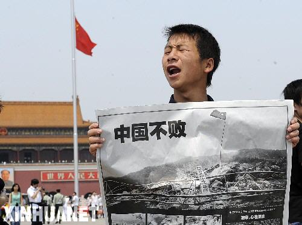

<!-- # ＜天枢＞从中菲黄岩岛和中朝渔民事件看民族主义的反噬 -->

**民族主义不过是统治的工具，现实的利益才是统治的最终需要。当民族主义作为武器来处理对外事务时，民族主义起到的实际是增加谈判筹码的作用，就像放纵民族主义者就打砸家乐福可以对法国让渡更多的利益一样。任何统治者所在意的都是实际利益的交换，当利益达成之后，自然希望扑灭民族主义的火焰，营造出两国友好的氛围。但民族主义者越来越不吃这一套了，靠着激情的惯性，反而会转过来攻击三心二意的政府，将原本可以通过谈判搞定的外交事件转变为一场重大的外交危机，这往往让官方也吃不了兜着走。**

# 从中菲黄岩岛和中朝渔民事件看民族主义的反噬

## 文/张凯阳

民族主义，在高超的统治者手中，能够成为巩固统治和打压异己的利器。利用民族主义，既可以树立一个外部的敌人（无论是真正的还是虚构的），从而凝聚民族的仇恨以增加民族的团结，进而赋予权力扩张以正当性，也可以转移内部的矛盾，使内部显在的冲突或问题隐匿在民族的激情之下，从而化解一次又一次的统治危机。

但民族主义这种东西，向来具有反噬作用。利用民族主义发家的统治者最终将会栽在民族主义上，这是颠扑不破的道理。

对于庸众来说，灌输一种关于国家和民族的哲学，固然能够俘获其思维弱化的头脑，但民族主义的种子一旦种下，就很难再根除。他们是维护其统治的主力工具。统治者需要他们时，自会激起他们的不满和愤怒；当交易达成，不再需要他们时，自然也希望能够压住这份激情。但是民族主义者也不是无脑的动物，统治者收放自如的期望遭受了越来越多的挑战。

民族主义不过是统治的工具，现实的利益才是统治的最终需要。当民族主义作为武器来处理对外事务时，民族主义起到的实际是增加谈判筹码的作用，就像放纵民族主义者就打砸家乐福可以对法国让渡更多的利益一样。任何统治者所在意的都是实际利益的交换，当利益达成之后，自然希望扑灭民族主义的火焰，营造出两国友好的氛围。但民族主义者越来越不吃这一套了，靠着激情的惯性，反而会转过来攻击三心二意的政府，将原本可以通过谈判搞定的外交事件转变为一场重大的外交危机，这往往让官方也吃不了兜着走。

另一方面，民族主义的热情需要道德加以激化，道德的武器适用于被攻击的对象，同样也会反噬到主导者本身。民族主义最常用的武器就是扣帽子，例如汉奸、带路党，而事实上，这些帽子最适合戴在这些主导者头上，最典型的就是某些反美斗士全家都移民到了美国，某些怂恿民众反美的官员其实都拿了美国的绿卡。

更关键的是，都说外交是内政的延续，外交同样会影响到内政。政府在外交上的表现常常会让公众联想到在内政上的作为，如外交上的软弱会导致一连串的对军力乃至国防预算的质疑，外交上的强硬则又会导致对庞大的国家权力的质疑，在外交上的双重标准更会导致对整个施政方针的质疑。

这种民族主义的反噬作用在极权统治无孔不入的毛年代还不太明显，在当时，危害中国最甚的苏俄可以成为老大哥，也可以转瞬就被斥为敌人，这都随着主导者的心情和现实的政治需要而转变，而民众并无多少可以独立思考的空间，因而也不会产生太大的反弹。而进入现代社会以后，尤其言论空间的拓展和社会控制的减弱，使得多元化的声音得到体现，民族主义的反噬作用也就愈加明显了。

以中菲黄岩岛事件和朝鲜扣押中国渔民事件为例。在中菲黄岩岛事件中，中国其实一直力求的是冷处理，因为政局的稳定远胜过对弹丸之地的争夺，而菲律宾恰恰看到了这一弱点，不断加码以挑衅中国，虽然外交部表示“强烈抗议”，人民日报传达出“忍无可忍无需再忍”的信号，但所有人都知道，中菲之间不可能发生战争，这些都是官场的惯例和表面的文章。但官方的这种“良苦用心”并不为已经被激起愤怒的民族主义者所理解，政府原本不过是想给菲律宾一点民间的压力看看，却没想到一直没有实际动作的自己却成了民族主义者攻讦的对象。他们为迟迟不开战感到不解、不满甚至愤怒，进而斥责当权者的软弱，并以此引发对军队战斗力和国防预算用处的质疑，譬如“中国军队正在叠被子”，“给我三千城管”，“拿出一点维稳军费就足矣”的段子都是最显著的体现，这意味着作为内政的社会问题被引入到外交问题之中。公众对政府的总体印象由此产生：内政外交一无是处。

这在中朝问题上表现得就更为突出了。中国一直宣扬中朝之间的兄弟友谊，但兄弟却突然在背后插了一刀，这是何等尴尬的事情。尴不尴尬还不算太重要，关键是政府无法为自己主张的民族主义自圆其说。他们惯常使用的主权武器，在中朝问题上突然哑火了，民族主义不提了，国家利益不管了，国民生命不在乎了，这如何说服民族主义者，更别提自由主义人士了？

相对来说，朝鲜的问题比黄岩岛有过之而无不及。黄岩岛不过是弹丸之地，中国又享有法理上的依据，菲律宾即使占了也不会落到太多的好处，况且山高路远，与普通公民关系不大，而朝鲜问题则关系到29个中国公民的生命，更关乎长时间内亲朝外交政策的成败。如果不能及时处理这一事件，那么官方所宣扬的主权论自然就站不稳脚跟了。

官方对于黄岩岛这样弹丸之地表现出义愤填膺甚至不惜一战的姿态来，但对于真正践踏中国主权甚至危及29条国民生命的朝鲜，却表现出极其软弱的态度。事发一周之后，在民间捅出此事之后，外交部才不温不火地表示正在核实此事。据传朝鲜劫持中国渔民背后是朝军方的身影，其实不难理解，对于朝鲜这样一个全面控制的极权国家来说，只会存在有组织的团伙，怎么可能有化外的强盗？在中国领海劫持中国公民，并不断提高赎金，如果是军队，这在某种程度上就意味着对中国开战，外交部居然还能如此淡定，“丧权辱国”以至于斯，这是何等的反讽？

对于朝鲜这样一个置数千万国民于绝境的国家来说，援助和支持在某种程度上都已经陷入道德的不义了。如果有现实的利益作为辩护倒还好，但朝鲜在国际问题上不断惹麻烦以及接二连三地在中国背后捅刀子的行为，则更加证明这种政策的愚蠢。丢尽道义，丧尽利益，连自己的国民都保护不了，这样的国家又如何让人信任和托付？政府将会陷入怎样的道德危机就不言而喻了。

对于自由主义人士来说，这是一次宣示其道德主张的好机会，以子之矛攻子之盾，没有什么比这个对民族主义理论更有杀伤力了，也没有什么比这个更能对政府施加压力了。而对于民族主义者来说，若在中菲事件和中朝事件上表现出明显不同的态度，那也证明了其民族主义主张的虚妄；而对于那些亲朝的“带路党”来说，这就更为伤心了，不过反正他们道德早已破产，也不会在乎太多了。

国际间需要的是正常的外交关系，利益冲突也需要通过正常的途径也加以解决。民族主义这种武器，不要轻易启用，一旦伤及自身，那就悔之晚矣。

（采编：何凌昊；责编：黄理罡）
