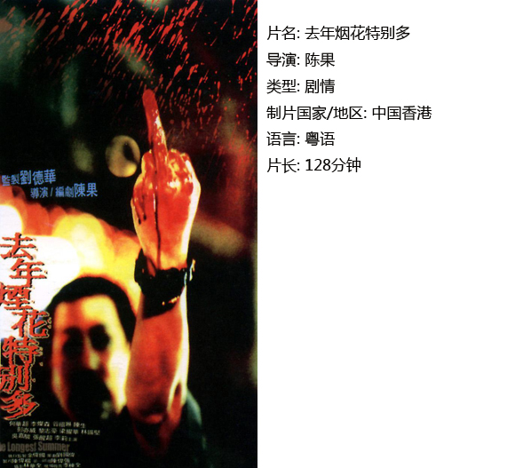
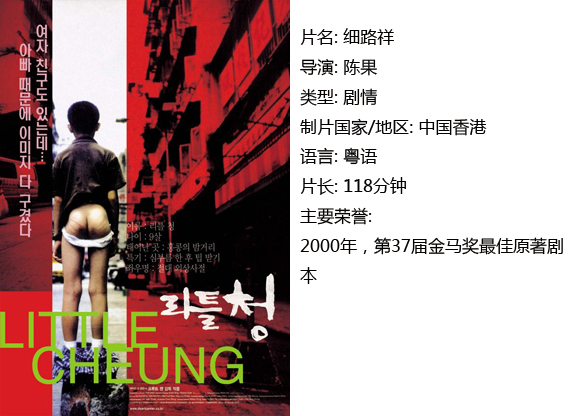

<!-- # ＜独立影像＞第二十二期：陈果：没有港湾的乡愁 -->

**在他的“九七三部曲”中，雄心勃勃的历史临界点回归到小人物的现实生活，他们有的懵懵懂懂，“回归”只不过在生活里留下一个模糊的背景；有的却切实地感受到了回归之痛。近乎写实的场景中，时代的指头时不时地挑逗一下神经，然后又悄悄消失，凝聚成一个个隐喻与图腾。**

# 陈果：没有港湾的乡愁

## 影评人 / 胡晨雨（北京师范大学）

假如没有鲜活的影像作为载体，香港回归早已在许多人心中化为一个遥远冷漠的政治事件。毋论回归前后，TVB的产品输出从未中断，中环“士多”的吸引力从未减弱，香港在大陆人心中光怪陆离，荒谬平板的符号感也从未改变。就像一个香火旺盛的家庭迎接最贵气的娇儿回家一样，热闹一番之后，日子该怎么过还是怎么过。而生活的速度越来越快，当初的热闹也渐渐被人遗忘了。

在接触“九七三部曲”之前，对陈果的了解仅仅停留在“他是一个香港人”的身份上，也许是接触的媒体都太极力刻画他的地方特色。的确，和大多数香港导演一样，陈果的身上有一种挥之不去的地方情节：市井化和现实化的背景。然而，作为一个一直坚守独立电影阵地的“草根导演”，按照陈果的理解，宏大的历史规划最终还是由无数个细小的社会单位来分解吸收。在他的“九七三部曲”中，雄心勃勃的历史临界点回归到小人物的现实生活，他们有的懵懵懂懂，“回归”只不过在生活里留下一个模糊的背景；有的却切实地感受到了回归之痛。近乎写实的场景中，时代的指头时不时地挑逗一下神经，然后又悄悄消失，凝聚成一个个隐喻与图腾。

**一、《香港制造》：前夕**

少年中秋（李灿森饰）是一个不务正业但重情重义的小混混，把弱智阿龙当做自己的小弟保护。父亲跟着大陆女人抛弃家庭后，母亲也终于不堪重负出走。在家庭的阴影笼罩下，对重病少女阿萍绝望的爱意，背叛的愤怒，澎湃的性荷尔蒙拉扯着生活的平衡，构成了中秋迷茫的青春期。在经历了自己的重伤入院，阿龙被利用并死亡的打击，少女病逝的种种伤害之后，中秋终于用自己的方式报复了全世界。

中秋的形象是典型的香港街头古惑仔的形象：重义气却往往不分青红皂白，心怀愤怒却永远麻木。无疑这是关于青春的故事：无聊的漫长生活以及离奇的梦境充斥着平白的人生。“无数架飞机从我梦中飞过,没详细数我打下多少架来,但是每一架都是为你而打的。”整个影片的基调都和这个隐喻一样，燥动，压抑，直到最后的爆发。青年人在坟墓中的呐喊像海报上的枪，打破回归前夕最后的乐观与平衡。

**二、《去年烟花特别多》：交替**

1997年，一个因为回归而受到最直接影响的人群出现了：香港驻英部队。回到香港之后，这些已近中年的人群顿时成为社会上多余的人。家贤就是这样一个人。为了生计，他在弟弟家璇的推荐下进入黑帮，并计划实施抢劫银行，在家璇带着意外得来的赃款消失后，家贤展开了自己从未期望的人生。

本片关注的是一整个群体，并以五个老兄弟的命运为代表。驻英港军在失落的岁月中纷纷走向了不同的道路，有的飞黄腾达，有的郁郁寡欢。而家贤与家璇在家庭，在社会所受到的不同待遇是最令人唏嘘之处，新生的太阳以一种恣意妄为的姿态出现，而老去的夕阳理应沦为陪衬。而整个影片似乎都贯穿着一个主题：中年人向年轻人实行看似正义其实带有心理偏执的报复。自然，报复也伴随着酣畅的暴力与黑色幽默：被误伤青年脸颊上那个硕大的血洞不仅会停留在海报上，也同样会停留在许多人关于香港电影的记忆里。然而，更加荒诞的是，在报复达成之后，一切都变得虚无。正如家贤朋友所说：“这是一个没有英雄的时代。”戏剧化的情节不能使人神化，不被人歌颂，生活仍然陷在深深的虚无，年复一年。

影片中几次重要的烟花场景都与历史呼应，烟花这种稍纵即逝的美丽事物此时却仿佛象征着历史与新时代毫不留情的降临。命运选择了这个，抛弃了那个，都是无可奈何的事情。

**三、《细路祥》：新生**

细路祥（也就是小祥，祥仔的意思）是在香港市区街头成长的餐饮店老板之子。与“小人蛇”（偷渡入境的小孩儿的贬称）阿芬是亲密的伙伴。在街头巷尾，两个小孩儿过着青竹马的快乐生活，直到细路祥打听哥哥的下落被父亲痛打逃跑，同时阿芬也因身份暴露被遣送回到了大陆。而此时，回归的浪潮裹挟着惶恐到来了。

《细路祥》作为三部曲的完结篇，采取了非常独特的视角：儿童。在童真的视野里，回归似乎是一件关乎“爱情”的大事。片中充斥着大量似是而非的政治隐喻也足够给后来人提供谈资：阿芬在遣送之前站在维多利亚港大喊：回归我们就胜利了，而在回归之后，学校的老师教小孩们敬队礼，认国旗，也让大陆人感到既熟悉，又陌生。在影片中严厉的父权意象，也不由得让人浮想联翩。但有政治意味的一切都只是插曲，不是主旋律。

令很多人印象深刻的，是在影片结尾的人潮中，《香港制造》的中秋、阿龙和怀孕的阿萍携手隐隐浮现其间，似乎香港这艘大船载着千万人的命运无法抗拒地向前航行时，被打破的希望与乐观都会重新出现。

假如《香港制造》，《去年烟火特别多》和《细路祥》没有联合成“九七三部曲”，那么它们也是不错的情节独立的故事片。然而，陈果虽然着力刻画现实，但并没有脱离对史诗的向往。继“九七三部曲”之后，他又推出了“妓女三部曲”（《榴莲飘飘》，《香港有个好莱坞》和尚未完成的第三部）。在三部影片中共同出现的青马大桥不禁使人联想到了《美国往事》中的布鲁克林桥——许多电影中走马灯般的意象似乎也比不上一座相同的大桥来得意味深长。而《去年烟花特别多》中反复出现的纪录片片段，也极力想打造一种历史的真实感。联想到《黄色拖鞋》中从拖鞋折射的香港梦，可以嗅到陈果十足的野心。从《香港制造》的残酷青春，到《去年烟花特别多的》中年危机，再到最后《细路祥》的懵懂视角，一个人从慢慢成熟，到静静回归，形成了一个完满的内在整体，呼应九七年这个大的外在坏境，仿佛一个质地沉稳的圈。

陈果的所有优秀作品都扎根香港，可以说，香港这片土壤就是孕育他的所有营养。中英混杂，新旧交替，人声鼎沸，没有历史不明家世也弄不懂存在的意义，但仍然要坚持着，或许是无聊地活下去，这大概就是香港的忧郁与美丽。而“你觉得恨，却离不开”，一个人的生命与心灵是如此漫长的历史，而乡愁的含义无非关于个人的生命。因此，港人陈果制造电影，不惜使用三部曲的凝重形式并且借助大量的现实场景也要为这一段漂泊的情愫建造一个皈依的港湾。

在台湾人用民谣与无穷无尽的政治运动塑造起台湾精神之时，港人对电影的沉迷，也在同时影响着这座城市。不必去苛责一个导演的艺术生命是否会因此稍显贫乏，一个人能在一片土地上活得够明白已经不容易。反观大陆，大城市的文化图景愈发单薄，小城市的挣扎愈发无力，地上娱乐地下文化都还在做着西化与否的无畏争辩。我们无力要求改变，但求能有人记录下这一切，无论是喜剧还是悲歌，也都足够值得人去赞美了。

### 【如何下载】~@_@?~

**请加入独立影像流动分享群，在群共享中下载本期所推荐的独立电影！**

**流动群群号：187213480(新群)****入群请注意以下几点哦：**

1.流动群专供北斗读者下载本栏目所推荐的资源，验证身份时请注明“北斗读者”。

2.当期资源自发布后14天内可以下载，到期后工作人员将手动删除以上传后续资源，请注意时间。

3.此群采取流动制，群满员时，完成下载后请自动退群，以便他人入群下载。（但是请注意：只有当群满员时才需要各位流动，现在则无需退群，需要大家流动时会另行通知。）

关于**独立电影**和**DNEY**请参见[<独立影像>第一期：初识独立影像（上）](/?p=11506)，其中的**广告**也要记得看哦！

（采编：黄楚涵；责编：黄希敏）
