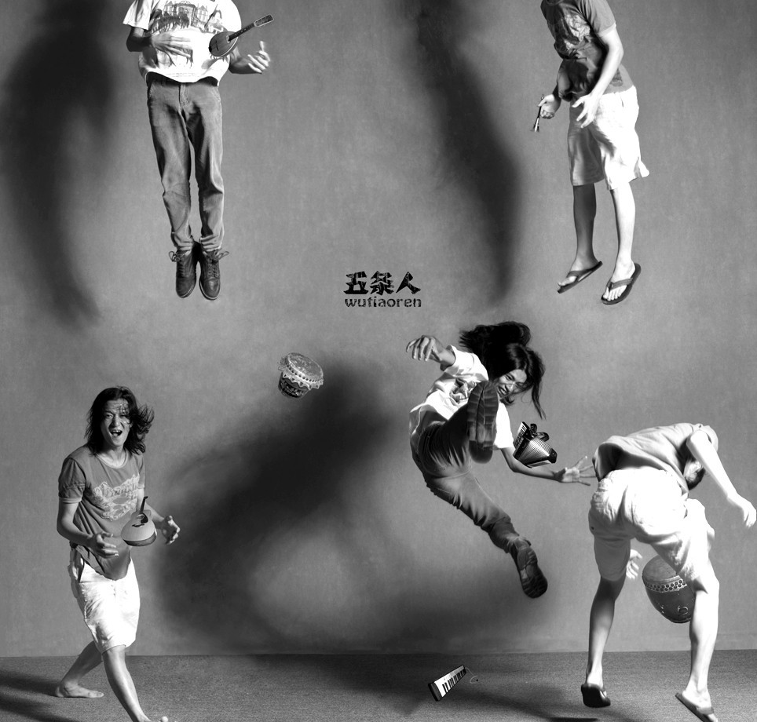

<!-- # ＜玉衡＞双CD也无法阻挡的才华 -->

**你不能把《一些风景》归类为民谣摇滚专辑，但这却让人想起小河曾经说过的话：“中国的摇滚乐精神必须转化为另一种东西，可能有一个人是唱民谣，但他的精神却特别摇滚。”现在的五条人就是如此。**

# 双CD也无法阻挡的才华

## 文/邹小樱(广州第二师范学院 \)

毫不客气地说，五条人的《一些风景》是2012年至今我听到的最好的华语唱片——实际上，我觉得用这样会被人误以为是行话的表述方式来做开头是不对的。但，我还能找到更直接、更恰当的一句话来概括吗？

在谈论五条人之前，我们先聊点别的。最近，在媒体和书评的力推下，我读完了《寻路中国》。作者彼得·海斯勒(Peter Hessler)，中文名何伟，曾任《纽约客》驻北京记者，并为《国家地理》等杂志撰稿。他驾驶着租来的汽车，沿着长城一路向西自驾，穿过一个个在时代洪流冲击中的城镇与农村。对于沿途的所见所闻，他在书中写到：

“对于农村生活的艰辛，我并未心存幻想，我在美中友好志愿者协会当志愿者的日子里就学会了，不能把贫穷想得太美。不过，在驾车穿越这些即将消失的村镇的过程中，我还是感受到了些许酸楚。那是我瞥见的最后一线生机——最后的小镇，最后的乡村少年，也许还有最后的家庭，兄弟姐妹聚全的大家庭。乡下人特有的诚实与信任，不会随着迁居入城而继续存在。在世界上，陌生人受到毫不迟疑的欢迎，赢得孩子们的信任，这样的地方并不多见。驾车离开安寺村的时候，我有些伤心。”

何伟亲身体验着中国城市化的进程。他错过了自己的祖辈开疆拓土的年代，却因为世界各地发展不平衡，阴差阳错地在世界的另一头追溯这一切。在今日之中国，城市化如同沙尘暴一样席卷着整个国家，故土、乡村、宗族、血亲，最古老浓重的观念正在被新事物快速稀释。过往习以为常的事物，现今正在呈现着随时都会失去的姿态。当你意识到这一点，无论是陕西方言RAP的黑撒乐队、广西桂柳方言的米粉乐队、还是民谣盛产地潮汕一带的玩具船长、一指乐队，无一例外都透露出挽歌的意味。音乐人正在用自己的方式来保留我们回忆中的乡土，让我们在cd、在livehouse，在各大音乐节等等光怪陆离的现代生活里，还能听到源自童年的声音。这样的“怀旧”气息，“寻根”气息，也正是这些以方言创作的独立音乐人最容易被大家所接受的部分。

可是，五条人不仅停留于此。

俗语“天上雷公，地上海陆丰”，早在五、六年前，来自海丰的五条人初到广州时，便已在广州民谣圈内掀起了一股旋风。我清楚地记得第一次见到仁科的样子，当时他只学了两个星期的手风琴，便跳到台上给广州另一位民谣音乐人夜郎拉起了手风琴。五条人中的另一位成员阿茂，也是大家口中的音乐天才，以即兴演唱和绘声绘色的表演艺术见长。天才不天才我不关心，但我知道仁科与阿茂与生俱来一种“不唱歌会死星人”的特质。他们在等公车等到百无聊赖的时候，会拉起手风琴唱起歌，到了后来干脆直接忘了等公车这码事，直到朋友提醒并催促他们，才飞奔着连人带琴朝已经驶离公交站点的巴士追去——请大家想象一下这个画面。他们的音乐始终是鲜活的，充满来自市井的生活气息，如果你不喜欢那些严肃且缺少幽默感的作品——嗯，是的，如果你和我一样喜欢舞曲大师Bob Dylan却对Bruce Springsteen嗤之以鼻的话——那么，五条人的音乐非常适合你。当然，这并不代表他们的音乐缺乏深度。相反，他们把一个个小人物的故事串联起来，歌唱生长于县城与农村的年轻人受到的冲击，以及他们来到大城市后的生存状况。正因如此，他们才备受乐评人、媒体喜爱，成为当今方言民谣中的最重要一员。

在《一些风景》之前，五条人已经足够好了。但毫无疑问的是，《一些风景》让他们又上了一个台阶。其实早在年前，我便得知五条人即将奔赴上海录制新专辑的事情，且还是一张双CD的作品。我不怀疑他们的实力，但我担心双CD的容量是否他们足以驾驭。听到最终成品的时候，感谢上帝，我又开启了久违的“逢魔时刻”模式，这是怎样优秀的作品啊！因为开窍太晚，或生不逢时，我错过了野孩子、美好药店的时代，没办法看着他们从最初到后来的进化模样，但所幸的是我作为其中的一员见证着五条人的每一个脚步，看着他们从小样到《春就很好听了》《县城记》，再到现在的《一些风景》。

从音乐内容上来说，《一些风景》延续着五条人一贯的风格，从村头吆喝到村尾的抄电表阿伯（《抄电表》）、犯酒瘾的学校守门大叔（《酒鬼猪哥伯》）、立志要去大城市走走的工厂青年（《世情》），蒙太奇式的镜头不断在每一首歌曲中穿插跳跃，小乡镇的生活画面呼之欲出。也许小镇青年终于能闯到大都市去（《踏架脚车牵条猪》），也许阿伯紧张兮兮的那块地也在不久将来被征用（《曹操你别怕》），可是此刻，五条人却用白描手笔记录下来，带着来自民间的活脱新鲜的幽默感，以最朴素的乡野生活入歌。可这张专辑中让我惊喜的是五条人的表现方式，他们在音乐性上的日新月异的进步。他们一改过往小作坊式的、乡村里赤脚医生式的简陋，在新专辑里首次采用了丰富的编曲和音色。在那些看似粗野的乡村琐事底下，却都埋藏着细腻的肌理。

从专辑中的开篇曲《曹操你别怕》开始，五条人便用让人瞠目结舌的表现刺激着我的鼓膜。在这首“重型民谣”里，五条人用类似重金属的吉他演奏方式来弹木吉他，密集的鼓点如潮水涌来，配合着“你知道我是谁吗”这样的口白，渲染出一幅“约架”的场面。间奏部分别出心裁地用了“爬格子”的音阶练习模式，搭配着延迟混响效果，黑色幽默感油然而生。包括专辑的最后一首同名主题曲《一些风景》（好吧，如果你把回广州录的《海风》当做是附加曲目的话，这确实是最后一首），用上这样庞大的编制，以手风琴的奏鸣和吉他的扫拨、再加上人声无意义的哼哼哈哈，这充满了先锋气息的民谣叙事曲，是否让你想到了小河、美好药店？不得不提的是《雨来淋秀才》，这其中的木吉他扫弦完全已是电吉他架势，冗长的器乐演奏，类似京韵大鼓的节奏，五条人轻松驾驭着这些元素，甚至还干脆在歌曲末尾来一段朋克、英伦、民谣吉他风格大混搭，精彩纷呈。你不能把《一些风景》归类为民谣摇滚专辑，但这却让人想起小河曾经说过的话：“中国的摇滚乐精神必须转化为另一种东西，可能有一个人是唱民谣，但他的精神却特别摇滚。”现在的五条人就是如此。

去年，五条人和“大大树”一起，来到了台湾，参加流浪者之歌音乐节，他们穿着松垮垮的T恤、卷着牛仔裤的裤脚、踢着人字拖的形象似乎和“台客”“原住民”这些词一拍即合。我相信五条人从这次台湾之旅中获益匪浅，我们在新专辑里清楚地听到了这些变化。如《酒鬼猪哥伯》，从第一个吉他音符开始，我差点以为这是林生祥的新歌。类似大竹研那样热衷于在高把位高音部的演奏，不断地填补人声处的空白；林生祥最爱的shuffle吉他扫弦节奏，时而游走在根音上模拟贝斯的效果。这样经典的双吉他编排，我们在林生祥的《种树》《野生》甚至是最新作品《大地书房》中已经听过许多许多了。我并非说五条人在模仿谁，但这确实可作为参考，展现五条人对于如何避免民谣歌曲最容易犯的节奏单一、编制重复、旋律单调的毛病，从而开拓民谣的疆土。

《一些风景》里重新制作了一些老歌，并占了相当的比重，但它们丝毫没有让我觉得是在充数。如《踏架脚车牵条猪（2012版）》，这或许已经是我听过的第三个版本，但确是最让人激赏的一个。变化多端的鼓点把歌曲梳理得泾渭分明，前奏、主歌、副歌、间奏一字划开，简单但极具标识度的原声吉他solo也令人印象深刻，且“哎朋友！你別问我，有没吃过假鸡蛋与地沟油。我条屌挂条命在广州挥荡，吃颗炸弹也能过三顿”，让人无奈的捧腹，顶楼马戏团的和音更是锦上添花。另一首老歌《上县城》也在重新改编后焕发了新的生命力，“我速速就跨上脚车，踉踉跄跄踉踉跄跄——县城到了！”这一声高呼，包括尾奏时的拟声词“咚其哒其

咚其哒其”，让人联想到林强当年《向前走》的意气风发。另一首老歌新编的惊喜来自于《彭阿湃》，带着一点器乐摇滚中的影子，用极尽夸张之能事，讲述这个荒诞的故事。五条人音乐中最有价值的“戏剧性”部分在重新录制后得到了完美的放大。当然，像《鲜花在岸上开》这样的大热曲目我就不多说了，谁说阿茂声音不好听的？这首低调的城市民谣就是要这个样子的呀！另，这已经是大家现场看五条人的K歌了吧？

就是这样，《一些风景》完全打消了我对五条人对驾驭双CD唱片的担心，事实证明这些担心完全是不必要的。在美好药店的《请给我放大一张表妹的照片》（2005）、《脚步声阵阵》（2008）之后，我们有多久没听到这样表达欲望快要从CD里溢出来的唱片了呢？

（采编：鲍晶晶；责编：麦静）
