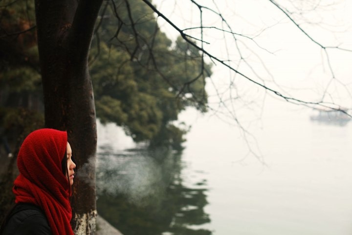

<!-- # ＜天璇＞从杨公堤说起 -->

**再来说说夜晚的白堤，这条我光是光脚就走过好几遍的路。我偏心地只从断桥往西走，且只走堤的南面，只是因为，在夜晚此番走去，身旁翻腾的西湖水让人错觉自己走在一片飞快流动的大江旁，把城市闪耀华丽的灯红酒绿飞快地甩在了背后。**

# 从杨公堤说起

## 文/周若韵（北京第二外国语学院）

杨公堤有六座桥，虽然我最喜欢的是景行桥，但往隐秀桥边一条安静的木道走去，在被大片水杉遮住的深处，眼前会突然开阔亮堂，如发现一个秘密般，看见里西湖边系的数条旧木船，湖边寥寥芦草几根，远处苏堤人柳之影交融，近身脚底则水面柔波初平。

这地方算不上神秘，常常过去都能遇到不少情侣依偎在此安静无言。我喜欢把包往头下一枕，偎着西湖的和风侧身睡个半梦半醒的觉。自从来了杭州，焦虑躁动的情绪大为减少，几乎进入了一种失忆的状态。之前那强烈的爱憎与绝对的原则消失殆尽，关于梦想之类，也再说不出个所以然来。有人倾诉，我静静地听完，然后指着天上的月亮说“快看”，月亮仍毫无变化从容地在那儿，只是因为这一刻的月亮跟下一刻的月亮再也不会一样了。我做不了知心姐姐了，在言语上显得笨拙了许多，这让我很满意，有时候在夜晚跑到这里来放声大哭，只因为朋友的苦我帮不了他。

一天晚上我又走到了这里，跪在地上把手伸到湖水里洗我刚捡的叶子。宝石山上还有弱灯点点，苏堤上的灯被湖水晃成了星辰。洗完树叶我又坐回我常坐的木凳，望着远处开始发呆。很长时间的寂静后，一个男孩子推着自行车从水杉后穿进来，他站在车旁背对我把眼前的西湖看了一圈，停好自行车，坐在了离我不远处的另一条木凳上把脸埋进手里。路把两条木凳分开，我只能看见他的人影，风把他的头发吹起来几根。我又扭过头来继续发呆。

良久，他大概是抬起头来了吧，大概是走到了我身边，大概在观察我，总之我听到他说“你好”的时候仿佛刚从远处回来对这边的世界毫不知情般吓了一跳。我对着他点了点头，他也不知看到了没有。他问我，你在想什么？我似乎还认真地思考了几秒，诚实地与他说，什么也没想。

什么也没想，我终于能什么也不想了，发现这点之后我感到我对那天的珍惜又多了几分。

发现桥的小秘密后也是这样，那也是一个晚上，我跟友人走在凌晨的杨公堤，过第五座桥的时候他轻轻提醒我虽说桥是03年重修的，但这上面的浮雕仍是花了一番功夫有点意思的。自此，看桥又成了我走杨公堤的另一大乐趣。这条按照明朝时原样修复的堤跟苏堤一样，是用西湖中堵塞河道的淤泥堆积而成，六桥也是古来便有。从南山路拐过来不远处就是杨公堤第一座桥，临着花港观鱼，不时能看见水杉丛中若隐若现的小桥古亭。桥上的浮雕妙趣横生地饰了花，鸟，还有玉卷轴，好一个浚河之源！用一幅卷轴打开这场花鸟相伴的山色之画。

喜欢景行桥也是这个原因，这六座桥中只有此桥为保存下来的古桥，浮雕取了它的字面意思，景中行走，原意是用了《诗经》中的“高山仰止，景行行止”来赞美德贤之人。那时看着这二十多块刻了西湖美景的石板猜这座桥的名字，后看到“景行”二字直叹妙哉。桥两边是里西湖和乌龟潭，远山近水亭台楼阁，桥拦上刻着的西湖美景此刻不仅有迹可循对比一番，自己竟也成了景中之人。每每过这座桥我迈的每一个步子都注满了对这景的尊重。

那天晚上我们沿着杨公堤走到虎跑路过六和塔到往日的之江大学，过钱塘江大桥后，他把我带到马路的另一边，穿过一条被植物绕起的小道一闪不见了，我紧跟过去，不由地啊了一声。

这是一个小的不能再小的街心花园，被树丛环绕起来，是为了纪念茅以升建的。三面都是车鸣人沸的马路，但里面安静得像不存在在这世上，钱塘江大桥上的路灯直直射到茅以升的雕像背面，从前面看，就像他的雕像在发出微光站在这小公园的一头照亮地面上低眠的草。那位友人，盘腿坐在地上正对着茅以升的雕像，低下头，他回到自己的归宿地了。

我也有一个轻易不去有如珍宝的归宿地，发现那还是因要找一匹马，马叫白玉，后来马没找到便在山上闲晃，无意中走进了那里。一座郁郁葱葱深邃茂密的墓地森林，里头也尽是些有七八十年了的老墓，走在上山的道上踩的全是落叶软绵的尸体，死亡的安定力与沉淀淡泊让我走在这里奇异地舒适。家里的破椅子旧坛子也是在这座山上惊喜捡到的。

想到那白马可能是谁变的，不禁恍然大悟感激不尽。

感激的时候一旦变多，珍惜便随之而至，珍惜足够更是能省却苦忆，好处颇多，堪比自省，哈哈。

再来说说夜晚的白堤，这条我光是光脚就走过好几遍的路。我偏心地只从断桥往西走，且只走堤的南面，只是因为，在夜晚此番走去，身旁翻腾的西湖水让人错觉自己走在一片飞快流动的大江旁，把城市闪耀华丽的灯红酒绿飞快地甩在了背后。远处是被夜色缭绕的黛山，过了锦带桥不远，就能看到平湖秋月的承香堂。承香堂本是望湖亭，后幸运地被承香堂的老板小改一番，一楼卖些笔墨纸砚香炉竹帘，二楼放着环绕整个平湖秋月的古琴洞箫，为品茗之地。下雨的时候走在苏堤上是感觉不到雨的大小的，仿佛衣服就是被湿润的空气浸地耷下来，头发不知不觉就湿漉漉贴在脸上，直到走到这里，听见雨声密密麻麻轻拍在那几株老枫树叶上，才知道这场不弱的雨是有多温柔。靠着柱子听会儿悠长的洞箫，想起徐文长在此“湖光渺渺水长流”后信步踏月离去，却不知此地“雨声潇潇山霭起“的美。起身的时候发现旁边不知什么时候已落下了一小片绿岑岑的枫叶，那已经是我仅能看清的东西了。

望湖亭旁是望月亭，一次凌晨三点走过那里，发现望月亭里有个人影趟在亭子一边，呼吸均匀，那时的我累极了，若不是翌日有要事，恐怕往另一边的靠椅上一躺也睡了。但去过那么多次，我却从未在望月亭里望过月。只前几日，老友从湖南来看我，我又领她走我常行之路，至望月亭坐下，聊了聊往日的乐事。亭外明星弱月相伴，静水为鱼跃所惊。湖风一阵，凉意爬满大腿，再抬头看看，那轮本就稀柔的弯月更是寻不见了，便匆匆步出亭外走过西泠桥，绕过苏小小墓的慕才亭，步子说是加快了却也不及我上班时的五分之一，过风雨亭往里瞧了一眼，一对情人在看西湖。

之后要路过苏堤，岳庙，曲院风荷，穿过植物园大牌坊就到了我心头至爱玉泉路。到现在，如果在杭州的时候有谁不知道这是我最爱的路只有一个解释，你跟我实在交集太少了。几乎每一次走这里，我都会不厌其烦地，充满爱恋的，溢满回忆的，对我身边的人唠叨，这条路是我最喜欢的路，他没什么特别的，只是被我喜欢就显得特别了起来。但其实我在《以为》里已经描述过我对他那懵懵懂懂的爱意了。他到底有何特别？他到底是有何特别呢？诶我说，你还是来杭州跟我走一趟吧。

还有一个我不想（还是懒得？）用文字和语言来描述的，是我的屋子。我喜欢它喜欢到了去把大自然的东西占有过来送给它。这也是我仅剩的占有欲了。

这几日天气放晴，门口修的路初见雏形，前几日去国美捡的那几块破瓦现在还堆在一角没被整理好，昨日跟BB说去布料市场，结果还没上公交我又改变主意去浙大逛，我看到阳光从树缝中射下来，把叶尖照地嫩绿发光，风一吹又照到了别处，我感觉我就像这投在地上的一小圈阳光。

那天晚上，那个问我在想什么的男孩子，后来推着车走了，我跟他说再见，他笑了，虽然我什么也看不见，他笑着说：“还会见的，这么美的地方。”

还有那个晚上，那位叫我看桥上浮雕的友人，在我跟他一起走到一个路口，迈腿欲行的时候，他突然把胳膊伸过来用手背挡住我，我顿了顿，抬头不解地看着他，他望着前方，像个老人有着白发鬓角，声音也像老人那样缓慢。

“慢慢走，”他说，“你走太快了。”

昨天晚上，我跟老友走在玉泉路上，我又开始在她耳边第一百遍跟她唠叨这是我最喜欢的一条路，她突然问我，你会舍不得这里吗？我几乎没想，笑了笑说，我为什么会舍不得这里呢？我很珍惜当下的一切，就是这一切。

（采编：董一儒；责编：应鹏华）
