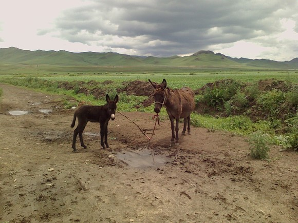
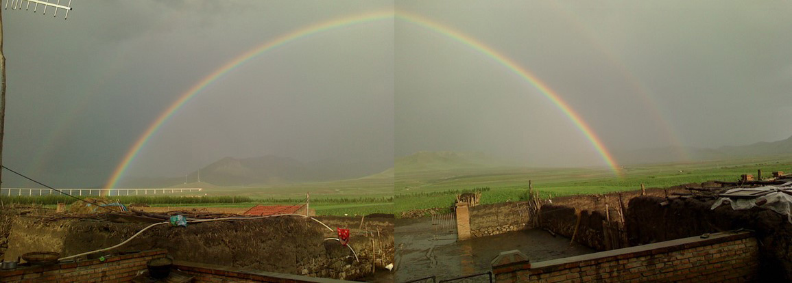

<!-- # ＜儿童节特稿＞草原童事——把故事写给那些未曾生活在草原上的人们 -->

**我是自小生于草原的“白头宫女”，我的生命与草原连接在一起，当别人在羡慕草原生活的浪漫自由时，我见证了草原从生态、文化到人心的日益颓败，也看到了生活在草原上幸福浪漫之外的平凡、哀愁和沉重。和那些因梦想仗剑走天涯而只身打马过草原的人不同，我曾经在大风雨中守护过羊群。我将以我所经历的草原往事，讲述生命的卑微与神圣。**

# 草原童事

# ——把故事写给那些未曾生活在草原上的人们

## 文/李晓明（内蒙古大学南园思想学社）

老去的芨芨草

根部

母花纹蛇睡梦香甜

祖国的内蒙古草原

在牧人的吆喝声中暮色深沉

那最响亮的声音

来自瘦小的毕力格

他醉意浓浓，小脸儿通红

哼着老牧人们听不懂的情歌

红鬃马上骄傲的毕力格

是我亲爱的老阿哥

他一手拉扯大的羊羔卖掉时

他忍不住哭了

毕力格，毕力格

一个意为“聪慧”的蒙古名字

毕力格，毕力格

我亲爱的老阿哥

请你带我回草原

让我们像羊羔一样

欢快的在草原上撒个欢

——《请你带我回草原》，写于一年前。

索尔仁尼琴在《古拉格群岛》第一卷中曾写到，只有那些和我们有相同经历的人，才会真正的了解我们。在我看来，索氏并非在夸大沟通的困难，而是在表述人类实际的局限。

鲜卑民族的《敕勒歌》中记载的“天苍苍、野茫茫、风吹草低现牛羊”或许依然是许多未曾去过草原的人用以对草原进行想象的重要原料，之外也许还有腾格尔和德德玛的歌词，席慕容的诗和散文，也许还有奔驰的骏马、徜徉的羊群，悠悠流淌的锡林郭勒九曲河；也许还有拍摄于早年的电视连续剧《成吉思汗》、有限几部较出名的电影如《嘎达梅林》、《图雅的婚事》，也许还有比较出名的那两本著作——《蒙古秘史》、《江格尔》；更重要的当然是官方刻板的宣传，如好饮烈酒的彪形蒙古大汉、喜跳舞爱唱歌的蒙古姑娘，大轮子的勒勒车和馒头样的蒙古包为象征的逐水草而居的游牧生活，自由而又浪漫。

当各地的朋友在传媒和交通已经如此现代化的时代，乐此不疲地向我询问那些违背基本常识判断的问题时，我在不经意间发现，人类总是有一种情不自禁地将他们不了解的事物进行浪漫化的冲动，这不是某个人的缺陷，而是人类集体的盲目，这说明我们的大脑中有一部专门用于屏蔽理性的区域。就像宫女在宫外时习惯幻想着得到皇上恩宠的曼妙生活，我们幻想着极可能不存在的美好，这比想吃到主人用以欺诈而悬在脑袋前的萝卜的驴子更愚蠢，然而作为人类，我们习惯于一厢情愿。

与那些幻想着进入深宫的待选“快乐女生”不同，我是自小生于草原的“白头宫女”，我的生命与草原连接在一起，当别人在羡慕草原生活的浪漫自由时，我见证了草原从生态、文化到人心的日益颓败，也看到了生活在草原上幸福浪漫之外的平凡、哀愁和沉重。和那些因梦想仗剑走天涯而只身打马过草原的人不同，我曾经在大风雨中守护过羊群。我将以我所经历的草原往事，讲述生命的卑微与神圣。

**大黄马之死**

也许是原野上的雷声，也许的顽童的石块，惊吓了老迈的大黄马，使近20岁高龄的它，在狂奔中震断了自己的血管，当父亲发现它的异常，找来兽医调剂了一盆汤药准备为它灌服的时候，它惊慌失措地后退了两步，随后轰然摔倒在牛圈里，它努力睁大的眼睛和深重的鼻息，是我对它新鲜生命的最后记忆。站在牛圈外的母亲顷刻间就落下泪来，孩子们则是哭出了声，而父亲则是短暂的沉默不言，之后又与兽医简略的交流大黄马可能的死因。

封闭、落后，物资又匮乏的农村生活，使家里在九十年代才拥有一部黑白熊猫电视机，孩子们除了电视里单调乏味的节目，就依靠母亲的故事来增添对世界的认知。母亲稀奇古怪的鬼故事让我做下了小时候持续多年天黑之后没人陪绝不出门上厕所和夜里用被子蒙头睡觉以防鬼怪的恐惧症。家里当年的一大乐事，就是偶尔享受看我在屋子里憋尿憋的蹦来蹦去，最后才让哥哥带我出去上厕所的过程；而夜夜蒙头偷窥门口有没有鬼的习惯则严重损害了我的安全感，使我直到今天都习惯于把被子直盖到鼻子以下的位置，仿佛是对世界的一种躲藏。

除了鬼故事，母亲所能贡献的就是她的人生见闻，其中就包括大黄马的生平。大黄马在姐姐降生之前便来到我家，骑行、耕地、拉车样样都行，是追随着父亲的忠诚战士，帮助我们的家改变了四壁徒空的窘迫状况，可谓功臣，而且此马有一特性，就是一旦被借到别人家绝不干活，桀骜不驯，就想着往家里跑，被邻里乡亲传为趣谈。且毛色和精神上极为优良，有一次后院爱酗酒的“八一”（蒙古名，我们村还有叫“六十九”的呢）大叔在我家酒后吐真言：曾有一个南方商人企图唆使他偷大黄马，只要他把马从院子里牵到离我家不足一千米的大桥处就给他五百元人民币，然而他出于兄弟义气、乡里感情义正言辞的委婉的拒绝了商人的提议。年幼时听母亲谈起此事，不由得对“八一”大叔十分感激，而且决心要做“八一”大叔一样高尚的人。当初的五百元可不是小数目啊，要知道家里因为违反计划生育超生了我才被罚了三百。总而言之，在我的童年，大黄马就是一个传奇。

然而，仅仅在它死去的两个小时后，他的肉干就被端上了我家宴请的餐桌，而短时间内就转换为屠夫的兽医则和父亲一起坐在桌边喝酒，孩子们则安静地吃饭。我童年惯于在陌生人面前低着头，那天则把头埋的更低，我真希望碗能大一点，这样我就可以把头埋在米饭里——我感到巨大的困惑，羞愧隐隐作痛，因为大黄马尸骨未寒，我们眼角为大黄马流的泪还没有干，它的肉就被我们端上了餐桌。我埋着头一粒一粒的夹碗里的米，慈祥的兽医先生并不理解我的心境，在父母的解释下，他以为我在陌生人面前一向害羞，便主动地向我碗里夹了块马肉，以显示长辈对晚辈的疼爱，我习惯性地沉默寡言，习惯性地服从，夹起油炸的马肉干放进嘴里，我只记得很硬很硬，味道是咸的，咽得很吃力。

那天的饭桌上，我没有留下其他记忆，只记得那种咀嚼吞咽的感觉让我耿耿于怀，让我直到今天在这里写下这篇文章时都会在心底泛起说不清道不明的难受。回想起来，那是我一生唯一一次吃过的马肉。

马肉都是硬的么？

**卖了一百元人民币的“大红秃子”**

初中一年级的春天，周末我步行三十里从学校回到家的时候，草园子里已经不见了“大红秃子”。我推开家门，和迎面走来的母亲说的第一句话便是：“‘大红秃子’呢？死了么？”

“大红秃子”是一头没有犄角的母牛，它继承了家里母牛普遍不长犄角的传统和温顺的性情，也继承了优良的生殖力，它每年都要下一个牛犊，为“秃头家族”增添新的成员，然而这个春天它意外地流产了，之后不知是子宫，还是其它什么关键器官便脱落了下来，兽医用土法试图将器官重新送回它的体内，然而这是徒劳的。它常态性地卧在储蓄牧草的园子里享受高干病房的病房却依旧食欲不振，输液治疗和兽用汤药也不能阻止它日益消瘦，它的精神渐渐消沉了。平时在我用羽毛打趣它时忽闪忽闪的大耳朵，在我上学前也不动了。

在我上学的这个星期里，父亲和母亲四处寻找买家，决定送走它，最后以一百元的价格将它卖掉，要知道那时一张牛皮就已经可以卖到一百元以上了，我知道爸爸妈妈不愿意看到它死在家里，当初“大红秃子”出生时，它的母亲“小白秃子”是初次生产，在牛犊即将产出的时候，却突然站立了起来，做接生工作的母亲的上去接住了它，干净的衣服却被弄得脏兮兮的，又气又笑。

记得小时候牛犊出生，都有一道必备的程序要做，就是要帮牛犊清理嘴里的污物，然后由接生者含一口酒喷在牛犊的口鼻和耳朵里，牛犊受了这刺激后，会本能地甩耳朵，样子好不可爱，而我却一直没有问过这样做的寓意或实效。

面对心情低落的我，母亲安慰我说“大红秃子”被买家带回家治疗了，然而那时的我已不像以前那样幼稚，我知道“大红秃子”几乎难逃一死的命运，然而又能怎样，即使留在家里不生病，迟早也不是要被卖掉，最终被送上驶离故乡的大卡车，被送进屠宰场，被分解后送上餐桌。

记得童年时我家的牛棚里有一捆很粗的牛尾毛，每卖一只牛，母亲都要扯下一束牛的尾毛做纪念，我不知道在每年秋天她一次次把这些她亲手接生并养大的牛犊送走时并换取家里的生活费用和孩子们上学的资费时是何种的心情。只记得一次买牛的商客并没有用汽车，而是采取“赶趟子”的方式——就是雇佣一批人骑马把牛赶到一百公里外镇上的屠宰场，而家里卖掉的一只牛似乎意识到这将是彻底的诀别，它在一次次被赶走后又一次次奔回家门口哀鸣，身上满是铁丝造成的鞭痕仍不肯离去，最初一两次的时候母亲尚只是坐在屋里不动，人困马乏的牛仔们也是和站在大门口的我笑笑表示无奈，到后来牛跑回来的次数渐多的时候，性情一向柔和的母亲从屋子走了出来，以少有的凌厉和坚决表达她了的意见：

“告诉你们老板，牛再跑回来我就不卖了，你看看你们都把牛打成啥样了。”

那头牛仿佛就是为了听母亲的那句话，它被赶走了，再也没有跑回来。

母亲也曾讲述过在我出生前家里一头牛在蹄子受伤时主动卧倒配合治疗的故事，她还曾讲述一个无从考证的关于牛通灵的故事，大意是一个孤苦伶仃的老阿婆仅有的财产是一头母牛，而母牛在生下牛犊不久后便死去，而小牛犊和老人相依为命，老阿婆把牛犊拉扯大，她吃什么就给牛犊吃什么，以至于后来她去推磨的时候，牛犊便用嘴唇帮老阿婆推动碾杆的故事。我也一向觉得牛是有灵性的动物，因为在村里有人家杀牛的时候，即使血迹掩埋得再好，也会有牛发现，随即便用哀鸣召唤同类，一大群牛便聚集在血迹周围不断地哀鸣，用前蹄扬起尘土，似乎在追悼，颇像《圣经》约伯的朋友们对约伯受难的遭遇表达哀思的方法——他们撕裂衣袍，坐在地上，把尘土扬向天空。

家里近年来因经济条件好转还杀了几次牛，每次都不会杀自己家的，而是另买其他，这似乎是某种形式的伪善或自欺，然而我觉得这规矩隐隐的触及到了人内心最柔软的地方。

**两只羔羊的命运**

高中时，在表达暗恋情思的日记中，我曾这样写道：“你的眼神像羊羔，纯洁得令我心碎，无辜得让我背负拯救的罪责。”

在汉语词汇中，近来我揣摩越来越多的，便是“无辜”，我们习惯于把它用在那些毫无责任罪孽的受害者身上，但是当你见到一只新生的羊羔时，才会真正地懂得这个词汇蕴含的力量。

当一只羊羔傻傻地，用那种天真的眼神茫然无助的眼神看着周围这个世界的时候，当它一边用稚嫩尖锐的傻叫表达它的不安一边迈着不稳当的小腿错把你当作妈妈而向你走来的时候，当它撒欢奔跑，诚惶诚恐的躲闪着你的追捕的时候，你就会情不自禁地心生怜爱，也会在刹那间懂得“无辜”这个词汇。

羊羔是羊一生中最可爱的阶段，几个月后略大时便是羔羊了。我的生命中曾有两只羔羊让我难以忘怀。

一次是初中的暑假，有一只生病的羔羊没有送去牧场，而是留在家里。那个下午，突然下起了大雨，那只羔羊无处躲雨在院子里无助地叫，我的恻隐之心让我没有犹豫，冲进雨幕中抱起它带回了屋子，完全不顾屋里挤满了父亲雇佣来帮忙打草的远房亲戚，羊羔挤到了角落，弄脏了新粉刷的墙壁，父亲看了批评我：“不就是只羊嘛，待在外边有什么事情，又不会死掉，如果是一群羊难道你都赶进房间么？”

我理直气壮地反驳道：“它还小，被雨淋着多不好，墙壁反正迟早要脏。”

第二次，则是高中毕业后升大学前的暑假，我一个人在牧场放了一个月羊，每天或追着羊群到山顶吹风，或在平坦处时便骑着摩托逡巡在羊群周围。我渐渐注意到一只羔羊病得十分衰弱，逐渐在夏日的酷热和疾病中丧失了生命力，它甚至不跟随羊群去山顶吃草了，只是留在平坦的地带每日躺着。不知道为什么，我心里竟然丝毫没有拯救它的愿望，反倒是生出了想替它提早结束生命的念头，某个午后，我离开羊群，骑着摩托停在了它身边，我不知道自己在想什么，突然加足了油门，在病怏怏的羔羊身上碾了过去，在车轮碾过它的时候，我能感到那种肉体生命独有的柔软，它区别于大地的踏实。也就在那一刻，我的心水面般被击破般的震动了，冷汗都从背后冒了出来，迥异于发动油门那一刻的脑海里的一片空白，我此刻意识到自己是个凶杀犯，心底蕴藏着毁灭的力量。

而那只羔羊竟然没有死，它挣扎着站了起来，走向了羊群。

**活着、生活，还是存在?**

活着的卑微与快乐、生活的艰辛与幸福，存在的幻灭与神圣，构成了生命的图景。我想无论是在草原，还是在草原之外，都是如此。然而无论在何处，我们都没有权利回避生活细节中透露出来的种种生命的悖论，活着意味着不停的被自己质问。我曾经长久的思考活着、生活和存在的关系，极度的推崇要用一生去探索存在的有限意义，曾以轻蔑的态度对待生命，以为没有存在的意义，活着和生活都是微不足道的。

像一个溺水者，拼命地扑打水面，妄图抓住一点什么，几乎是任何人面对死亡逼迫的常态性动作，我们担心自己徒劳无功，因为一切终究会流走，死亡终究会来临。人冥冥中有一种对死亡的深切恐惧，也正是这一点，教会了我对生命的敬畏和珍惜。

在我的生活履历中，草原的成长经历是我前半生的重要组成部分，草原教会了我很多，其中最重要的就是审美的冲动、爱的能力和思想的格局，然而其中并没有信仰，作为一个怀疑论者，我已经羔羊般在浮世中为乱象所困，许许多多的时候我陷入虚弱、欲哭无泪，徒增对自己的厌恶和毁灭自己的冲动。

然而我知道，我深深地爱着这个世界，深深地眷顾着这一切，我只是太害怕这一切美好的都消失得太快，害怕死亡把他们都带走，害怕黑暗和邪恶吞噬掉我，我害怕自己麻木，害怕自己失去审美和创造的能力，我害怕自己的一生让自己不够满意，我害怕孤苦伶仃，不被人理解。

我知道自己会死，我知道这一切都会消失，我深知自己的有限，也渐渐学会了从容不迫的去生活。

然而我终究有梦，这些梦迫不及待的催促我上路前行，鼓励我应当像当初上帝把我抛到人间一样，要把自己抛进巨大的未知中去。我深信，只要活着，我就不会停止热爱，就不会停止探索。

编者注：主标题“草原童事”为编者所改，原题为“草原往事”。

（采编：黄理罡；责编：黄理罡）
