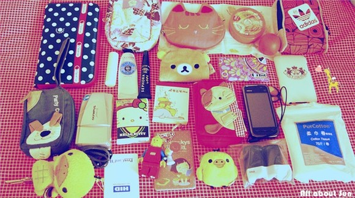

<!-- # ＜摇光＞翻包社会学 -->

**在翻包行为中，“我是什么样的”等于“我的包里面是什么样的”，而“我的包里面是什么样的”又等于“我希望我的包里面是什么样的”。真正地把包里的物品拿出来细数——这是解构自我、分析自我，而挑选一些值得进入镜头的物品，排除一些没必要进入镜头的物品的过程，就是建构一个“新我”。**

# 翻包社会学

## 文/周雨霏（中国人民大学）

不知道人类是从什么时候开始使用包的。我想像在远古时代，原始人类外出打猎要携带太多的狩猎工具以至于行动不便，于是他们用一张兽皮或纺织物把工具都裹起来，系在背上，或许这就是“包”最初的形态。中国古时候上京赶考的书生背着一个方形的“框”走在乡间小路上；赶去大剧院看戏的巴黎贵妇左手拿着报纸，右手拎着一只别致小巧的手袋；印第安人在部落大迁徙时把麻袋子塞满所有家当，驮在驴子背上跋涉于荒漠。包几乎出现在人类文明的每一个场景中。

人类使用包的第一动机是为了收敛物品，而包不透明的质地（透明塑料被发明之前），使得它在收敛物品的同时也恰好起到了隐藏物品的功效。把东西放进包的一瞬间，东西消失了。自从人开始使用包，别人就不再知道你拥有什么东西，因此包创造了隐私的概念。谍战片里经常看见神秘人从包里慢慢掏出一支“本来不存在”的手枪；性教育宣传片里偶尔出现有女生包里的卫生巾掉出来使得女生面红难堪的桥段。包，保守了我们的秘密，推进了自我意识和个人主义的生长。因此，当一大群人开始主动地打开自己的包，掏出里面的每一个东西向人展示时，事情开始变得令人费解。

这就是现在广泛流行于年轻人中间的翻包活动，其中以豆瓣网上的在线活动为最盛。在活动标签栏中输入“翻包”，会出现几十个相关活动，其形式非常统一，全部都是豆瓣用户将自己随身携带的包中的物品掏出来摆成一片，然后拍照上传。我着重观察了两次近期的翻包活动，其参与的广泛度令人感叹。一次是从2011年4月22日21:00开始，到2011年6月30日21:00结束，共有14430人参加，上传共7367张照片，有3857人按了“喜欢”键。更近的一次是“What's in ur bag？【翻包——第N季】”活动，从2012年3月29日09:00到 2012年4月23日18:05截止，共有9006人参加，上传5166张照片，共3697人表示喜欢。

翻包活动引起如此广泛的参与，这是否表示年轻世代的心中存在着否定包的隐藏功能的倾向？他们是否有比以往世代更强烈的暴露欲？他们到底为什么要翻包？如果将翻包行为放进更大的脉络中进行体察的话，我们会发现它其实从属于一种新兴的“晒客文化”。百度百科解释说：“所谓晒客，就是热衷于用文字和照片将私人物件以及私人生活放在网上曝光的网友。由于所晒内容的多元性和趣味性，如今的晒客通过坚持不懈也培养出了一批看客，就是专门在网上看别人晒东西的人，或分享经验、或获得新知，在看别人盘点生活的时候也对比自己。

晒客正在成为网络族群中的一个团体。”本文的写作目的即是以翻包的角度作为切入点考察“晒客文化”的一些特征与产生原因。

翻包行为分为五个阶段：打开包，掏出物品，排列物品，拍照，上传。翻包活动由两种参与者组成：只围观不翻包的网友，以及既围观又翻包的网友。在此之中，上传是最关键的环节，而真正翻包上传的网友是更重要的参与主体。这是由于只有上传行为才包含了暴露的本质，即对隐私的放弃。这些翻包客，他们放弃的都是些什么隐私呢？根据肉眼不可靠统计，翻包照片中可能存在的物品一般有：手机（至少一部，多两部），化妆包与化妆品（唇膏、口红、香水、镜子、防晒霜、粉饼、吸油面纸、护手霜、梳子），纸巾，眼药水，相机（单反、拍立得、数码相机），本子，书，笔和笔袋，钱包，钥匙， mp3，耳机（大或小），PC，游戏机，糖，口香糖，水杯，烟和打火机，眼镜，墨镜，小食品，证件（身份证，学生证，工作证），伞，小包包，卡片，药。

乍看去都是一些功能极其日常和普遍的物品，每个城市人都对这些物品非常熟悉，简单地想想觉得好像没有什么暴露的意义。然而晒客的上传行为给日常物品所赋予的不日常的对待，传递出的正是他们对于日常生活一种不平常的看重态度。他们欣赏日用品丰富的功能，也就是欣赏一种丰富而精细的物质生活。从物品属性来看，参加翻包活动的女生比男生多得多。而女性心理中的一个特别之处就在于，她们通常被认为拥有更大可能的物质倾向。同时，女性有着对形象外表、时尚趋势更敏锐的感受力。女生对于物质生活的态度是精细的，同时参加翻包的男生也表现出不同程度的精细。这些精细的男生女生喜欢在文字描述中仔细罗列所晒物品的名称、品牌、功能以及好用之处，这个过程或许正是他们向外界宣扬其对于精细生活之热爱的方式。这种热爱生活的方式常被称为“小资”。所谓小资，百度百科又说：“小资为‘小资产阶级’的简称，特指向往西方思想生活，追求内心体验、物质和精神享受的年轻人。小资情调应该是一种追求生活品味的人。”

（图片来自豆瓣）

“小资”不仅体现在物品的日常功能上，还暗含在照片的呈现方式之中。大多数的翻包照片中的物品都经过拍摄者精心地排列，以便围观者可以清楚地看到每一件物品。因此这些物品通常占满整个屏幕，特别是一些物品很多的照片，整体呈现出极致的饱和感，给人以充实、丰盛的视觉体验。看着这样的照片，仿佛都听得到拍照者在大声地说：“你看，我东西很多哦！很多很多哦！”在这种情形下，通过购买得到的、被拿来使用的物品经过排列之后就又多了一种新的功能叫做“宣布被占有”，它们如待检阅的军队一般整齐地静静排列，忠诚地注视着自己的主人，而主人则向其所属物投以同样爱意的目光，怜惜地按动快门，记录下它们美丽的身影。每一件物品都在默默地宣布被占有，反过来拍照者则是在默默地宣布其对于丰繁物质的独占。这种独占言说着人对物的权力，人对物的迷恋，物对人的反向控制。这也是为什么近来越来越多的年轻人喜欢用“恋物癖”这个本来带有病态贬义的词语来给自己贴标签——喜欢看到漂亮的制造物，喜欢占有漂亮的制造物，喜欢向人宣布自己对于漂亮的制造物的占有。在今天，对人与物的亲密程度与权力关系之逆转的表达在晒客身上得到前所未有的发扬光大。

除开大多数只展示常规物品的晒客，还有一些晒客所展示的物品跳出“普通”的框架，或向着更隐私处挖掘，或寻求稀奇、古怪和不同凡响。一些女生会在照片里放置不加遮盖的大片卫生巾，这与文章开头提到的那个因为卫生巾掉出书包而羞愧难当的女生形成鲜明对比。卫生巾这种提供私密功能的私密物品，从以前的遮遮掩掩，到现在被大大方方地拍进照片上传到公众视野内，这其中有着巨大的观念跨越。似乎在我们自中学以来的“卫生巾文化”中，一直隐隐约约存在着这样的道德要求——女生不可以把自己的卫生巾拿给男生看，否则就是失乎礼节的，甚至是带有性隐喻的暗示行为。但是，如果女生并非用一双真正的手把一张卫生巾交给一个具体的男生，而是通过翻包上传的方式呈现呢，这其中有着怎样的不同？这不同就在于，卫生巾所连接着的那个女生与那个男生都并不真正在场，女生通过镜头隐藏自己，男生通过屏幕遮盖身份。整个交流过程都是通过虚拟的网络进行，间接、超时空并且清洁无害。

这种间接、超时空与无害对上传者的勇气与信心是莫大的鼓励。在网络中，网友以帐号身份示人，他们的相貌、职业、年龄等具体信息全部隐匿了，因此帐号就像一个超大号的包，把真实的我们罩在里面，通过包上的小孔（电脑屏幕）我们可以看到外面的世界，外面的世界却看不到真正的我们。这给人以“敌在明处，我在暗处”的先发制人的安全感。在这种安全感的推动下，我们偶尔从藏身的大包里扔出一两件与真实的我们相关联的事物——文字或照片，仿佛它们就是我们人格的代表，仿佛它们所承载的性能细节，成为了我们诠释自己、别人解读我们的权威文本。而这些文本虽然泄露个人信息，却又不会真正出卖我们，因为翻包者所展示的大量物品，即使再多再丰富也依然都只是工业机械复制工序生产出的大众商品（如果本雅明在世，他肯定不会给予这些表面光鲜的物品任何有关“灵韵”的赞美），带有商品一贯的冷漠气质，也就是说必然穿戴着与占有者本人无关的普遍性外壳。被抛出的占有者的部分灵魂依然安逸舒适地藏在外壳里面，不受打扰。

这种对于隐藏以及不受打扰的追求体现了一种可爱的害羞——“躲起来”是害羞者才会做的事情。只用将翻包与自拍做简单的对比我们就能发现，自拍者所从事的活动是一个网络帐号所能暴露个人信息最多最直接的形式。对于自拍者来说，我的照片就是我，独一无二、如假包换。但是自拍只适合对于自己相貌极端自信的网友，对于那些有强烈地想要将自己的脸藏起来的倾向的人来说一点都不适用。而翻包这项活动就是对于他们一边想要隐藏一边又摆脱不了自我呈现的欲望的微妙平衡——让我的物品来代表我，我的物品就是我。翻包是害羞的自我呈现者的救赎。齐美尔在《时尚心理的社会学研究》中曾说：“靠外在表现的独特性来显眼，表明这种人的内在本质性的独特性就是使某些天性隐藏到时尚隐藏性的平均化之中的东西，这是一种优雅的害羞和胆怯。”[1]自拍的暴露太极致、太露骨，而翻包的间接性则刚刚好体现一种婉转的优雅，这或许是翻包活动广为流行的一个重要原因。

除了如展示卫生巾这样的挖掘个人隐私的翻包行为，还有一种翻包行为不能归为普通正常。这种翻包者的照片里有一些奇怪的东西，比如一本叫做《证据学》的教材，一包安全套，用过的邮票，一条游泳裤，皮带，手枪（不知真假），医用胶带，木头弹弓等等。这让人难免怀疑其真实性——这是拍照者故意放进去的还是本来就装在包里的？如果是本来就装在包里的，那么安全套、手枪（玩具手枪）、胶带……每一个都会使人遐想联翩。这样的使人遐想联翩的物品通常就是围观者们口中的“亮点”。不论这些亮点是自然存在还是人为制造的，它们比起一般的日常物品都包含更深远的隐私信息，对真实自我的暴露也更彻底。

亮点可以是人为制造的。其实不只是奇怪的物品，翻包照片中的每一件物品都不能保证它是原本就在包里而非被后来加进照片的，因为拍照上传是幕后的私密的事情，没有监督也没有自首。有一些女生的翻包照片琳琅满目的程度令人叹为观止，仔细地看下来你简直无法相信她会随身携带大瓶的名牌香水或十几盒不同颜色的眼影，或者在一些男生的背包里你不敢相信自己的眼睛看见了至少五种以上高档的各类电子产品。惊叹和怀疑是理所应当的。如果“作弊”行为确实存在，那么翻包行动所包含的意义就在原本“暴露隐私”的基础上又有所上升——进而充当起“建构自我”的职能。

在翻包行为中，“我是什么样的”等于“我的包里面是什么样的”，而“我的包里面是什么样的”又等于“我希望我的包里面是什么样的”。真正地把包里的物品拿出来细数——这是解构自我、分析自我，而挑选一些值得进入镜头的物品，排除一些没必要进入镜头的物品的过程，就是建构一个“新我”。波普教主安迪·沃霍尔曾说：“我通常以人们的主观形象为准而接受他们，因为他们的主观形象与他们的思考方式的关联胜过他们的客观形象”[2]。这种逻辑部分适用于翻包行为，在这里你看到的照片不能让你看到拍照者的客观形象，你所能看到的全部是他们所希望你看到的他们的样子，也就是他们的自我认同。有的人认为自己是风格清新的优雅淑女，有人认为自己是充满生活格调的高富帅，有人认为自己是专业的数码技术宅……这些主观形象全部都能从他们对所拍物品的选择中找到对应。而这种对应被运用得最广泛且无争议的地方，就是名牌商品与物质财富之间的关联了。无数的拍照者通过其“包内物品”被塑造成富人，而这引起了一部分围观者的不满。在一些照片下面，你可以看到诸如此类的留言：

“养眼能干屁，那叫小虚荣。”

“连车钥都晒上来了，啧啧。”

“电子用品强奸了我们的生活。”

“人手几台电话、奢侈化妆品、psp、mp几几几以及大白色立拍得。必须的？”

“有什么钱啊，全都是一堆烂大街的包，硕大的logo生怕别人不知道自己买了个名牌，还指不定从淘宝里哪店淘的。即使是真的，也是有钱没品。”

“就现在的形式看来，没有IPOD、诺记E街机、铁三角、拍立得，就不用翻包了。翻了也是现眼。我举手，我不能翻包。”

由此可见这种被刻意经营出来的富裕形象并不完全讨好，经营者的虚荣心似乎并不能从反馈者那里得到加分。然而仅仅是将自己的财富象征物聚拢到一起并拍下一张永久性的具有纪念意义的照片，仿佛就已经能够满足虚荣者的虚荣心了，至于那些看不顺眼的人，尽可以被富人理解为不平衡的仇富心态。反馈即使是负面的，也可以被转换成对于自我认同的正面鼓励。

可见许多翻包者在拍照与上传的一瞬间内心是充满愉悦与满足的，因为自我认同是一种极佳的精神体验。但是，上传的又不只自己一个人，结构相同、内容相似的照片有几千上万张，自己的照片所体现出的那一点点微弱的与众不同所带来的骄傲，在翻包者围观他人照片的时候会变得越来越无力。总有人的相机比你多，总有人的卡包比你可爱，每一个人引以为荣的自我认同在数量急剧的增长中被贬值，正如同若人人都是孤独的，那么孤独就一分钱不值。这像极了齐美尔对于时尚的解读中的一句话——时尚，就是一个人找到自我又迷失自我的过程。新媒体传播工具给人以更便捷更多样化的方式表现自己，但是当太多独特的自我们聚在一起，并且发现彼此的趋同性时，独特就在群体中消散。

这就意味着翻包活动所能带给人的愉悦永远是转瞬即逝的。一方面，由于你繁盛的购物欲与占有欲以及你对于“漂亮”的不断变化的理解，以及你对自己主观形象不断改变的期待，你包里的东西一轮接一轮地遭到淘汰、更新，每一次你都不得不给你的新一批军队立此存照；同时，当你发现自己被淹没在一群与你同样有着繁盛的购物欲与占有欲，对“漂亮”事物有着同样孜孜不倦的追求，并且同样看重对自己主观形象的构建的人里面时，你真真切切地感到，自己一点都不特别，品味一点都不独到，默默无闻，微小到尘埃里。齐美尔不无怜悯地说：“时尚的死亡萌芽，其注定要被代替的原因恰恰在于，时尚的注意力过于强烈地指向自身，时尚意味着一种指向某个特定之点的社会意识短暂的高峰期。对于那些信仰持久存在和真理的人来说，任何诸如此类的新颖以及在理论或实践中突然流行的东西，都绝对不是什么‘时尚’。只有那些对时尚来去倏忽无踪充满自信的人，才愿意这么称呼它们。”[3]

不论是包里的东西还是翻包的人都是迅速变迁的，只有翻包这个行为以及一切与人类欲望相关的概念才不朽而永恒。除非一个人对物质的理解观念产生质变，那么他就只能一直参与翻包以及围观翻包的活动直到他因无聊绝望而死。

[1] 齐美尔，《金钱、性别、现代生活风格》，刘小枫选编，华东师范大学出版社，2010年，100页；

[2] 安迪·沃霍尔，《安迪·沃霍尔的哲学：波普启示录》，广西师范大学出版社，2008年，104页；

[3] 齐美尔，《金钱、性别、现代生活风格》，刘小枫选编，华东师范大学出版社，2010年，101页。

（采编：董一儒；责编：应鹏华）
