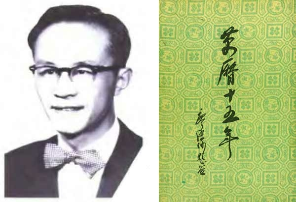
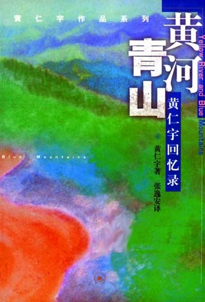

<!-- # ＜天权＞失败的总和——读《黄河青山：黄仁宇回忆录》 -->

**这是黄仁宇在解释为什么他要写《万历十五年》，“中国的问题大于上述人士努力的总和。上述不同阶段的失败必须被视为阶段的调试，以达成一致的终点。”那么，推广到黄仁宇自己身上，是不是他在暗示，自己的各种失败大于努力的总和，而这些失败必须被视为对历史的阶段性调试，最终将到达一个更深远的终点？**

# 失败的总和

# ——读《黄河青山：黄仁宇回忆录》

## 文/阮一峰（上海金融学院老师）

历史学家黄仁宇的最出名著作，大概非《万历十五年》莫属。

可是，我更喜欢他的回忆录《黄河青山》。

多年前，在学校图书馆读到的时候，就觉得这本书很特别，讲述了一个国民党军官如何变成一个历史学家，夹叙夹议，将个人命运放在历史背景上，写得非常生动。

最近，我重读这本书，才发觉以前读得太粗糙，完全没有领会作者的用意。通常来说，自传总是记录一些令人骄傲的个人经历，可是打开《黄河青山》，你只看到一件接着一件的失败。

全书一开始，就是黄仁宇的恋爱失败：

“1945年末，我遇见一个比自己小一岁的女孩，名字叫安，我对她一见倾心。许多天的下午及黄昏时刻，我从第三方面军总部借出吉普车，停在她家门口。佣人带我进到起居室，我就一直等，只听到走道中某处有座老式座钟发出的滴答声。安很少让我只等二十分钟。

即使我的虚荣心再强，都无法骗自己说，安曾经爱过我......这样也好，因为如果她说,“让我们结婚吧，你最好认真一点”，我就会不知所措。我的新羊毛制服经过适当的熨烫后，勉强让我可以在上海的社交圈中走动。但除此以外，身为上尉的我，甚至负担不起一间套房。我的母亲、弟弟及妹妹仍然住在重庆的山间破屋中，甚至没有自来水可用，更不要说每一层都有浴室了。”

然后，他开始讲自己选择人生道路的失败。1937年，他是南开大学电机系的二年级学生，听到日军入侵，不顾父亲的反对，毅然决定投笔从戎。

“抗战爆发后不久，沿海各处相继失陷，我即立意去从军。”

30年代，大学生当兵是一件极其稀有的事情。这种爱国热情当然值得肯定，可是从历史角度来看，他放弃工程师生涯，选择加入军队，等于选择了失败的人生。而且，毫不意外地，他不选择加入共产党。

“1938年，我个人反对延安是因为他们教的是游击战，并不合我的胃口。我觉得如果要当职业军人，就应该领导军队进攻。我甚至想当拿破仑。躲在暗处放冷箭，然后快速逃走，听起来可不光彩，不是我要做的事。”

讽刺的是，加入国民党军以后，他也没有上战场，而是被送到成都中央军校，大部分时间都在练习踢正步，等到三年后出来，抗日战争已经接近尾声。他作为军官被派到云南前线，可是日军临时放弃进攻云南，导致他连续几个月驻守在大山里，无所事事。这时，他开始体会到理想与现实的巨大差距。

“我们还停留在明朝的条件。如果我需要一头驴来驮负重物，我必须派士兵到村落里去找村长，在枪支的威胁下，他可能听从我们的差遣。至于邮政，要送一封信到邻近的省份，必须耗上一个月的时间。我必须慎选词汇，才能让村民听懂我说的话。”

“士兵穿着冬季的棉袄蜷缩身体入睡，用蚊帐、毛毯或帆布当被子，抓到什么就盖什么，甚至几个人合盖一床被。地板上则铺着稻草，这样的环境造就了虱子的天堂。”

“我们的兵士每月薪饷十二元，身为上尉的我，月薪也不过四十元。可是，山头上的土匪开出每支枪七千元的条件，而且保障携枪逃亡者的安全。......有些连队晚上把步枪锁起来，军官睡觉时把手枪放在枕头下。”

战争的最后阶段，黄仁宇的部队开赴缅甸，终于与日军正面作战了。可是，他在书中一笔带过那些“光辉经历”，比如，被日军狙击手击中大腿，差点丧命，或者给全国第一大报《大公报》当战地记者，后来出了一本《缅北之战》。详细写的，却是下面这样的事情：

“一大块生铁从炮壳剥落，飞落到身旁不远处，我才知道自己逃过一劫。我本能想捡起来当纪念品，却发现铁片滚烫难耐，手掌几乎长水泡。”

“一天晚上，自部队后方传来'卡碰'声，前方部队于是向我们还击。一片混乱中，后方部队也朝我们射击，机关枪及迫击炮此起彼落。为了避免被击中，我们尽量压低身体，浸泡在湿寒冰冷中。”

日军投降后，内战开始，他始终不受重用，最后还被怀疑可能叛变。调查表明他是清白的，但是他最终还是被强制退役。

“我不知道台北当局如何处理我的退役。我请成都中央军校的同班同学汪奉曾上校回台北时，帮我查查我在国防部的档案。他说我的退役完全合乎规定，记录上还添了备注：'该军官应永远不再委任或聘用'。”

既然成了平民，大陆和台湾都回不了，黄仁宇只好来到美国，以34岁的“高龄”重新进入大学读本科。

“时年34岁还是大学生的我，除了学费偶尔可以延后缴纳外，得不到任何单位的帮助，长期的工读生涯就成为很自然的结果。有一次，唐纳德·季林教授问我几个中国内战的问题，我那时在当电梯服务员。我对他说，我不介意回答他的问题，但我必须工作，他可能要上上下下电梯好几次。”

他有过各种各样的打工经历。

“我经历过各种工作形态：全职工作、兼职工作、一周上两天班、只在周末和学校放假日上班、完全停掉工作、重新申请等等，大部分是在餐饮业。”

“在餐厅当打杂小弟，必须穿上浆过的白制服，戴上顶端有个网子的白帽。店内有儿童时，收银员会按铃，我就冲上前去帮他们处理杯盘。我第一次做这件事时，一位年轻的妈妈对儿子说：'把盘子留着，只要给那个中国人就行了。'小孩好像听不懂，她又说：'艾瑞克，我告诉你，只要给那个中国小弟就行了！'我当时已年近四十，待在学校的时间多过其他人。不过我也找不到抱怨的原因，谁叫我做的工作就是打杂'小弟'呢。”

博士毕业后，依靠老师余英时的帮忙，他才在纽约州一所师范类大学找到了一个教职。可是，一所美国地方大学，会有多少学生对中国古代史的课程感兴趣呢？

“只有6到10名学生选我的课，一半以上消失得无影无踪，或是不定期来上课，我根本无法准备教材，不知该针对谁的水准来上课。负责任的学生向我抱怨，宿舍太过吵闹喧嚣，再也无法念书（，所以来上课）。懒惰的学生持续扰乱我上课，有一名学生已经缺席两星期，竟然在课堂上要我简述前两堂课的内容。如果不回答这种扰乱秩序的问题，只会弘扬我心胸偏狭的名声。”

“我已经养成习惯，只要学生连续缺席几次，我就设法联络他们。我的学生一开始就很少，可不能再丢掉任何一个。”

更糟糕的是，1979年，校方通知黄仁宇，他被解聘了。那时，他已经61岁了。

“当天晚上，妻子将消息告知我们的儿子。当时他只有11岁，还在念中学。在这个很小的大学城，人人都知道别人的举动及遭遇。直到今天，只要想到1979年3月27日那一天，我的儿子如何接受这个令人不快的消息，我就觉得很难过。儿子知道他的父亲已被解聘，而许多同学的父母却在大学里有杰出表现。有人的妈妈最近被选为系主任，有人的父亲筹组野外探险队，带学生去特殊景点，但他的父亲却被解聘了。他仍然坚持要我去参观他的赛跑大会和学校音乐会，但在心里一定也和父母一样难过。有些同学好奇地问他，你爸爸下一步要怎么办？我接到通知的数天后，邻家十岁男童丹尼走近在后院的我：'你要卖房子吗？”

解聘以后，找不到工作。

“我没有办法再找到另一个职位，即使朋友们试着帮我忙，但没有人会雇用一个刚被解聘的六十多岁的人。”

生活水准急剧下降。

“我被解聘后，就没有找到工作，也没有申请到研究经费。目前，我的家庭支出大半依靠社会福利津贴，每个月500美元，我的妻子和儿子也可以各领450美元。此外，我每个月的教师年金300美元。这些钱让我们勉强维生，略微超过最低生活水平。我的版税收入可以用来缴税，有时还要动用我妻子的储蓄。我只要一听到热水器要更新，或是屋顶有破洞，心都会一阵抽痛。我们可以设法偶尔附近玩玩，但如果要去一次纽约，家庭预算就必须重新大幅更动。我每次定大笔出版品或买几本书时，就必须考虑财源。”

直到《万历十五年》出版，在中国引起轰动，黄仁宇的经济状况才开始逐步改善。自传也就写到这个地方。

看了上面摘录，我们不禁要问，为什么黄仁宇只强调自己的人生失败，他想证明什么？大多数自传都在自我美化，你何时见过，有人执意要把自己塑造为“失败者”（Loser），还写成500页的传记，一定要让后人记住这一点？

我联想到了《万历十五年》，里面一共写了六个人物----万历皇帝、申时行、张居正、海瑞、戚继光、李贽----他们也全部失败了。事实上，《万历十五年》的主题就是，中国作为一个整体的失败。它的结尾是这样的：

“当一个人口众多的国家，个人行动全凭儒家简单粗浅而又无法固定的原则所限制，而法律又缺乏创造性，则其社会发展的程度，必然受到限制。即便是宗旨善良，也不能补助技术之不及。1587年，是为万历十五年，丁亥次岁，表面上似乎是四海升平，无事可记，实际上我们的大明帝国却已经走到了它发展的尽头。在这个时候，皇帝的励精图治或者宴安耽乐，首辅的独裁或者调和，高级将领的富于创造或者习于苟安，文官的廉洁奉公或者贪污舞弊，思想家的极端进步或者绝对保守，最后的结果，都是无分善恶，统统不能在事业上取得有意义的发展，有的身败，有的名裂，还有的人则身败名裂。

因此我们的故事只好在这里作悲剧性的结束。万历丁亥年的年鉴，是为历史上一部失败的总记录。”

仔细阅读这段话，“最后的结果，都是无分善恶，统统不能在事业上取得有意义的发展”，这就是说，失败是不可避免的。《万历十五年》的主题是，中国的失败不可避免；那么《黄河青山》的意思是不是说，黄仁宇个人的失败不可避免？两者之间有什么联系吗？

“我写回忆录不是为了自己，而是为了说明我的背景，为了特定的历史史观。”

显然，黄仁宇在用自传，解释他的历史观。

“在美国读书和打工时，我常被在中国的痛苦回忆所折磨，不时陷入沉思。后来当教师，拿着麦克风站在五百名大学生面前，无法立即解释：为何康有为失败了，孙中山失败了，袁世凯失败了，张作霖失败了，陈独秀失败了，蒋介石失败了，而毛泽东也失败了。为使我的讲课内容前后一致又有说服力，唯一的方法就是说，中国的问题大于上述人士努力的总和。中国文明将和西方文明融合的说法，是人类历史上空前的事件。上述不同阶段的失败必须被视为阶段的调试，以达成一致的终点。对我们这些有后见之识的人来说，这点很明显，但舞台上的演员看不到。”

这是黄仁宇在解释为什么他要写《万历十五年》，“中国的问题大于上述人士努力的总和。上述不同阶段的失败必须被视为阶段的调试，以达成一致的终点。”那么，推广到黄仁宇自己身上，是不是他在暗示，自己的各种失败大于努力的总和，而这些失败必须被视为对历史的阶段性调试，最终将到达一个更深远的终点？

“我开始领悟，为何我必须在生命中见识如此多的奇人异事，面临如此多的暴力。我恰巧出生在中国政治的最低点，以及人心惶惶的最高点。

我阅读的东西，听过的对话，在中国见证的事件，都只有在我迁居美国多年后才产生意义。由于离主体很远，又有够长的时间来发展后见之明，终于可以轮到我说，我懂了。”

黄仁宇是在说，他的个人失败，是20世纪中国遭受挫折的一种个体反映。

“以长期观点阅读中国现代历史时，就不会连连沮丧，反而会看到全本的戏剧在眼前开展。中国历史很可能即将融入世界历史，不但是空前的进展，而且是实质上的融和，不再缺乏希望与期许，纵使还会有挫败及暂时的逆转。”

如果你看到了历史的长期合理性，那么当你经历了种种失败，年老时回望自己人生，才能平静地接受命运，体会其中的必然，然后静静地等待隧道的尽头开始展现一丝曙光，证明那些企图逆转命运的举动，并非无谓和徒劳，一切自有内在的因果。这大概就是《黄河青山》的写作目的吧。

（荐稿：陈蓉；责编：应鹏华）
