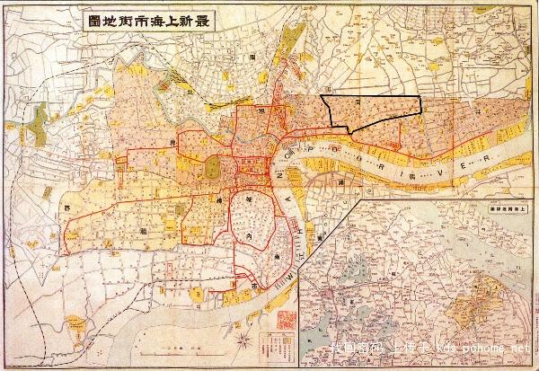

<!-- # ＜开阳＞租界里的法律故事（上） -->

**租界既是中国领土但并不受中国政府直接管辖，但租界里又居住着大批中国居民。尽管租界和中国政府管辖的地带往往仅有一河、一桥或一路之隔，但它使得中国大一统的政治局面出现一道缝隙。**

# 租界里的法律故事（上）

## 文/周大伟（西南政法大学）

在大师钱钟书先生的小说《围城》里，主人公方鸿渐谈情说爱时总愿意用外文来表达那些多少有些刺眼肉麻的词语，此时，方鸿渐觉得自己“正像政治犯躲在外国租界里活动”。意思是说，生活在上海滩上，却在用西方书函来向女士们示爱，可以减轻不少尴尬和羞涩；好比当年那些政治犯在租界内活动，可以躲避中国法律的约束。

钱钟书这句有些调侃意味的话语，本意是为了讥讽那些上海滩上小知识分子的酸腐。但无意中却扯出了一个晚清民初时期的经典法律图案：躲进租界里的某类人的法律生态。

这事儿说来话长，还得从100多年前发生的那些人和事说起。

很多细心人可能已经注意到，在清末民初那个年代，那些活跃在大城市里的革命党（当然包括共产党在内）人，在遇到危险时第一个想到的就是——往“帝国主义的”租界里跑；如果类似上海滩上那样的英租界、法租界还觉得不够安全，就往更大、更远的租界里跑（比如，香港和澳门）；如果还不行，那就只好流亡欧美和日本了。假如在租界里不幸被“红头阿三”（上海人称租界巡捕房里的带着红顶帽子的印度人）捕获，他们第一个想到的，就是千万不要让租界法庭把自己引渡给中国当局。因为，租界里的“帝国主义列强”再凶恶，总还是要走个“正当的法律程序”，甚至还可以请律师为自己辩护几个回合，通常或保释出狱，或被判个三五年监禁，出来又是一条好汉。假如真的被“引渡”给了当时的“中国政府”，轻则绑赴菜市口“就地正法”，重则株连九族、“满门抄斩”。

租界既是中国领土但并不受中国政府直接管辖，但租界里又居住着大批中国居民。尽管租界和中国政府管辖的地带往往仅有一河、一桥或一路之隔，但它使得中国大一统的政治局面出现一道缝隙。这道缝隙在清朝政府、北洋政府、南京政府的统治系统中，形成持不同政见者或反政府力量可以利用的灰色政治空间。在危难时刻，中国近现代史上的不少著名人物，例如康有为、梁启超、章太炎、蔡元培、吴稚晖、陈独秀、廖承志等人都曾利用这个灰色政治空间保住了性命或成功逃脱。

1840年的鸦片战争失败后，满清政府被迫打开国门，开放通商口岸，准许外国人来华经商、行医、办学、旅行和传教。但是，一旦这些居住在在中国的外国人遭遇到法律问题（比如刑事和民事案件），应该由哪个法院并适用什么法律来审理呢？在当时，这的确是个极大的难题。

当年的中国政府为了维护“主权”，当然主张要由中国自己的“衙门”审案并适用中国自己的律例。可是洋人们却断然不肯接受。他们提出的一个重要理由就是，中国的法律与当时的“文明国家法律”相比，实在太落后了。其中最让洋人们无法接受的就是“中国衙门”里“刑讯逼供”的滥用。南宋之后，元、明、清三个朝代，中国法律史上有一个很不光彩的主题，就是“酷刑的泛滥”。那时候，中国各地的衙门、监狱和刑场上，每日鞭杖之声不断，受刑人惨叫之声此起彼伏。甚至鞭笞火烫、凌迟砍头、剥皮抽筋等酷刑层出不穷。在许多来华经商、旅行和传教的西方人眼中，那些戴着沉重的枷锁被铐在衙门门前示众或被剥光衣服五花大绑地游街的罪犯们，是晚清时期这些西方人回到自己的故乡时向乡亲们津津乐道的“中国城市风景”。

1839年3月10日，林则徐作为钦差大臣抵达广州。在禁烟文告中，他责令外国鸦片贩子三日内必须呈缴鸦片并签署保证书，若有再贩，“一经查出，货尽没官，人即正法，情甘服罪”。当时很少人想到这个文告竟为日后中英冲突埋下隐患。从中国人的立场来看，林则徐的做法没有什么不对，中国官人自古以来就是这种思维方式和一贯做法。但是，英国人却强烈抗议。英国人的逻辑是，一个人犯了法，必须经过法院的合法程序进行审判，根据其行为触犯法律的程度给予恰当的处罚。而“人即正法”，未经合法审判就被处死，显然有违英国人的程序正义的原则。可当时中国的“法院”在哪里呢？

自1843年租界在上海开辟后，西方列强凭借条约中关于领事裁判权的规定，在租界内设立了领事法庭（ConsularCourts）。租界内的外国人违法犯罪则可以不受中国法律的制裁，由各国驻沪领事自行审理。1868年4月，根据上海道台和英美等领事商订的《洋泾浜设官会审章程》，在英美租界设立了会审公廨。会审公廨是上海历史上在特殊时期、特殊区域成立的一个特殊司法机关，由道台任命中方专职会审官（谳员），与外方陪审官（领事）会同审理租界内与华人有关的诉讼案件。由此，租界成为“国中之国”。

从此刻开始到后来的一百多年里，有关中国的法律中的绝大部分问题的来龙去脉，人们都不得不从与西方的关系中加以理解。整个一部中国近现代的法律发展史，其实就是一部中国法和外国法、中国政府和外国政府之间冲突博弈而又调适妥协的历史。

在目前流行的历史教科书里，通常是以帝国主义的“阴谋论”来解释上述现象的。这种说法认为，帝国主义蔑视中国的法律，隐藏在背后的动机是想逃避中国法律的制裁，抗拒中国皇帝的权威，达到践踏中国主权的目的。这一说法至今仍然是大学法学院法制史课程考试乃至中学生高考试卷的标准答案。

“己所不欲，勿施于人”，这是中国儒家文化中的盖世格言。对于那些来华经商、行医、办学、旅行和传教的外国人而言，这样的残酷律例能不设法“回避”吗？这样的皇帝权威能不“抗拒”吗？还有，这样的“国家主权”充其量也只是和紫禁城里那些皇亲国戚的荣辱有关，它究竟和那些缺乏人权保障的普通百姓的福祉又有多大关系呢？

在人类历史长河中，腐朽的、缺乏人道主义的司法法律，为新的文明体系所取代，是一个必然的普遍的规律。吊诡和不幸的是，当这两种不同文明体系的司法冲突是和侵略与被侵略、先进与落后、傲慢与屈辱联结在一起的时候，我们该如何理性地判断其冲突的价值呢？是将正反两者一并谴责呢？还是站在国际和近代的层面来避免判断的误区呢？显然，一百年前租界里发生的法律故事，给中国法律界提出了过于苦涩并沉重的研究课题。

作者简介：

周大伟，旅美法律学者。

祖籍江苏无锡，西南政法大学、中国人民大学法学院、美国伊利诺大学（香槟校区）法学院。美国哥伦比亚大学法学院研究学者。热爱法学写作，不做官样文章，正在尝试以深入浅出、幽默诙谐的语言来阐述艰涩枯燥的法律问题，主张客观温和、活泛并人性充沛的写作风格。

（荐稿：陈蓉，采编：许鹤立，责编：应鹏华）
