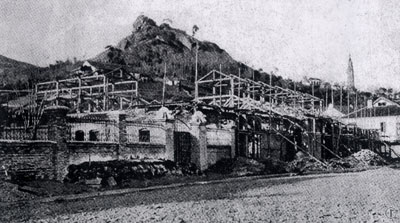
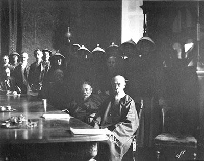

<!-- # ＜开阳＞租界里的法律故事（下） -->

**然而，就是在这样一个“说不清、道不白”的租界里，中国近现代的科技、司法、教育、医疗、新闻、城市规划管理、工商管理以及女权意识、市民意识、法治意识、公共道德意识等等成果，像涓涓细流，通过租界所体现的西方文明，点点滴滴地扩散开来。**

# 租界里的法律故事（下）

## 文/周大伟（西南政法大学）

鲁迅曾把自己的杂文集取名为《且介亭杂文》、《且介亭杂文二集》、《且介亭杂文末编》。“且介”二字是什么意思呢？最早告诉我答案的是自己的中学语文老师周思源先生（后任北京语言学院中文系教授、中央电视台“百家讲坛”演讲嘉宾）。记得他当年在讲述鲁迅先生的杂文时告诉我们，鲁迅先生这些杂文大都是在租界里（也有人称其为“半租界”，即日租界扩展延伸的地段）写成的，鲁迅从租界二字里各取其一半，即以“且介”二字命名自己的杂文集。鲁迅生命的最后十年里写的那些“匕首和投枪”一类的文章，大都是他在上海日租界里向外投掷完成的。后来，不少人由此对鲁迅的“爱国”、“勇敢”以及“骨头硬”一类品格颇有微词。对这件事，鲁迅自己也从不愿意多讲，因为说出来一定会让他的民族自尊心“很受伤”。

中国共产党的“建党大业”，其实也是在上海的租界里筹办的。因为法租界是中共主要创办人陈独秀、李汉俊、李达等人当时的居住活动地。今天很多人经常去朝圣的中共“一大”会址就坐落在当时的法租界内。在北洋政府执政时代，尽管党禁解除，但对政治犯的迫害从未停止。由此，上海租界便是进步人士活动比较理想的场所。只要不是明目张胆地进行反政府的暴力活动（如暗杀、绑架等），声称保护结社、新闻自由的租界当局大都是睁一只眼闭一只眼。中共早期领导人陈独秀在1921年10月、1922年8月两次被法租界当局拘捕，分别被关了22天和5天，理由是宣传“过激主义”，经有关方面斡旋，分别罚大洋100元、400元了事。陈出狱后，还是“屡教不改”地在法租界活动。自然，出于阶级仇和民族恨，革命党人们对租界的痛骂和声讨始终不绝于耳。在这些人眼里，租界像是块臭豆腐，闻起来很臭，但吃起来特香。

听一位老家在山东牟平的著名法学教授说起过，100多年前，他的家乡附近有个村子，毗邻早年德国殖民者管辖的胶州湾属地。村民们为了寻求“洋旗”的保护，趁着月黑风高的晚上，偷偷地将“租界”的地标向后移动，以便将自己的村子也包括在内。这种“挟洋自重”的自保行为，在当时“万恶的旧社会”里似乎完全可以被理解和原谅。因为民间公认的生存法则是：百姓怕官府，官府怕洋人。后来闹起了“义和团”，又有了“洋人怕百姓”之说，当然指的是百姓中的某些异类。君视民为草芥，民视君为仇敌，这是皇权专制独裁统治的必然结果。从中我们又一次看到，一个腐朽垂危、民心涣散、贫穷积弱的国家，在国难危急的时刻只能处于孤立无援、被动挨打的境地。

据学者吴思的研究，1927年11月26日，重庆聚福洋行与法国吉利洋行签订密约，其实两家是假合资，法方在名义上拥有的1/3股份是“虚股”。中方借用法商之名，挂法国国旗，每年支付“挂旗费”三万两白银。在1911年，辛亥革命前后，中国海关挂号的内港船只中，挂洋旗的船占16%～17%。1924年，这个数几乎翻了一番，超过了32%。挂上昂贵的洋旗到底有什么价值？用聚福洋行黄瑾莹总经理的思路看，这是一笔富于中国特色的物有所值的交易：聚福洋行凭借这块法商的招牌，在那四川军阀混战的防区时代，确实减少了许多麻烦。

租界的存在一直是中国人内心的隐痛。上世纪60年代当小学生时，在大型舞蹈史诗《东方红》里看到过一幕：舞台上，上海外滩一座公园的门口，“华人与狗不得入内”的白底黑字牌子赫然触目，一个个洋巡捕面目狰狞，一群愤怒的中国人在牌子前挥拳扬腿愤而起舞。在今天的中国，老幼妇孺对这个牌子的故事铭记于心，它成了中国近代屈辱史的一个标志。

不过，直到今天，学者们对历史上究竟有没有过这样一个告示牌还在争论不休。从历史档案中，至今没有查到直接写着这样条文的记载，甚至也没有人拍下过任何现场照片。除了个别学者声称亲眼见过这个告示牌以外，它依然匮乏相关的有力证据。

上海学者熊月之先生在《关于上海外滩公园的历史记忆》中提及了一个鲜为人知的史实：当年洋人限制华人很重要的一条理由，就是华人不守公德，摘花践草。有史料记载，在外滩公园允许华人凭券入园后，不少人不顾公益，不听劝阻，在里面狎妓作乐、损毁花木、随地吐痰，甚至随地大小便等，致使公园管理当局十分恼怒。

在1913年，一位后来当了毛泽东的岳父的人——北京大学教授杨昌济这样写道：“试观汉口、上海之洋街，皆宽平洁净，而一入中国人街道，则狭隘拥挤，秽污不洁，……上海西洋人公园门首榜云：‘华人不许入’，又云‘犬不许入’，此真莫大之奇辱……平心论之，华人如此不洁，如此不讲公德，实无入公园之资格。”杨昌济还说，西方人虽然是欺人太甚，但中国人如果不改习惯，“养成与西人平等交际之资格，则此等耻辱终湔洗之期”。

可见，除了维护民族尊严争取平等权利的“外省型反应”以外，还有另一种呼吁国人尊重公德、改良习俗的“内省型反应”。实际上，自20世纪初以来，尤其在中国思想界和知识界里，一直存在这样的清醒反省。但是，在“五四”以后的激进革命的喧嚣声中，尤其是在1928年外滩公园取消对华人入园的限制后，洗刷耻辱的祝捷声完全淹没了这类微弱的清醒反省。这类反省在中国的学者笔下以及后来所有的历史教科书中一概消失了。毛泽东的岳父杨昌济教授的上述理性反省文字，并没有因为自己的女婿后来成了“开国领袖”而获得彰显和传播。

如果仅仅从中西近代司法观念、制度和运作的层面看，当时的中国完全不属于一个近代法治国家。一系列的冲突尽管最初是在西方列强殖民侵略扩张的背景下展开的，而且从一开始就呈现出一方相对落后并极端保守而另一方相对先进并竭力渗透的持久碰撞态势。在租界里，不仅人们再也看不到鞭棍杖笞和砍头示众，还让中国人第一次知道了什么叫律师，什么叫陪审制，什么叫法律援助。从封闭排外保守且具有较强内聚力的中国专制司法体系逐渐解体，到西方先进的司法制度开始为中国社会所逐渐继受，这是一个从1840年鸦片战争开始发生但直到今天还没有完成的漫长而痛苦的转型过程。

很长一段时间里，人们一直很难理解，为什么如此昏庸保守的慈禧太后会在1900年底（光绪26年）就下诏书启动了晚清的司法改革？显然，这和当时的中国政府试图早日废除不平等的治外法权的强烈愿望有关。中国的法律只有早一天和西方法律“接轨”，清廷才能有理由和借口早一天让西方各国交出领事裁判权。这个驱动力如此之大，甚至到了“有条件要上，没有条件创造条件也要上”的境况。然而，出乎慈禧太后意料之外的是，晚清的司法改革不仅仅触及了传统的诉讼审判制度与方式，而且直接冲击了几千年的皇权专制体系，成为整个社会走向近代文明重要步骤。

晚清以来，西方国家在中国共设有26个租界。辛亥革命后到抗日战争胜利前后，民国政府陆续废除了各国在中国的领事裁判权和其他相关特权。1945年，当时的国民党政府宣布收回外国在华（未包括香港和澳门）的所有租界和租借地。从此，外国租界在中国大陆的历史宣告结束。

一个愈加普遍的共识就是，西方租界在中国境内发挥的作用过于复杂，其复杂的程度可以超出人们的任何想象。任何人试图对其做出简单的归纳，都可能挂一漏万、失之偏颇。它既是破门而入的强盗，又是前行引路的先生；既是灰色的染缸，又是红色的摇篮；既是西方列强侵略中国的桥头堡，又是中华民族反抗侵略的大本营；既是土匪流氓的蜗居地，又是革命志士的藏身所；既是强者傲慢的小天井，又是弱者觉醒的大舞台；既是冒险家和殖民者的乐园，又是“德先生”和“赛先生”的讲坛；人们可以说出一万个理由谴责它是罪恶的深渊，也可以说出一万个理由赞美它是文明的窗口。在近代租界这些狭小的空间里，如此多种异质文化在这里冲撞和融合，堪称史无前例。

然而，就是在这样一个“说不清、道不白”的租界里，中国近现代的科技、司法、教育、医疗、新闻、城市规划管理、工商管理以及女权意识、市民意识、法治意识、公共道德意识等等成果，像涓涓细流，通过租界所体现的西方文明，点点滴滴地扩散开来。一百多年来，中国传统文明和西方现代文明之间的巨大差距和冲突，极大地刺激着中国人，在反抗、挣扎、调适和妥协中，东西方共同推动着历史车轮前进的步伐。

（荐稿：陈蓉，采编：许鹤立，责编：应鹏华）
