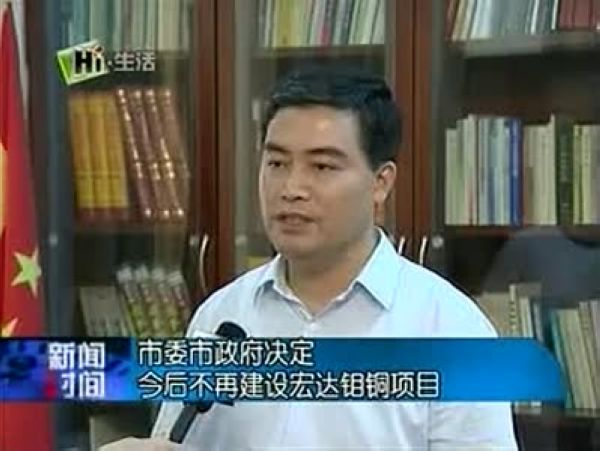

<!-- # ＜摇光＞钼矿好不好！人民要不要？ -->

**这无所谓对错，完全是各人自己的权衡——并没有一个标准能踩着科学正确理性的祥云来统一一切。这就是现在面临的问题。从一些人的角度来看，引进几百亿的投资项目，对什邡的经济太有好处了，与此相比，付出的代价简直微乎其微。而另一些人不愿意。他们觉得自己并不能从中得益，所以并不想支持。更或者说，他们有其他原因，哪怕是破坏风水。不得不说，如果一个地区的绝大多数人都信风水，那么在这个封闭的环境里，这就是一条重要的理由。前一种人指责后一种人无知愚昧，信谣传谣，没有大局观。但问题是，这是前一种人的观念。长久以来，中共在西藏就一直是用这样的思维：我是对你好，你凭什么，你为什么不要？自持科学理性而强人所难，非要逼人喝鱼汤，这就是蛋疼。不过我相信最重要的原因不是这个，而是几百亿的引资居然被一群人给搅了，实在令人恼羞成怒。**

# 钼矿好不好！人民要不要？

## 文/陈子赟（南京师大）

1，

刚看到一篇文章，颇为意难平。通篇在抄百科上“钼如何如何是人体不可缺乏微量元素”、“钼无放射性无致癌性”、“钼在化工中有什么什么作用，在农牧业中有什么作用”，最后得出结论，什邡人如何如何，游行如何如何，武警扔催泪弹如何如何。

这篇文章列举的事实对不对？

对。

实际上这还算是一个常识，我记得旧版的小学语文课本上就有一篇这样内容的短文：钼矿厂的工人发现，他们上下班必经的一条路上，苜蓿长得比其他地方都好，后来发现是因为他们身上的钼矿屑对苜蓿生长具有增产效果。

钼确实有非常多的作用，缺钼还可能致癌。

但文章在混淆一些常识：钼本身无放射性无毒，就代表钼矿工业没污染么？煤炭有没有放射性有没有毒？

钼铜矿是很多国家的重点产业，也不能证明钼铜矿没污染。煤炭不也是支柱产业？

按照这种逻辑，想必那个作者也无法理解“草本”的造纸业和奶牛场对水源的严重污染。

现代工矿业在采矿筛矿等各种工序中需要多少化学步骤？排出的矿渣废水怎么处理？以为钼铜矿开采就是有机合成体光膀子抡矿锄么？

此外，钼是人体所需微量元素，这就代表它对人体无害么？氧多了人吃得消么？

氧中毒是极端情况，但这并不是夸张。钼过量，“顶多”是痛风么！

钼铜矿的开采必然会带来污染，只不过是程度多少而已。如果加以有效的管理监督，它的危害理应不会超过大部分矿业。但这个前提是，“加以有效地管理监督”。生活在这个现实中，人早已见多了相关组织利润至上的实际行动，能多刮一块，绝不多留五毛。

2，

从一开始，我就不认为这是个围绕钼铜矿谁对谁错的问题。这是人各自的选择和权衡。

可以打个很简单的比方说清楚。

比如我上班下班好好的，这时候有关部门跳出来说：想改造某某道路，所以可能让你在上下班路上多花半个小时。但是，我们交通部门会给您每个月多五百块钱的补贴，好不好？

这时候就是各人各自权衡了。有的人觉得，每天多坐半个小时公交，一个月多五百块钱，不错啊！

有的人则不觉得，就是给他们一千块钱，他们都不肯多花15分钟。

这无所谓对错，完全是各人自己的权衡——并没有一个标准能踩着科学正确理性的祥云来统一一切。

这就是现在面临的问题。从一些人的角度来看，引进几百亿的投资项目，对什邡的经济太有好处了，与此相比，付出的代价简直微乎其微。

而另一些人不愿意。他们觉得自己并不能从中得益，所以并不想支持。更或者说，他们有其他原因，哪怕是破坏风水。

不得不说，如果一个地区的绝大多数人都信风水，那么在这个封闭的环境里，这就是一条重要的理由。

前一种人指责后一种人无知愚昧，信谣传谣，没有大局观。

但问题是，这是前一种人的观念。

长久以来，中共在西藏就一直是用这样的思维：我是对你好，你凭什么，你为什么不要？

自持科学理性而强人所难，非要逼人喝鱼汤，这就是蛋疼。不过我相信最重要的原因不是这个，而是几百亿的引资居然被一群人给搅了，实在令人恼羞成怒。

3，

钼矿好不好，是一个问题，人民要不要，是另一个问题。什邡是你什邡政府的，是你什邡一些资本家的，但同时也是什邡普通百姓的，关于钼铜矿事宜，什邡普通百姓有没有影响结果的可能？

事实上什邡平民没有什么途径，详细叙述可以参看上一篇《不游行，难道还走司法渠道？》。

那些说什么听证会之类的，还是算了吧，规章里还规定没剥夺政治权利年满十八岁的人都有资格参选人大代表呢。

这个博弈就跟南京地铁一个样，有的人反对因为建地铁而砍树，为了反对砍树而游行。而我是绝对支持地铁，不能容忍地铁建设停工。你说谁对谁错？按我的利益出发，为了解决拥堵问题，把长江大桥炸了完全没问题，但肯定有的人觉得我疯了——他不用每天走长江大桥，自然不能理解。

人人都是从自己利益的角度看问题，权衡利弊，关键是看有没有沟通的渠道。什邡事件最值得让人思考的，就是这个问题，就是在司法无法独立的现实条件下，如何不让两个阶层的诉求最后变成流血与暴力宣泄。

所以，钼铜矿好不好，你说了不算。从我个人角度看，要是老家有钼铜矿，没准我还会欢迎它进来。但现在要承担的主体在什邡。

即使是基础教育和高等教育这样大部分人都觉得政治正确的事情，塞到西藏也有很多人不领情不满——人家不要，你不能硬塞。道理就是这么简单。

发展高GDP的经济，对于官员来说是政治正确，但对于很多平民而言，他们已经意识到这不是他们的利益正确。出于对组织监管污染不力，成本都扔给大众承担的诸多事例，我认为什邡人的担忧不无道理，而且很有必要。

最后再次申明，你觉得好，未必别人觉得好，你觉得可以付出的、微不足道的代价，未必别人愿意承担。如果早多一些像你们这样的科普大军，要是有一个畅通的交流渠道，什邡何至于流血烧钱至此？

另外P.S.一下：关于上面提到的例子，在现实中，有关部门还给你补贴？屁。这次南京城西干道大改造，我接触的出租车司机没一个不骂骂咧咧的。我问，改造难道不是要长痛不如短痛，工程完了之后交通能好一点吗？他们说，那帮贪官，就是要政绩和捞钱！

对于城市交通方面的专业知识，我不是很具备，不过感觉上要是完全没益处，那么交通规划部门里那些专家教授都可以剖腹自裁了。

但你就是不能让出租车司机理解。

按中共或者企业的实用主义逻辑，垄断了宣传工具，大多数对象却仍不理解，你宣传部他妈是吃屎的啊！

编者注：本文标题系编者所改，原标题为“钼矿好不好，人民要不要”。

（采编：黄理罡；责编：黄理罡）
