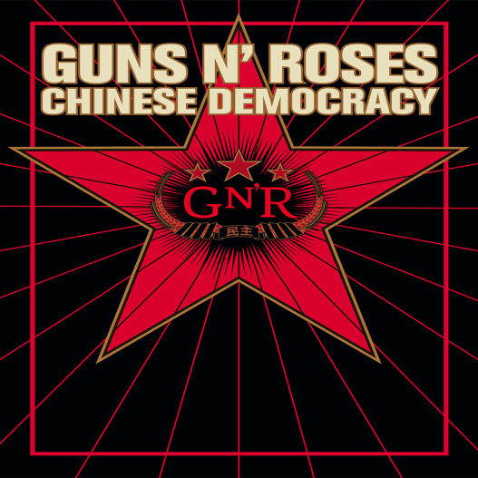

<!-- # ＜开阳＞民主的魅与惑——从什邡说开去 -->

**民主并非万灵药，但并不是否定民主的价值，相反，我的最终想法是，为民主去一点点的魅，因为我越来也觉得，在追求民主的道路上，对民主价值过分推崇比怀疑和反对民主的观点更妨碍人们对民主价值的正确理解和追求，“由爱而生的恨和失望比一开始的怀疑更令人绝望”。**

# 民主的魅与惑

# ——从什邡说开去

## 文/马军（国立台北大学）

什邡一事，纷纷扬扬已经两天有余，由于微博的传播，使得网民们都通过网线，隔着成百上千公里或义愤填膺，或沉着冷静的围观。以我个人的观察，对此事的发生，站在百姓一边的成比较稳定的相对多数，从薛蛮子任志强这些商界精英，到贺卫方刘晓原这些法律人士，到韩寒老罗这种网络红人，再到我身边的这些普通的学生和百姓，对于政府使用镇暴警察和镇暴武器纷纷表示了谴责。当然，我也观察到了，关于这些事，也有一些同学和网友发表了一些不同的观点，认为民众的抗议是因为欲壑难填，也对一些人的“民主原教旨主义”提出了自己的忧虑和批评。姑且放下自己的立场不谈，在这篇文章的开始我想说的是，从什邡这件事在互联网上的传播，我们可以看出，即使是在我们这个传媒和网络被管控得相对比较厉害的国家，我们也不能否认，大学和互联网，应该是这个国家最自由的地方，再加上这次事件背后可能出现的一些不为人知的情况，导致这次事件在微博和一些SNS网站上的传播并没有被大规模地删帖，这就使得本次的事件得到了我们所经历过的最全面和充分的一次传播，在这次全面和充分的传播过程中，不同的声音的出现，也导致人们产生的不同的看法，其实这就是很多人一直呼吁自由媒体的原因，在传媒自由的情况下，由于媒体信息来源和视角的多元，以及媒体之间的竞争，会给受众带来比不自由媒体情况下尽可能更充分和全面的信息和影响，受众可以自由选择自己的信息，或强化，或改变自己的原有态度。

当然，这并不是本文想探讨的重点，重点是一些关于民主的话题。在这件事情的讨论中，除了这件事关乎到的环境保护和基本人权的问题，民主这两个字，基本上是讨论最多的一个概念，甚至超乎了这件事的本身。不少人认为这件事又是中国民主进程中的一件大事，也有人为民主化可能带来的如这件事一般的混乱带来担忧。人们不同的看法，很大程度上是因为每个人对民主的理解和定义不同。萨托利曾经说过，就如民主这个概念的复杂一样，我们生活在了一个民主观极其混乱的时代。本文，我只想根据自己浅薄的政治学知识，试图阐释一些关于民主的理论和概念，为各位读者更好的理解民主和更清晰的观察身边发生的公共事件提供一些微不足道的参考。

民主之魅：民主有那么好么？

隐约记得在那个纪念广场事件的纪录片里，有一位当时的大学生站在纪念碑的上方进行的义正词严的演讲：“民，就是人民，主，就是当家做主。我以为，民主，就是人民当家做主，我们要当家做主。”想必人民当家做主，这应该是大家看到民主这个词首先联想到的概念。但是如果大家知道一点政治学知识的话，就知道民主是一个外来词，其西文的词源来自于希腊语，是人民掌握权利的意思，这和人民当家做主之间，还是有着细微的差别。民主一词引入中国之时，中国人面临着反帝和反封建的双重任务，民主一词被赋予了很多革命与乌托邦式的内涵，某种程度上作为一种“药”的职能的存在。有其是在当今的社会，伴随着几十年来的高速增长的经济，越来越大的贫富差距，越来越严重的污染问题，越来越多的群体性事件，越来越多的周边领土领海的争议，很多的问题都让人不禁想起了民主的这剂“药方”，很多人认为，有了民主之后，中国这些问题就能解决了，蓝天白云重现，污染灾害再见，腐败能够治理，房价能够下跌，高富帅能够低调，穷屌丝能够逆袭，社会上老百姓安居乐业，衙门里公务员官不聊生……当然，这些都是现存的很多社会问题，人们寄希望于找到解决问题的药方的出发点是好的，然而客观来说，对民主功能的过度期待反而会给追求民主价值的人以打击，因为历史事实证明，虽然对解决某些社会问题有着很好的作用，但是民主远非万灵药，并不能治愈很多问题，甚至还会带来一些问题。

要搞清楚民主能够解决什么问题，很明显的，我们得搞清楚民主是什么。民主本身有两种内涵，一是一种政治价值上的内涵，一种是政治工具上的内涵。政治价值上的内涵很容易理解，这东西就跟民族主义、自由等等价值一样，是一种由于对宗教、或者道德或者自然法则的推崇而产生的不完全理性的一种追求。《勇敢的心》里梅尔吉布森对自由的呼喊振聋发聩让人感动，就是一种对自由价值的追求。而政治工具上的意涵指的是民主是一种政治工具，是一种我们用来追求更好的政治的过程中使用的东西，这种工具上的意涵就能够被理性衡量了，很多人认为“如果民主带来动荡、混乱甚至国土的丧失，那么我宁愿不要民主”，这么说的人就是在用理性衡量民主的工具价值了。

对于民主的定义，我个人比较推崇奥地利学者熊彼得的说法，熊彼得认为“民主就是一种制度性的安排”。这个概念可能不太好理解，说白了很简单，就是老百姓根本不制定政策，什么民主是一种生活方式这种话就是屁话，人民不是主人，人民只有在投票的那一刹那行驶了主人的权利，投票之后，被选上的人说了算，老百姓该干嘛还得干嘛去。这套民主的理论叫做程序民主理论，而且和帕累托等社会学家的精英理论在某种程度上产生了合流，所以也有人称之为精英民主理论：“即便是民主下，对政策有影响的，还是精英。”所以，民主不是人民当家做主，而是民主只是一种制度，让老百姓选出替自己做决策的人的一种制度而已。

有人看到这里可能会泄气，会认为这不就是假民主么？其实这么说的人，错不在民主上，而是他把民主太理想化了。但是即便是这种“假”民主，在追求更好的政治的意义上也有着比没民主更高的价值，以什邡这件事为例，在有市长选举的民主制度安排之下，候选人在竞选的过程中，肯定会对修建这个化工厂的政策进行公开的辩论，如果在民意极其反对的情况之下，这个工厂要么不建，要么下令修建的官员就得押上自己的政治前途和自己政党的政治名誉或瞒或骗地修建工厂，而在修建的过程中，反对党和媒体也会严苛的监督整个过程。虽然民主制度不能保证这个工厂一定不建，但是最起码，能够增加很多政府强硬上马的成本，让政府做“民众不想做”的事情的时候，更有顾虑。

民主之惑：对于民主的误解和忧虑

我上述的观点只是想证明，民主并非万灵药，但并不是否定民主的价值，相反，我的最终想法是，为民主去一点点的魅，因为我越来也觉得，在追求民主的道路上，对民主价值过分推崇比怀疑和反对民主的观点更妨碍人们对民主价值的正确理解和追求，“由爱而生的恨和失望比一开始的怀疑更令人绝望”。说了一些去魅的话，接下来，本人将再尝试简要的解释一些关于民主的误解和疑虑。

首先，大家最关心的就是民主会不会带来混乱的问题。人们会担心，民主会带来多数暴政的问题，这是一种必要的担忧，但是从实际来看，却是过度的担忧。代议制、分权制衡以及司法独立和基本人权的保障，都很有效地解决了多数人暴政的问题，从历史上看，专制带来的暴政要远比民主带来的暴政多得多。从什邡这件事能够看出，假如有良好的民主选举和沟通的渠道存在，根本不会发生警察殴打民众的“专制暴力”和民众扔石头砸警察的、推翻警车的“多数暴力”，民主在防范暴力的过程中，价值要远远大于危险性。

另一种对民主是否会带来混乱的担忧是来自于政治稳定，开放言论自由和民主之后会不会带来社会的政治不稳定呢？答案是有可能的，蔡定剑认为：“历史证明，专制才是人类社会不稳定的根源，民主是抑制独裁和暴力的最适当的工具”；“拉美、东南亚等国的混乱，是自称民主的威权之乱，是民主转型之乱，不是民主之乱”。作为研究民主政治的大家，蔡定剑的观点有其意义，但是我认为，蔡先生的观点有些乐观。过早开始的民主化的确会对社会稳定带来伤害，但是在该民主化的时代不开放民主化，更会给社会稳定带来伤害。集权政治作为专制政治到民主政治的过度阶段，会经历军事独裁、个人专制到集团专制的三个阶段，在市场经济发展情况一致的情况下，越往后的政治阶段，向民主政治的和平转型就越容易成功，越往前的政治阶段，向民主政治的和平转型就越容易带来动乱。中国无论是经济条件还是政治发展，都一定程度上达到了适度开放民主的程度，纵观近年来发生的大型的群体性事件，都一定程度上和缺乏民主有关，所以，这些乱象，绝不是民主之乱，而是专制之乱。

其次，人们对民主的怀疑在经济问题上，人们会认为民主和经济发展是一对矛盾。诚然，开放政治参与势必加强国家政策对人权方面的倾斜从而影响国家层面上的效率，从历史上看，民主国家的经济成长率不如最近的一些威权国家，未民主前的韩国、台湾以及中国，都取得了极高的经济成长率，但是，当经济成长到达一定程度之后，把经济成果保留下去才是更重要的问题。而保留经济成果，显然民主制度下有着更好的分配机制和动机。在自然资源、劳动力红利以及土地这三个要素为经济成长提供了几十年的支持之后，要使经济再次的成长，在产权制度、民主制度以及法治制度的改革就显得非常重要了。

最后，关于民主素质和民主的问题，我想说的是，决定民主政治参与的不是受教育程度和民众素质，而是经济利益。如果说中国不能搞民主是因为民众素质低的话，那么我们国家民众的素质难道比印度和博茨瓦纳还要低？当然，经济发展所带来的识字率的提升、教育水平的提升以及民众妥协宽容精神的提升对民主运行有着很大的帮助，但是民众素质绝对不是能不能实行民主的决定性影响因素。

现在，我们该怎么办？

我们活在的集权的时代，有其异质性，说白了，就是拧巴。现在的政府，你说它独裁吧，它还给我们保留着一些政治参与的渠道；你说它民主吧，它又时时刻刻地限制着你的权利。在这个拧巴的时代，我们并非无能为力。在由集权政治向民主政治的转型过程中，在中国目前没有成型和成势力的反对党的现况之下，公民社会显然是我们改变这个政治情势的最好的选择。如果我们认为中国没有民主是因为人们素质不够的话，那么首先要做的就是提升自己的素质，然后推动身边每一件微小的公共事件向着公平和好的方向前行，尽力维护自己的切身利益，日拱一卒，不期速成。对民主怀有憧憬，而不是时时刻刻都以此为念，因为“当人们意识到民主不能解决所有问题的时候，民主就真的巩固了”。

（采编：黄理罡；责编：黄理罡）
