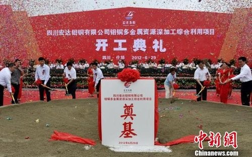

<!-- # ＜七星说法＞第三十六期：如何将群体性事件转变为法律事件 -->

**【本期导读】：5年前，厦门市民为了家园和健康而“散步”，反对PX项目；去年广州海门市民为了家园和健康而“散步”，反对扩建的燃煤项目；今年，什邡市的90后孩子们以及群众为了家园和健康而“散步”，反对钼铜。本期说法将深入“有重大影响的建设工程”，了解环保法的规定，以及探讨将可能引发的群众性事件变为法律事件去解决的实际做法。**

# 如何将群体性事件转变为法律事件

## ——致什邡市政府们的一封信

### 什邡の殇

筹备一年多的什邡钼铜多金属资源深加工项目，于3 月 26日通过了国家环保部的审批。6月29日，总投资104亿元的钼铜项目在四川什邡开工。7月1日，四川什邡市部分市民和学生因担心于6月29日开工建设的“钼铜项目”会引发环境污染，到什邡市委、市政府聚集抗议示威，要求停建项目。7月2日事态不断严重和激化，反对建设的示威逐步演变为群体性事件。执行警戒任务的特警采用了催泪瓦斯和震爆弹对过激人群予以驱散，拘留部分群众和学生，造成数十名群众受伤。7月3日，什邡市人民政府要求钼铜项目停止建设。

然而，网络上的反对声浪并未就此停息。**从高呼“发展经济不能以牺牲环境为代价”，到指责官方动用警力和催泪弹对付平民百姓，什邡抗议者火线收获十方盟友。**不仅是天涯、凯迪这些“草民大本营”里山呼海啸，甚至，连“草榴”都在贡献全套什邡现场图片，人们根据流传的现场视频表达同情、愤怒和敬意，用那些警察追打、女孩摔倒的画面反过来辟官方“打不还手、

骂不还口”的谣，众志成城的感觉仿佛回到了五年前的厦门PX化工项目风波。

然而，回头来看，政府并没有因为5年前发生的“厦门PX事件”先例，而更加从容地去处理突发群众性事件，民众也并没有因为经过5年，培养了更好的市民素质，甚至不及当年理性和有限度的厦门“散步”示威。顺从民意的什邡政府貌似很好地解决了这起群众性事件。**但仔细想想，事先不征求群众意见，通过环评审批后直接开工；和面对突发的群众性事件、网络铺天盖地的舆论压力，不走任何程序，无视投资企业的正当权益，拍大腿决定对确实合法审批的项目立刻停建，这两者之间又有什么区别呢？**如果民众看到政府立刻停建，就以为群体性事件的作用是立竿见影的，因而随后纷纷效仿；甚至学者也认为在没有法律保障实体权利的情况下，群众采取这种方式是迫不得已的，而政府最后的解决方式是合理的，符合群众的利益的，那末，才真正是法律的悲哀。

只要稍微回顾下5年前的厦门PX事件，就会明白一个道理。类似什邡事件并非社会问题、甚至政治问题，而应当是一起可以通过法律来避免（前期）、解决（后期）的法律问题。本文不分析什邡事件中项目是否有污染，也不分析警方出动武力对付百姓的方式是否侵犯了公民的人身权，**而是针对

“修建涉及公众利益的重大建设项目”，提出现行环保法律法规对环境影响评价制度的相关规定，群众是否享有环境项目信息公开、环评项目中公众参与的权利，群众环保维权的现状，并结合厦门PX案例中值得借鉴性的部分进行深入分析。**

### 法律规定公众有参与环境影响评价的权利

修建涉及重大公众利益、可能污染环境的建设项目，例如水电站、发电厂、化工厂、矿厂等，都需要通过国家环保局的环境影响评价程序。而近年来，一系列重大建设项目虽然通过了环评，却依旧遭到周边居民的抵制，引发了许多争议和冲突。如，2004年云南怒江水电建设规划与项目争议案、2007年厦门PX事件、2009年北京六里屯、阿苏卫以及广东番禺焚烧发电厂争议事件，2011年香港老太太诉港珠澳大桥环评不合格诉讼、2011年汕头海门发电厂争议群体性事件、2012年什邡钼铜事件……

**对此，反对民众抗议的死理性派提出**：“我国目前处于工业建设高速发展的阶段，一些地方政府为了本地经济利益和自身政绩，大幅度招商引资，一些高污染的企业得以通过政府的规划进行修建，在这种情况下，周边民众对此反对是有道理的；但是，如果这些大型建设项目通过了环评，政府并未作任何虚假操作，企业是良心企业，本着发展经济的目的前来建设，并且还会采用一定比例的投资进行环境建设和治理，在这种情况下，民众的反对是否理性呢？”

**而支持民众抗议的死理性派提出**：“因为环评制度不合理，所以很多企业建设的项目虽然符合了环评的规定，但仍然不排除有污染环境的可能，为了保卫自己生长的地方，必然要去抗议；另外，大部分对环境可能有污染的建设项目，事前公众都不了解，审批环节根本没有征求公众意见，直到开工动土才知道有这么回事儿，而且不知道危害有多大、污染有多大，对政府也不信任，因此必须要站出来抵制政府的做法。”

**对此，我国有以下几部法律对公众参与环评及环评制度改革有着详实以及不断改进的规定。**

1989年颁布的《环境保护法》第6条规定：“一切单位和个人都有保护环境的义务，并有权对污染和破坏环境的单位和个人进行检举和控告。”2002年颁布的《环境影响评价法》第5条规定：“国家鼓励有关单位、专家和公众以适当方式参与环境影响评价。”这些法律法规的规定从立法上对公民的环境知情权和环境保护参与权给予了保护。

同时《环境影响评价法》11条规定了编制报告书的机关——**即政府部门应采取措施让公众参与到环评中**：“专项规划的编制机关对可能造成不良影响并直接涉及公众权益的规划，应当在该规划草案报送审批之前，举行论证会、听证会，或者采取其他形式征求有关单位、专家和公众对环境影响报告书草案的意见。但是国家规定需要保密的情形除外。”

21条规定建设单位——即项目方应该采取措施让公众参与到环评中：“除国家规定需要保密的情形外，对环境可能造成重大影响、应当编制环境影响报告书的建设项目，建设单位应当在报批建设项目环境影响报告书前，举行论证会、听证会，或者采取其他形式，征求有关单位、专家和公众的意见。”

2004年颁布的《环境保护行政许可听证暂行办法》确定了两类建设项目，如“对环境可能造成重大影响、应当编制环境影响报告书的大中型建设项目”，和十类专项规划必须实行环保公众听证。

2006年颁布的《环境影响评价公众参与暂行办法》规定了环境影响评价中公众参与的具体的范围、参与的程序、方式、期限以及公众环境知情权和参与权的保障措施等。规定由政府、项目方或受委托的环评机构公开有关环境影响评价的信息，征求公众意见，并且该办法规定：“在建设项目环境影响报告书中，编制公众参与篇章”，确保公众能够切实地了解重大建设工程项目的环境影响评价信息。然而，该《办法》所规定的所谓“座谈会”、“论证会”、“听证会”是否需要举行，由谁主持，都是由项目开发单位决定。谁可以来参加论证或者听证完全由规划编制机关或者项目建设单位自己来决定，由于在环评程序中欠缺监督程序，项目开发单位为谋求项目的通过极有可能在报批时粉饰“公众意见”。

**2009年颁布的《规划环境影响评价条例》对环评制度可谓是重大的改革，改变了我国长期以来单一且低层次的“项目环评”，加上了“规划环评”(即对一个区域进行整体环境影响评价)，使环境保护多了一道关键的屏障。**而该条例和厦门PX案也有密切关系。且听下文详述。除此以外，还规定，“对公众意见不采纳且理由不合理的，审查小组应当提出对环境影响报告书进行修改并重新审查”，如果不采纳公众意见且反对意见不合理，规划环境影响报告书就通不过，这对于加强公众参与确实起到了很大的保障作用。但是，在具体实施过程中，公众参与时有哪些具体权利、什么情况下必须召开听证会、如果听证会上存在较大争议而政府不采纳时是否可以诉讼等问题，《条例》仍然缺乏具体规定。

如果，政府、项目单位、委托进行环境影响评价的机构严格按照法律规定，启动了公众参与程序，征求了公众意见，对有争议的事件召开了听证会；并且按照规定对特定项目开展项目环评及规划环评，之后该项目顺利通过了环评，在这种情况下，又如何会发生大规模的群体性事件或者会有群众冒着生命危险采取过激行为呢？

### 维护环境权益只能靠群体性事件吗？

而在发生争议、纠纷，甚至突发性群众事件的上述案例中，大多数建设项目在事先是没有启动任何的公众参与程序的，甚至连向公众进行信息公开的过程都没有。公众面对可能会污染环境的重大建设项目开土动工，能够采取哪些方式维护自己正当合法的环境权益呢？

**第一种，【向最高管理层请愿】** 2003年，怒江水电站开发被提上日程。2004年，怒江水电开发的环评也通过了评审。但从民间到专家均对该项目持以反对态度。在该项目通过环评后几天内，中国社科院、绿色流域等联合在北京举行了研讨，并将会议记录递交给了国家最高决策者。随后，温家宝总理对“怒江水电开发”给出批示，将主张建坝的国家发改委上报国务院的《怒江十三级水电开发规划》退回：“对这类引起社会高度关注，且有环保方面不同意见的大型水电工程应慎重研究，科学决策。”此后，怒江水电站开发一事至今没有一个项目启动。

**第二种，【通过法律维权】**2011年，家住香港东涌的66岁老太朱绮华认为长近50公里、工程造价逾700亿港元的港珠澳大桥的环境评估报告不合理也不合法，因为没有评估臭氧、二氧化硫及悬浮微粒的影响。她通过申请法律援助入禀香港高等法院，就大桥香港段环评报告申请司法复核。2011年4月18日下午，香港高院正式裁定港珠澳大桥香港段环评报告不合规格，要求环保署署长撤销环境许可证。

**第三种，【群体性事件】**这类型的案例有很多。2011年12月中旬，汕头市海门镇群众因担心即将扩建的燃煤发电厂对环境造成污染，而聚众堵路抗议，随后事件升级，部分村民冲进政府大楼打砸破坏，后汕头市委市政府向村民回应“立即暂停华电项目”，事件才得到平息。北京六里屯、阿苏卫焚烧发电厂项目也都经历了群众抗议示威的过程。这些事件和什邡事件发生的情形几乎一模一样，包括最终都停止建设的结果，只是程度有所不同。唯一不一样的是，海门群众反对的是扩建，因为既有的燃煤发电厂已经对当地造成了很大的污染，民众的反对是迫在眉睫的唯一选择。

**第四种，【厦门PX模式】**将厦门PX事件单独列出来，是因为该事件不仅仅具有群体性事件的特征，最后还通过法律得到很好解决。因此，需要单独对厦门PX事件进行分析。虽然已经过去5年，但是，有些教训就是没有人去学。什邡的事情才过去一周，已经有人开始深刻地分析“从什邡案件中，我们可以学到什么”。可到底，又有谁学到了什么。

### 将“群体性事件”转化为“法律事件”的PX模式

厦门PX项目是厦门市引进的总投资额达108亿元的生产“对二甲苯”（p-Xylene）的化工厂项目，原计划在厦门海沧区兴建，该厂址距厦门岛16公里，距鼓浪屿及市中心仅7公里。2004年2月国务院批准立项，2005年7月国家环保总局审查通过了《环境影响评价报告》，国家发改委于2006年7月核准通过该项目，11月，该项目已经按计划开工。而2007年3月，因担心化工厂建成后危及民众健康，政协委员在两会提出建议厦门PX项目迁址的提案，厦门市民也积极动员反对PX项目。**面对公众的反对，厦门市政府先是在厦门晚报发表上万字的说明，强调了该项目是合法、经过环保审批的项目，后到5月28日宣布PX项目“缓建”，并启动“公众参与程序”。**但6月1、2日，厦门市民依然纷纷走上街头抗议，为了家园和健康而“散步”，要求停建该项目而非缓建。**随后，厦门市政府委托中国环境科学院开展区别于之前“项目环评”的“规划环评”——“厦门市城市总体规划环境影响评价”，12月环科院将“规划环评”简本向社会公布，以多种形式征求公众意见；2007年12月13、14日，厦门市政府召开公众座谈会，以

“随机摇号”“现场直播”和的形式选取参会市民代表。**“反对建设PX项目的发言者占发言总人数的71%”，“11%

的发言者”支持PX项目建设。最后2007年12月，厦门市政府将该项目迁往漳州市漳浦县的古雷半岛兴建，政府承担了投资企业在初期建厂工作中的大笔经济损失。

按照现行的法律，因为厦门PX项目重大以及有分歧，除了需要进行“项目环评”以外，还需要进行“规划环评”。但按照07年环保法的规定，厦门PX项目通过了“项目环评”就已经足够，该项目确实是按照法定程序审批通过的合法项目。那么，为什么公众仍然反对该项目，采取“散步”这种类游行示威的方式维护自己的权益？厦门市政府为何在事后升级环评程序，开展“规划环评”以及启动“公众参与程序”？**显然可见，在厦门PX项目的环境影响评价过程中，有两个问题，一是，我国环境影响评价制度存在缺陷，二是公众参与这一制度没有得到切实的施行。**

其一，项目环评的局限性与我国07年环境影响评价制度的局限性有关。**PX项目顺利过关与所适用的系统标准较低的项目环评程序具有直接的关系。**一个单独的项目是极容易包装的，但是一个整体性的规划方案要通过审查则需要综合更加复杂的经济社会指标，特别是区域环境容量。

这就容易造成一个个合格的项目导致一种极不合理的地区或产业规划布局。而民众对此虽不有明确的了解，但是一个离居住区最近只有1.2公里的重大化工项目会对群众的身体健康造成危害，运用朴素的常识就可以判断。目前09年已出台规划环评条例。

其二，**环境影响评价中公众参与的前提是环境信息的公开。**广大的厦门市公众一直都不知道PX项目的环境信息，更不要说参与到调查和参与工作中。直到工程开工、提案公开，厦门公众才对此项目有了了解并立刻高度关注。同时，在群众上街抗议后，政府才开始公开“环评简本”，启动“公众参与程序”，可见，在05-06年PX项目的环评过程，根本没有开展公众参与，更没有向公众公开过相关环境信息。严重缺少信息公开以及公众的参与导致了之后矛盾的激化。

一方面，厦门市人民在这次“散步”事件中显示了优秀的市民素质，公众的“散步”适可而止，并不断地强调“散步”的理性与和平原则，目的只在于向政府表达一种公意诉求，且他们能够理性而耐心地等待政府的回应。

**另一方面，厦门市政府也选择积极回应民众的理性要求，**没有保守地将该事件定性为恶性群体性事件，没有以危害公共安全与公共秩序的理由进行压制；也没有回避该事件，也并未第一时间做出“停建”这样貌似符合人民群众利益的决定，**而是主动宣布缓建、升级环评级别并启动正式的公众参与程序。**

6月初的“散步事件”之后，政府首先将规划环评简本向全社会公布，并广泛征求意见，这首先是一种信息公开，**信息公开是公众有效参与的基础和前提。**

其次是围绕规划环评开展的公众参与。“PX模式”的亮点在于公众座谈会，特别是代表遴选与发言权分配。尽管公众座谈会可能没有公众听证会正式，但以往主要涉及价格的公众听证会，不仅因其“逢听必涨”的结果而受人诟病，而且听证代表的遴选也被普遍认为缺乏公正性。**然而，“PX模式”里的公众座谈会具体做法是“随机摇号+现场直播”。**在公共座谈会的发言权分配上，**“PX模式”也很有讲究，比如人大代表和政协委员从第51号开始领取发言顺序牌，之前的50个机会全部留给市民代表；每人发言限时三分钟，这样可以保证大多数代表的发言机会。**听证代表的遴选以及发言权平等分配的模式很简单也有效，值得推广。最后的公众座谈会取得了比较良好的效果，并且对最终的行政决策产生了有联系的影响。

**PX模式可行，不是说散步还要继续，而是说，政府可以在一开始就实施启动公众参与的过程。**因为如果一开始政府就能够合理地提供公众参与的程序，不仅不会发生后来的群体性事件，也不至于因需要保护投资方的信赖利益而进行高额的政府赔偿。公众参与也许会增加一些公共行政的成本，并导致相关的项目滞后一段时期，但是经过公众参与程序的公共行政决定将具有更高的可接受性和执行力，其在前期增加的行政成本完全可以被后期节约的执行成本及因此产生的良好的社会效益所填平并超越。

### 除了公众参与，还要保障司法救济

**在当下，公众几乎无法通过法律途径解决环保维权问题。**即使是厦门PX项目，也是在采取“散步”的措施后，才争取到的法律权利。目前对项目规划决策、环评立项等环节的行政审批缺乏程序性、强制性规范。同时，规划本身没有法律救济渠道，“不允许对政府发布的规划提起诉讼”，这导致众多环保维权事件只能“遇项目反项目”。并且此前的一些群体性事件，没有通过法律途径，最后仍然能够实现民众的权利，从某种意义上强化了公众不按法律办事的心态，认为只有通过集体抗议才会取得效果，通过法律途径理性表达诉求往往收不到效果。

我国现行环境法颁布已经二十多年了，在这二十多年里，无论是立法环境还是实际司法操作都有了很大改善，也出现了很多问题，也有很多问题没有得到解决。在立法方面，已经从曾经的填补空白发展到弥补漏洞。而在司法方面，严格程序仍然是重中之重。**环境法即将面临修改，立法者如果能够关注这些重大项目建设在国内屡屡引发群体性事件的情况，从立法上做出更好的规定，保障公民的公众参与权，以及司法救济权，那末，才算是真正从什邡事件中学到了什么吧。**

### 【深入阅读】

[公众参与的时代标本——厦门PX事件的过程分析与模式归纳，田飞龙](http://rrurl.cn/7P91pD) [抗争中的环境信息应该及时公开——评厦门PX项目与城市总体规划环评](http://rrurl.cn/nigGmQ) [关于环境影响评价制度的一些思考——从厦门PX项目说起](http://rrurl.cn/k3RBrR) [汕头海门事件](http://rrurl.cn/mgs1mB) [云南怒江水电建设规划与项目争议案](http://rrurl.cn/1xE6bT) [叫停港珠澳大桥不是香港老太太强悍](http://rrurl.cn/06Ifai) [《规划环评条例》带来了什么?](http://rrurl.cn/izAIjx) [关于《规划环境影响评价条例》在山西省实施情况的调查与思考](http://rrurl.cn/7SIK0R)

（编辑：马特，陈蓉）

#### 来自[北斗网](http://rrurl.cn/vNE0s4)旗下连接七星百科栏目

### 关注七星百科

如果你喜欢七星百科的话，可以采用以下的方式关注我们:

关注[瓢虫君](http://rrurl.cn/2yNkp0)、[瓢虫妹](http://rrurl.cn/i3tz65)

关注[北斗网](http://rrurl.cn/vNE0s4)、[北斗网新浪微博](http://rrurl.cn/0NAtu7)

更多[七星百科词条](http://rrurl.cn/uAsEoh)
