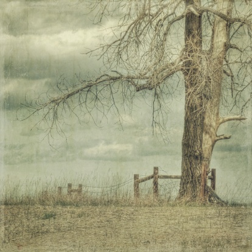
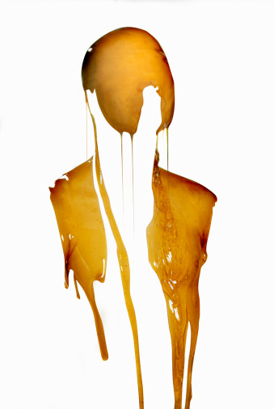

<!-- # ＜天玑＞为了这些残忍的温柔 -->

**所以有些人，对这种美与爱，尽管无比渴望，但选择的态度常常是回避和否认的。因为潜意识里深知，它遭遇现实之后，便无法逃脱必然消失的命运。只有在那个精神的世界里，那个浓黑的时间之海中，它才能永恒的泅渡，永恒的闪耀着微茫的金色光芒，搭救起我们心中那深不见底，无以言喻的孤独。**

# 为了这些残忍的温柔

## 文/李维恩（香港浸会大学国际联合学院）

实你或许比我更清楚，每一条路都通向死亡。

每一段友情，每一种爱都是。

折磨、失去、背叛、痛苦、苦难、苍老、屈辱。

或者是久治不愈的恶疾。

所有这一切，只带来一个结局。

一个给你的、给每一个你曾在意的人和事的结局。

那就是死亡。

**1.**

爱情是可怕的。

至少在《图兰朵》的世界里是这样。

故事的梗概就是：侍女柳儿爱着王子，王子爱着公主图兰朵。于是一帮大臣百姓，加上三个主角，拉锯般的开始了这个关于王子要不要为了得到公主的爱情而去送死的争论。在最后的那个晚上，一整座孤城、一整个长夜都没有人敢睡去，所有人都在等待王子猜出那个谜语。

第一幕，黎明之前，波斯王子因答错谜语被砍去头颅。当刽子手挑着受刑人沾满鲜血的白衣走过剧场时，在微蓝的月光中，死去王子的灵魂飘无所依，枉送了性命。他以为那是爱，其实却只不过是一个女人复仇的诡计。

可笑的是，《图兰朵》这个故事里，每个人都是爱情狂热的单恋者，也是爱情愚蠢的牺牲者。我想普契尼想要表达的是，爱是一件多么诡秘的事情。

它可令人胸腔充满奇怪的热望，血液沸腾。失去一切理性，忘记一切原则，如疯如魔，趋死避生，形同巫蛊，好像中邪。

它是世间最可怕的猛兽，然而它却有着世间最温柔的眉目。

因此，当图兰朵发现自己竟然是在爱的时候，她不是欢喜，而是惊恐的。

柳儿应该是这幕戏剧中最赚人同情的角色。她的爱情，隐秘，沉重，毫无指望，多年流亡的苦楚，王子的笑容是她永不可磨灭的记忆。她因他情窦初开，亦为他心如刀割，却是在终于相遇的时候，发现他爱上别人，爱上一个美艳，残忍，虚荣的女人。她成全他，以她的生命，刚烈，坚毅，宁为玉碎。

那一刻我想，她究竟是为了令他如愿，还是根本死于自己的绝望。

1929年，Guerlain特意为柳儿做了那款著名的香水，LIU。

前调是完全的浓烈、苦涩，最终却化为一缕缱绻柔美的香气。

古董香水，古老时代，古典爱情，很恰当的表现出那种求不得的清寂凄美。爱情的疯狂自内部燃烧，摧毁灵魂。那光芒，神秘温暖，据说看过的人，都会为了它，奋不顾身。

然而这样一份捧在手中仿佛要将肌肉烧融的感情，又有谁敢消受，谁能消受？谁能承担，谁能回应？如果谁都配不上你的爱，你为什么不去爱自己？

暴戾决绝到玉石俱焚，把所有的热情倾注在怎么浇灌都不会开花的墓地上。

可是，她不会。她爱另一个人，远胜过自己。

所以她才是柳儿。一个美丽却不为人知的名字，诠释着我们死去的，早已腐烂的理想。

越是充满激情和天赋的女子，越是脆弱，固执。

越是珍惜爱情，越是为爱情所伤。

越是捍卫理想的纯洁，越要遭受现实的诘难。

它是冰块，却令你燃烧。你越燃烧，却越冰冷

它是雪白，又是漆黑。

它给你自由，你便自此成为奴隶。

你奴役它后，从此自由自在。

所以，这则谜语的谜底与谜面，都是爱情。

爱才是图兰朵公主的最后一个谜语，也是最残酷的答案。

亚里士多德有个可爱的理论：心脏用来使血液沸腾，而大脑则负责冷却。

那么爱情会不会，就是产生于这沸腾与冷却之间，温度恰好的那一瞬呢？

这部歌剧无疑亦在思考这个问题，最终仍然一无所获。

但绝对可以肯定的一点是，不管我们叫它什么，它永恒主宰着我们的幸福，寂寞与温柔。

面对它，我们只能这样抵死挣扎而又心甘情愿，浴血奋战并且相依为命。

所以，我深爱这个充满疑问的世界。

所以，我爱你。

**2.**

无端的，我总是在脑海空白的缝隙里，想起三岛在《金阁寺》中刻画的那个羸弱、丑陋、结巴的少年。

他的世界是极端的，与世隔绝的。因为这种疯狂的孤独和激情，他固执的迷恋上了金阁的美。无数个时辰，他长久的凝望着金阁，眼睛几乎被晚夏的烈日灼伤。

这个影像如此的暴烈灿烂，以至于我每每想起这一幕，都觉得眼前一片雪白的化不开的倾城日光，金阁那非凡的光芒从此在我的意识里，打上了灿烂燃烧的印记。

他无比固执的相信，金阁有着不属于白天的一面，它的表象仅仅是一种伪装。它的美隐藏在不为人知的深夜或人们目所不能及的瞬间，那种美神秘、浩大，带着无穷的忧伤和魔力，深深的迷住了这个内心黑暗的少年。

他固执的相信它有着无与伦比的不属于世间的美。因为只有它是这样的美，才能够拯救他的绝望，才能够承载他的绝望，才能够照亮他的绝望

每个人的生命里，都有一个必须美的东西。它倾注了我们对于终极状态的种种幻象和期望。但它属于世间的这一面，通常是极其平庸的。在我们精神的那个世界里，它陷在浓黑的夜色中，散发着微茫的希望之光。它是行进在黑暗的时间之海中的船，泅渡我们肉身之外的最华美的想象，最终到达彼岸。

这个必须美的东西，在大多数的情况下，是以某一个人的形象出现的。至于为什么通常是人，也许是因为我们认为人与人之间，具有某种可以沟通的可能。这种对美的渴求，我们给了它一个新的名字--爱情。

这个被爱的对象身上或许具有一点和别人不同的特质。于是我们就会敏感的抓住这种特质，无限的扩大，无限的幻想。就像少年对于金阁那种疯狂的想象和沉迷，这个人在我们的想象中变得越来越具有一种难言的美。

但在现实社会中我们遇到被爱对象的实体，因为落差感，有时会生出一种被美所背叛的痛苦，短暂的现实痛苦之后，又不得不让他必须美下去的，如是往返不休，直至疲惫，清醒，消亡。

所以有些人，对这种美与爱，尽管无比渴望，但选择的态度常常是回避和否认的。因为潜意识里深知，它遭遇现实之后，便无法逃脱必然消失的命运。只有在那个精神的世界里，那个浓黑的时间之海中，它才能永恒的泅渡，永恒的闪耀着微茫的金色光芒，搭救起我们心中那深不见底，无以言喻的孤独。

每个人的心中都有一座金阁寺，它是我们在这无味的绝望的世间，最后的一根救命稻草。只要我们还仍然在爱，那么金阁寺就永远存在，它就是我们心中明知不可能，又极度盼望、无法放弃的，渴望被拯救的一丝生的信念。

故事中的少年，最后一把火烧掉了金阁寺。这一举动其实也象征着三岛由纪夫本人和肉身世界的彻底决裂。他彻底清醒了，彻底面对自己，承认了这一切虚无的本质，不再寄希望于任何世间之物，狠狠的把自己的世界分割开来。这是种毁灭，也是种成全。

杀意和慈悲往往就是同一样东西。

**3.**

据说，爱情和死亡是艺术的两个永恒的主题。这也容易理解，大多数的我们，都无法离开脚下的土地去展翅飞翔，我们甚至不会去远方流浪，终其一生，也不会有太离奇的际遇，现实平淡得甚至连哭泣和大笑都没有了。

但是，我们都会遭遇爱情。

一千个人看见了一千个罗马，那么，一千个人也一定看见了一千种爱情。

卡夫卡给他的挚爱菲丽斯写信，问：“为什么要爱？”

没有人可以回答这个问题。生命的起点就是荒谬的，人们在没有任何知觉的情况下“被”诞生在这个世界。上帝创世时撒下多少颗石子，人的一生就会遇到多少件无聊的事情。每一个人，作为单一的个体，都会有孤独和无助的时候，此时，最可依靠的就是能够和自己的生命相契合的另一个体。

在《37°2 Le Matin》里，爱情的双方，贝蒂和左格，分别是理想主义和现实的化身。左格想写作，却没有信心，宁愿在海边刷几百间木屋（刷几百间木屋，枯燥，没有意义，是俗世生活的表象），而贝蒂，先是烧掉了木屋，然后竭尽全力鼓励左格写作，她相信，左格一定会写出伟大的作品。最后，贝蒂精神失常，弄瞎自己的双眼，在精神病院死去，她用生命完成对左格的救赎，理想主义和现实终于在左格身上得到统一，左格开始潜心于写作，如同贝蒂生前期望的那样。爱在此时，与那个人无关。它仅仅是热烈活过的证据。

《Lovers on the Bridge》里，被俗世生活遗弃的Alex爱上了被俗世情爱遗弃的Michelle，因为在他荒凉的生命里，她是唯一的温暖，他在爱她的过程中得到救赎。Michelle以为自己不爱Alex，但是，在逃离以后，她还是回到Alex面前，说：“我时常梦见你，所以我爱你。”或许，她也无法离开新桥上空漫天烟花下爱的期许。

爱情本身并不值得我们歌颂，因为爱上一个人太简单了。你处在人生的岔口，选择往左或是往右，会爱上一个不同的人，这本身就是一件荒谬的事情。

爱情的荒谬还在于，你似乎永远无法区分什么是真正的爱情。

基斯洛甫斯基的《蓝》里，朱丽叶一直无法忘记死去的丈夫，后来，当她知道丈夫有情人并且还怀有一子时，爱的信念轰然倒塌，她终于可以从爱的桎梏中解脱出来，代价是意识到了爱的虚无。

《有爱，也有污秽凄苦》。这是David Salinger在《九故事》中的一个副标题，它几乎可以看作是Salinger所有创作的母题。Salinger落笔漫不经心，脏话连篇，甚至连基本的六要素规则也不屑与遵守，完全是美国式的直接粗野。在他笔下，光怪陆离地呈现出一个虚伪的世界，以及其中绝望的众生相。但你若能一眼洞穿，在这些污浊的，飘满枯枝和油腻的水面之下，还有一股温暖的清流。在污浊和凄苦中，它清澈坚定，在人性的最深处无声流淌。这就是Salinger心中的爱，是令他在麦田之上日日守望的，一天云锦，万颗奔星。

你划着小木船，因为渴望聆听我的歌唱，尾随载满我声音的木筏航向彼方。但请回到你自己熟悉的故土，不要随我冒险飘向茫茫海洋，以免失去我而迷航。我要横渡那无人越过的大洋，但我有密涅瓦女神吹送，我有阿波罗引航，九位缪斯示意大熊星为我指引方向。

我们终生被冥冥不可知的力量牵引，穿越过黑暗无边的生命海洋，但我们却永有一点点微光相随。我们共同走过漫长的海岸线，比生命还要长。我们说好要去看樱花，在富士山下给彼此寄明信片。樱花如今又开了几转，你的头发好长好长。

是的，我们是草芥，是沙粒

但是我们的爱欲不灭，所以我们的灵魂不死。

**4.**

《西伯利亚的理发师》是一部很好莱坞化的电影，但气质却完完全全是俄罗斯式的浪漫与苍凉，是那片广袤、寒冷的大地上散发的忠贞和深沉。这种气息让我想起普希金的所有诗句，以及他为纳塔利亚进行的决斗。

情节并不复杂：十九世纪后期，美国女人珍前往莫斯科，她的任务是做好士官学校校长沙俄将军的交际工作，以便让他资助美国人投资的一项发明——制造一架巨大的叫“西伯利亚理发师”的伐木机器，这机器用来砍伐西伯利亚无边的白桦林。珍在去莫斯科的火车上遇到年轻的军校学员托尔斯泰，或许是她迥异于俄罗斯女孩的气质，托尔斯泰爱上她。

军校学生演出莫扎特《费加罗的婚礼》，托尔斯泰饰演理发师，他在歌剧上演前夕无意中听到珍在房间里向将军示好的对话，觉得爱情受辱，冲入大雨中，苍白的脸上流着雨水和泪，惊恐的眼神令人心碎。托尔斯泰重上舞台，他的心里一定是充满骄傲和不妥协的：没有人能够侮辱我的感情，因为它便是我人生的尊严。他最终在朋友担忧的注视下拿起提琴琴弓，奋力抽向将军，也因此被发配西伯利亚。

很多年以后，“西伯利亚的理发师”终于可以轰鸣着驶在西伯利亚的丛林间，珍也有机会踏上托尔斯泰流放的那片土地，但是她在住处没有找到托尔斯泰，只能驾着马车怅然离去。

此时，在山野里打猎的托尔斯泰一定感觉到了珍，他向着珍的方向，像野兽一样疯狂奔跑，他穿过丛林，越过溪流，最后站在山脚。往日的英俊少年已是野人一般的模样，他点一支烟，吸上，然后抬头，痴望着昔日爱人的影子在原野尽头逐渐消失。

从技术的角度来说，这个片子揉杂了很多东西，如米哈尔科夫对俄帝国的辉煌和俄罗斯精神的迷恋，以及对这种旧精神中专制一面的批判，再有，就是西方文明对俄国文化的冲击（典型的表象是那台巨大的机器）。

然而，最让我动容的，还是托尔斯泰对爱的忠贞和不妥协，他可以用自己的前途乃至生命来捍卫爱的纯洁和高贵，当他的同学对珍有些不尊重时，他提出用决斗的方式解决彼此的争执，并为此差点丢掉性命。在托尔斯泰身上，爱情和他内在的精神气质高度统一，他捍卫爱情，就像捍卫自己的人格尊严。

这种气质中极端的成分让他的生命如同水晶一样易碎，却也使他苍茫的生命之途散发出水晶折射太阳之后的熠熠光芒，在我看来，这种光芒蕴涵的骄傲是人性中唯一让人敬畏之物。

假如我又遇见你，隔着悠长的岁月，我将如何致候？以沉默？以眼泪？

实际上，我只是静静的点了一支烟。

当我循你的气息翻滚下山，当我的容貌已无法辨认，当你的马车在西伯利亚原野上疾驰而过，当懊热的空气如往事般瞬间淹没我。

你知道的，我曾经天雷地火的爱过别人，到如今却孑然一身

关于爱，消失的时候，回顾都成了酷刑。空余灰烬。

最后，谁才是你真正爱的人？

《The Tango Lesson》里说了一个故事，雅各布四处行走，有一天黄昏在山谷遇到一个傲慢的年轻人，他无法忍受年轻人的骄傲，于是和他打架，他们从黄昏打到深夜，又从深夜打到太阳升起，最后，雅各布停了下来，因为他发现所有的努力都是徒劳，年轻人是无法战胜的，他或许是天使，或许就是上帝本人。

你的爱人，便是你心底那个无法战胜的人。

**5.**

数年后再重读米兰-昆德拉的几部作品，终于觉得不再过分晦涩。

其实他的故事是那么简单，始终是有那么一个男人。因为要确认自己的忠诚，所以不停的背叛。他反复咀嚼自己的爱情，用离开的方式靠近他的爱人。所以就有那么一个深爱他的女人，终日生活在嫉妒的牢笼里。

决绝是她，疯狂是她，乞求的是她，拒绝的也是她，就像阿黛尔-雨果那样，为了爱情，不疯魔，不成活。还有那些始终带着一片毒药，随时准备结束生命的人。在对世界的绝望和留恋之间，徒劳的寻找生命的出路。

他们真实的让人不敢面对，好像就在我的身边。在每一天擦肩而过的人群里，在每一个茫然失措的瞬间中，在每一种沉默温柔的面孔下。

昆德拉的字典里，永远没有完美这个词。他笔下的人物即便是美丽聪明名声赫赫，却永恒带着某种缺陷，因此就永远摆脱不了生的痛觉。昆德拉是文字的大师，更是人心的大师。他总是能用最精准细微的语言，直击潜意识里已经麻木的那根神经，唤醒它。

他只是写自己，却令到每一个读他的人不得不反省自己的生命。

他拆开平静的生之地壳，让我们看到其下滚滚翻涌的，灼热噬人的岩浆

让我们看到真相就是如此，吞噬和毁灭一切美感，好比美人皮相之下的血肉和骷髅。越是平淡美好的表象，掩盖的越是不忍卒睹的内核。

所以，如果你愿意知道，他就会告诉你：善的真相，是恶，贪图享受与隐忍自制。前者是及时行乐，后者亦不过为了是零存整取。

生的真相，是死；光的真相，是暗；爱的真相，是自私，是幻觉，是永恒的孤独。

这个世界已经充斥了太多被夸大的感情与道德，人们统统活在别人的目光中。我们的行为不知不觉的已经带上了浓重的戏剧化和形式化而不自知，我们害怕别人认为我们偏离了主流世界的价值观。害怕被隔离化、被边缘化，所以强迫自己成为这个世界认可的人，耗尽一生的心力去争夺那些荣耀的标签。

纵使有许多人标新立异嚷嚷着做出各种叛逆的举动，却不过是对这个世界另一种更为时新的媚俗。但其实，这一切并不是我们的错。

是的，加缪说，“这不是我们的错。”

这个虚假粗糙的世界像一台绞肉机，他不能允许任何真实独立的个体和感情的存在。他机械残忍的，日复一日将这些个体绞碎在群体中，成为面目模糊不分彼此的肉泥。最终的结局是我们一起老去死去，成为那个与狗作伴的孤独老头、那些在养老院里散发腐朽气味的老人、那些在墓地中静静躺卧消失的白骨。

所以，我们对这个世界和世人仅剩的爱，是一个承诺，是一种残酷的温柔。

承诺，并不等于契约，它的存在并不需要另一个人的认可。因为它可以没有任何对象，只为自身的执着而存在。它是一个人给自己的途程，给自己的极限。

只不过有时候这种承诺需要一段很长的旅程来考量，长得就像是你的一生。

有时我们要穿过曲折绵延的小径，有时要越过寸草不生的沙漠，有时要走过过暗无天日的雨林，有时攀过云雾缭绕的雪山。这段旅途很复杂，充满无数未知的危险与陷阱，也充满形形色色奇奇怪怪的人。他们有的会给你希望，有的会让你更加绝望。甚至在途中你会丧失意志，会麻木，厌倦，失去对生活的一切热爱。

但是你知道，无论如何，你会抵达。

因为对你来说，它其实非常简单，简单到只要两个字就可以完成，向前。

它就像是你自己种下的莲花，因此只属于你自己。即便它最初是根植于另个人的土壤之中绽放，而它一旦盛开变成为你的私有，没有人能够夺走，连你的爱人也不可以。

她对此有无意见，已经不重要。甚至她是否还活着，还存在于这个世界上，都已经没有关系了。

让你完整的是你心中的莲花，不是她所给予的土壤。

只要莲花足够有生命力，它就可以在任何土壤之上存活。

既然这原本就是是你的世界，它叶完全因为你的感受而存在，你就是那个感受的中心，是全部存在的意义。

所以，当你愿意爱时，你可以爱某个人爱到死去。

而你不愿意了，你就可以把这一切幻觉如水雾般从镜子上抹掉。

你会看到，从始到终，镜子里映照的都只是你自己，并无他人。

所以，当你终于历经无数艰辛与幻觉抵达过去为自己设定好的目的地时，你所做的，也不过就是返回，以终点为起点，再踏上另一段旅途。毕竟，人活着本来就是一种修行。

我们都在这片生之荒漠上艰难跋涉，暴烈日光劈头盖脸地炙烤着这具肉身。

清凉的美好终有一天还是像所有的水滴般蒸发，消失无踪

但我们不能停止，我们仍将继续。

哪怕只是为了这些荒谬的意义，为了这些残忍的温柔

（采编：安镜轩；责编：安镜轩）
