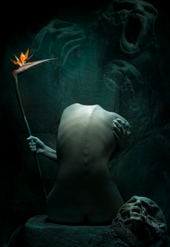

<!-- # ＜天玑＞我耗尽这肤浅一生，只陪你痴人说梦 -->

**生的全貌或许是美好的，它的完整盛大的美，已足以掩饰一切在路途中的破碎与失落。这是生的选择，激烈的燃烧，还是淡暖的熄灭；是如瀑布般奔涌跌落，还是如同河流般缓缓流逝。不论是凝聚为天空闪烁的群星，亦或者春生秋死的树叶，生命都是美好的，它的空虚，它的不确定，它存在本身已是奇迹，无可挽回无可复制，转瞬即逝，无迹可循。**

# 我耗尽这肤浅一生，只陪你痴人说梦

## 文/李维恩（香港浸会大学国际联合学院）

是不是我越软弱就越像你的情人。

---崔健

《时代的晚上》

**1.**

你一直在我心中生存着，有时你离我很近，和我在一起，有时却似乎走远了些。

昨夜做梦，在梦中我眼盲，不辨五色，不知光昧，不知是否也聋，但觉整个世界都静的出奇，间或似乎有一两声微动，如树叶坠地。我似乎坐在一片绵软的漂浮物之上，四边都靠不到，又似乎很高很高，稍稍乱动就要跌下九重云霄，非常惶恐但又觉得异常快乐。

梦中我唯一可依赖的就是气味。嗅觉一瞬间变的无比敏感。我贪婪的分辨各种气味，依靠它们勾勒着实体的形色，比如，一颗白银做成的棕榈树上，结满了火红的柿子；一望无垠的稻田，风把碳素墨水味的稻香传到几千里之外的荒原。

在梦中我终于可以走入你称王的城池，在梦中我不过是你的裙下之臣，所有的河流都向你涌去，所有的白马都向你奔去。你的城池是一座没有入口的城，四壁皆以最微薄的灰色纸张搭建，远远看去如同花岗岩般坚固。

我轻轻的呵气，风吹起，城墙发出哗啦哗啦的声响，脆弱不堪。游走在其外的我，曾误以为是城内的树叶在欣然应和，因我原本不知道，这城内早已寸草不生。

我这一生见过许许多多的城。就像是几百年前的马可波罗，独自在一个个沙漠与荒原中的城市穿行，这些城市或有美丽的名字，有白银、黄金或是琉璃瓦造的圆屋顶，还有镶满螺旋贝壳的楼梯。这些城市里，有被吊死的篡朝者摆荡的双脚，有黎明前偷情的鳏夫和寡妇，有因为答错谜语而被公主诛杀的异国王子，也在摩天飞檐上摇摆走动的疯子和盲客。

又或者是卡尔维诺，独自在一个个丘壑与密林交织、人心铸成的城市里中寻索。这些人，或有清白的素面，有粗暴的神态，活泼的眼睛，玩世的嘴角；这些人，有往事的明媚，欲望的天真，思想的沉堕，风情的落拓，以及对异样情欲的狂热痴迷与对盲目真理的否认。

我爱这些城就好像世界上可能存在的任何一城，我爱那些人就好像世界上可能出现的任何一人。

可是你的城市，又与这一切的存在截然不同。

在你的城市里，太阳投射下书的阴影，人群里漫出没有字句的流言，飞鸟投来意味深长的眼神。它们交汇成灰色的雾气蔓延，渐渐在你的城中一切都变的暧昧不明。有时，有女子穿着深蓝长裙赤足在街头徘徊，我在街道的细沙上为她写下一行行的诗句，却被你细洁足趾践踏，最终在深深浅浅的痕迹中淹没无踪。

我在你的城池面前无能为力，就像K先生在城堡面前那样的的无力，一如我面对自己心底那遥不可及的乌托邦时的疲乏与颓丧，一种想要夺路狂奔、却又无路可去的软弱与绝望。

太阳放荡地炙烤着大地。是啊，还记得这句话吗？一个过分苍白的、吱吱冒着热气的夏天，就是你与我的全部人生。那些秘而不宣的孤独冷漠好比见不得光的丑闻，被藏在远离光明的地方，然而离开了真实孤独的光明却也什么都不是。

忘掉那些煽情的电影桥段和文学信仰吧，支撑我们的，才不是什么爱，不过孤独而已。

我转而修建自己的城楼如巴别塔，妄想它能高耸入云，还以为这样就能窥觑你城池深处，立志孤独终老的剪影身形。

剪影的你轮廓太好看，凝住眼泪才敢细看。我的感情与故土一样，是一个不可能完全逃避的世界，是一个失去的或被掠夺了的身份地。

**2.**

我在世界的梦中迅速苍老或重返年轻，每一秒与每一天以同等的速度年华飞逝。

“一个人外表的青春是美的，一个人灵魂的老去同样是美的。”

这是让•科克托在《存在之难》中的一句话，当我读到这句话时，像是被什么东西击中了似的，顿时脑子一片空白。记得读杜拉斯《情人》也有这样的感受，小说是这样开始的：

我已经老了，有一天，在一处公共场所的大厅里，有一个男人向我走来。他主动介绍自己，他对我说：“我认识你，永远记得你。那时候，你还很年轻，人人都说你美，现在，我是特意来告诉你，对我来说，我觉得现在你比年轻的时候更美，那时你是年轻女人，与你那时的面貌相比，我更爱你现在备受摧残的面容。

“我已经老了”，这个被王小波称为“无限沧桑尽在其中”的开头，掺杂了太多的惊叹、执著、哀伤、凄绝和等待。所有这些沧桑的感受猛然向你砸来足以令你昏厥。

杜拉斯是一个令人胆战心惊的女王，她的文笔，用王小波的话讲，是“极端的精美，让读小说的人狂喜、让打算写小说的人害怕”。读她的文字就像在那个燥动不安的夏日午后，无意中闯入了杜拉斯的精美宫殿掀起的帷幕一角，偷窥到她内心的隐痛，即使只言片语也足以让孤寂的夜空顿时被闪电全部撕破。她的语言带着雷电，从天上直撕毁到地上。同时，读者也领略到了她的困顿、固执和残忍。就像她在《情人》里说的：“我知道，每次不把各种事物混成一团，归结为唯一的极坏的本质性的东西，那么写作除了可以是广告以外，就什么也不是了。”

杜拉斯的固执如同她中年以后容貌急剧变化的照片不可理喻，曾经美丽无比的杜拉斯被固执与任性消灭了，被酗酒与吸烟杀害了，惟有拿华贵的文字当她的祛皱霜。

她在《劳儿之劫》中愤愤地写道：“这个女人是自己毁了自己，又是为了什么毁了自己？”杜拉斯自己又何尝不是如此。

你可以不喜欢她，但你无法拒绝她。

有人说杜拉斯是力量的暴君，是个文字世界的玩火者，也是最好的情人。

在杜拉斯的语言药店里，装满毒药的瓶子往往会混合着解毒剂。她会让你在短暂的痛苦中保持着持续的清醒，感受到短暂与永恒、狂迷与冷静、残忍与宽容、活着与死亡都包裹在自己的界限与无限中。

我觉得《情人》最迷人的地方是：这是一个曾经美丽的女人，款款述说她年轻时候烈焰熊熊、惊心动魄的爱情。字句之间，她满目疮痍的面孔时隐时现；出现在视线之中的是腰如蜂、肤如蜜的少女胴体，可凝视的目光却已千山踏遍、阅尽悲欢。

这情境是如此销魂，宛如幽寂的三圣庵里，陈圆圆面对一个懵懂少年低吟着《圆圆曲》：鼎鹿征逐，江山易主，冲冠一怒，红颜误付，顷刻唱尽了亦只是弦上一支曲子；又宛如一千年前的浔阳江上，枫红荻白，月寒江清，曾经艳冠京城的女子，将老去的面容隐在琵琶后边，轻声诉说少年情事，如水的月光凉透一襟青衫；又宛如百岁有余的Rose，面对苍茫茫大海，平静地讲起曾经有怎样一个天使面庞的金发少年，怎样与她背着全世界轻怜蜜爱、缱绻缠绵，怎样将爱与生命留给她之后，随着那艘船永沉海底。

博尔赫斯说：“人类的三个能力：记忆、理解、意志都并非学究式的幻想。”随着岁月的流逝，人人都被迫背上越来越沉重的记忆负担，你可以失去记忆，但不能失去对记忆的知觉，否则你想从某个地方重新开始就拾不起来了。

记忆会在做梦时，在夜间工作时，在翻阅一本书、拐过一个街角时或者爱上另一个人时浮现出来。只有那些真正理解了意志力在时间的记忆里耐心等待的人，才能战胜时间，在某个注定的时间特意来告诉你，我更爱你现在备受摧残的面容。

若得一心人，白头不相离，就算朝如青丝暮成雪，也可坦然道是瑞雪兆丰年。

我爱你在人世时间中留下的一切痕迹，千百年来一向如此。

**3.**

“我一直在寻找你，仿佛我的生命由你决定。”

——

《乌拉尼亚》

川端康成也是一个擅长说梦的人。暮秋的伊豆。20岁的川端康成穿着高齿木屐，在落英缤纷的山谷中独行，其间与一群流浪艺人不期而遇，并默默地爱上了14岁的舞女薰子，之后离别。

故事简单到几乎没有情节，只有字里行间的暧昧，在清淡迟缓的流淌着川端康成的文字影像感极强，我有种错觉是在看纸上的电影，阅读中脑海里总是不停浮现出一帧帧的图画。

南伊豆的小阳春，薰子清白的赤身如一棵小桐树。雨后的月夜，“我”独自伏在床上听着远处舞女的鼓声。黑暗的隧道，冰冷的雨滴，通往伊豆的出口微微透出了亮光，文字构建出的影像美好到虚幻，感情也清洁到如花瓣自枝头落下尚未染尘，却始终哀而不伤，静水深流。

故事里，他们反复谈论着一件事，千代子早产死去的婴儿，从始至终贯穿全文。

“他们又谈起了旅途上死去的婴儿，据说那孩子生下来像水一样透明，连哭的力气都没有，可是还活了一个星期...”

我想，这个透明的死婴正是川端康成对这段感情的具象化：连哭的力气都没有，连相爱的可能都没有。这段感情如此短暂如此稚拙，像水一样透明，终究是逃不开必死的命运。“我”在故事中始终在匆匆行走，开始是不停地追赶他们，后来才意识到自己只是在匆忙的逃避。

川端康成说自己有着孤儿根性养成的怪脾气，和受不了的令人窒息的忧郁感。其实他并不是真的想逃避，只是敏感到胆怯，高傲到自卑。

在翻过险峻的爬山小道时，薰子追赶着他，使得他们终于有了一次短暂的独处。他们谈到家乡，赏花时节的舞蹈，终于再次谈到了那个死婴。

你应当也能理解这种感受吧，爱的字眼就在唇边，却没有人能够说出口，甚至连看见你时眼角眉梢的欢欣也要妥善隐藏。

少年时候的爱情，再美好也带着没来由的恐惧与绝望。

前路漫漫，谁有并肩飞过沧海的勇气呢？

再怎么爱，说到底终究是我一个人的事情吧？

少年离开的那天，是死去婴儿的断七之日，在祭典后他匆匆搭上了回家的客船。黑暗的客船中，他蜷缩在陌生人的睡袋里摇晃着，潮水和生鱼的腥气越发浓烈，令我无端想起出生在鱼市上的格雷诺耶。在读这一段时我仿佛也置身于一七三八年臭气弥漫的法国巴黎，站在圣•梅里修道院的小门边，看着摇篮中的弃儿，小小的身体没有任何气味，惊惶失措的奶妈对着牧师大喊：他是魔鬼的孩子，他身上没有任何属于人类的气味。然后，周围的空气开始慢慢变浓稠，景色泛黄，各种味道纷至沓来。在这里，你可以嗅到18世纪巴黎的味道，少女胴体的醇香，罪恶与美丽的完美结合，还有掩藏每个人内心深处、随时等待爆发的欲望。

一种空虚的美好使少年幸福的流泪。

所有的情爱都死在了那个透明婴儿的祭典上，死在了伊豆秋雨飘落的山间，死在了人间若只初相见的清白中。

第一次，我相信死亡了原来是如此美好的事情。

不知黑白，不辨善恶，不晓美丑。我看见的每一个画面都是一片深海，每一次相爱都是一次潜水，让你的眼睛带着你的手去忠实的记录下每一个线条的流动，每一束光影的明灭，跟随它们，一直到达这片海洋的幽微深细之处，这就是灵魂。

你知道这个世界上有过多少相爱的人吗？你知道这个世界上爱情活过又死过多少次吗？这世上曾经相爱过的任何一人，他们都走了吧。走的如此突然，就像他们没来过这个世界一样。你幻想着再与她坐在老屋的秋千上等待夜晚降临，你幻想触摸她静止的脸庞，你幻想与她推心置腹的交谈。这是否就叫做揪心的玩笑，那么我漫长的白日梦又该交由谁去实现？

**4．**

“我来了，来了，心中充满喜悦。你我合二为一永不分离。我在尘世，我在苍穹。我正在绽放，我正在凋零。”

这是电影《美丽佳人奥兰多》结束时出现在树枝上的天使所唱的歌词。奥兰多》是英国著名的女作家Virginia Woolf的作品，作者因为亲密的女朋友离家出走而备感思念，为了表达思念之情，伍尔芙便以她为原型，创作了这部被称为“世界上最长最动人的情书”的传奇小说。1992年英国才女导演萨莉波特把她改编后拍成电影。

听着歌让我记起柏拉图《会饮篇》中记载的一则古希腊传说：人类曾经本不分男女，雌雄一体，后来只因力量超群，遭神妒嫉被劈为两半。

从此人类就在努力寻找自己生命的另一半，期望获得完整的性别。柏拉图认为人生前和死后都有最真实的观念世界, 在观念世界的你原本的另一半就是你最完美的对象，在那里, 每个人都是男女合体的完整的人, 到了我们这个世界就分裂为二，他或她就在世界的某个角落隐秘着。

所以，人们总觉得若有所失, 企图找回自己的“另一半”，惟有找到自己生命的另一半才能得到真正完美的幸福。奥兰朵正是经历过两种性别转换的综合体，虽然躯体的性别特徵有所不同，他是她，她是他，却改变了世人对不同性别的期待。爱并非独立存在的，爱之中包含了一个个体的人与另一个个体的人的结合，是人类产生和生存之源。古希腊一位哲人曾说过：“爱总是和所爱的东西结合为一体，而结合为一体的开始，也就是分离的开始，是由争执与憎恨支配阶段的开始。”由此，从爱的正面会看到了其反面的争执与憎恨。

奥兰多的经历好似场睡梦，一觉醒来，伍尔芙说：

“倘若这是睡眠，我们不禁要问，这样的睡眠倒是什么性质的呢？它们会不会是一种疗法？在昏睡中，一只黑色的巨大翅膀，把最痛苦的回忆，即可让人的生活一蹶不振的记忆，一笔勾销，抹去它们的苦涩，为它们涂上光亮的色彩，甚至对最丑陋，最卑鄙的记忆也是如此。会不会是死的愤怒必得时不时地遮蔽生的喧嚣，免得它把我们撕成碎片？会不会我们天生必得每天一小口一小口地品尝死亡的滋味，否则就无法继续存活？那么，在我们并不情愿的情况下，那些渗透我们最隐秘的生活方式，改变我们最宝贵的自制力的神奇力量究竟是什么呢？奥兰多是否因痛不欲生而死去一星期，然后死而复生？倘若如此，死的本质是什么？生的本质又是什么？”

嚼咀伍尔芙这句发问似乎让我略略明白，为何害怕读普鲁斯特《重现的时光》。忧愁敏感的普鲁斯特，他用一个病人的躯体，感受到了浮在脑海里与万物很近的那团气息是可以抓住也想拼命抓住的东西。那是一个跟生命逆向运行的世界，也是生命的本能回溯。如果能尽可能多地找到来时的路，那就能同时求得死亡与轮回两条平行的线路，一个属于自己的时空就能同时建立。

然而，在人类光速里，时光如何可能重现，惟一可能重现的，只是模糊的幻影和昏暗的错觉，或许如奥兰多的昏睡，或许如普鲁斯特的失眠，抑或如博尔赫斯的失忆。

而我，更愿意凝固住一个时间，一个最短的时间，争取一个永恒的时间；愿意在某个瞬间爱上一个人，然后只爱着那个爱上她的瞬间。——人是为活着本身而活，思想像海绵般吸收一样，保持对生命、对爱、对梦的阅读，才会在多么飞逝的似水流年里也一直活着。

**5.**

如果问，世界上最有智慧的民族是谁？大半人会答，犹太人。

犹太人的历史中，最智慧者又是谁？

对于大多熟知圣经的人来说，这个问题的答案很明确。

所罗门。甚至没有之一。

公元前950年，无数从东方而来的大船载满黄金与宝石，于红海之上往返来去。

它们都只有一个方向，耶路撒冷。

而那时，耶路撒冷的君王，就是这位所罗门。

富甲天下，以檀香木与黄金修建煌煌圣殿的所罗门。令到万邦君主纷纷飘洋过海前来恭聆慧训的所罗门。心似深海，智慧更是如同海沙般不可测量的所罗门。

他执掌以色列王国四十年，政绩卓著。一手将这个王国的威荣引领至空前绝后的巅峰。却因晚年弃绝真神，落得身后国祚衰落，江河日下。

自此，以色列南北分裂，战火连绵，开始了整个民族几千年的流徙和苦难。千年后，遥想所罗门王朝当日的繁华，真叫人感叹烟花一瞬，盛世成灰。

总说是，国家不幸诗家幸，写得一手好文章的多半是昏君。所罗门倒是个例外，据圣经记载，他不仅政治清明，善杀伐决断，更有无论从规模还是质量上都令人仰止的三千箴言与一千诗歌。

至今仍流传于世的尚有旧约中的箴言、传道书与雅歌三卷。

作箴言一卷时，所罗门正当壮年，国祚昌荣，四海归心。他也分外的意气风发，连说出来的话也是那么果断，练达，挥斥方遒。字字句句掷地有声，毋庸置疑，仿佛世界诸道亦也不过是他手心纹路。

到得传道书时，他却已看尽声色犬马，浮光浪影，生出厌世之心。他绝望，空虚，成了彻底的虚无主义者。展卷读去，满纸尽是虚空与捕风。

由色悟空，并不稀奇。奇就奇在传道书之后竟又有一卷雅歌。

雅歌，在整本圣经里都显得极为奇特，旧约一贯的火马刀兵，到得此处却陡然一转，转入了温柔旖旎的情爱。而所罗门的文辞竟也一扫之前的灰遁，破茧成蝶的鲜妍起来。这般山穷水复，柳暗花明，实令人不得其解。

但其实有什么好奇怪的呢？

这个世界上最伟大的人也会为爱而疯狂。

**6.**

最近痴迷于《Ladies in Lavender》中表述的情感方式。

今晚我站在银色的海边，一直等你。

月光下的海好安静，浪尖还闪烁着如鳞的微光。我独自站着整夜，为了想你。

你紧闭双眼，金色的长睫毛如蝴蝶微微扑动。那么年轻，紧实的手臂上一层绒绒的汗毛，会发光。多么漂亮，我看着你，你是金色的。

你拥有阿基里斯那样脆弱的脚踝。因为脚踝骨折，所以这只折翼的天使才会落入凡间。你那么美，这青春像支利剑准确无误的击中我，令我惊叹并深感卑微。

所以我知道，我爱上你了。

你那么年轻却能把一个故事讲得那么动人。时而沉痛，时而轻快，时而淘气，时而温柔。你真令我诧异，你的声音里竟能有那么深的渴望。

我一生的暗涌都在你的舌尖中倾诉殆尽。

今夜我站在银色的海边。手心还握着你金色的发丝，像握住生命中最后一缕金色的阳光。我早知留你不住，总会是别人来带走你。有一种鸟的羽毛太绚烂，天生就不可能被锁在笼子里。而我只自私的希望这一天来的晚些，再晚些。直到我可以坦然的同你，同生命告别。

但是谁能和离别和死亡来讨价还价呢？

就像在《呼啸山庄》里，很多次想起关于爱情，都是因为凯瑟琳她说，我就是希刺克利夫，他永远永远在我心里。想到，就会动容，就会黯然。

爱情的定义，是心动么，是温柔么，是无奈么。《呼啸山庄》里，爱就是天雷地火，生死相许，在凯瑟琳和希刺克利夫面前，许多的所谓爱情都黯然失色。动心，失望，分手，难过，再动心，这是真的爱过么，还是只因为无法忍受一个人的孤独。

一个是骨子里叛逆的，却被从小教导成为必须淑女的庄园小姐。一个是阴郁倔强，被捡回收养的吉普赛孤儿。但是他们却有同样的灵魂。在呼啸山庄蓝紫色的天空下，他们牵手在沼泽和草原上奔跑。在阴暗的阁楼里，他们被打被饿，但是依偎在一起，凭借对方的体温取暖。小小的心灵有着同样的对自由的渴望。希刺克利夫能够忍耐暗无天日的生活，因为凯瑟琳是他的太阳，然而在那个雷雨夜，他听说凯瑟琳的婚讯时，他最后的温暖也消失了。凯瑟琳在雷雨夜痛苦的哭泣，落下了一生也医不好的顽疾。

可是他还是回来了，没有她的世界如此荒凉。他带着神秘的财产和复仇的计划归来，他要他的爱人，其他的一切都微不足道。他危险的黑眼睛里燃烧着炽热的火焰，英俊的外表下却是一颗破碎的心。当他以为幸福快要降临，从此不会在寒冷的地狱里孤身一人时，她却在爱与恨的挣扎中，苍白的凋谢了。

又是雷雨夜。呼啸山庄的天空彻底黑暗了，只有刺目的闪电一道道划破长空。他整夜整夜的站在树下，守候着爱人的消息，可是连最后的一面，终究还是错过了。

许多次在睡前翻开这本书，然后在黑暗中沉默。

这样的爱情，很多人一生也不会遇见。因为人性的复杂，懦弱，自私，只能眼睁睁的看着爱情和梦想消失，然后安慰自己说，其实，我们拥有平淡的幸福啊。

可是谁又甘于平平淡淡的过一生呢。

人的生命，碰撞在千万分之一的偶然率上，才得以在母腹中由一颗透明种籽发端。历经童年的幼嫩青翠，最终成长为枝叶如云的参天巨树。这其间生发出无数枝与叶，各有自由意志，生命自此生发出无限可能，虽无数种分叉错落，又有无数蛛网虫蠹隐藏其间

但我总觉得，生的全貌或许是美好的，它的完整盛大的美，已足以掩饰一切在路途中的破碎与失落。这是生的选择，激烈的燃烧，还是淡暖的熄灭；是如瀑布般奔涌跌落，还是如同河流般缓缓流逝。不论是凝聚为天空闪烁的群星，亦或者春生秋死的树叶，生命都是美好的，它的空虚，它的不确定，它存在本身已是奇迹，无可挽回无可复制，转瞬即逝，无迹可循。

所以我愿意耗尽这不可预知的一生，只想陪你好好做完一梦。

有一梦就多做一梦，免得在下次醒来时一切落空。

（采编：安镜轩；责编：安镜轩）
