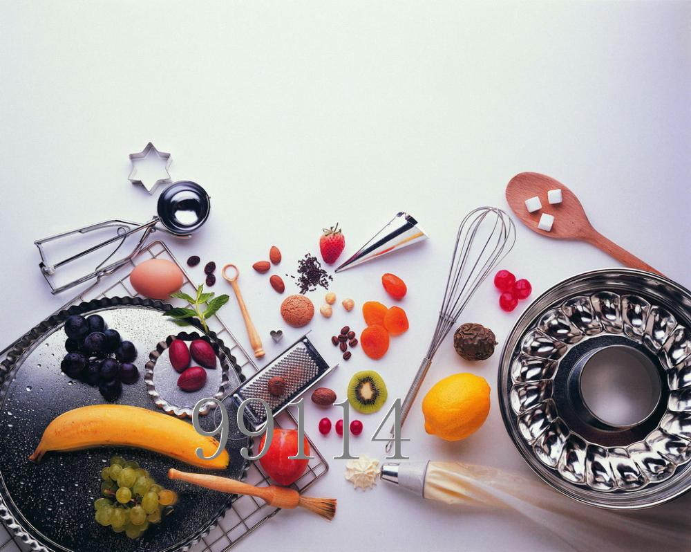

<!-- # 在舌尖上气死恩格尔 -->

**读懂中国，从舌尖上开始。团结中国人，也从舌尖上开始。中国人说起吃饭就是一种神奇的凝聚力。在这么个国家里，艺术方面能歌善舞的多是少数民族；我们难得的有了个俞伯牙，可是钟子期不多；宗教的凝聚力也不如耶路撒冷和其他地方；所以，说凝聚力，说乡愁方面，余光中的邮票和船票可比不上舌尖上的水煮活鱼。所以，满足了最基本生存的中国人都去了餐厅饭馆尝尝更精心制作的食材，或者在去餐厅的路上想象下味蕾将有怎么样的体验。若在家里则对着食谱书和电视美食节目，或者一家人一起下厨一起吃饭，一派其乐融融。**

# 在舌尖上气死恩格尔

## 文 / 林静（华侨大学）

“I eat for live, but not live for eat.”

要是我说出这句话，怕会让人怀疑我的国籍、祖籍、出生、肤色、宗教、种族、信仰等等等等。

不知道中国人是什么时候开始有那么，那么，那么高超的饮食记忆；外加那么，那么，那么丰富的食材理念；那么，那么，那么多复杂的制作流程居然还有那么多那么多的人趋之若即……

同样，是那么，那么，那么让恩格尔先生大概死不瞑目的，居然有一帮有钱人把钱都花去吃东西，这不是提高了恩格尔系数。那么用恩格尔指数去判断生活水平和贫富还怎么成立？

恩格尔系数，是何方神圣？也就是食品支出总额占个人消费支出总额的比重。没钱的人收入少，所有收入中用来购买食物的支出所占的比例大。反之亦然，有钱的人收入多，花在食物支出上的钱和所有花的钱相比，只是小小比例。

对于这个系数，就是维持生存的支出在总支出上的比例。如果吃喝够了，那么剩下的钱就可以用于玩乐等，除了吃喝其他方面上花的钱越多，那么这个人生活水平越高。可是对于中国人，这个定理真心无法成立。

或许是恩格尔的国家有歌剧有话剧还有唱诗班；有国家公园可以谈恋爱，然后谈恋爱后还不去餐厅约会；还可以一杯咖啡喝很久，去炉火边打个盹，去电影院看部电影还不吃爆米花，去那些高级成衣定制的商店消费，等等等等。总之，人吃饱了，有的去的地方多了，有的花钱的地方也多了，消费也就丰富了，恩格尔系数就下降了。

人类对生命的热爱不仅仅通过消费发泄，还通过其他。恩格尔的国家何止是文化发达，哲学家多，连科学也发达，还可以去探究一下百科全书，研究下力学、光学、热学……不像我们的国家，一般来说文化上早就有罢黜百家独尊个什么的，千年优秀文化中的历朝历代封建统治者希望民众“守脑如玉”像是男人要求女人“守身如玉”一样。根本生活不需要思考，恩，当然不包括思考怎么制作满汉全席。在我们的饮食发展和历史发展的重要时间内，在古代中国，只要学会“怎样服役，怎样纳粮，怎样磕头，怎样颂圣”（鲁迅《灯下漫笔》），至于科学？还有科学啊，学习科学那是科举制度下的非主流，“匠人之作，奇技淫巧”啊。

如此看来，国人何止是消费没有地方去，我们那些对宇宙人生的热爱也没地方发泄，那就投入了对美食上吧。

所以说，恩格尔假设的条件或许是在一种“we eat for live”的前提下，食物支出只是为了维持生存。可是在中国，食物支出，不仅仅是为了生存，还为了娱乐，为了发泄，为了高歌，为了悲伤，为了你满足了生存后所追求的人生喜乐——满足了马斯洛需求层次理论中从生存到自我实现的所有。

这便是有别于“eat for live”的一种“live for eat”的状态。

一种满足生存权后，追求更高品质的生活。可是中国人的“玩乐”也是吃喝，吃喝嫖赌是吃喝、看美女是秀色可餐、美女想吸引男人厨艺也是一个魅力、连看戏也是茶馆里八仙桌一摆边吃遍看。总之中国人的食品支出就是涵盖生存生活甚至生产。将对高品质生活的追求融入到中国令人惊奇的吃文化中。下馆子、自助餐或者五星级饭店，无论是富有还是不富有，食物的支出占总收入支出永远保持很高的系数。

这就是中国。请在舌尖上读懂！子曰：食色性也。看见不？“食”为第一。有时候从舌尖上看中国，比从南方周末看读懂中国更有效。

读懂中国，从舌尖上开始。团结中国人，也从舌尖上开始。

中国人说起吃饭就是一种神奇的凝聚力。在这么个国家里，艺术方面能歌善舞的多是少数民族；我们难得的有了个俞伯牙，可是钟子期不多；宗教的凝聚力也不如耶路撒冷和其他地方；所以，说凝聚力，说乡愁方面，余光中的邮票和船票可比不上舌尖上的水煮活鱼。所以，满足了最基本生存的中国人都去了餐厅饭馆尝尝更精心制作的食材，或者在去餐厅的路上想象下味蕾将有怎么样的体验。若在家里则对着食谱书和电视美食节目，或者一家人一起下厨一起吃饭，一派其乐融融。

我最近身边的老人和小孩、男人和女人、女子和小人、君子和伪君子、知识分子非知识分子、文艺范的非文艺范的、党员和非党员等等等等人们都迷上了那部纪录片《舌尖上的中国》。另外一方面，那些个舌尖上的另一个中国也源源不断的给我们元素周期表的科普教育。从地沟油到苏丹红咸蛋到三聚氰胺牛奶，还不乏避孕药鱼、尿素豆芽菜等等等等。

中国人对食物对舌尖的热爱，让美食家看到了美食，让中医学家看到了药食同源，让民族大团结主义看到了满汉全席的和谐感，让孩子们想起了母亲，让女人们认为征服男人的心首先要征服男人的胃。即便是最缺乏想象力和思辨力的评论家，也轻而易举的就可以把这部令人看了垂涎三尺的纪录片，也会同当下正引来举国声讨和反思的触目惊心的食品安全问题联系在一起。再发一通通宏论。

一部纪录片，可以很亲切，可以不用3D，只是讲人讲生活，讲食物也讲食物与环境的和谐。这远比《大国崛起》低调，远比《阿凡达》活色生香，也更富有煽动性和民族自豪感。“吃”作为一种软实力，不知不觉地在海外华人和洋人中建立起来。我们的“价值观”出现了，并且，还输出到海外。

可是，我可以悄悄说一生《舌尖上的中国》画面不如任学安团队的《大国崛起》或者《公司的力量》吗？更不要说《阿凡达》了。如果我再说我全篇看完了《大国崛起》还有《公司的力量》，可是我没有全部看完《舌尖上的中国》啊。那么，我一定被被人质疑：你简直不是中国人！

这个时候，我可以找恩格尔先生或者他思想的继承者把酒言欢吗？

走，下馆子去。把酒言欢，对酒当歌，人生从生存需求到自我实现，全部在馆子里实现了。

我想在餐桌上问他：恩格尔先生，若您是在中国呆久了，这个恩格尔系数还会被提出吗？

（采编：何凌昊；责编：何凌昊）
